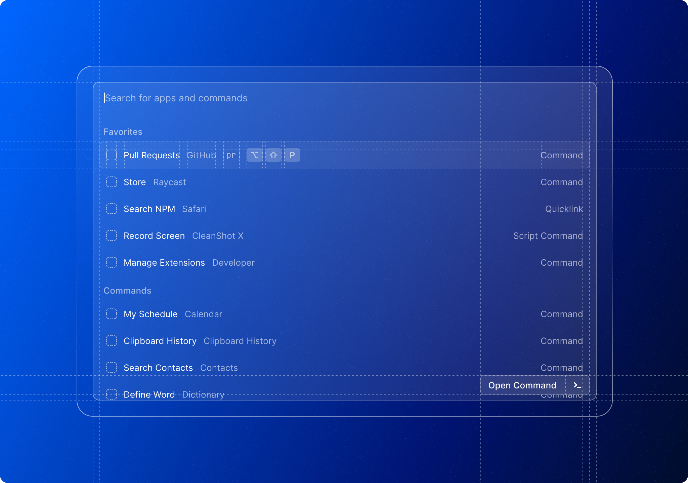

  
  <h1 align="center">Raycast Extensions</h1>

  
  

[Raycast](https://raycast.com/) lets you control your tools with a few keystrokes. This repository contains all extensions that are available in the [Raycast Store](https://raycast.com/store). It also includes documentation and examples of how to extend Raycast using React.

## Getting Started

Visit [https://developers.raycast.com](https://developers.raycast.com) to get started with our API. If you want to discover and install extensions, check out [our Store](https://raycast.com/store).

## Feedback

Raycast wouldn't be where it is without the feedback from our community, so we would be happy to hear what you think of the API / DevX and how we can improve. Please use [GitHub issues](https://github.com/raycast/extensions/issues/new/choose) for everything API related (bugs, improvements suggestions, developer experience, docs, etc). We have a few [templates](https://developers.raycast.com/examples) that should help you get started.

## Community

Join our [Slack community](https://raycast.com/community) to share your extension, debug nasty bugs or simply get to know like-minded folks.
