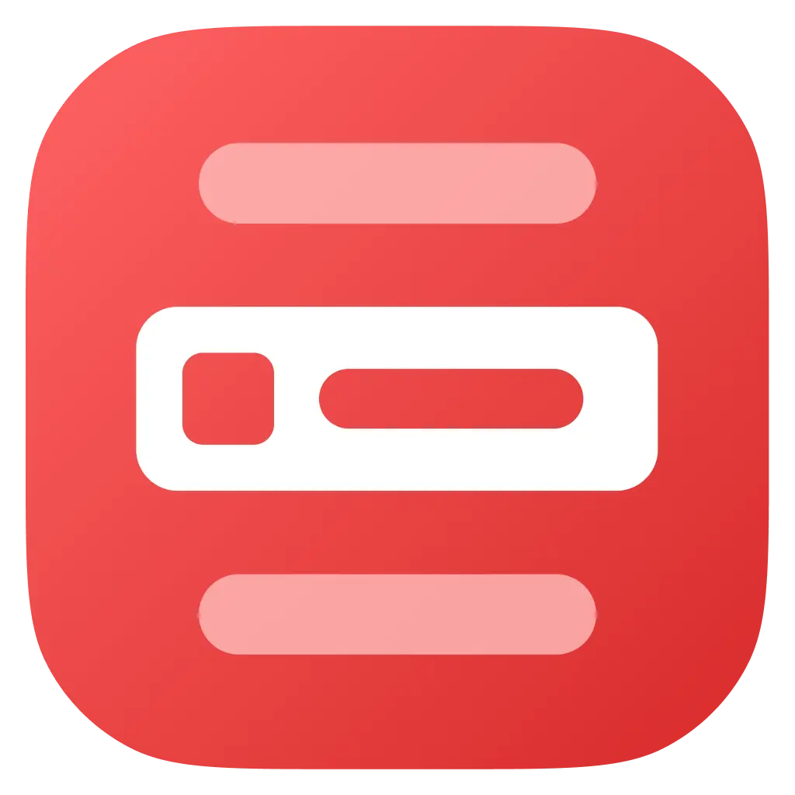
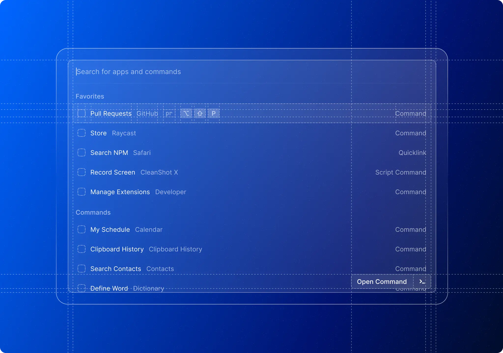

<<<<<<< HEAD

  
  <h1 align="center">Raycast Extensions</h1>

  
  

[Raycast](https://raycast.com/) lets you control your tools with a few keystrokes. This repository contains all extensions that are available in the [Raycast Store](https://raycast.com/store). It also includes documentation and examples of how to extend Raycast using React.

## Getting Started

Visit [https://developers.raycast.com](https://developers.raycast.com) to get started with our API. If you want to discover and install extensions, check out [our Store](https://raycast.com/store).

Be sure to read and follow our [Community](https://manual.raycast.com/community-guidelines) and [Extension](https://manual.raycast.com/extensions) guidelines when submitting your extension and interacting with other folks in this repository.

## Feedback

Raycast wouldn't be where it is without the feedback from our community, so we would be happy to hear what you think of the API / DevX and how we can improve. Please use [GitHub issues](https://github.com/raycast/extensions/issues/new/choose) for everything API related (bugs, improvements suggestions, developer experience, docs, etc). We have a few [templates](https://developers.raycast.com/examples) that should help you get started.

## Community

Join our [Slack community](https://raycast.com/community) to share your extension, debug nasty bugs or simply get to know like-minded folks.
=======
# Buildkite

Extension to view your Buildkite pipelines and builds.

## Configuration

### Creating an access token

This extension requires a Buildkite access token with GraphQL API access. To create a new token, follow these steps:

1. Go to https://buildkite.com/user/api-access-tokens
1. Click **New API Access Token**
1. Enter a name for your token in the **Description** field
1. Select the organization you wish to grant access to
1. Check the **Enable GraphQL API Access** checkbox
1. Click **Create New API Access Token**

### Enter your organization slug

This extension currently only works with a single Buildkite organization. In the organization slug field, enter the name of the organization you wish to use. This value is case sensitive.

## Showcases

### Search pipelines

### My builds

>>>>>>> 0644b3cac (Initial commit)
