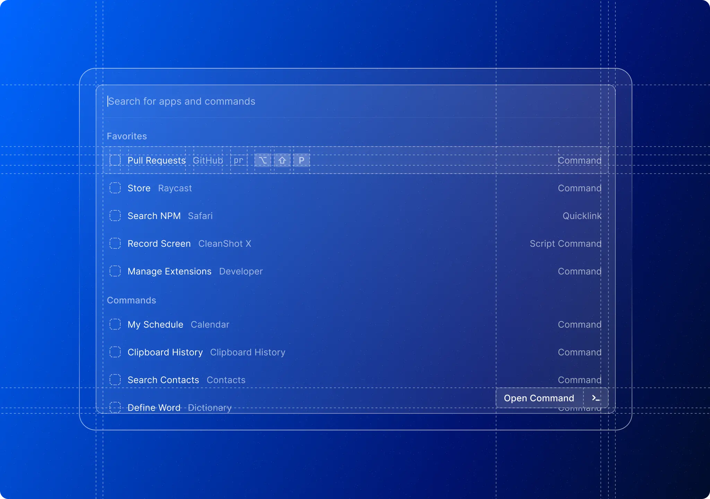
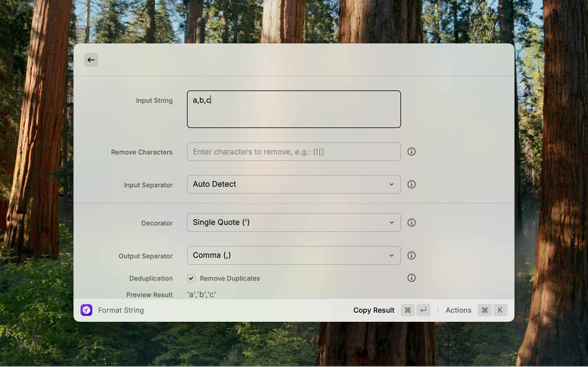

<p align="center">
  
  <h1 align="center">Raycast Extensions</h1>
</p>

<p align="center">
  <a aria-label="Follow Raycast on X" href="https://x.com/raycast">
    
  </a>
  <a aria-label="Join the community on Slack" href="https://raycast.com/community">
    
  </a>
</p>

[Raycast](https://raycast.com/) lets you control your tools with a few keystrokes. This repository contains all extensions that are available in the [Raycast Store](https://raycast.com/store). It also includes documentation and examples of how to extend Raycast using React.



## Getting Started

Visit [https://developers.raycast.com](https://developers.raycast.com) to get started with our API. If you want to discover and install extensions, check out [our Store](https://raycast.com/store).

Be sure to read and follow our [Community](https://manual.raycast.com/community-guidelines) and [Extension](https://manual.raycast.com/extensions) guidelines when submitting your extension and interacting with other folks in this repository.

## Feedback

Raycast wouldn't be where it is without the feedback from our community, so we would be happy to hear what you think of the API / DevX and how we can improve. Please use [GitHub issues](https://github.com/raycast/extensions/issues/new/choose) for everything API related (bugs, improvements suggestions, developer experience, docs, etc). We have a few [templates](https://developers.raycast.com/examples) that should help you get started.

## Community

Join our [Slack community](https://raycast.com/community) to share your extension, debug nasty bugs or simply get to know like-minded folks.
>>>>>>> e7b9fa6b40f5337631c0eab6128953b7fdda8045
=======
# String Formatter - Raycast Extension



A powerful string formatting Raycast extension with intelligent separator detection, character removal, custom decorators, and output formatting.

## 🚀 Features

### Input Processing
- 🔤 **String Input**: Support for multi-line string input
- 🗑️ **Character Removal**: Remove specified characters or strings
- 🔍 **Smart Separator Detection**: Automatically detect separators in input strings
- ⚙️ **Manual Separator Selection**: Support for comma, semicolon, space, pipe, tab, newline, etc.

### Output Formatting
- 🎨 **Decorator Selection**: Support for single quotes, double quotes, backticks, square brackets, parentheses, curly braces
- 📤 **Custom Output Separator**: Configurable output result separator
- 🔄 **Deduplication**: Optional removal of duplicate elements (enabled by default)
- 👀 **Real-time Preview**: Instantly display formatting results as you type
- 📋 **One-click Copy**: Quick copy of formatted results to clipboard

### User Experience
- 🎯 **Smart Interface**: Clear separation between input and output areas with dividers
- ⚠️ **Error Handling**: Friendly error messages and exception handling
- ⌨️ **Keyboard Shortcuts**: Convenient keyboard operations

## 📝 Usage Examples

### Basic Example
**Input**: `a,b,c`
**Input Separator**: Auto Detect (detects comma)
**Decorator**: Single Quote (')
**Output Separator**: Comma (,)
**Deduplication**: ✅ Enabled
**Output**: `'a','b','c'`

### Advanced Example
**Input**: `(apple);(banana);(cherry)`
**Remove Characters**: `()`
**Input Separator**: Auto Detect (detects semicolon)
**Decorator**: Square Brackets []
**Output Separator**: Newline (\n)
**Output**:
```
[apple]
[banana]
[cherry]
```

### Complex Example
**Input**: `"item1" | "item2" | "item3"`
**Remove Characters**: `"`
**Input Separator**: Pipe (|)
**Decorator**: Backtick (`)
**Output Separator**: Semicolon (;)
**Output**: `` `item1`;`item2`;`item3` ``

### Deduplication Example
**Input**: `apple,banana,apple,cherry,banana`
**Input Separator**: Auto Detect (detects comma)
**Decorator**: Double Quote (")
**Output Separator**: Comma (,)
**Deduplication**: ✅ Enabled
**Output**: `"apple","banana","cherry"`


## ⌨️ Keyboard Shortcuts

- `Cmd + C`: Copy formatted result
- `Cmd + R`: Reset form

## 🛠️ Installation

1. Make sure [Raycast](https://raycast.com/) is installed
2. Run in project directory: `npm install`
3. Development mode: `npm run dev`
4. Build: `npm run build`

## 🔧 Development

```bash
# Install dependencies
npm install

# Development mode
npm run dev

# Code linting
npm run lint

# Fix code formatting
npm run fix-lint
```

## 📄 License

MIT License
=======
<p align="center">
  
  <h1 align="center">Raycast Extensions</h1>
</p>

<p align="center">
  <a aria-label="Follow Raycast on X" href="https://x.com/raycast">
    
  </a>
  <a aria-label="Join the community on Slack" href="https://raycast.com/community">
    
  </a>
</p>

[Raycast](https://raycast.com/) lets you control your tools with a few keystrokes. This repository contains all extensions that are available in the [Raycast Store](https://raycast.com/store). It also includes documentation and examples of how to extend Raycast using React.


## Getting Started

Visit [https://developers.raycast.com](https://developers.raycast.com) to get started with our API. If you want to discover and install extensions, check out [our Store](https://raycast.com/store).

Be sure to read and follow our [Community](https://manual.raycast.com/community-guidelines) and [Extension](https://manual.raycast.com/extensions) guidelines when submitting your extension and interacting with other folks in this repository.

## Feedback

Raycast wouldn't be where it is without the feedback from our community, so we would be happy to hear what you think of the API / DevX and how we can improve. Please use [GitHub issues](https://github.com/raycast/extensions/issues/new/choose) for everything API related (bugs, improvements suggestions, developer experience, docs, etc). We have a few [templates](https://developers.raycast.com/examples) that should help you get started.

## Community

Join our [Slack community](https://raycast.com/community) to share your extension, debug nasty bugs or simply get to know like-minded folks.
>>>>>>> e7b9fa6b40f5337631c0eab6128953b7fdda8045
