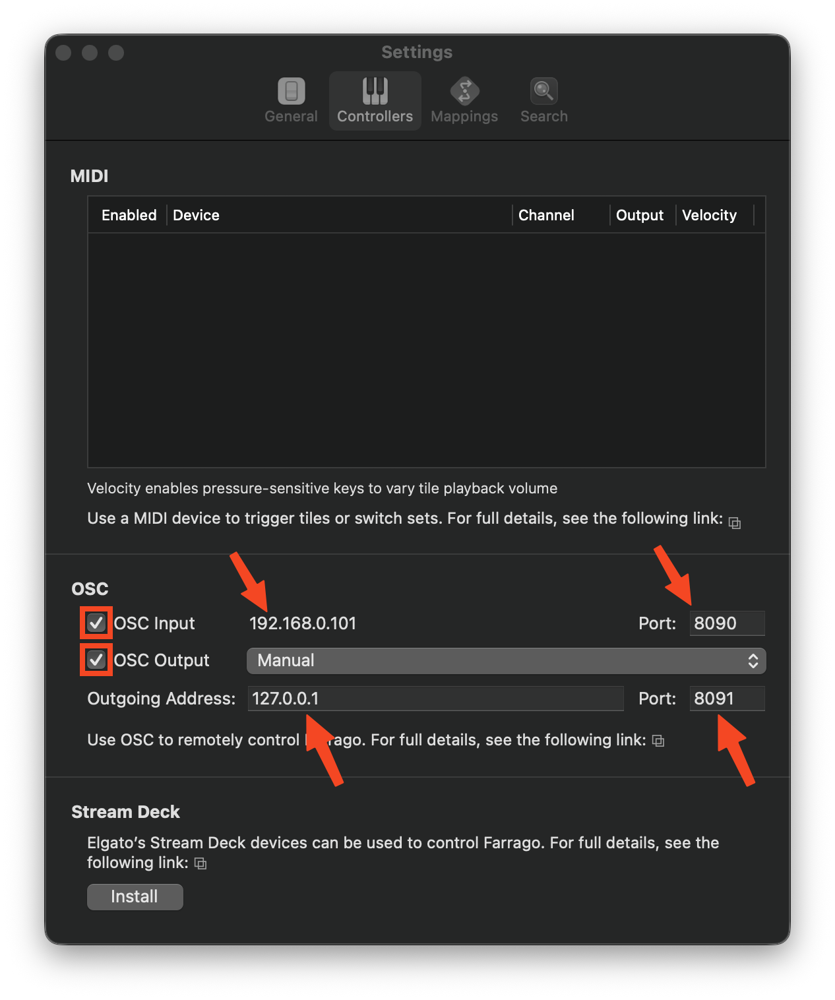

# Farrago

### About

This extension allows you to interact with all your sounds in Farrago (a soundboard app).

### Prerequisites

1. Have [Farrago](https://rogueamoeba.com/farrago/) installed.
2. Configure OSC in Farrago 
3. Ensure that the folder `~/Library/Application Support/Farrago 2` exists on your machine (it probably does). If not, locate Farrago's data directory and set its path in the plugin settings.

### Global keyboard shortcuts to play sounds

To be able to play a specific sound with a keyboard shortcut, execute the "Add Shortcut" action while focused on the sound in the "Search" command. This will add an Apple Shortcut which contains further instructions (they're few and simple).
