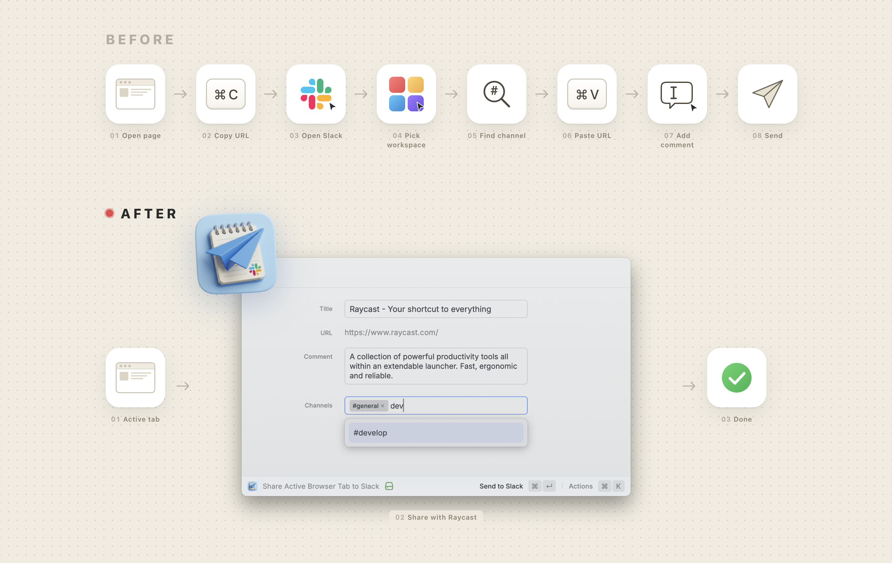
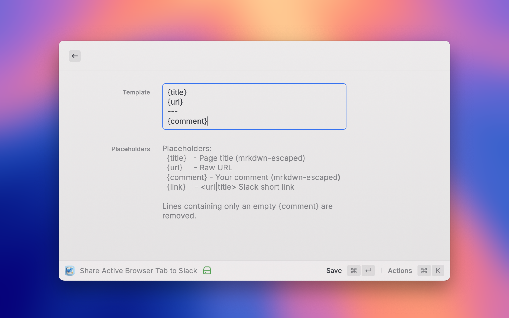
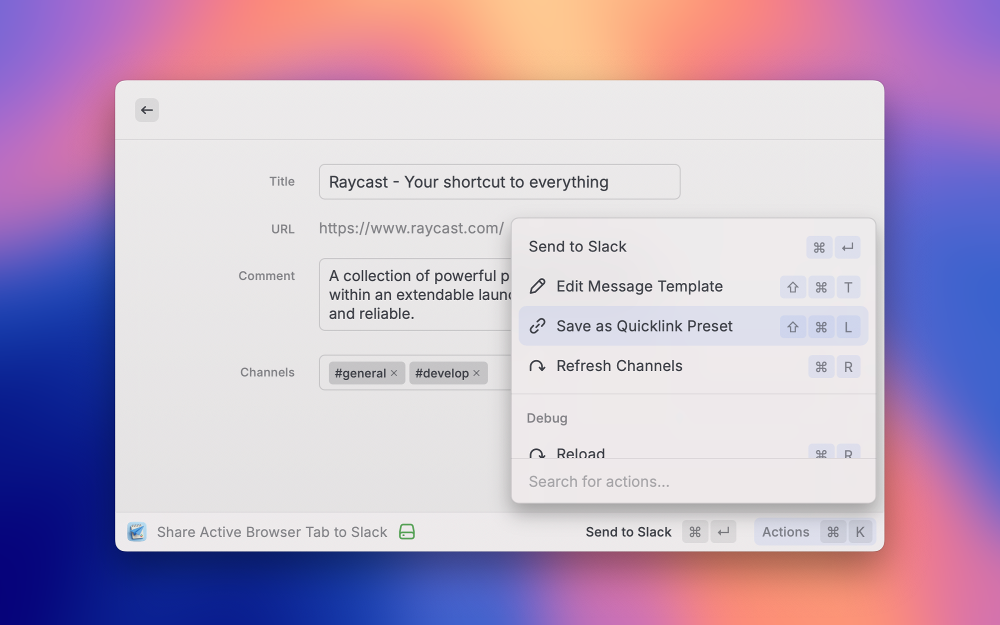
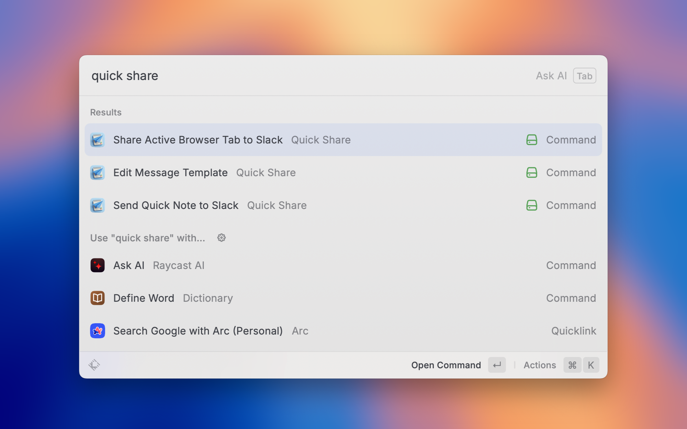

<div align="center">


# Quick Share

Share the active browser tab to Slack — comment, pick channels, send.
All without leaving Raycast.



</div>

## Features

- **Active tab → Slack** with title, URL, and an optional comment
- **Send to multiple channels** in one shot, public or private
- **Quick Note** mode for comment-only messages (no URL)
- **Customizable message template** with `{title}` / `{url}` / `{comment}` / `{link}` placeholders
- **Channel preset Quicklinks** — pin a channel set to a hotkey for one-press posting
- **Browser auto-detect** — Arc, Chrome, Brave, Edge, Safari

## Commands

### Share Active Browser Tab to Slack

Share the active tab with a comment

### Send Quick Note to Slack

Comment-only note, no URL

### Edit Message Template

Customize the Slack message format

## Screenshots

<p align="center">
  
  
  
  
</p>

## Setup

### 1. Create a Slack app

Go to [api.slack.com/apps](https://api.slack.com/apps) → **Create New App** → **From an app manifest**, and paste:

```yaml
display_information:
  name: Quick Share
features:
  bot_user:
    display_name: Quick Share
oauth_config:
  scopes:
    bot:
      - chat:write
      - chat:write.public
      - channels:read
      - groups:read
```

| Scope | Purpose |
|---|---|
| `chat:write` | Post messages (required) |
| `chat:write.public` | Post to public channels without inviting the bot (recommended) |
| `channels:read` | Fetch channel list (required) |
| `groups:read` | Include private channels in candidates (recommended) |

Click **Install to Workspace**, then copy the **Bot User OAuth Token** (`xoxb-...`).

> For private channels, run `/invite @quickshare` in each one.

### 2. Configure the extension

The first time you open **Share Active Browser Tab to Slack**, Raycast will prompt for:

| Field | Example | Notes |
|---|---|---|
| **Slack Bot Token** | `xoxb-...` | From step 1 |
| **Default Channels** | `general,team-share` | Pre-selected for Share Active Browser Tab (optional, comma-separated) |
| **Quick Note Default Channels** | `idea` | Pre-selected for Quick Note (optional) |

No browser-side setup required.

## Usage

### Sharing a tab

1. Open the tab you want to share
2. Trigger **Share Active Browser Tab to Slack** in Raycast
3. URL and title are pre-filled (title is editable)
4. Add a comment (optional) and pick channels
5. **Send to Slack**

### Quick notes

For text-only messages without a URL, use **Send Quick Note to Slack**. Same flow, no tab fetch.

### Channel preset Quicklinks

Pin a specific channel selection to a hotkey:

1. In Share Active Browser Tab (or Quick Note), select the channels you want
2. Action Panel → **Save as Quicklink Preset** (<kbd>⌘⇧L</kbd>)
3. Save the Quicklink with a memorable name
4. Assign a hotkey or alias in **Raycast Settings → Extensions → Quicklinks**

The preset stores channel IDs, so it survives Slack channel renames.

### Customizing the message format

Open **Edit Message Template** (<kbd>⌘⇧T</kbd> from the Share Active Browser Tab action panel, or as a top-level Raycast command).

| Placeholder | Resolves to |
|---|---|
| `{title}` | Page title (mrkdwn-escaped) |
| `{url}` | Raw URL |
| `{comment}` | Your comment (mrkdwn-escaped) |
| `{link}` | `<url\|title>` Slack short link |

When the comment is empty, lines containing only `{comment}` are stripped automatically.

Default template:

```
{comment}
{link}
```

Templates are persisted on your device. Use **Reset to Default** in the editor's action panel to revert.

## Troubleshooting

| Error | Likely cause | Fix |
|---|---|---|
| `not_in_channel` | Bot isn't in a private/restricted channel | `/invite @quickshare` in that channel |
| `channel_not_found` | Channel renamed, archived, or out of scope | Check the name; prefer channel IDs for resilience |
| `invalid_auth` | Token is wrong or was rotated | Paste the latest `xoxb-...` |
| `missing_scope` | Slack app lacks a scope | Add the scope and **Reinstall to Workspace** |
| `Could not connect to the Browser Extension.` | Raycast Browser Extension isn't installed/connected | Harmless — Quick Share automatically falls back to AppleScript |

## Requirements

- macOS with Raycast
- Arc, Google Chrome, Brave, Microsoft Edge, or Safari
- A Slack workspace where you can install a bot

## Support

<div align="center">

If you enjoy using Quick Share and/or want to support further development, feel free to donate below!

<a href="https://github.com/sponsors/peinan"></a>
&nbsp;
<a href="https://ko-fi.com/peinan"></a>
&nbsp;
<a href="https://www.buymeacoffee.com/peinan" target="_blank"></a>

</div>

## License

MIT © [peinan](https://github.com/peinan)
