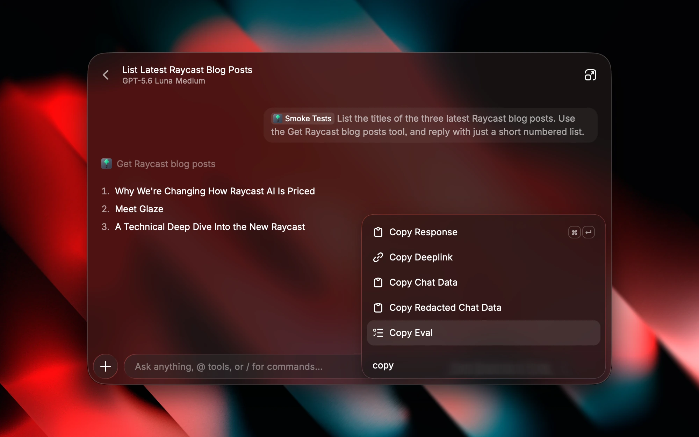

# Evals

Evals test how Raycast AI uses your extension. They combine a prompt, simulated tool results, and expectations about the response and tool calls. They also provide suggested prompts that help users discover what your extension can do.

Define evals in the `ai.evals` array in your [extension manifest](../information/manifest.md#ai-properties), or under `evals` in an [`ai.yaml` file](learn-core-concepts-of-ai-extensions.md#ai-file).

## Add an Eval

Run `npx ray develop`, then start a new conversation in Quick AI or AI Chat and mention your extension in a single prompt. Once Raycast AI has finished using your tools, open the Actions panel and choose **Copy Eval**. The action copies JSON containing the prompt, tool-result mocks, and tool-call expectations.

Copy Eval supports conversations with one prompt. Start a new conversation if you have sent follow-up messages. If a tool is called more than once, the copied eval keeps the first successful result for that tool as its mock. Review the mocks and remove personal information or credentials before committing them.



You can then paste the eval into the `evals` array in the [`package.json` file](../information/manifest.md).

```json
{
  "ai": {
    "evals": [
      {
        "input": "@todo-list what are my open todos",
        "mocks": {
          "get-todos": [
            {
              "id": "Z5lF8F-lSvGCD6e3uZwkL",
              "isCompleted": false,
              "title": "Buy oat milk"
            },
            {
              "id": "69Ag2mfaDakC3IP8XxpXU",
              "isCompleted": false,
              "title": "Play with my cat"
            }
          ]
        },
        "expected": [
          {
            "callsTool": "get-todos"
          }
        ]
      }
    ]
  }
}
```

## Eval Format

An eval consists of the following parts:

- `input` is the prompt to test. Include an `@` mention using your extension’s `name` from `package.json`, for example `@todo-list What are my todos?`.
- `mocks` maps tool names to their simulated return values. Use the tool’s `name` from `package.json`, such as `get-todos`, without an extension prefix. The eval runner uses these values instead of executing your tools.
- `expected` is an array of expectations that must all pass, similar to assertions in integration tests.
- `usedAsExample` controls whether the input is shown as a suggested prompt. Defaults to `true`.

## Expectations

Expectations are used to check if the AI response matches the expected behavior. You have different options to choose from:

- `includes`: Check that AI response includes some substring (case-insensitive), for example `{"includes": "added" }`
- `matches`: Check that AI response matches some regexp, for example check if response contains a Markdown link `{ "matches": "\\[([^\\]]+)\\]\\(([^\\s\\)]+)(?:\\s+\"([^\"]+)\")?\\)" }`
- `meetsCriteria`: Check that AI response meets some plain-text criteria (validated using AI). Useful when AI varies the response and it is hard to match it using `includes` or `matches`. Example: `{ "meetsCriteria": "Tells that label with this name doesn't exist" }`
- `callsTool`: Check that during the request AI called some tool included from your AI extension. There are two forms:
  - Short form to check if AI tool with specific name was called. Example: `{ "callsTool": "get-todos" }`
  - Long form to check tool arguments: `{ callsTool: { name: "name", arguments: { arg1: matcher, arg2: matcher } } }`. Matches could be complex and combine any supported rules:
    - `eq` (used by default for any value that is not object or array)
    - `includes`
    - `matches`
    - `and` (used by default if array is used)
    - `or`
    - `not`
- `not`: Invert an expectation, for example `{ "not": { "callsTool": "delete-todo" } }`.

### Examples




```json
{
  "ai": {
    "evals": [
      {
        "expected": [
          {
            "callsTool": {
              "name": "greet",
              "arguments": {
                "name": "thomas"
              }
            }
          }
        ]
      }
    ]
  }
}
```




```json
{
  "ai": {
    "evals": [
      {
        "expected": [
          {
            "callsTool": {
              "name": "create-comment",
              "arguments": {
                "issueId": "ISS-1",
                "body": {
                  "includes": "waiting for design"
                }
              }
            }
          }
        ]
      }
    ]
  }
}
```




```json
{
  "ai": {
    "evals": [
      {
        "expected": [
          {
            "callsTool": {
              "name": "greet",
              "arguments": {
                "user.name": "thomas"
              }
            }
          }
        ]
      }
    ]
  }
}
```




```json
{
  "ai": {
    "evals": [
      {
        "expected": [
          {
            "not": {
              "callsTool": "create-issue"
            }
          }
        ]
      }
    ]
  }
}
```




## Matching Tool Arguments

Use the long form of `callsTool` to check arguments. Primitive values use equality by default; an array of matchers means all of them must match. Wrap a literal array in `eq` so it is compared as a value:

```json
{
  "callsTool": {
    "name": "create-todo",
    "arguments": {
      "title": { "includes": "milk" },
      "labels": { "eq": ["shopping", "home"] },
      "priority": { "or": ["high", "urgent"] },
      "description": [{ "includes": "milk" }, { "not": { "includes": "bread" } }]
    }
  }
}
```

Use dot notation to match a nested argument, such as `"user.name": "thomas"`. `includes` checks a substring without case sensitivity; `matches` accepts a regular expression; `and`, `or`, and `not` combine or invert matchers.

## Suggested Prompts

Evals are used as suggested prompts by default. Add `"usedAsExample": false` to an eval for edge cases or internal tests that should not appear as suggestions. The eval still runs.

## Run Evals

From your extension directory, run:

```sh
npx ray evals
```

The CLI builds the extension, runs the evals remotely, and prints which evals passed or failed. Use the results to improve your tool names, descriptions, and instructions. Sign in with `npx ray login` if needed. To run selected evals, use their zero-based indexes:

```sh
npx ray evals --only 0,2
```

## Best Practices

- Develop and debug your tools with `npx ray develop`, then use **Copy Eval** on a successful single-prompt conversation to capture a starting point.
- Review the generated expectations. Add response checks and argument matchers that describe the behavior you want to preserve.
- Keep mocks small and remove personal information, credentials, and unrelated data before committing them.
- Describe argument formats and dependencies in your tools. For example, explain that an ID must come from `get-todos` before calling `toggle-todo`.
- Put shared behavior, response formats, and tool-ordering guidance in `ai.instructions`.
