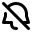
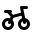
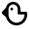
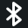
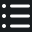
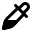
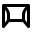
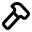
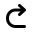

# Icons & Images

## API Reference

### Icon

List of built-in icons that can be used for actions or list items.

#### Example

```typescript
import { Icon, List } from "@raycast/api";

export default function Command() {
  return (
    <List>
      <List.Item title="Icon" icon={Icon.Circle} />
    </List>
  );
}
```

#### Enumeration members

|                <p><br>AddPerson</p>                |             <p><br>Airplane</p>             |         <p><br>AirplaneFilled</p>         |
| :---------------------------------------------------------------------------------------------------------------: | :------------------------------------------------------------------------------------------------------: | :-----------------------------------------------------------------------------------------------------------: |
|          <p><br>AirplaneLanding</p>          |     <p><br>AirplaneTakeoff</p>      |                <p><br>Airpods</p>                 |
|                    <p><br>Alarm</p>                     |        <p><br>AlarmRinging</p>         |            <p><br>AlignCentre</p>            |
|                <p><br>AlignLeft</p>                |          <p><br>AlignRight</p>           |       <p><br>AmericanFootball</p>       |
|                   <p><br>Anchor</p>                    |           <p><br>AppWindow</p>            |      <p><br>AppWindowGrid2x2</p>      |
|        <p><br>AppWindowGrid3x3</p>        |       <p><br>AppWindowList</p>       |  <p><br>AppWindowSidebarLeft</p>  |
|   <p><br>AppWindowSidebarRight</p>   |      <p><br>ArrowClockwise</p>       | <p><br>ArrowCounterClockwise</p>  |
|                <p><br>ArrowDown</p>                |     <p><br>ArrowDownCircle</p>     | <p><br>ArrowDownCircleFilled</p> |
|                <p><br>ArrowLeft</p>                |     <p><br>ArrowLeftCircle</p>     | <p><br>ArrowLeftCircleFilled</p> |
|                  <p><br>ArrowNe</p>                  |          <p><br>ArrowRight</p>           |      <p><br>ArrowRightCircle</p>       |
|  <p><br>ArrowRightCircleFilled</p>  |             <p><br>ArrowUp</p>              |         <p><br>ArrowUpCircle</p>          |
|     <p><br>ArrowUpCircleFilled</p>     |      <p><br>ArrowsContract</p>       |           <p><br>ArrowsExpand</p>           |
|                 <p><br>AtSymbol</p>                 |             <p><br>BandAid</p>              |               <p><br>BankNote</p>               |
|                 <p><br>BarChart</p>                 |             <p><br>BarCode</p>              |                <p><br>BathTub</p>                |
|                  <p><br>Battery</p>                   |     <p><br>BatteryCharging</p>      |        <p><br>BatteryDisabled</p>        |
|                     <p><br>Bell</p>                      |        <p><br>BellDisabled</p>         |                   <p><br>Bike</p>                    |
|               <p><br>Binoculars</p>                |                 <p><br>Bird</p>                 |          <p><br>BlankDocument</p>          |
|                <p><br>Bluetooth</p>                 |                 <p><br>Boat</p>                 |                   <p><br>Bold</p>                    |
|                     <p><br>Bolt</p>                      |        <p><br>BoltDisabled</p>         |                   <p><br>Book</p>                    |
|                 <p><br>Bookmark</p>                  |                  <p><br>Box</p>                  |                  <p><br>Brush</p>                   |
|                <p><br>Bubble</p>                |                  <p><br>Bug</p>                  |               <p><br>Building</p>                |
|             <p><br>BulletPoints</p>             |            <p><br>BullsEye</p>             |                   <p><br>Buoy</p>                    |
|               <p><br>Calculator</p>                |             <p><br>Calendar</p>             |                 <p><br>Camera</p>                  |
|                      <p><br>Car</p>                       |                 <p><br>Cart</p>                 |                     <p><br>Cd</p>                      |
|                   <p><br>Center</p>                    |                <p><br>Check</p>                |            <p><br>CheckCircle</p>            |
|             <p><br>CheckRosette</p>             |          <p><br>Checkmark</p>           |             <p><br>ChessPiece</p>             |
|              <p><br>ChevronDown</p>              |    <p><br>ChevronDownSmall</p>    |            <p><br>ChevronLeft</p>            |
|        <p><br>ChevronLeftSmall</p>         |        <p><br>ChevronRight</p>         |     <p><br>ChevronRightSmall</p>      |
|                <p><br>ChevronUp</p>                |      <p><br>ChevronUpSmall</p>      |                 <p><br>Circle</p>                  |
|           <p><br>CircleEllipsis</p>           |        <p><br>CircleFilled</p>         |         <p><br>CircleProgress</p>         |
|       <p><br>CircleProgress100</p>        |    <p><br>CircleProgress25</p>    |      <p><br>CircleProgress50</p>       |
|        <p><br>CircleProgress75</p>         |     <p><br>ClearFormatting</p>      |            <p><br>Clipboard</p>            |
|                    <p><br>Clock</p>                     |                <p><br>Cloud</p>                |         <p><br>CloudLightning</p>         |
|                <p><br>CloudRain</p>                |           <p><br>CloudSnow</p>            |               <p><br>CloudSun</p>               |
|                     <p><br>Code</p>                      |           <p><br>CodeBlock</p>            |                    <p><br>Cog</p>                     |
|                     <p><br>Coin</p>                      |                <p><br>Coins</p>                |          <p><br>CommandSymbol</p>          |
|                  <p><br>Compass</p>                   |        <p><br>ComputerChip</p>         |               <p><br>Contrast</p>                |
|            <p><br>CopyClipboard</p>            |          <p><br>CreditCard</p>           |            <p><br>CricketBall</p>            |
|                     <p><br>Crop</p>                      |                <p><br>Crown</p>                |                 <p><br>Crypto</p>                  |
|           <p><br>DeleteDocument</p>           |              <p><br>Desktop</p>              |                    <p><br>Dna</p>                     |
|              <p><br>Document</p>               |                  <p><br>Dot</p>                  |               <p><br>Download</p>                |
|                <p><br>EditShape</p>                |                <p><br>Eject</p>                |               <p><br>Ellipsis</p>                |
|                    <p><br>Emoji</p>                     |             <p><br>Envelope</p>             |                 <p><br>Eraser</p>                  |
|            <p><br>ExclamationMark</p>            |      <p><br>Exclamationmark</p>      |       <p><br>Exclamationmark2</p>       |
|         <p><br>Exclamationmark3</p>         |                  <p><br>Eye</p>                  |            <p><br>EyeDisabled</p>            |
|               <p><br>EyeDropper</p>               |               <p><br>Female</p>               |              <p><br>FilmStrip</p>              |
|                   <p><br>Filter</p>                    |               <p><br>Finder</p>               |            <p><br>Fingerprint</p>             |
|                     <p><br>Flag</p>                      |               <p><br>Folder</p>               |             <p><br>Footprints</p>              |
|                  <p><br>Forward</p>                   |       <p><br>ForwardFilled</p>        |            <p><br>FountainTip</p>            |
|               <p><br>FullSignal</p>               |      <p><br>GameController</p>       |                  <p><br>Gauge</p>                   |
|                      <p><br>Gear</p>                      |               <p><br>Geopin</p>               |                   <p><br>Germ</p>                    |
|                     <p><br>Gift</p>                      |              <p><br>Glasses</p>              |                 <p><br>Globe</p>                 |
|                     <p><br>Goal</p>                      |               <p><br>Hammer</p>               |              <p><br>HardDrive</p>              |
|                  <p><br>Hashtag</p>                   |           <p><br>Headphones</p>           |                  <p><br>Heart</p>                   |
|            <p><br>HeartDisabled</p>            |            <p><br>Heartbeat</p>            |              <p><br>Highlight</p>               |
|                <p><br>Hourglass</p>                 |                <p><br>House</p>                |                  <p><br>Image</p>                   |
|               <p><br>Important</p>               |               <p><br>Info</p>                |                <p><br>Italics</p>                 |
|                      <p><br>Key</p>                       |             <p><br>Keyboard</p>             |                 <p><br>Layers</p>                  |
|              <p><br>Leaderboard</p>               |                 <p><br>Leaf</p>                 |              <p><br>LevelMeter</p>               |
|                <p><br>LightBulb</p>                |        <p><br>LightBulbOff</p>        |              <p><br>LineChart</p>              |
|                     <p><br>Link</p>                      |           <p><br>List</p>            |            <p><br>Livestream</p>            |
|     <p><br>LivestreamDisabled</p>      |                 <p><br>Lock</p>                 |           <p><br>LockDisabled</p>           |
|             <p><br>LockUnlocked</p>             |               <p><br>Logout</p>               |                  <p><br>Lorry</p>                   |
|                <p><br>Lowercase</p>                 |     <p><br>MagnifyingGlass</p>      |                   <p><br>Male</p>                    |
|                      <p><br>Map</p>                       |                 <p><br>Mask</p>                 |               <p><br>Maximize</p>                |
|           <p><br>MedicalSupport</p>           |            <p><br>Megaphone</p>            |            <p><br>MemoryChip</p>            |
|              <p><br>MemoryStick</p>              |           <p><br>Message</p>           |             <p><br>Microphone</p>              |
|       <p><br>MicrophoneDisabled</p>       |             <p><br>Minimize</p>             |                  <p><br>Minus</p>                   |
|              <p><br>MinusCircle</p>              |   <p><br>MinusCircleFilled</p>   |                 <p><br>Mobile</p>                  |
|                  <p><br>Monitor</p>                   |                 <p><br>Moon</p>                 |               <p><br>Mountain</p>                |
|                    <p><br>Mouse</p>                     |             <p><br>Multiply</p>             |                  <p><br>Music</p>                   |
|                  <p><br>Network</p>                   |         <p><br>NewDocument</p>          |              <p><br>NewFolder</p>              |
|                <p><br>Paperclip</p>                 |            <p><br>Paragraph</p>            |                  <p><br>Patch</p>                   |
|                    <p><br>Pause</p>                     |         <p><br>PauseFilled</p>          |                 <p><br>Pencil</p>                  |
|                   <p><br>Person</p>                    |        <p><br>PersonCircle</p>         |            <p><br>PersonLines</p>            |
|                    <p><br>Phone</p>                     |        <p><br>PhoneRinging</p>         |               <p><br>PieChart</p>               |
|                     <p><br>Pill</p>                      |                  <p><br>Pin</p>                  |            <p><br>PinDisabled</p>            |
|                     <p><br>Play</p>                      |          <p><br>PlayFilled</p>           |                   <p><br>Plug</p>                    |
|                     <p><br>Plus</p>                      |          <p><br>PlusCircle</p>           |      <p><br>PlusCircleFilled</p>       |
| <p><br>PlusMinusDivideMultiply</p> |          <p><br>PlusSquare</p>           |    <p><br>PlusTopRightSquare</p>    |
|                    <p><br>Power</p>                     |                <p><br>Print</p>                |       <p><br>QuestionMark</p>        |
|      <p><br>QuestionMarkCircle</p>       |      <p><br>QuotationMarks</p>       |             <p><br>QuoteBlock</p>             |
|                   <p><br>Racket</p>                    |             <p><br>Raindrop</p>             |        <p><br>RaycastLogoNeg</p>         |
|          <p><br>RaycastLogoPos</p>           |              <p><br>Receipt</p>              |                   <p><br>Redo</p>                    |
|             <p><br>RemovePerson</p>             |               <p><br>Repeat</p>               |                  <p><br>Reply</p>                   |
|                   <p><br>Rewind</p>                    |        <p><br>RewindFilled</p>         |                 <p><br>Rocket</p>                  |
|                  <p><br>Rosette</p>                   | <p><br>RotateAntiClockwise</p> |        <p><br>RotateClockwise</p>        |
|                    <p><br>Ruler</p>                     |        <p><br>SaveDocument</p>         |                <p><br>Shield</p>                |
|           <p><br>ShortParagraph</p>           |              <p><br>Shuffle</p>              |        <p><br>Sidebar</p>        |
|                  <p><br>Signal1</p>                  |             <p><br>Signal2</p>              |                <p><br>Signal3</p>                |
|                 <p><br>Snippets</p>                  |            <p><br>Snowflake</p>            |             <p><br>SoccerBall</p>             |
|              <p><br>SpeakerDown</p>              |         <p><br>SpeakerHigh</p>          |             <p><br>SpeakerLow</p>             |
|               <p><br>SpeakerOff</p>               |           <p><br>SpeakerOn</p>            |              <p><br>SpeakerUp</p>              |
|             <p><br>SpeechBubble</p>             |  <p><br>SpeechBubbleActive</p>  | <p><br>SpeechBubbleImportant</p>  |
|                     <p><br>Star</p>                      |          <p><br>StarCircle</p>           |           <p><br>StarDisabled</p>           |
|                    <p><br>Stars</p>                     |                 <p><br>Stop</p>                 |             <p><br>StopFilled</p>             |
|                <p><br>Stopwatch</p>                 |                <p><br>Store</p>                |          <p><br>StrikeThrough</p>          |
|                      <p><br>Sun</p>                       |              <p><br>Sunrise</p>              |                 <p><br>Swatch</p>                  |
|                   <p><br>Switch</p>                    |              <p><br>Syringe</p>              |                    <p><br>Tag</p>                     |
|              <p><br>Temperature</p>               |          <p><br>TennisBall</p>           |               <p><br>Terminal</p>                |
|                     <p><br>Text</p>                      |          <p><br>TextCursor</p>           |              <p><br>TextInput</p>              |
|                    <p><br>Torch</p>                     |                <p><br>Train</p>                |                  <p><br>Trash</p>                   |
|                     <p><br>Tray</p>                      |                 <p><br>Tree</p>                 |                 <p><br>Trophy</p>                  |
|                <p><br>TwoPeople</p>                |             <p><br>Umbrella</p>             |              <p><br>Underline</p>               |
|                     <p><br>Undo</p>                      |               <p><br>Upload</p>               |              <p><br>Uppercase</p>               |
|                    <p><br>Video</p>                     |               <p><br>Wallet</p>               |                   <p><br>Wand</p>                    |
|                  <p><br>Warning</p>                   |              <p><br>Weights</p>              |                   <p><br>Wifi</p>                    |
|             <p><br>WifiDisabled</p>             |             <p><br>Window</p>             |      <p><br>WrenchScrewdriver</p>      |
|               <p><br>WristWatch</p>               |         <p><br>XMarkCircle</p>         |     <p><br>XMarkCircleFilled</p>     |
|    <p><br>XMarkTopRightSquare</p>     |

### Image.Mask

Available masks that can be used to change the shape of an image.

Can be handy to shape avatars or other items in a list.

#### Example

```typescript
import { Image, List } from "@raycast/api";

export default function Command() {
  return (
    <List>
      <List.Item
        title="Icon"
        icon={{
          source: "https://raycast.com/uploads/avatar.png",
          mask: Image.Mask.Circle,
        }}
      />
    </List>
  );
}
```

#### Enumeration members

| Name             | Value              |
| :--------------- | :----------------- |
| Circle           | "circle"           |
| RoundedRectangle | "roundedRectangle" |

## Types

### Image

Display different types of images, including network images or bundled assets.

Apply image transforms to the source, such as a `mask` or a `tintColor`.


Tip: Suffix your local assets with `@dark` to automatically provide a dark theme option, eg: `icon.png` and `icon@dark.png`.


#### Example

```typescript
// Built-in icon
const icon = Icon.Eye;

// Built-in icon with tint color
const tintedIcon = { source: Icon.Bubble, tintColor: Color.Red };

// Bundled asset with circular mask
const avatar = { source: "avatar.png", mask: ImageMask.Circle };

// Implicit theme-aware icon
// with 'icon.png' and 'icon@dark.png' in the `assets` folder
const icon = "icon.png";

// Explicit theme-aware icon
const icon = { source: { light: "https://example.com/icon-light.png", dark: "https://example.com/icon-dark.png" } };
```

#### Properties

| Property | Description | Type |
| :--- | :--- | :--- |
| source<mark style="color:red;">*</mark> | The [Image.Source](icons-and-images.md#image.source) of the image. | <code>[Image.Source](icons-and-images.md#image.source)</code> |
| fallback | [Image.Fallback](icons-and-images.md#image.fallback) image, in case `source` can't be loaded. | <code>[Image.Fallback](icons-and-images.md#image.fallback)</code> |
| mask | A [Image.Mask](icons-and-images.md#image.mask) to apply to the image. | <code>[Image.Mask](icons-and-images.md#image.mask)</code> |
| tintColor | A [Color.ColorLike](colors.md#color.colorlike) to tint all the non-transparent pixels of the image. | <code>[Color.ColorLike](colors.md#color.colorlike)</code> |

### FileIcon

An icon as it's used in the Finder.

#### Example

```typescript
import { List } from "@raycast/api";

export default function Command() {
  return (
    <List>
      <List.Item title="File icon" icon={{ fileIcon: __filename }} />
    </List>
  );
}
```

#### Properties

| Property | Description | Type |
| :--- | :--- | :--- |
| fileIcon<mark style="color:red;">*</mark> | The path to a file or folder to get its icon from. | <code>string</code> |

### Image.ImageLike

```typescript
ImageLike: URL | Asset | Icon | FileIcon | Image;
```

Union type for the supported image types.

#### Example

```typescript
import { Icon, Image, List } from "@raycast/api";

export default function Command() {
  return (
    <List>
      <List.Item title="URL" icon="https://raycast.com/uploads/avatar.png" />
      <List.Item title="Asset" icon="avatar.png" />
      <List.Item title="Icon" icon={Icon.Circle} />
      <List.Item title="FileIcon" icon={{ fileIcon: __filename }} />
      <List.Item
        title="Image"
        icon={{
          source: "https://raycast.com/uploads/avatar.png",
          mask: Image.Mask.Circle,
        }}
      />
    </List>
  );
}
```

### Image.Source

```typescript
Image.Source: URL | Asset | Icon | { light: URL | Asset; dark: URL | Asset }
```

The source of an [Image](#image). Can be either a remote URL, a local file resource, a built-in [Icon](#icon) or
a single emoji.

For consistency, it's best to use the built-in [Icon](#icon) in lists, the Action Panel, and other places. If a
specific icon isn't built-in, you can reference custom ones from the `assets` folder of the extension by file name,
e.g. `my-icon.png`. Alternatively, you can reference an absolute HTTPS URL that points to an image or use an emoji.
You can also specify different remote or local assets for light and dark theme.

#### Example

```typescript
import { Icon, List } from "@raycast/api";

export default function Command() {
  return (
    <List>
      <List.Item title="URL" icon={{ source: "https://raycast.com/uploads/avatar.png" }} />
      <List.Item title="Asset" icon={{ source: "avatar.png" }} />
      <List.Item title="Icon" icon={{ source: Icon.Circle }} />
      <List.Item
        title="Theme"
        icon={{
          source: {
            light: "https://raycast.com/uploads/avatar.png",
            dark: "https://raycast.com/uploads/avatar.png",
          },
        }}
      />
    </List>
  );
}
```

### Image.Fallback

```typescript
Image.Fallback: Asset | Icon | { light: Asset; dark: Asset }
```

A fallback [Image](#image) that will be displayed in case the source image cannot be loaded. Can be either a local file resource, a built-in [Icon](#icon), a single emoji, or a theme-aware asset. Any specified `mask` or `tintColor` will also apply to the fallback image.

#### Example

```typescript
import { List } from "@raycast/api";

export default function Command() {
  return (
    <List>
      <List.Item
        title="URL Source With Asset Fallback"
        icon={{
          source: "https://raycast.com/uploads/avatar.png",
          fallback: "default-avatar.png",
        }}
      />
    </List>
  );
}
```

### Image.URL

Image is a string representing a URL.

#### Example

```typescript
import { List } from "@raycast/api";

export default function Command() {
  return (
    <List>
      <List.Item title="URL" icon={{ source: "https://raycast.com/uploads/avatar.png" }} />
    </List>
  );
}
```

### Image.Asset

Image is a string representing an asset from the `assets/` folder

#### Example

```typescript
import { List } from "@raycast/api";

export default function Command() {
  return (
    <List>
      <List.Item title="Asset" icon={{ source: "avatar.png" }} />
    </List>
  );
}
```
