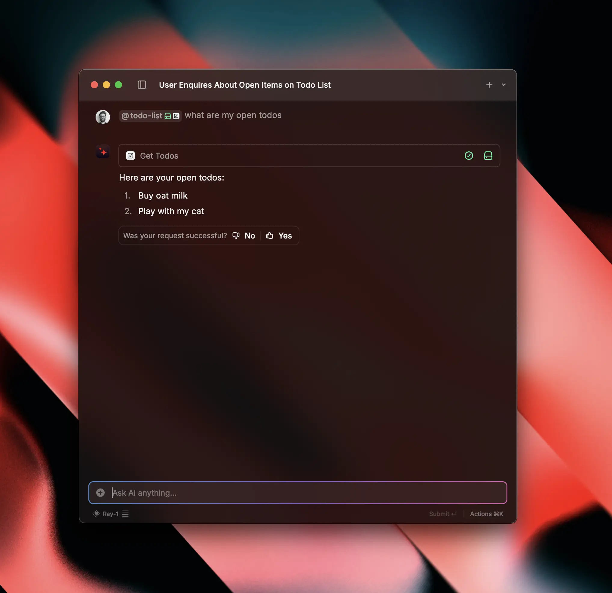

# Create an AI Extension

To turn your regular extension into an AI-powered one, you need to add a set of tools that allow Raycast AI to interact with your extension.

## Add AI Tools

The simplest way to add a tool to your extensions is to open the Manage Extensions command, search for your extension and perform the Add New Tool action via the Action Panel (or press `⌥` `⌘` `T`).


Alternatively you can edit the [`package.json` file](../information/manifest.md) manually and add a new entry to the `tools` array.


Give the tool a name, a description, and pick a template. The name and description will show up in the UI as well as the Store. The description is passed to AI to help it understand how to use the tool.

## Build Your AI Extension

Just like with regular extensions, you need to build your AI Extension. After you've added a tool, switch to your terminal and navigate to your extension directory. Run `npm install && npm run dev` to start the extension in development mode.


`npm run dev` starts the extension in development mode with hot reloading, error reporting and [more](../information/developer-tools/cli.md#development).


## Use Your AI Extension

Open Raycast, and you'll notice a new list item saying "Ask ..." at the top of the root search. Press `↵` to open it. From there on, you can chat to your AI Extension.

Alternatively, you can open Raycast's AI Chat and start chatting to your AI Extension there. Simply type `@` and start typing the name of your extension.

🎉 Congratulations! You built your first AI extension. Now you can start adding more tools to your extension to make it more powerful.
