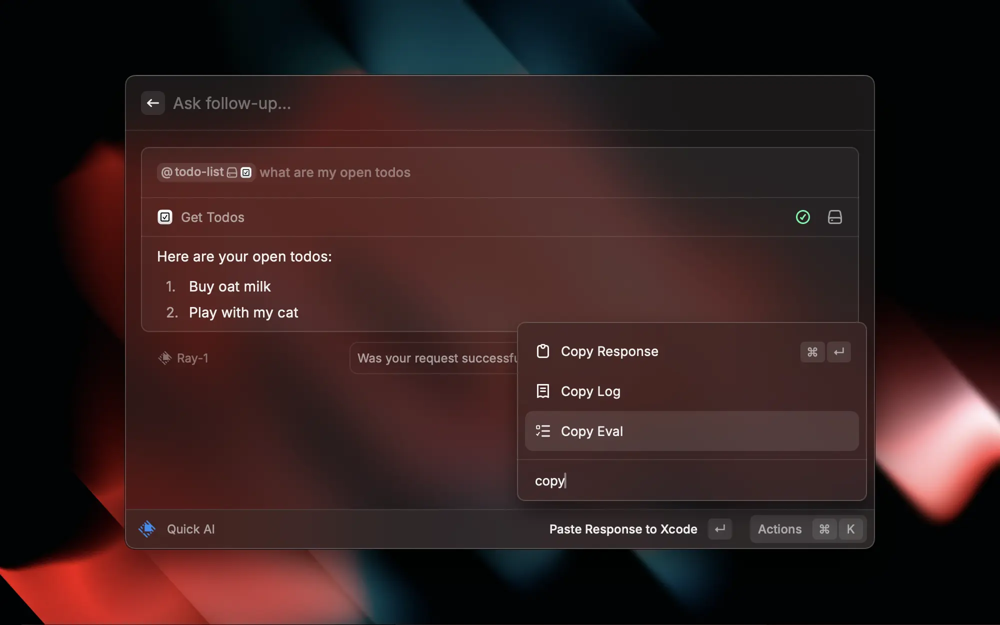

# Write Evals For Your AI Extension

We all know that AI is not always reliable. This is why it's important to write evals for your AI Extension. Evals allow you to test your AI Extension and make sure it behaves as expected.

## Add an Eval

The easiest way to add an eval is to first use your AI Extension. Then, once Raycast AI used your tools to finish its response, you can use the Copy Eval action to copy the eval to your clipboard.



You can then paste the eval into the `evals` array in the [`package.json` file](../information/manifest.md).

```json
{
  "ai": {
    "evals": [
      {
        "input": "@todo-list what are my open todos",
        "mocks": {
          "get-todos": [
            {
              "id": "Z5lF8F-lSvGCD6e3uZwkL",
              "isCompleted": false,
              "title": "Buy oat milk"
            },
            {
              "id": "69Ag2mfaDakC3IP8XxpXU",
              "isCompleted": false,
              "title": "Play with my cat"
            }
          ]
        },
        "expected": [
          {
            "callsTool": "get-todos"
          }
        ]
      }
    ]
  }
}
```

## Run Your Evals

To run your evals, you can use the `npx ray evals` command. This will run the evals and print the results to the console. You get an overview of the evals that failed and the ones that passed. From here you can start improving the names and descriptions of your tools.

Visit [Learn Core Concepts of AI Extensions](./learn-core-concepts-of-ai-extensions.md#evals) to learn more about the different types of evals you can write.
