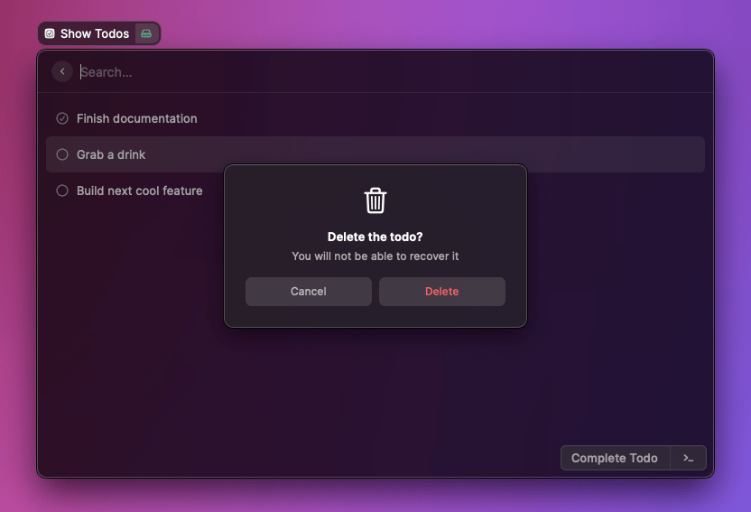

# Alert

When the user takes an important action (for example when irreversibly deleting something), you can ask for confirmation by using `confirmAlert`.



## API Reference

### confirmAlert

Creates and shows a confirmation Alert with the given [options](#alert.options).

#### Signature

```typescript
async function confirmAlert(options: Alert.Options): Promise<boolean>;
```

#### Example

```typescript
import { confirmAlert } from "@raycast/api";

export default async () => {
  if (await confirmAlert({ title: "Are you sure?" })) {
    // do something
  }
};
```

#### Parameters

| Name    | Type                                         | Required | Description                           |
| :------ | :------------------------------------------- | :------- | :------------------------------------ |
| options | <code>[Alert.Options](#alert.options)</code> | Yes      | The options used to create the Alert. |

#### Return

A Promise that resolves to a boolean when the user triggers one of the actions.
It will be `true` for the primary Action, `false` for the dismiss Action.

## Types

### Alert.Options

The options to create an Alert.

#### Example

```typescript
import { Alert } from "@raycast/api";

export default async () => {
  const options: Alert.Options = {
    title: "Finished cooking",
    message: "Delicious pasta for lunch",
    primaryAction: {
      title: "Do something",
      onAction: () => {
        // while you can register a handler for an action, it's more elegant
        // to use the `if (await confirmAlert(...)) { ... }` pattern
        console.log("The alert action has been triggered");
      },
    },
  };
  await confirmAlert(options);
};
```

#### Properties

| Name          | Type                                                      | Required | Description                                                                                                                |
| :------------ | :-------------------------------------------------------- | :------- | :------------------------------------------------------------------------------------------------------------------------- |
| title         | <code>string</code>                                       | Yes      | The title of an alert. Displayed below the icon.                                                                           |
| icon          | <code>[ImageLike](./icons-and-images.md#imagelike)</code> | No       | The icon of an alert to illustrate the action. Displayed on the top.                                                       |
| message       | <code>string</code>                                       | No       | An additional message for an Alert. Useful to show more information, e.g. a confirmation message for a destructive action. |
| primaryAction | <code>[Alert.ActionOptions](#alert.actionoptions)</code>  | No       | The primary Action the user can take.                                                                                      |
| dismissAction | <code>[Alert.ActionOptions](#alert.actionoptions)</code>  | No       | The Action to dismiss the alert. There usually shouldn't be any side effects when the user takes this action.              |

### Alert.ActionOptions

The options to create an Alert Action.

#### Properties

| Name     | Type                                                 | Required | Description                                     |
| :------- | :--------------------------------------------------- | :------- | :---------------------------------------------- |
| title    | <code>string</code>                                  | Yes      | The title of the action.                        |
| style    | <code>[Alert.ActionStyle](#alert.actionstyle)</code> | No       | The style of the action.                        |
| onAction | <code>() => void</code>                              | No       | A callback called when the action is triggered. |

### Alert.ActionStyle

Defines the visual style of an Action of the Alert.

Use [Alert.ActionStyle.Default](#alert.actionstyle) for confirmations of a positive action.
Use [Alert.ActionStyle.Destructive](#alert.actionstyle) for confirmations of a destructive action (eg. deleting a file).

#### Enumeration members

| Name        | Value                                                   |
| :---------- | :------------------------------------------------------ |
| Default     |      |
| Destructive |  |
| Cancel      |       |
