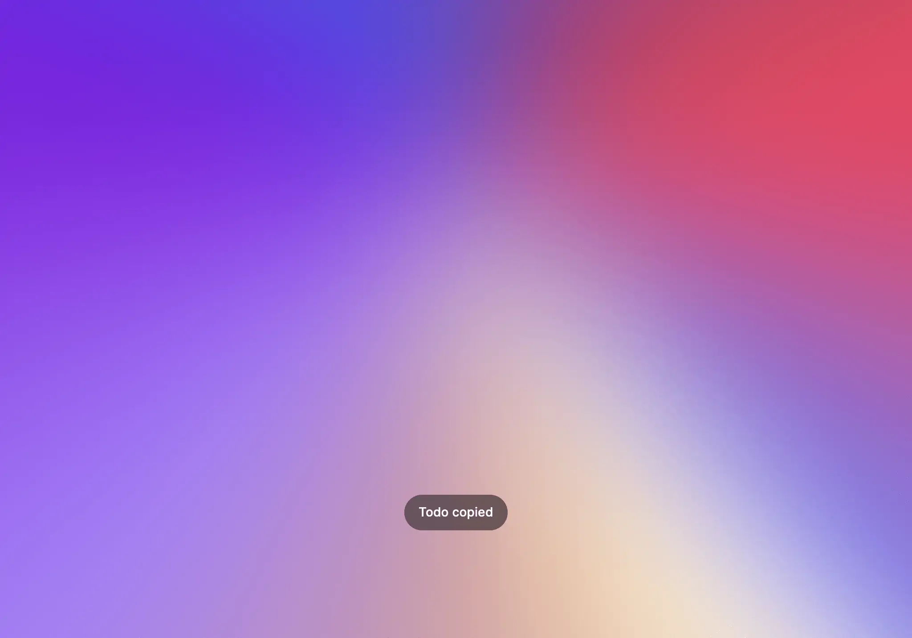

# HUD

When the user takes an action that has the side effect of closing Raycast (for example when copying something in the [Clipboard](../clipboard.md)), you can use a HUD to confirm that the action worked properly.



## API Reference

### showHUD

A HUD will automatically hide the main window and show a compact message at the bottom of the screen.

#### Signature

```typescript
async function showHUD(
  title: string,
  options?: { clearRootSearch?: boolean; popToRootType?: PopToRootType }
): Promise<void>;
```

#### Example

```typescript
import { showHUD } from "@raycast/api";

export default async function Command() {
  await showHUD("Hey there 👋");
}
```

`showHUD` closes the main window when called, so you can use the same options as `closeMainWindow`:

```typescript
import { PopToRootType, showHUD } from "@raycast/api";

export default async function Command() {
  await showHUD("Hey there 👋", { clearRootSearch: true, popToRootType: PopToRootType.Immediate });
}
```

#### Parameters

<FunctionParametersTableFromJSDoc name="showHUD" />

#### Return

A Promise that resolves when the HUD is shown.
