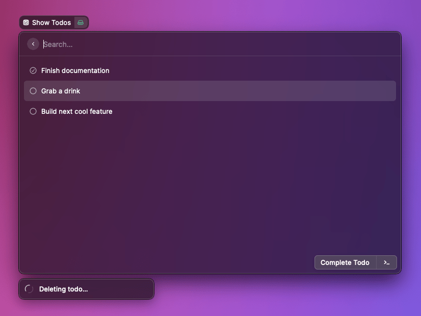
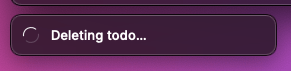
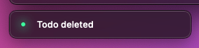
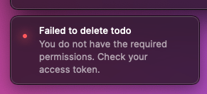

# Toast

When an asynchronous operation is happening or when an error is thrown, it's usually a good idea to keep the user informed about it. Toasts are made for that.

Additionaly, Toasts can have some actions associated to the action they are about. For example, you could provide a way to cancel an asynchronous operation, undo an action, or copy the stack trace of an error.



## API Reference

### showToast

Creates and shows a Toast with the given [options](#toast.options).

#### Signature

```typescript
async function showToast(options: Toast.Options): Promise<Toast>;
```

#### Example

```typescript
import { showToast, Toast } from "@raycast/api";

export default async () => {
  const success = false;

  if (success) {
    await showToast({ title: "Dinner is ready", message: "Pizza margherita" });
  } else {
    await showToast({
      style: Toast.Style.Failure,
      title: "Dinner isn't ready",
      message: "Pizza dropped on the floor",
    });
  }
};
```

When showing an animated Toast, you can later on update it:

```typescript
import { showToast, Toast } from "@raycast/api";
import { setTimeout } from "timers/promises";

export default async () => {
  const toast = await showToast({
    style: Toast.Style.Animated,
    title: "Uploading image",
  });

  try {
    // upload the image
    await setTimeout(1000);

    toast.style = Toast.Style.Success;
    toast.title = "Uploaded image";
  } catch (err) {
    toast.style = Toast.Style.Failure;
    toast.title = "Failed to upload image";
    toast.message = err.message;
  }
};
```

#### Parameters

| Name    | Type                                         | Required | Description                           |
| :------ | :------------------------------------------- | :------- | :------------------------------------ |
| options | <code>[Toast.Options](#toast.options)</code> | Yes      | The options used to create the Toast. |

#### Return

A Promise that resolves with the shown Toast. The Toast can be used to change or hide it.

## Types

### Toast

A Toast with a certain style, title, and message.

Use [showToast](#showtoast) to create and show a Toast.

#### Properties

| Name            | Type                                                                               | Description                                                                                                        |
| :-------------- | :--------------------------------------------------------------------------------- | :----------------------------------------------------------------------------------------------------------------- |
| title           | <code>string</code>                                                                | The title of a Toast. Displayed on the top.                                                                        |
| message         | <code>undefined</code> or <code>string</code>                                      | An additional message for the Toast. Useful to show more information, e.g. an identifier of a newly created asset. |
| style           | <code>[Toast.Style](#toast.style)</code>                                           | The style of a Toast.                                                                                              |
| primaryAction   | <code>undefined</code> or <code>[Toast.ActionOptions](#toast.actionoptions)</code> | The primary Action the user can take when hovering on the Toast.                                                   |
| secondaryAction | <code>undefined</code> or <code>[Toast.ActionOptions](#toast.actionoptions)</code> | The secondary Action the user can take when hovering on the Toast.                                                 |

#### Methods

| Name | Type                                | Description      |
| :--- | :---------------------------------- | :--------------- |
| hide | <code>() => Promise&lt;void></code> | Hides the Toast. |
| show | <code>() => Promise&lt;void></code> | Shows the Toast. |

### Toast.Options

The options to create a [Toast](#toast).

#### Example

```typescript
import { showToast, Toast } from "@raycast/api";

export default async () => {
  const options: Toast.Options = {
    style: Toast.Style.Success,
    title: "Finished cooking",
    message: "Delicious pasta for lunch",
    primaryAction: {
      title: "Do something",
      onAction: (toast) => {
        console.log("The toast action has been triggered");
        toast.hide();
      },
    },
  };
  await showToast(options);
};
```

#### Properties

| Name            | Type                                                     | Required | Description                                                                                                        |
| :-------------- | :------------------------------------------------------- | :------- | :----------------------------------------------------------------------------------------------------------------- |
| title           | <code>string</code>                                      | Yes      | The title of a Toast. Displayed on the top.                                                                        |
| style           | <code>[Toast.Style](#toast.style)</code>                 | No       | The style of a Toast. Defaults to `Toast.Style.Success`                                                            |
| message         | <code>string</code>                                      | No       | An additional message for the Toast. Useful to show more information, e.g. an identifier of a newly created asset. |
| primaryAction   | <code>[Toast.ActionOptions](#toast.actionoptions)</code> | No       | The primary Action the user can take when hovering on the Toast.                                                   |
| secondaryAction | <code>[Toast.ActionOptions](#toast.actionoptions)</code> | No       | The secondary Action the user can take when hovering on the Toast.                                                 |

### Toast.Style

Defines the visual style of the Toast.

Use [Toast.Style.Success](#toast.style) for confirmations and [Toast.Style.Failure](#toast.style) for displaying errors.
Use [Toast.Style.Animated](#toast.style) when your Toast should be shown until a process is completed.
You can hide it later by using [Toast.hide](#toast) or update the properties of an existing Toast.

#### Enumeration members

| Name     | Value                                         |
| :------- | :-------------------------------------------- |
| Animated |  |
| Success  |   |
| Failure  |   |

### Toast.ActionOptions

The options to create a [Toast](#toast) Action.

#### Properties

| Name     | Type                                                     | Required | Description                                                                                    |
| :------- | :------------------------------------------------------- | :------- | :--------------------------------------------------------------------------------------------- |
| title    | <code>string</code>                                      | Yes      | The title of the action.                                                                       |
| onAction | <code>(toast: Toast) => void</code>                      | Yes      | A callback called when the action is triggered. It receives the current Toast as its argument. |
| shortcut | <code>[KeyboardShortcut](../keyboard.md#shortcut)</code> | No       | The keyboard shortcut for the action.                                                          |
