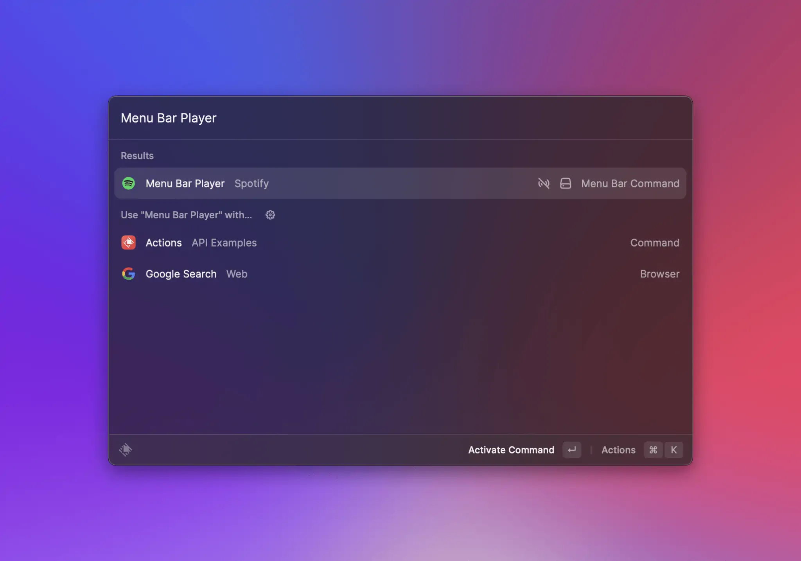
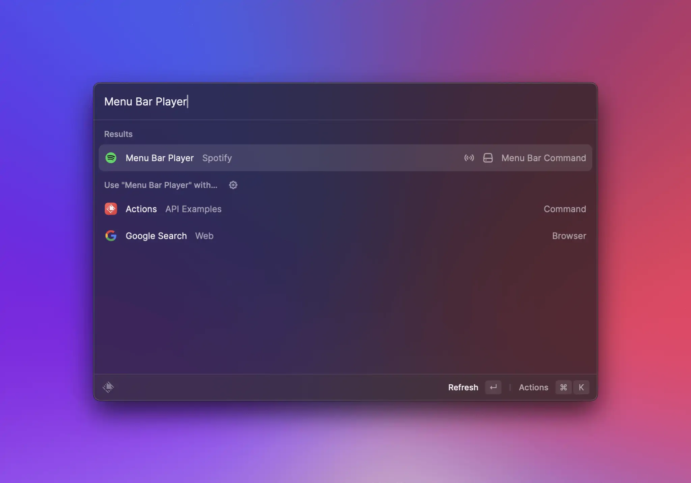
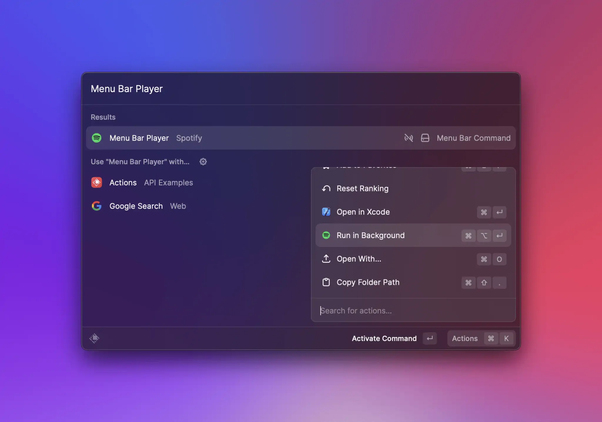

# Menu Bar Commands

The `MenuBarExtra` component can be used to create commands which populate the [extras](https://developer.apple.com/design/human-interface-guidelines/components/system-experiences/the-menu-bar#menu-bar-commands) section of macOS' menu bar.



Menubar commands aren't available on Windows.



## Getting Started

If you don't have an extension yet, follow the [getting started](../basics/getting-started.md) guide and then return to this page.
Now that your extension is ready, let's open its `package.json` file and add a new entry to its `commands` array, ensuring its `mode` property is set to `menu-bar`. For this guide, let's add the following:

```JSON
{
  "name": "github-pull-requests",
  "title": "Pull Requests",
  "subtitle": "GitHub",
  "description": "See your GitHub pull requests at a glance",
  "mode": "menu-bar"
},
```


Check out the [command properties entry](../information/manifest.md#command-properties) in the manifest file documentation for more detailed information on each of those properties.


Create `github-pull-requests.tsx` in your extensions `src/` folder and add the following:

```typescript
import { MenuBarExtra } from "@raycast/api";

export default function Command() {
  return (
    <MenuBarExtra icon="https://github.githubassets.com/favicons/favicon.png" tooltip="Your Pull Requests">
      <MenuBarExtra.Item title="Seen" />
      <MenuBarExtra.Item
        title="Example Seen Pull Request"
        onAction={() => {
          console.log("seen pull request clicked");
        }}
      />
      <MenuBarExtra.Item title="Unseen" />
      <MenuBarExtra.Item
        title="Example Unseen Pull Request"
        onAction={() => {
          console.log("unseen pull request clicked");
        }}
      />
    </MenuBarExtra>
  );
}
```

If your development server is running, the command should appear in your root search, and running the command should result in the `GitHub` icon appearing in your menu bar.



macOS has the final say on whether a given menu bar extra is displayed. If you have a lot of items there, it is possible that the command we just ran doesn't show up. If that's the case, try to clear up some space in the menu bar, either by closing some of the items you don't need or by hiding them using [HiddenBar](https://github.com/dwarvesf/hidden), [Bartender](https://www.macbartender.com/), or similar apps.


Of course, our pull request command wouldn't be of that much use if we had to tell it to update itself every single time. To add [background refresh](../information/lifecycle/background-refresh.md) to our command, we need to open the `package.json` file we modified earlier and add an `interval` key to the command configuration object:

```JSON
{
  "name": "github-pull-requests",
  "title": "Pull Requests",
  "subtitle": "GitHub",
  "description": "See your GitHub pull requests at a glance",
  "mode": "menu-bar",
  "interval": "5m"
}
```

Your root search should look similar to:



Running it once should activate it to:



## Lifecycle

Although `menu-bar` commands can result in items permanently showing up in the macOS menu bar, they are not long-lived processes. Instead, as with other commands, Raycast loads them into memory on demand, executes their code and then tries to unload them at the next convenient time.
There are five distinct events that can result in a `menu-bar`'s item being placed in the menu bar, so let's walk through each one.

### From the root search

Same as any other commands, `menu-bar` commands can be run directly from Raycast's root search. Eventually, they may result in a new item showing up in your menu bar (if you have enough room and if the command returns a `MenuBarExtra`), or in a previous item disappearing, if the command returns `null`. In this case, Raycast will load your command code, execute it, wait for the `MenuBarExtra`'s `isLoading` prop to switch to `false`, and unload the command.


If your command returns a `MenuBarExtra`, it _must_ either not set `isLoading` - in which case Raycast will render and immediately unload the command, or set it to `true` while it's performing an async task (such as an API call) and then set it to `false` once it's done. Same as above, Raycast will load the command code, execute it, wait for `MenuBarExtra`'s `isLoading` prop to switch to `false`, and then unload the command.


### At a set interval

If your `menu-bar` command also makes use of [background refresh](../information/lifecycle/background-refresh.md) _and_ it has background refresh activated, Raycast will run the command at set intervals. In your command, you can use `environment.launchType` to check whether it is launched in the background or by the user.


To ease testing, commands configured to run in the background have an extra action in development mode:\



### When the user clicks the command's icon / title in the menu bar

One of the bigger differences to `view` or `no-view` commands is that `menu-bar` commands have an additional entry point: when the user clicks their item in the menu bar. If the item has a menu (i.e. `MenuBarExtra` provides at least one child), Raycast will load the command code, execute it and keep it in memory while the menu is open. When the menu closes (either by the user clicking outside, or by clicking a `MenuBarExtra.Item`), the command is then unloaded.

### When Raycast is restarted

This case assumes that your command has run at least once, resulting in an item being placed in the menu bar. If that's the case, quitting and starting Raycast again should put the same item in your menu bar. However, that item will be restored from Raycast's database - _not_ by loading and executing the command.

### When a menu bar command is re-enabled in preferences

This case should work the same as when Raycast is restarted.

## Best practices

- make generous use of the [Cache API](./cache.md) and our [Utilities](../utils-reference/getting-started.md) in order to provide quick feedback and ensure action handlers work as expected
- make sure you set `isLoading` to false when your command finishes executing
- avoid setting long titles in `MenuBarExtra`, `MenuBarExtra.Submenu` or `MenuBarExtra.Item`
- don't put identical `MenuBarExtra.Item`s at the same level (direct children of `MenuBarExtra` or in the same `Submenu`) as their `onAction` handlers will not be executed correctly

## API Reference

### MenuBarExtra

Adds an item to the menu bar, optionally with a menu attached in case its `children` prop is non-empty.


`menu-bar` commands don't always need to return a `MenuBarExtra`. Sometimes it makes sense to remove an item from the menu bar, in which case you can write your command logic to return `null` instead.


#### Example

```typescript
import { Icon, MenuBarExtra, open } from "@raycast/api";

const data = {
  archivedBookmarks: [{ name: "Google Search", url: "www.google.com" }],
  newBookmarks: [{ name: "Raycast", url: "www.raycast.com" }],
};

export default function Command() {
  return (
    <MenuBarExtra icon={Icon.Bookmark}>
      <MenuBarExtra.Section title="New">
        {data?.newBookmarks.map((bookmark) => (
          <MenuBarExtra.Item key={bookmark.url} title={bookmark.name} onAction={() => open(bookmark.url)} />
        ))}
      </MenuBarExtra.Section>
      <MenuBarExtra.Section title="Archived">
        {data?.archivedBookmarks.map((bookmark) => (
          <MenuBarExtra.Item key={bookmark.url} title={bookmark.name} onAction={() => open(bookmark.url)} />
        ))}
      </MenuBarExtra.Section>
    </MenuBarExtra>
  );
}
```

#### Props

<PropsTableFromJSDoc component="MenuBarExtra" />

### MenuBarExtra.Item

An item in the [MenuBarExtra](#menubarextra) or in a [MenuBarExtra.Submenu](#menubarextra.submenu).

#### Example





An item that only provides a `title` prop will be rendered as disabled. Use this to create section titles.

```typescript
import { Icon, MenuBarExtra } from "@raycast/api";

export default function Command() {
  return (
    <MenuBarExtra icon={Icon.Bookmark}>
      <MenuBarExtra.Item title="Raycast.com" />
    </MenuBarExtra>
  );
}
```





Similarly, an item that provides a `title` and an `icon` prop will also be rendered as disabled.

```typescript
import { Icon, MenuBarExtra } from "@raycast/api";

export default function Command() {
  return (
    <MenuBarExtra icon={Icon.Bookmark}>
      <MenuBarExtra.Item icon="raycast.png" title="Raycast.com" />
    </MenuBarExtra>
  );
}
```





An item that provides an `onAction` prop alongside `title` (and optionally `icon`) will _not_ be rendered as disabled. When users click this item in the menu bar, the action handler will be executed.

```typescript
import { Icon, MenuBarExtra, open } from "@raycast/api";

export default function Command() {
  return (
    <MenuBarExtra icon={Icon.Bookmark}>
      <MenuBarExtra.Item icon="raycast.png" title="Raycast.com" onAction={() => open("https://raycast.com")} />
    </MenuBarExtra>
  );
}
```





If an item provides another `MenuBarEtra.Item` via its `alternate`, prop, the second item will be shown then the user presses the ⌥ (opt) key. There are a few limitation:

1. The `alternate` item may not have a custom shortcut. Instead, it will inherit its parent's shortcut, with the addition of ⌥ (opt) as a modifier.
2. The `alternate` item may not also specify an alternate.
3. A parent item that provides an `alternate` may not use ⌥ (opt) as a modifier.

```typescript
import { Icon, MenuBarExtra, open } from "@raycast/api";

export default function Command() {
  return (
    <MenuBarExtra icon={Icon.Bookmark}>
      <MenuBarExtra.Item
        icon="raycast.png"
        title="Open Raycast Homepage"
        shortcut={{ key: "r", modifiers: ["cmd"] }}
        onAction={() => open("https://raycast.com")}
        alternate={
          <MenuBarExtra.Item
            icon="raycast.png"
            title="Open Raycast Store"
            onAction={() => open("https://raycast.com/store")}
          />
        }
      />
    </MenuBarExtra>
  );
}
```





#### Props

<PropsTableFromJSDoc component="MenuBarExtra.Item" />

### MenuBarExtra.Submenu

`MenuBarExtra.Submenu`s reveal their items when people interact with them. They're a good way to group items that naturally belong together, but keep in mind that submenus add complexity to your interface - so use them sparingly!

#### Example





```typescript
import { Icon, MenuBarExtra, open } from "@raycast/api";

export default function Command() {
  return (
    <MenuBarExtra icon={Icon.Bookmark}>
      <MenuBarExtra.Item icon="raycast.png" title="Raycast.com" onAction={() => open("https://raycast.com")} />
      <MenuBarExtra.Submenu icon="github.png" title="GitHub">
        <MenuBarExtra.Item title="Pull Requests" onAction={() => open("https://github.com/pulls")} />
        <MenuBarExtra.Item title="Issues" onAction={() => open("https://github.com/issues")} />
      </MenuBarExtra.Submenu>
      <MenuBarExtra.Submenu title="Disabled"></MenuBarExtra.Submenu>
    </MenuBarExtra>
  );
}
```





Submenus with no children will show up as disabled.

```typescript
import { Icon, MenuBarExtra, open } from "@raycast/api";

export default function Command() {
  return (
    <MenuBarExtra icon={Icon.Bookmark}>
      <MenuBarExtra.Submenu title="Disabled"></MenuBarExtra.Submenu>
    </MenuBarExtra>
  );
}
```





#### Props

<PropsTableFromJSDoc component="MenuBarExtra.Submenu" />

### MenuBarExtra.Section

An item to group related menu items. It has an optional title and a separator is added automatically between sections.

#### Example

```typescript
import { Icon, MenuBarExtra, open } from "@raycast/api";

const data = {
  archivedBookmarks: [{ name: "Google Search", url: "www.google.com" }],
  newBookmarks: [{ name: "Raycast", url: "www.raycast.com" }],
};

export default function Command() {
  return (
    <MenuBarExtra icon={Icon.Bookmark}>
      <MenuBarExtra.Section title="New">
        {data?.newBookmarks.map((bookmark) => (
          <MenuBarExtra.Item key={bookmark.url} title={bookmark.name} onAction={() => open(bookmark.url)} />
        ))}
      </MenuBarExtra.Section>
      <MenuBarExtra.Section title="Archived">
        {data?.archivedBookmarks.map((bookmark) => (
          <MenuBarExtra.Item key={bookmark.url} title={bookmark.name} onAction={() => open(bookmark.url)} />
        ))}
      </MenuBarExtra.Section>
    </MenuBarExtra>
  );
}
```

#### Props

<PropsTableFromJSDoc component="MenuBarExtra.Section" />

## Types

### MenuBarExtra.ActionEvent

An interface describing Action events in callbacks.

#### Properties

<InterfaceTableFromJSDoc name="MenuBarExtra.ActionEvent" />

#### Example

```typescript
import { MenuBarExtra } from "@raycast/api";

export default function Command() {
  return (
    <MenuBarExtra>
      <MenuBarExtra.Item
        title="Log Action Event Type"
        onAction={(event: MenuBarExtra.ActionEvent) => console.log("Action Event Type", event.type)}
      />
    </MenuBarExtra>
  );
}
```
