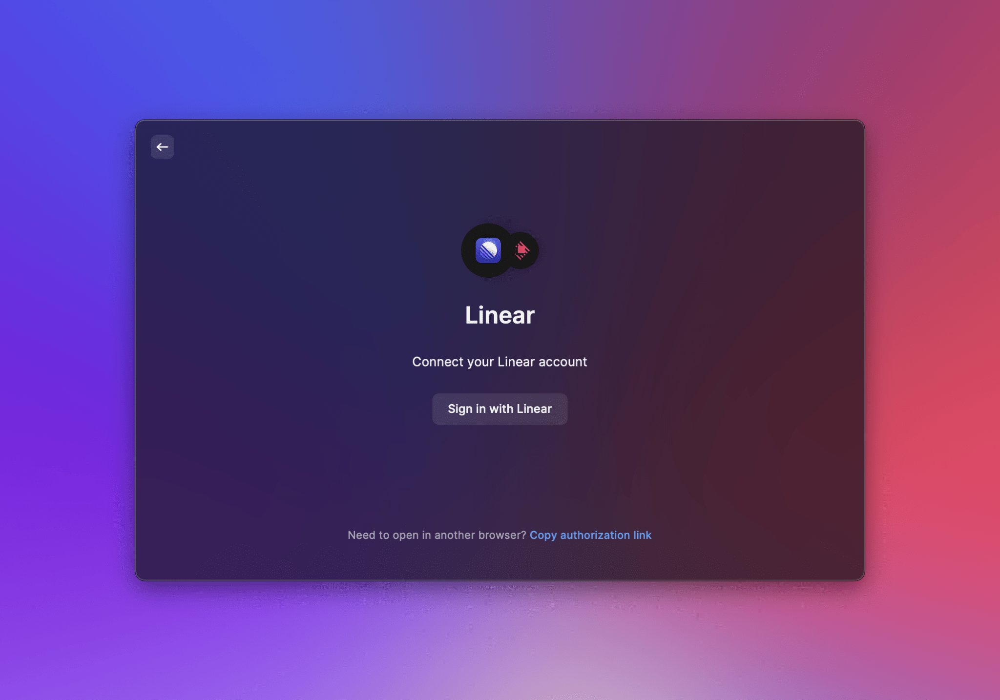
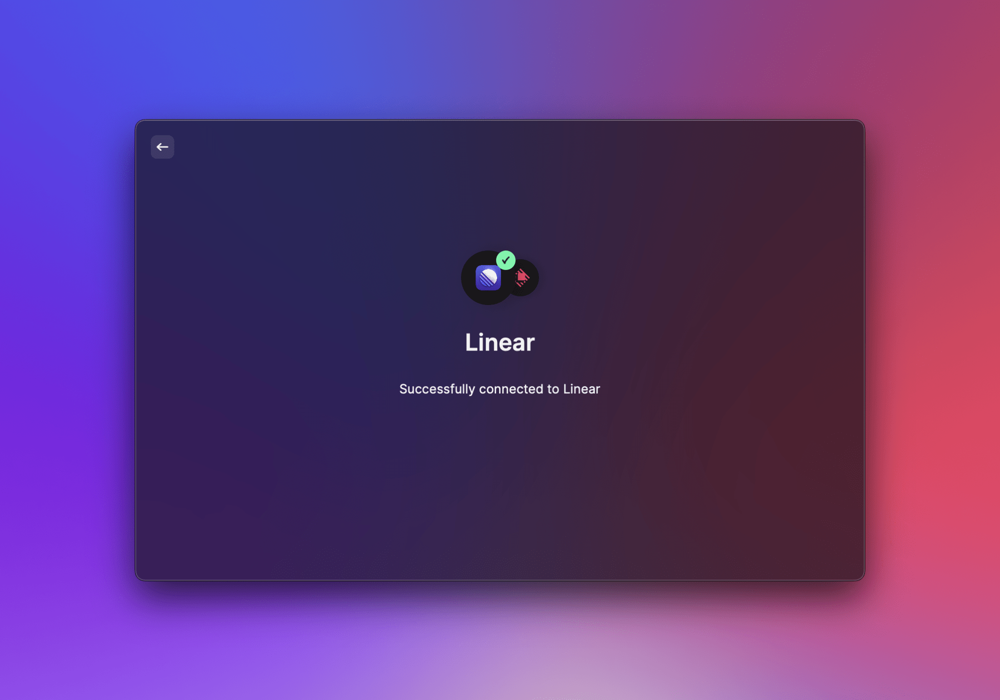

# OAuth

## Prerequisites

A Raycast extension can use OAuth for authorizing access to a provider's resources on the user's behalf. Since Raycast is a desktop app and the extensions are considered "public", we only support the [PKCE flow](https://datatracker.ietf.org/doc/html/rfc7636) (Proof Key for Code Exchange, pronounced “pixy”). This flow is the official recommendation for native clients that cannot keep a client secret. With PKCE, the client dynamically creates a secret and uses the secret again during code exchange, ensuring that only the client that performed the initial request can exchange the code for the access token (”proof of possession”).

Before considering OAuth, first check if your provider supports PKCE. You can usually find this in the provider's OAuth docs by looking for `code_challenge` and `code_verifier` parameters. Providers such as Google, Twitter, GitLab, Spotify, Zoom, Asana or Dropbox are all PKCE-ready. If you find that your provider does not yet support PKCE, you can often use other forms of authorization such as personal access tokens (usable with Raycast password preferences), or open-source PKCE proxies that "adapt" an OAuth flow to be PKCE-compatible (you would need to operate your own backend service in this case, so this is only recommended for very advanced use cases.)

## OAuth Flow



The OAuth flow from an extension looks like this:

1. The extension initiates the OAuth flow and starts authorization
2. Raycast shows the OAuth overlay ("Connect to provider...")
3. The user opens the provider's consent page in the web browser
4. After the user consent, the provider redirects back to Raycast
5. Raycast opens the extension where authorization is completed

When the flow is complete, the extension has received an access token from the provider and can perform API calls.
The API provides functions for securely storing and retrieving token sets, so that an extension can check whether the user is already logged in and whether an expired access token needs to be refreshed. Raycast also automatically shows a logout preference.



## OAuth App

You first need to register a new OAuth app with your provider. This is usually done in the provider's developer portal. After registering, you will receive a client ID. You also need to configure a redirect URI, see the next section.

Note: Make sure to choose an app type that supports PKCE. Some providers still show you a client secret, which you don't need and should _not_ hardcode in the extension, or support PKCE only for certain types such as "desktop", "native" or "mobile" app types.

## Authorizing

An extension can initiate the OAuth flow and authorize by using the methods on `OAuth.PKCEClient`.

You can create a new client and configure it with a provider name, icon and description that will be shown in the OAuth overlay. You can also choose between different redirect methods–depending on which method you choose, you need to configure this value as redirect URI in your provider's registered OAuth app. (See the `OAuth.RedirectMethod` docs for each method to get concrete examples for supported redirect URI.) If you can choose, use `OAuth.RedirectMethod.Web` and enter `https://raycast.com/redirect?packageName=Extension` (whether you have to add the `?packageName=Extension` depends on the provider).

```typescript
import { OAuth } from "@raycast/api";

const client = new OAuth.PKCEClient({
  redirectMethod: OAuth.RedirectMethod.Web,
  providerName: "Twitter",
  providerIcon: "twitter-logo.png",
  description: "Connect your Twitter account...",
});
```

Next you create an authorization request with the authorization endpoint, client ID, and scope values. You receive all values from your provider's docs and when you register a new OAuth app.

The returned `AuthorizationRequest` contains parameters such as the code challenge, verifier, state and redirect URI as standard OAuth authorization request. You can also customize the authorization URL through `OAuth.AuthorizationOptions` if you need to.

```typescript
const authRequest = await client.authorizationRequest({
  endpoint: "https://twitter.com/i/oauth2/authorize",
  clientId: "YourClientId",
  scope: "tweet.read users.read follows.read",
});
```

To get the authorization code needed for the token exchange, you call `authorize` with the request from the previous step.
This call shows the Raycast OAuth overlay and provides the user with an option to open the consent page in the web browser.
The authorize promise is resolved after the redirect back to Raycast and into the extension:

```typescript
const { authorizationCode } = await client.authorize(authRequest);
```

**Important**: When in development mode, make sure not to trigger auto-reloading (e.g. by saving a file) while you're testing an active OAuth authorization and redirect. This would cause an OAuth state mismatch when you're redirected back into the extension since the client would be reinitialized on reload.

Now that you have received the authorization code, you can exchange this code for an access token using your provider's token endpoint. This token exchange (and the following API calls) can be done with your preferred Node HTTP client library. Example using `node-fetch`:

```typescript
async function fetchTokens(
  authRequest: OAuth.AuthorizationRequest,
  authCode: string
): Promise<OAuth.TokenResponse> {
  const params = new URLSearchParams();
  params.append("client_id", "YourClientId");
  params.append("code", authCode);
  params.append("code_verifier", authRequest.codeVerifier);
  params.append("grant_type", "authorization_code");
  params.append("redirect_uri", authRequest.redirectURI);

  const response = await fetch("https://api.twitter.com/2/oauth2/token", {
    method: "POST",
    body: params,
  });
  if (!response.ok) {
    console.error("fetch tokens error:", await response.text());
    throw new Error(response.statusText);
  }
  return (await response.json()) as OAuth.TokenResponse;
}
```

## Token Storage

The PKCE client exposes methods for storing, retrieving and deleting token sets. A `TokenSet` contains an access token and typically also a refresh token, expires value, and the current scope. Since this data is returned by the provider's token endpoint as standard OAuth JSON response, you can directly store the response (`OAuth.TokenResponse`) or alternatively use `OAuth.TokenSetOptions`:

```typescript
await client.setTokens(tokenResponse);
```

Once the token set is stored, Raycast will automatically show a logout preference for the extension. When the user logs out, the token set gets removed.

The `TokenSet` also enables you to check whether the user is logged in before starting the authorization flow:

```typescript
const tokenSet = await client.getTokens();
```

## Token Refresh

Since access tokens usually expire, an extension should provide a way to refresh the access token, otherwise users would be logged out or see errors.
Some providers require you to add an offline scope so that you get a refresh token. (Twitter, for example, needs the scope `offline.access` or it only returns an access token.)
A basic refresh flow could look like this:

```typescript
const tokenSet = await client.getTokens();
if (tokenSet?.accessToken) {
  if (tokenSet.refreshToken && tokenSet.isExpired()) {
    await client.setTokens(await refreshTokens(tokenSet.refreshToken));
  }
  return;
}
// authorize...
```

This code would run before starting the authorization flow. It checks the presence of a token set to see whether the user is logged in and then checks whether there is a refresh token and the token set is expired (through the convenience method `isExpired()` on the `TokenSet`). If it is expired, the token is refreshed and updated in the token set. Example using `node-fetch`:

```typescript
async function refreshTokens(
  refreshToken: string
): Promise<OAuth.TokenResponse> {
  const params = new URLSearchParams();
  params.append("client_id", "YourClientId");
  params.append("refresh_token", refreshToken);
  params.append("grant_type", "refresh_token");

  const response = await fetch("https://api.twitter.com/2/oauth2/token", {
    method: "POST",
    body: params,
  });
  if (!response.ok) {
    console.error("refresh tokens error:", await response.text());
    throw new Error(response.statusText);
  }

  const tokenResponse = (await response.json()) as OAuth.TokenResponse;
  tokenResponse.refresh_token = tokenResponse.refresh_token ?? refreshToken;
  return tokenResponse;
}
```

## Examples

We've provided [OAuth example integrations for Google, Twitter, and Dropbox](https://github.com/raycast/extensions/tree/main/examples/api-examples) that demonstrate the entire flow shown above.

## API Reference

### OAuth.PKCEClient

#### Example

```typescript
import { OAuth } from "@raycast/api";

const client = new OAuth.PKCEClient({
  redirectMethod: OAuth.RedirectMethod.Web,
  providerName: "Twitter",
  providerIcon: "twitter-logo.png",
  description: "Connect your Twitter account...",
});
```

### OAuth.PKCEClient.Options

The options for creating a new [PKCEClient](#oauth.pkceclient).

#### Properties

<InterfaceTableFromJSDoc name="OAuth.PKCEClient.Options" />

### authorizationRequest

Creates an authorization request for the provided authorization endpoint, client ID, and scopes. You need to first create the authorization request before calling [authorize](#authorize).

The generated code challenge for the PKCE request uses the S256 method.

#### Signature

```typescript
async authorizationRequest(options: AuthorizationRequestOptions): Promise<AuthorizationRequest>;
```

#### Example

```typescript
const authRequest = await client.authorizationRequest({
  endpoint: "https://twitter.com/i/oauth2/authorize",
  clientId: "YourClientId",
  scope: "tweet.read users.read follows.read",
});
```

#### Parameters

| Name    | Type                                                                           | Required | Description                                           |
| :------ | :----------------------------------------------------------------------------- | :------- | :---------------------------------------------------- |
| options | <code>[AuthorizationRequestOptions](#oauth.authorizationrequestoptions)</code> | Yes      | The options used to create the authorization request. |

#### Return

A promise for an [AuthorizationRequest](#oauth.authorizationrequest) that you can use as input for [authorize](#authorize).

### authorize

Starts the authorization and shows the OAuth overlay in Raycast. As parameter you can either directly use the returned request from [authorizationRequest](#oauth.authorizationrequest), or customize the URL by extracting parameters from [AuthorizationRequest](#oauth.authorizationrequest) and providing your own URL via [AuthorizationOptions](#oauth.authorizationoptions). Eventually the URL will be used to open the authorization page of the provider in the web browser.

#### Signature

```typescript
async authorize(options: AuthorizationRequest | AuthorizationOptions): Promise<AuthorizationResponse>;
```

#### Example

```typescript
const { authorizationCode } = await client.authorize(authRequest);
```

#### Parameters

| Name    | Type                                                                                                                    | Required | Description                    |
| :------ | :---------------------------------------------------------------------------------------------------------------------- | :------- | :----------------------------- |
| options | <code>[AuthorizationRequest](#oauth.authorizationrequest) \| [AuthorizationOptions](#oauth.authorizationoptions)</code> | Yes      | The options used to authorize. |

#### Return

A promise for an [AuthorizationResponse](#oauth.authorizationresponse), which contains the authorization code needed for the token exchange. The promise is resolved when the user was redirected back from the provider's authorization page to the Raycast extension.

### setTokens

Securely stores a [TokenSet](#oauth.tokenset) for the provider. Use this after fetching the access token from the provider. If the provider returns a a standard OAuth JSON token response, you can directly pass the [TokenResponse](#oauth.tokenresponse).
At a minimum, you need to set the `accessToken`, and typically you also set `refreshToken` and `isExpired`.

Raycast automatically shows a logout preference for the extension when a token set was saved.

If you want to make use of the convenience `isExpired()` method, the property `expiresIn` must be configured.

#### Signature

```typescript
async setTokens(options: TokenSetOptions | TokenResponse): Promise<void>;
```

#### Example

```typescript
await client.setTokens(tokenResponse);
```

#### Parameters

| Name    | Type                                                                                            | Required | Description                              |
| :------ | :---------------------------------------------------------------------------------------------- | :------- | :--------------------------------------- |
| options | <code>[TokenSetOptions](#oauth.tokensetoptions) \| [TokenResponse](#oauth.tokenresponse)</code> | Yes      | The options used to store the token set. |

#### Return

A promise that resolves when the token set has been stored.

### getTokens

Retrieves the stored [TokenSet](#oauth.tokenset) for the client. You can use this to initially check whether the authorization flow should be initiated or the user is already logged in and you might have to refresh the access token.

#### Signature

```typescript
async getTokens(): Promise<TokenSet | undefined>;
```

#### Example

```typescript
const tokenSet = await client.getTokens();
```

#### Return

A promise that resolves when the token set has been retrieved.

### removeTokens

Removes the stored [TokenSet](#oauth.tokenset) for the client.
Raycast automatically shows a logout preference that removes the token set. Use this method only if you need to provide an additional logout option in your extension or you want to remove the token set because of a migration.

#### Signature

```typescript
async removeTokens(): Promise<void>;
```

#### Example

```typescript
await client.removeTokens();
```

#### Return

A promise that resolves when the token set has been removed.

### OAuth.RedirectMethod

Defines the supported redirect methods for the OAuth flow. You can choose between web and app-scheme redirect methods, depending on what the provider requires when setting up the OAuth app. For examples on what redirect URI you need to configure, see the docs for each method.

#### Enumeration members

| Name   | Value                                                                                                                                                                                                                                                                                                                  |
| :----- | :--------------------------------------------------------------------------------------------------------------------------------------------------------------------------------------------------------------------------------------------------------------------------------------------------------------------- |
| Web    | Use this type for a redirect back to the Raycast website, which will then open the extension. In the OAuth app, configure either `https://raycast.com/redirect` or `https://raycast.com/redirect?packageName=Extension`<br>(For example, Twitter would accept the former, while Spotify requires the query parameter.) |
| App    | Use this type for an app-scheme based redirect that directly opens Raycast. In the OAuth app, configure `raycast://oauth?package_name=Extension`                                                                                                                                                                       |
| AppURI | Use this type for a URI-style app scheme that directly opens Raycast. In the OAuth app, configure `com.raycast:/oauth?package_name=Extension`<br>(Note the single slash – Google, for example, would require this flavor for an OAuth app where the Bundle ID is `com.raycast`)                                        |

### OAuth.AuthorizationRequestOptions

The options for an authorization request via [authorizationRequest](#authorizationrequest).

<InterfaceTableFromJSDoc name="OAuth.AuthorizationRequestOptions" />

### OAuth.AuthorizationRequestURLParams

Values of [AuthorizationRequest](#oauth.authorizationrequest).
The PKCE client automatically generates the values for you and returns them for [authorizationRequest](#authorizationrequest)

<InterfaceTableFromJSDoc name="OAuth.AuthorizationRequestURLParams" />

### OAuth.AuthorizationRequest

The request returned by [authorizationRequest](#authorizationrequest).
Can be used as direct input to [authorize](#authorize), or to extract parameters for constructing a custom URL in [AuthorizationOptions](#oauth.authorizationoptions).

<InterfaceTableFromJSDoc name="OAuth.AuthorizationRequest" />

#### Methods

| Name    | Type                      | Description                            |
| :------ | :------------------------ | :------------------------------------- |
| toURL() | <code>() => string</code> | Constructs the full authorization URL. |

### OAuth.AuthorizationOptions

Options for customizing [authorize](#authorize).
You can use values from [AuthorizationRequest](#oauth.authorizationrequest) to build your own URL.

<InterfaceTableFromJSDoc name="OAuth.AuthorizationOptions" />

### OAuth.AuthorizationResponse

The response returned by [authorize](#authorize), containing the authorization code after the provider redirect. You can then exchange the authorization code for an access token using the provider's token endpoint.

<InterfaceTableFromJSDoc name="OAuth.AuthorizationResponse" />

### OAuth.TokenSet

Describes the TokenSet created from an OAuth provider's token response. The `accessToken` is the only required parameter but typically OAuth providers also return a refresh token, an expires value, and the scope.
Securely store a token set via [setTokens](#settokens) and retrieve it via [getTokens](#gettokens).

<InterfaceTableFromJSDoc name="OAuth.TokenSet" />

#### Methods

| Name        | Type                       | Description                                                                                                                                                                                                                                          |
| :---------- | :------------------------- | :--------------------------------------------------------------------------------------------------------------------------------------------------------------------------------------------------------------------------------------------------- |
| isExpired() | <code>() => boolean</code> | A convenience method for checking whether the access token has expired. The method factors in some seconds of "buffer", so it returns true a couple of seconds before the actual expiration time. This requires the `expiresIn` parameter to be set. |

### OAuth.TokenSetOptions

Options for a [TokenSet](#oauth.tokenset) to store via [setTokens](#settokens).

<InterfaceTableFromJSDoc name="OAuth.TokenSetOptions" />

### OAuth.TokenResponse

Defines the standard JSON response for an OAuth token request.
The response can be directly used to store a [TokenSet](#oauth.tokenset) via [setTokens](#settokens).

<InterfaceTableFromJSDoc name="OAuth.TokenResponse" />
