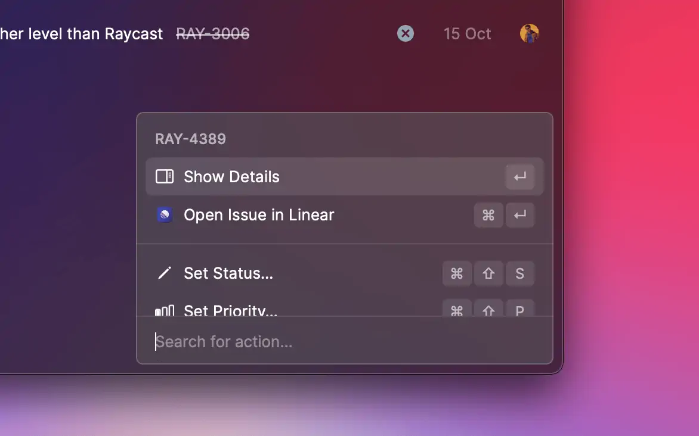

# Action Panel



## API Reference

### ActionPanel

Exposes a list of [actions](./actions.md) that can be performed by the user.

Often items are context-aware, e.g., based on the selected list item. Actions can be grouped into semantic
sections and can have keyboard shortcuts assigned.

The first and second action become the primary and secondary action. They automatically get the default keyboard shortcuts assigned.
In [List](./list.md), [Grid](./grid.md), and [Detail](./detail.md), this is `↵` for the primary and `⌘` `↵` for the secondary action. In [Form](./form.md) it's `⌘` `↵` for the primary and `⌘` `⇧` `↵` for the secondary.
Keep in mind that while you can specify an alternative shortcut for the primary and secondary actions, it won't be displayed in the Action Panel.

#### Example

```typescript
import { ActionPanel, Action, List } from "@raycast/api";

export default function Command() {
  return (
    <List navigationTitle="Open Pull Requests">
      <List.Item
        title="Docs: Update API Reference"
        subtitle="#1"
        actions={
          <ActionPanel title="#1 in raycast/extensions">
            <Action.OpenInBrowser url="https://github.com/raycast/extensions/pull/1" />
            <Action.CopyToClipboard
              title="Copy Pull Request URL"
              content="https://github.com/raycast/extensions/pull/1"
            />
          </ActionPanel>
        }
      />
    </List>
  );
}
```

#### Props

<PropsTableFromJSDoc component="ActionPanel" />

### ActionPanel.Section

A group of visually separated items.

Use sections when the [ActionPanel](#actionpanel) contains a lot of actions to help guide the user to related actions.
For example, create a section for all copy actions.

#### Example

```typescript
import { ActionPanel, Action, List } from "@raycast/api";

export default function Command() {
  return (
    <List navigationTitle="Open Pull Requests">
      <List.Item
        title="Docs: Update API Reference"
        subtitle="#1"
        actions={
          <ActionPanel title="#1 in raycast/extensions">
            <ActionPanel.Section title="Copy">
              <Action.CopyToClipboard title="Copy Pull Request Number" content="#1" />
              <Action.CopyToClipboard
                title="Copy Pull Request URL"
                content="https://github.com/raycast/extensions/pull/1"
              />
              <Action.CopyToClipboard title="Copy Pull Request Title" content="Docs: Update API Reference" />
            </ActionPanel.Section>
            <ActionPanel.Section title="Danger zone">
              <Action title="Close Pull Request" onAction={() => console.log("Close PR #1")} />
            </ActionPanel.Section>
          </ActionPanel>
        }
      />
    </List>
  );
}
```

#### Props

<PropsTableFromJSDoc component="ActionPanel.Section" />

### ActionPanel.Submenu

A very specific action that replaces the current [ActionPanel](#actionpanel) with its children when selected.

This is handy when an action needs to select from a range of options. For example, to add a label to a GitHub pull request or an assignee to a todo.

#### Example

```typescript
import { Action, ActionPanel, Color, Icon, List } from "@raycast/api";

export default function Command() {
  return (
    <List navigationTitle="Open Pull Requests">
      <List.Item
        title="Docs: Update API Reference"
        subtitle="#1"
        actions={
          <ActionPanel title="#1 in raycast/extensions">
            <ActionPanel.Submenu title="Add Label">
              <Action
                icon={{ source: Icon.Circle, tintColor: Color.Red }}
                title="Bug"
                onAction={() => console.log("Add bug label")}
              />
              <Action
                icon={{ source: Icon.Circle, tintColor: Color.Yellow }}
                title="Enhancement"
                onAction={() => console.log("Add enhancement label")}
              />
              <Action
                icon={{ source: Icon.Circle, tintColor: Color.Blue }}
                title="Help Wanted"
                onAction={() => console.log("Add help wanted label")}
              />
            </ActionPanel.Submenu>
          </ActionPanel>
        }
      />
    </List>
  );
}
```

#### Props

<PropsTableFromJSDoc component="ActionPanel.Submenu" />

## Types

### ActionPanel.Children

```typescript
ActionPanel.Children: ActionPanel.Section | ActionPanel.Section[] | ActionPanel.Section.Children | null
```

Supported children for the [ActionPanel](#actionpanel) component.

### ActionPanel.Section.Children

```typescript
ActionPanel.Section.Children: Action | Action[] | ReactElement<ActionPanel.Submenu.Props> | ReactElement<ActionPanel.Submenu.Props>[] | null
```

Supported children for the [ActionPanel.Section](#actionpanel.section) component.

### ActionPanel.Submenu.Children

```typescript
ActionPanel.Children: ActionPanel.Section | ActionPanel.Section[] | ActionPanel.Section.Children | null
```

Supported children for the [ActionPanel.Submenu](#actionpanel.submenu) component.
