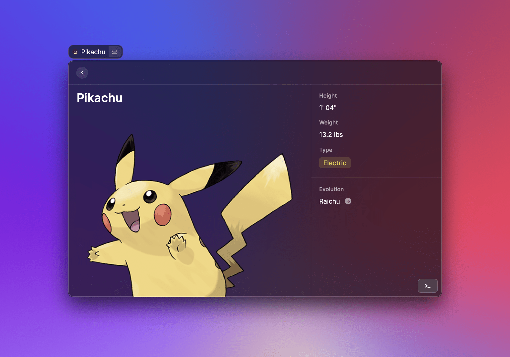

# Detail


## API Reference

### Detail

Renders a markdown ([CommonMark](https://commonmark.org)) string.

Typically used as a standalone view or when navigating from a [List](list.md).

#### Example

```typescript
import { Detail } from "@raycast/api";

export default function Command() {
  return <Detail markdown="**Hello** _World_!" />;
}
```

#### Props

| Prop            | Type                                                                           | Required | Default       | Description                                                                    |
| :-------------- | :----------------------------------------------------------------------------- | :------- | :------------ | :----------------------------------------------------------------------------- |
| markdown        | <code>null</code> or <code>string</code>                                       | No       | -             | The CommonMark string to be rendered.                                          |
| actions         | <code>null</code> or <code>[ActionPanel](./action-panel.md#actionpanel)</code> | No       | -             | A reference to an [ActionPanel](./action-panel.md#actionpanel).                |
| isLoading       | <code>boolean</code>                                                           | No       | false         | Indicates whether a loading bar should be shown or hidden below the search bar |
| navigationTitle | <code>string</code>                                                            | No       | Command title | The main title for that view displayed in Raycast                              |
| metadata        | <code>null</code> or <code>[Detail.Metadata](#detail.metadata)</code>          | No       | -             | The `Detail.Metadata` to be rendered in the right side area                    |

### Detail.Metadata

A Metadata view that will be shown in the right-hand-side of the `Detail`.

Use it to display additional structured data about the main content shown in the `Detail` view.



#### Example

```typescript
import { Detail } from "@raycast/api";

const markdown = `
# Pikachu


Pikachu that can generate powerful electricity have cheek sacs that are extra soft and super stretchy.
`;

export default function Main() {
  return (
    <Detail
      markdown={markdown}
      navigationTitle="Pikachu"
      metadata={
        <Detail.Metadata>
          <Detail.Metadata.Label title="Height" text={`1' 04"`} />
          <Detail.Metadata.Label title="Weight" text="13.2 lbs" />
          <Detail.Metadata.TagList title="Type">
            <Detail.Metadata.TagList.Item text="Electric" color={"#eed535"} />
          </Detail.Metadata.TagList>
          <Detail.Metadata.Separator />
          <Detail.Metadata.Link
            title="Evolution"
            target="https://www.pokemon.com/us/pokedex/pikachu"
            text="Raichu"
          />
        </Detail.Metadata>
      }
    />
  );
}
```

#### Props

| Prop     | Type                                                                                                               | Required | Default | Description                                             |
| :------- | :----------------------------------------------------------------------------------------------------------------- | :------- | :------ | :------------------------------------------------------ |
| children | `null` or `ReactElement<Detail.Metadata.ItemProps, string>` or `ReactElement<Detail.Metadata.ItemProps, string>[]` | No       | -       | The Detail.Metadata.Item elements of the Metadata view. |

### Detail.Metadata.Label

A single value with an optional icon.


#### Example

```typescript
import { Detail } from "@raycast/api";

export default function Main() {
  return (
    <Detail
      markdown={markdown}
      navigationTitle="Pikachu"
      metadata={
        <Detail.Metadata>
          <Detail.Metadata.Label
            title="Height"
            text={`1' 04"`}
            icon="weight.svg"
          />
        </Detail.Metadata>
      }
    />
  );
}
```

#### Props

| Prop  | Type                                         | Required | Default | Description                                  |
| :---- | :------------------------------------------- | :------- | :------ | :------------------------------------------- |
| title | `string`                                     | Yes      | -       | The title shown above the item.              |
| text  | `string`                                     | No       | -       | The text value of the item.                  |
| icon  | [`ImageLike`](icons-and-images.md#imagelike) | No       | -       | An icon to illustrate the value of the item. |

### Detail.Metadata.Link

An item to display a link.


#### Example

```typescript
import { Detail } from "@raycast/api";

export default function Main() {
  return (
    <Detail
      markdown={markdown}
      navigationTitle="Pikachu"
      metadata={
        <Detail.Metadata>
          <Detail.Metadata.Link
            title="Evolution"
            target="https://www.pokemon.com/us/pokedex/pikachu"
            text="Raichu"
          />
        </Detail.Metadata>
      }
    />
  );
}
```

#### Props

| Prop   | Type     | Required | Default | Description                     |
| :----- | :------- | :------- | :------ | :------------------------------ |
| title  | `string` | Yes      | -       | The title shown above the item. |
| text   | `string` | Yes      | -       | The text value of the item.     |
| target | `string` | Yes      | -       | The target of the link.         |

### Detail.Metadata.TagList

A list of [`Tags`](detail.md#detail.metadata.taglist.item) displayed in a row.


#### Example

```typescript
import { Detail } from "@raycast/api";

export default function Main() {
  return (
    <Detail
      markdown={markdown}
      navigationTitle="Pikachu"
      metadata={
        <Detail.Metadata>
          <Detail.Metadata.TagList title="Type">
            <Detail.Metadata.TagList.Item text="Electric" color={"#eed535"} />
          </Detail.Metadata.TagList>
        </Detail.Metadata>
      }
    />
  );
}
```

#### Props

| Prop     | Type                                                                                                                                                               | Required | Default | Description                        |
| :------- | :----------------------------------------------------------------------------------------------------------------------------------------------------------------- | :------- | :------ | :--------------------------------- |
| title    | `string`                                                                                                                                                           | Yes      | -       | The title shown above the item.    |
| children | `null` or [`Detail.Metadata.TagList.Item`](detail.md#detail.metadata.taglist.item) or [`Detail.Metadata.TagList.Item`](detail.md#detail.metadata.taglist.item)`[]` | No       | -       | The tags contained in the TagList. |

### Detail.Metadata.TagList.Item

A Tag in a `Detail.Metadata.TagList`.

#### Props

| Prop  | Type                                         | Required | Default | Description                                                                                         |
| :---- | :------------------------------------------- | :------- | :------ | :-------------------------------------------------------------------------------------------------- |
| text  | `string`                                     | Yes      | -       | The text of the tag.                                                                                |
| icon  | [`ImageLike`](icons-and-images.md#imagelike) | No       | -       | An icon in front of the text of the tag.                                                            |
| color | [`ColorLike`](colors.md#colorlike)           | No       | -       | Changes the text color to the provided color and sets a transparent background with the same color. |

### Detail.Metadata.Separator

A metadata item that shows a separator line. Use it for grouping and visually separating metadata items.


```typescript
import { Detail } from "@raycast/api";

export default function Main() {
  return (
    <Detail
      markdown={markdown}
      navigationTitle="Pikachu"
      metadata={
        <Detail.Metadata>
          <Detail.Metadata.Label title="Height" text={`1' 04"`} />
          <Detail.Metadata.Separator />
          <Detail.Metadata.Label title="Weight" text="13.2 lbs" />
        </Detail.Metadata>
      }
    />
  );
}
```
