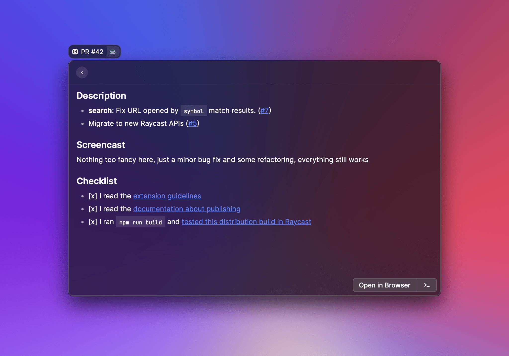

# Detail



## API Reference

### Detail

Renders a markdown ([CommonMark](https://commonmark.org)) string.

Typically used as a standalone view or when navigating from a [List](list.md).

#### Example

```typescript
import { Detail } from "@raycast/api";

export default function Command() {
  return <Detail markdown="**Hello** _World_!" />;
}
```

#### Props

| Prop            | Type                                                                           | Required | Default       | Description                                                                    |
| :-------------- | :----------------------------------------------------------------------------- | :------- | :------------ | :----------------------------------------------------------------------------- |
| actions         | <code>null</code> or <code>[ActionPanel](./action-panel.md#actionpanel)</code> | No       | -             | A reference to an [ActionPanel](./action-panel.md#actionpanel).                |
| isLoading       | <code>boolean</code>                                                           | No       | false         | Indicates whether a loading bar should be shown or hidden below the search bar |
| markdown        | <code>null</code> or <code>string</code>                                       | No       | -             | The CommonMark string to be rendered.                                          |
| navigationTitle | <code>string</code>                                                            | No       | Command title | The main title for that view displayed in Raycast                              |
