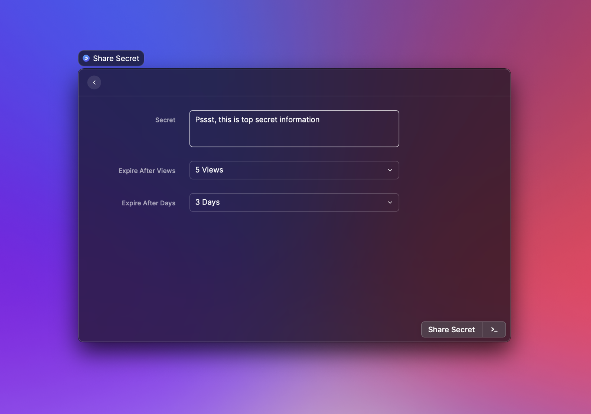
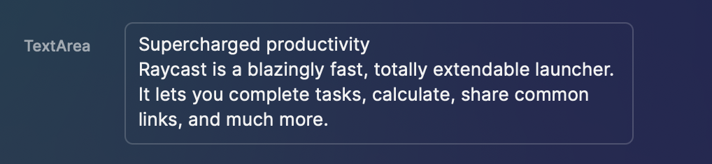
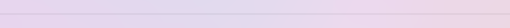

# Form



## API Reference

### Form

Shows a list of form items such as [Form.TextField](form.md#form.textfield), [Form.Checkbox](form.md#form.checkbox) or [Form.Dropdown](form.md#form.dropdown).

#### Props

| Prop            | Type                                                                                                                | Required | Default       | Description                                                                    |
| --------------- | ------------------------------------------------------------------------------------------------------------------- | -------- | ------------- | ------------------------------------------------------------------------------ |
| actions         | `null` or [`ActionPanel`](action-panel.md#actionpanel)                                                              | No       | -             | A reference to an [ActionPanel](action-panel.md#actionpanel).                  |
| children        | `null` or `ReactElement<Form.ItemProps<FormValue>, string>` or `ReactElement<Form.ItemProps<Form.Value>, string>[]` | No       | -             | The Form.Item elements of the form.                                            |
| isLoading       | `boolean`                                                                                                           | No       | false         | Indicates whether a loading bar should be shown or hidden below the search bar |
| navigationTitle | `string`                                                                                                            | No       | Command title | The main title for that view displayed in Raycast                              |

### Form.TextField

A form item with a text field for input.


#### Example




```typescript
import { ActionPanel, Form, Action } from "@raycast/api";

export default function Command() {
  return (
    <Form
      actions={
        <ActionPanel>
          <Action.SubmitForm
            title="Submit Name"
            onSubmit={(values) => console.log(values)}
          />
        </ActionPanel>
      }
    >
      <Form.TextField id="name" defaultValue="Steve" />
    </Form>
  );
}
```





```typescript
import { ActionPanel, Form, Action } from "@raycast/api";
import { useState } from "react";

export default function Command() {
  const [name, setName] = useState<string>();

  return (
    <Form
      actions={
        <ActionPanel>
          <Action.SubmitForm
            title="Submit Name"
            onSubmit={(values) => console.log(values)}
          />
        </ActionPanel>
      }
    >
      <Form.TextField id="name" value={name} onChange={setName} />
    </Form>
  );
}
```




#### Props

| Prop         | Type                                    | Required | Default | Description                                                                                                                                                                                                       |
| ------------ | --------------------------------------- | -------- | ------- | ----------------------------------------------------------------------------------------------------------------------------------------------------------------------------------------------------------------- |
| defaultValue | `string`                                | No       | -       | The default value of the item. Keep in mind that `defaultValue` will be configured once per component lifecycle. This means that if a user changes the value, `defaultValue` won't be configured on re-rendering. |
| id           | `string`                                | Yes      | -       | ID of the form item. Make sure to assign each form item a unique id. When using `Action.SubmitForm`, your can access the value with this id.                                                                      |
| placeholder  | `string`                                | No       | -       | Placeholder text shown in the text field.                                                                                                                                                                         |
| storeValue   | `boolean`                               | No       | -       | Indicates whether the value of the item should be persisted after submitting, and restored next time the form is rendered.                                                                                        |
| autofocus    | `boolean`                               | No       | -       | Indicates whether the item should be focused automatically once the form is rendered.                                                                                                                             |
| title        | `string`                                | No       | -       | The title displayed on the left side of the item.                                                                                                                                                                 |
| value        | `string`                                | No       | -       | The current value of the item.                                                                                                                                                                                    |
| onChange     | <code>(newValue: string) => void</code> | No       | -       |                                                                                                                                                                                                                   |

#### Methods (Imperative API)

| Name  | Signature               | Description                                                                                                                            |
| ----- | ----------------------- | -------------------------------------------------------------------------------------------------------------------------------------- |
| focus | <code>() => void</code> | Makes the item request focus.                                                                                                          |
| reset | <code>() => void</code> | Resets the form item to its initial value, or `defaultValue` if specified.                                                             |


### Form.PasswordField

A form item with a secure text field for password-entry in which the entered characters must be kept secret.


#### Example




```typescript
import { ActionPanel, Form, Action } from "@raycast/api";

export default function Command() {
  return (
    <Form
      actions={
        <ActionPanel>
          <Action.SubmitForm
            title="Submit Password"
            onSubmit={(values) => console.log(values)}
          />
        </ActionPanel>
      }
    >
      <Form.PasswordField id="password" title="Enter Password" />
    </Form>
  );
}
```





```typescript
import { ActionPanel, Form, Action } from "@raycast/api";
import { useState } from "react";

export default function Command() {
  const [password, setPassword] = useState<string>();

  return (
    <Form
      actions={
        <ActionPanel>
          <Action.SubmitForm
            title="Submit Password"
            onSubmit={(values) => console.log(values)}
          />
        </ActionPanel>
      }
    >
      <Form.PasswordField
        id="password"
        value={password}
        onChange={setPassword}
      />
    </Form>
  );
}
```




#### Props

| Prop         | Type                                    | Required | Default | Description                                                                                                                                                                                                       |
| ------------ | --------------------------------------- | -------- | ------- | ----------------------------------------------------------------------------------------------------------------------------------------------------------------------------------------------------------------- |
| defaultValue | `string`                                | No       | -       | The default value of the item. Keep in mind that `defaultValue` will be configured once per component lifecycle. This means that if a user changes the value, `defaultValue` won't be configured on re-rendering. |
| id           | `string`                                | Yes      | -       | ID of the form item. Make sure to assign each form item a unique id. When using `Action.SubmitForm`, your can access the value with this id.                                                                      |
| placeholder  | `string`                                | No       | -       | Placeholder text shown in the text field.                                                                                                                                                                         |
| storeValue   | `boolean`                               | No       | -       | Indicates whether the value of the item should be persisted after submitting, and restored next time the form is rendered.                                                                                        |
| autofocus    | `boolean`                               | No       | -       | Indicates whether the item should be focused automatically once the form is rendered.                                                                                                                             |
| title        | `string`                                | No       | -       | The title displayed on the left side of the item.                                                                                                                                                                 |
| value        | `string`                                | No       | -       | The current value of the item.                                                                                                                                                                                    |
| onChange     | <code>(newValue: string) => void</code> | No       | -       |                                                                                                                                                                                                                   |

#### Methods (Imperative API)

| Name  | Signature               | Description                                                                                                                            |
| ----- | ----------------------- | -------------------------------------------------------------------------------------------------------------------------------------- |
| focus | <code>() => void</code> | Makes the item request focus.                                                                                                          |
| reset | <code>() => void</code> | Resets the form item to its initial value, or `defaultValue` if specified.                                                             |

### Form.TextArea

A form item with a text area for input. The item supports multiline text entry.



#### Example




```typescript
import { ActionPanel, Form, Action } from "@raycast/api";

const DESCRIPTION =
  "We spend too much time staring at loading indicators. The Raycast team is dedicated to make everybody interact faster with their computers.";

export default function Command() {
  return (
    <Form
      actions={
        <ActionPanel>
          <Action.SubmitForm
            title="Submit Description"
            onSubmit={(values) => console.log(values)}
          />
        </ActionPanel>
      }
    >
      <Form.TextArea id="description" defaultValue={DESCRIPTION} />
    </Form>
  );
}
```





```typescript
import { ActionPanel, Form, Action } from "@raycast/api";
import { useState } from "react";

export default function Command() {
  const [description, setDescription] = useState<string>();

  return (
    <Form
      actions={
        <ActionPanel>
          <Action.SubmitForm
            title="Submit Description"
            onSubmit={(values) => console.log(values)}
          />
        </ActionPanel>
      }
    >
      <Form.TextArea
        id="description"
        value={description}
        onChange={setDescription}
      />
    </Form>
  );
}
```




#### Props

| Prop         | Type                                    | Required | Default | Description                                                                                                                                                                                                       |
| ------------ | --------------------------------------- | -------- | ------- | ----------------------------------------------------------------------------------------------------------------------------------------------------------------------------------------------------------------- |
| defaultValue | `string`                                | No       | -       | The default value of the item. Keep in mind that `defaultValue` will be configured once per component lifecycle. This means that if a user changes the value, `defaultValue` won't be configured on re-rendering. |
| id           | `string`                                | Yes      | -       | ID of the form item. Make sure to assign each form item a unique id. When using `Action.SubmitForm`, your can access the value with this id.                                                                      |
| placeholder  | `string`                                | No       | -       | Placeholder text shown in the text field.                                                                                                                                                                         |
| storeValue   | `boolean`                               | No       | -       | Indicates whether the value of the item should be persisted after submitting, and restored next time the form is rendered.                                                                                        |
| autofocus    | `boolean`                               | No       | -       | Indicates whether the item should be focused automatically once the form is rendered.                                                                                                                             |
| title        | `string`                                | No       | -       | The title displayed on the left side of the item.                                                                                                                                                                 |
| value        | `string`                                | No       | -       | The current value of the item.                                                                                                                                                                                    |
| onChange     | <code>(newValue: string) => void</code> | No       | -       |                                                                                                                                                                                                                   |

#### Methods (Imperative API)

| Name  | Signature               | Description                                                                                                                            |
| ----- | ----------------------- | -------------------------------------------------------------------------------------------------------------------------------------- |
| focus | <code>() => void</code> | Makes the item request focus.                                                                                                          |
| reset | <code>() => void</code> | Resets the form item to its initial value, or `defaultValue` if specified.                                                             |

### Form.Checkbox

A form item with a checkbox.


#### Example




```typescript
import { ActionPanel, Form, Action } from "@raycast/api";

export default function Command() {
  return (
    <Form
      actions={
        <ActionPanel>
          <Action.SubmitForm
            title="Submit Answer"
            onSubmit={(values) => console.log(values)}
          />
        </ActionPanel>
      }
    >
      <Form.Checkbox id="answer" label="Are you happy?" defaultValue={true} />
    </Form>
  );
}
```





```typescript
import { ActionPanel, Form, Action } from "@raycast/api";
import { useState } from "react";

export default function Command() {
  const [checked, setChecked] = useState(true);

  return (
    <Form
      actions={
        <ActionPanel>
          <Action.SubmitForm
            title="Submit Answer"
            onSubmit={(values) => console.log(values)}
          />
        </ActionPanel>
      }
    >
      <Form.Checkbox
        id="answer"
        label="Do you like orange juice?"
        value={checked}
        onChange={setChecked}
      />
    </Form>
  );
}
```




#### Props

| Prop         | Type                                     | Required | Default | Description                                                                                                                                                                                                       |
| ------------ | ---------------------------------------- | -------- | ------- | ----------------------------------------------------------------------------------------------------------------------------------------------------------------------------------------------------------------- |
| defaultValue | `boolean`                                | No       | -       | The default value of the item. Keep in mind that `defaultValue` will be configured once per component lifecycle. This means that if a user changes the value, `defaultValue` won't be configured on re-rendering. |
| id           | `string`                                 | Yes      | -       | ID of the form item. Make sure to assign each form item a unique id. When using `Action.SubmitForm`, your can access the value with this id.                                                                      |
| label        | `string`                                 | Yes      | -       | The label displayed on the right side of the checkbox.                                                                                                                                                            |
| storeValue   | `boolean`                                | No       | -       | Indicates whether the value of the item should be persisted after submitting, and restored next time the form is rendered.                                                                                        |
| title        | `string`                                 | No       | -       | The title displayed on the left side of the item.                                                                                                                                                                 |
| value        | `boolean`                                | No       | -       | The current value of the item.                                                                                                                                                                                    |
| onChange     | <code>(newValue: boolean) => void</code> | No       | -       |                                                                                                                                                                                                                   |

#### Methods (Imperative API)

| Name  | Signature               | Description                                                                                                                            |
| ----- | ----------------------- | -------------------------------------------------------------------------------------------------------------------------------------- |
| focus | <code>() => void</code> | Makes the item request focus.                                                                                                          |
| reset | <code>() => void</code> | Resets the form item to its initial value, or `defaultValue` if specified.                                                             |

### Form.DatePicker

A form item with a date picker.


#### Example




```typescript
import { ActionPanel, Form, Action } from "@raycast/api";

export default function Command() {
  return (
    <Form
      actions={
        <ActionPanel>
          <Action.SubmitForm
            title="Submit Form"
            onSubmit={(values) => console.log(values)}
          />
        </ActionPanel>
      }
    >
      <Form.DatePicker
        id="dateOfBirth"
        title="Date of Birth"
        defaultValue={new Date(1955, 1, 24)}
      />
    </Form>
  );
}
```





```typescript
import { ActionPanel, Form, Action } from "@raycast/api";
import { useState } from "react";

export default function Command() {
  const [date, setDate] = useState<Date>();

  return (
    <Form
      actions={
        <ActionPanel>
          <Action.SubmitForm
            title="Submit Form"
            onSubmit={(values) => console.log(values)}
          />
        </ActionPanel>
      }
    >
      <Form.DatePicker
        id="launchDate"
        title="Launch Date"
        value={date}
        onChange={setDate}
      />
    </Form>
  );
}
```




#### Props

| Prop         | Type                                                       | Required | Default                         | Description                                                                                                                                                                                                       |
| ------------ | ---------------------------------------------------------- | -------- | ------------------------------- | ----------------------------------------------------------------------------------------------------------------------------------------------------------------------------------------------------------------- |
| defaultValue | `Date`                                                     | No       | -                               | The default value of the item. Keep in mind that `defaultValue` will be configured once per component lifecycle. This means that if a user changes the value, `defaultValue` won't be configured on re-rendering. |
| id           | `string`                                                   | Yes      | -                               | ID of the form item. Make sure to assign each form item a unique id. When using `Action.SubmitForm`, your can access the value with this id.                                                                      |
| storeValue   | `boolean`                                                  | No       | -                               | Indicates whether the value of the item should be persisted after submitting, and restored next time the form is rendered.                                                                                        |
| title        | `string`                                                   | No       | -                               | The title displayed on the left side of the item.                                                                                                                                                                 |
| value        | `Date`                                                     | No       | -                               | The current value of the item.                                                                                                                                                                                    |
| onChange     | <code>(newValue: Date) => void</code>                      | No       | -                               |                                                                                                                                                                                                                   |
| type         | <code>[Form.DatePicker.Type](#form.datepicker.type]</code> | No       | `Form.DatePicker.Type.DateTime` | Indicates what types of date components can be picked                                                                                                                                                             |

#### Methods (Imperative API)

| Name  | Signature               | Description                                                                                                                            |
| ----- | ----------------------- | -------------------------------------------------------------------------------------------------------------------------------------- |
| focus | <code>() => void</code> | Makes the item request focus.                                                                                                          |
| reset | <code>() => void</code> | Resets the form item to its initial value, or `defaultValue` if specified.                                                             |

#### Form.DatePicker.Type

The types of date components the user can pick with a \`Form.DatePicker

| Name     | Description                                                      |
| -------- | ---------------------------------------------------------------- |
| DateTime | Hour and second can be picked in addition to year, month and day |
| Date     | Only year, month, and day can be picked                          |

### Form.Dropdown

A form item with a dropdown menu.


#### Example




```typescript
import { ActionPanel, Form, Action } from "@raycast/api";

export default function Command() {
  return (
    <Form
      actions={
        <ActionPanel>
          <Action.SubmitForm
            title="Submit Favorite"
            onSubmit={(values) => console.log(values)}
          />
        </ActionPanel>
      }
    >
      <Form.Dropdown id="emoji" title="Favorite Emoji" defaultValue="lol">
        <Form.Dropdown.Item value="poop" title="Pile of poop" icon="💩" />
        <Form.Dropdown.Item value="rocket" title="Rocket" icon="🚀" />
        <Form.Dropdown.Item
          value="lol"
          title="Rolling on the floor laughing face"
          icon="🤣"
        />
      </Form.Dropdown>
    </Form>
  );
}
```





```typescript
import { ActionPanel, Form, Action } from "@raycast/api";
import { useState } from "react";

export default function Command() {
  const [programmingLanguage, setProgrammingLanguage] =
    useState<string>("typescript");

  return (
    <Form
      actions={
        <ActionPanel>
          <Action.SubmitForm
            title="Submit Favorite"
            onSubmit={(values) => console.log(values)}
          />
        </ActionPanel>
      }
    >
      <Form.Dropdown
        id="dropdown"
        title="Favorite Language"
        value={programmingLanguage}
        onChange={setProgrammingLanguage}
      >
        <Form.Dropdown.Item value="cpp" title="C++" />
        <Form.Dropdown.Item value="javascript" title="JavaScript" />
        <Form.Dropdown.Item value="ruby" title="Ruby" />
        <Form.Dropdown.Item value="python" title="Python" />
        <Form.Dropdown.Item value="swift" title="Swift" />
        <Form.Dropdown.Item value="typescript" title="TypeScript" />
      </Form.Dropdown>
    </Form>
  );
}
```




#### Props

| Prop         | Type                                                                                                                                                                                                                                                                                       | Required | Default | Description                                                                                                                                                                                                       |
| ------------ | ------------------------------------------------------------------------------------------------------------------------------------------------------------------------------------------------------------------------------------------------------------------------------------------ | -------- | ------- | ----------------------------------------------------------------------------------------------------------------------------------------------------------------------------------------------------------------- |
| children     | `null` or <code>[Form.Dropdown.Section](form.md#form.dropdown.section)</code> or <code>[Form.Dropdown.Section](form.md#form.dropdown.section)[]</code> or <code>[Form.Dropdown.Item](form.md#form.dropdown.item)</code> or <code>[Form.Dropdown.Item](form.md#form.dropdown.item)[]</code> | No       | -       | Sections or items. If [Form.Dropdown.Item](form.md#form.dropdown.item) elements are specified, a default section is automatically created.                                                                        |
| defaultValue | `string`                                                                                                                                                                                                                                                                                   | No       | -       | The default value of the item. Keep in mind that `defaultValue` will be configured once per component lifecycle. This means that if a user changes the value, `defaultValue` won't be configured on re-rendering. |
| id           | `string`                                                                                                                                                                                                                                                                                   | Yes      | -       | ID of the form item. Make sure to assign each form item a unique id. When using `Action.SubmitForm`, your can access the value with this id.                                                                      |
| storeValue   | `boolean`                                                                                                                                                                                                                                                                                  | No       | -       | Indicates whether the value of the item should be persisted after submitting, and restored next time the form is rendered.                                                                                        |
| title        | `string`                                                                                                                                                                                                                                                                                   | No       | -       | The title displayed on the left side of the item.                                                                                                                                                                 |
| value        | `string`                                                                                                                                                                                                                                                                                   | No       | -       | The current value of the item.                                                                                                                                                                                    |
| onChange     | <code>(newValue: string) => void</code>                                                                                                                                                                                                                                                    | No       | -       |                                                                                                                                                                                                                   |

#### Methods (Imperative API)

| Name  | Signature               | Description                                                                                                                            |
| ----- | ----------------------- | -------------------------------------------------------------------------------------------------------------------------------------- |
| focus | <code>() => void</code> | Makes the item request focus.                                                                                                          |
| reset | <code>() => void</code> | Resets the form item to its initial value, or `defaultValue` if specified.                                                             |

### Form.Dropdown.Item

A dropdown item in a [Form.Dropdown](form.md#form.dropdown)

#### Example

```typescript
import { ActionPanel, Form, Action } from "@raycast/api";

export default function Command() {
  return (
    <Form
      actions={
        <ActionPanel>
          <Action.SubmitForm
            title="Submit Icon"
            onSubmit={(values) => console.log(values)}
          />
        </ActionPanel>
      }
    >
      <Form.Dropdown id="icon" title="Icon">
        <Form.Dropdown.Item value="circle" title="Cirlce" icon={Icon.Circle} />
      </Form.Dropdown>
    </Form>
  );
}
```

#### Props

| Prop  | Type                                                    | Required | Default | Description                                                                                                                 |
| ----- | ------------------------------------------------------- | -------- | ------- | --------------------------------------------------------------------------------------------------------------------------- |
| icon  | <code>[ImageLike](icons-and-images.md#imagelike)</code> | No       | -       | A optional icon displayed for the item. See [ImageLike](icons-and-images.md#imagelike) for the supported formats and types. |
| title | `string`                                                | Yes      | -       | The title displayed for the item.                                                                                           |
| value | `string`                                                | Yes      | -       | Value of the dropdown item. Make sure to assign each unique value for each item.                                            |

### Form.Dropdown.Section

Visually separated group of dropdown items.

Use sections to group related menu items together.

#### Example

```typescript
import { ActionPanel, Form, Action } from "@raycast/api";

export default function Command() {
  return (
    <Form
      actions={
        <ActionPanel>
          <Action.SubmitForm
            title="Submit Favorite"
            onSubmit={(values) => console.log(values)}
          />
        </ActionPanel>
      }
    >
      <Form.Dropdown id="food" title="Favorite Food">
        <Form.Dropdown.Section title="Fruits">
          <Form.Dropdown.Item value="apple" title="Apple" icon="🍎" />
          <Form.Dropdown.Item value="banana" title="Banana" icon="🍌" />
        </Form.Dropdown.Section>
        <Form.Dropdown.Section title="Vegetables">
          <Form.Dropdown.Item value="broccoli" title="Broccoli" icon="🥦" />
          <Form.Dropdown.Item value="carrot" title="Carrot" icon="🥕" />
        </Form.Dropdown.Section>
      </Form.Dropdown>
    </Form>
  );
}
```

#### Props

| Prop     | Type                                                                                                                                       | Required | Default | Description                       |
| -------- | ------------------------------------------------------------------------------------------------------------------------------------------ | -------- | ------- | --------------------------------- |
| children | `null` or <code>[Form.Dropdown.Item](form.md#form.dropdown.item)</code> or <code>[Form.Dropdown.Item](form.md#form.dropdown.item)[]</code> | No       | -       | The item elements of the section. |
| title    | `string`                                                                                                                                   | No       | -       | Title displayed above the section |

### Form.TagPicker

A form item with a tag picker that allows the user to select multiple items.


#### Example




```typescript
import { ActionPanel, Form, Action } from "@raycast/api";

export default function Command() {
  return (
    <Form
      actions={
        <ActionPanel>
          <Action.SubmitForm
            title="Submit Favorite"
            onSubmit={(values) => console.log(values)}
          />
        </ActionPanel>
      }
    >
      <Form.TagPicker
        id="sports"
        title="Favorite Sports"
        defaultValue={["football"]}
      >
        <Form.TagPicker.Item value="basketball" title="Basketball" icon="🏀" />
        <Form.TagPicker.Item value="football" title="Football" icon="⚽️" />
        <Form.TagPicker.Item value="tennis" title="Tennis" icon="🎾" />
      </Form.TagPicker>
    </Form>
  );
}
```





```typescript
import { ActionPanel, Form, Action } from "@raycast/api";
import { useState } from "react";

export default function Command() {
  const [countries, setCountries] = useState<string[]>(["ger", "ned", "pol"]);

  return (
    <Form
      actions={
        <ActionPanel>
          <Action.SubmitForm
            title="Submit Countries"
            onSubmit={(values) => console.log(values)}
          />
        </ActionPanel>
      }
    >
      <Form.TagPicker
        id="countries"
        title="Visited Countries"
        value={countries}
        onChange={setCountries}
      >
        <Form.TagPicker.Item value="ger" title="Germany" icon="🇩🇪" />
        <Form.TagPicker.Item value="ind" title="India" icon="🇮🇳" />
        <Form.TagPicker.Item value="ned" title="Netherlands" icon="🇳🇱" />
        <Form.TagPicker.Item value="nor" title="Norway" icon="🇳🇴" />
        <Form.TagPicker.Item value="pol" title="Poland" icon="🇵🇱" />
        <Form.TagPicker.Item value="rus" title="Russia" icon="🇷🇺" />
        <Form.TagPicker.Item value="sco" title="Scotland" icon="🏴󠁧󠁢󠁳󠁣󠁴󠁿" />
      </Form.TagPicker>
    </Form>
  );
}
```




#### Props

| Prop         | Type                                                                                                                                           | Required | Default | Description                                                                                                                                                                                                       |
| ------------ | ---------------------------------------------------------------------------------------------------------------------------------------------- | -------- | ------- | ----------------------------------------------------------------------------------------------------------------------------------------------------------------------------------------------------------------- |
| children     | `null` or <code>[Form.TagPicker.Item](form.md#form.tagpicker.item)</code> or <code>[Form.TagPicker.Item](form.md#form.tagpicker.item)[]</code> | No       | -       | The list of tag picker's items.                                                                                                                                                                                   |
| defaultValue | `string[]`                                                                                                                                     | No       | -       | The default value of the item. Keep in mind that `defaultValue` will be configured once per component lifecycle. This means that if a user changes the value, `defaultValue` won't be configured on re-rendering. |
| id           | `string`                                                                                                                                       | Yes      | -       | ID of the form item. Make sure to assign each form item a unique id. When using `Action.SubmitForm`, your can access the value with this id.                                                                      |
| placeholder  | `string`                                                                                                                                       | No       | -       | Placeholder text shown in the token field.                                                                                                                                                                        |
| storeValue   | `boolean`                                                                                                                                      | No       | -       | Indicates whether the value of the item should be persisted after submitting, and restored next time the form is rendered.                                                                                        |
| title        | `string`                                                                                                                                       | No       | -       | The title displayed on the left side of the item.                                                                                                                                                                 |
| value        | `string[]`                                                                                                                                     | No       | -       | The current value of the item.                                                                                                                                                                                    |
| onChange     | <code>(newValue: string[]) => void</code>                                                                                                      | No       | -       |                                                                                                                                                                                                                   |

#### Methods (Imperative API)

| Name  | Signature               | Description                                                                                                                            |
| ----- | ----------------------- | -------------------------------------------------------------------------------------------------------------------------------------- |
| focus | <code>() => void</code> | Makes the item request focus.                                                                                                          |
| reset | <code>() => void</code> | Resets the form item to its initial value, or `defaultValue` if specified.                                                             |

### Form.TagPicker.Item

A tag picker item in a [Form.TagPicker](form.md#form.tagpicker).

#### Example

```typescript
import { ActionPanel, Color, Form, Icon, Action } from "@raycast/api";

export default function Command() {
  return (
    <Form
      actions={
        <ActionPanel>
          <Action.SubmitForm
            title="Submit Color"
            onSubmit={(values) => console.log(values)}
          />
        </ActionPanel>
      }
    >
      <Form.TagPicker id="color" title="Color">
        <Form.TagPicker.Item
          value="red"
          title="Red"
          icon={{ source: Icon.Circle, tintColor: Color.Red }}
        />
        <Form.TagPicker.Item
          value="green"
          title="Green"
          icon={{ source: Icon.Circle, tintColor: Color.Green }}
        />
        <Form.TagPicker.Item
          value="blue"
          title="Blue"
          icon={{ source: Icon.Circle, tintColor: Color.Blue }}
        />
      </Form.TagPicker>
    </Form>
  );
}
```

#### Props

| Prop  | Type                                                    | Required | Default | Description                                                                   |
| ----- | ------------------------------------------------------- | -------- | ------- | ----------------------------------------------------------------------------- |
| icon  | <code>[ImageLike](icons-and-images.md#imagelike)</code> | No       | -       | An icon to show in the token.                                                 |
| title | `string`                                                | Yes      | -       | The display title of the token.                                               |
| value | `string`                                                | Yes      | -       | Value of the tag picker item. Make sure to assign unique value for each item. |

### Form.Separator

A form item that shows a separator line. Use for grouping and visually separating form items.



#### Example

```typescript
import { ActionPanel, Form, Action } from "@raycast/api";

export default function Command() {
  return (
    <Form
      actions={
        <ActionPanel>
          <Action.SubmitForm
            title="Submit Form"
            onSubmit={(values) => console.log(values)}
          />
        </ActionPanel>
      }
    >
      <Form.TextField id="textfield" />
      <Form.Separator />
      <Form.TextArea id="textarea" />
    </Form>
  );
}
```

### Form.Description

A form item with a simple text label.

Do _not_ use this component to show validation messages for other form fields.


#### Example

```typescript
import { ActionPanel, Form, Action } from "@raycast/api";

export default function Command() {
  return (
    <Form
      actions={
        <ActionPanel>
          <Action.SubmitForm
            title="Submit"
            onSubmit={(values) => console.log(values)}
          />
        </ActionPanel>
      }
    >
      <Form.Description
        title="Import / Export"
        text="Exporting will back-up your preferences, quicklinks, snippets, floating notes, script-command folder paths, aliases, hotkeys, favorites and other data."
      />
    </Form>
  );
}
```

#### Props

| Prop  | Type     | Required | Default | Description                                                   |
| ----- | -------- | -------- | ------- | ------------------------------------------------------------- |
| title | `string` | No       | -       | The display title of the left side from the description item. |
| text  | `string` | Yes      | -       | Text that will be displayed in the middle.                    |

## Types

### Values

Values of items in the form.

For type-safe form values, you can define your own interface. Use the ID's of the form items as the property name.

#### Example

```typescript
import { Form } from "@raycast/api";

interface Values {
  todo: string;
  due?: Date;
}

export default function Command() {
  function handleSubmit(values: Values) {
    console.log(values);
  }

  return (
    <Form
      actions={
        <ActionPanel>
          <Action.SubmitForm title="Submit" onSubmit={handleSubmit} />
        </ActionPanel>
      }
    >
      <Form.TextField id="todo" title="Todo" />
      <Form.DatePicker id="due" title="Due Date" />
    </Form>
  );
}
```

#### Properties

| Name              | Type  | Required | Description                     |
| ----------------- | ----- | -------- | ------------------------------- |
| \[itemId: string] | `any` | Yes      | The form value of a given item. |

---

## Imperative API

You can use React's [useRef](https://reactjs.org/docs/hooks-reference.html#useref) hook to create variables which have access to imperative APIs (such as `.focus()` or `.reset()`) exposed by the native form items.

```typescript
import { useRef } from "react";
import { ActionPanel, Form, Action } from "@raycast/api";

interface FormValues {
  nameField: string;
  bioTextArea: string;
  datePicker: string;
}

export default function Command() {
  const textFieldRef = useRef<Form.TextField>(null);
  const textAreaRef = useRef<Form.TextArea>(null);
  const datePickerRef = useRef<Form.DatePicker>(null);
  const passwordFieldRef = useRef<Form.PasswordField>(null);
  const dropdownRef = useRef<Form.Dropdown>(null);
  const tagPickerRef = useRef<Form.TagPicker>(null);
  const firstCheckboxRef = useRef<Form.Checkbox>(null);
  const secondCheckboxRef = useRef<Form.Checkbox>(null);

  async function handleSubmit(values: FormValues) {
    console.log(values);
    datePickerRef.current?.focus();
    dropdownRef.current?.reset();
  }

  return (
    <Form
      actions={
        <ActionPanel>
          <Action.SubmitForm title="Submit" onSubmit={handleSubmit} />
          <ActionPanel.Section title="Focus">
            <Action title="Focus TextField" onAction={() => textFieldRef.current?.focus()} />
            <Action title="Focus TextArea" onAction={() => textAreaRef.current?.focus()} />
            <Action title="Focus DatePicker" onAction={() => datePickerRef.current?.focus()} />
            <Action title="Focus PasswordField" onAction={() => passwordFieldRef.current?.focus()} />
            <Action title="Focus Dropdown" onAction={() => dropdownRef.current?.focus()} />
            <Action title="Focus TagPicker" onAction={() => tagPickerRef.current?.focus()} />
            <Action title="Focus First Checkbox" onAction={() => firstCheckboxRef.current?.focus()} />
            <Action title="Focus Second Checkbox" onAction={() => secondCheckboxRef.current?.focus()} />
          </ActionPanel.Section>
          <ActionPanel.Section title="Reset">
            <Action title="Reset TextField" onAction={() => textFieldRef.current?.reset()} />
            <Action title="Reset TextArea" onAction={() => textAreaRef.current?.reset()} />
            <Action title="Reset DatePicker" onAction={() => datePickerRef.current?.reset()} />
            <Action title="Reset PasswordField" onAction={() => passwordFieldRef.current?.reset()} />
            <Action title="Reset Dropdown" onAction={() => dropdownRef.current?.reset()} />
            <Action title="Reset TagPicker" onAction={() => tagPickerRef.current?.reset()} />
            <Action title="Reset First Checkbox" onAction={() => firstCheckboxRef.current?.reset()} />
            <Action title="Reset Second Checkbox" onAction={() => secondCheckboxRef.current?.reset()} />
          </ActionPanel.Section>
        </ActionPanel>
      }
    >
      <Form.TextField id="textField" title="TextField" ref={textFieldRef} />
      <Form.TextArea id="textArea" title="TextArea" ref={textAreaRef} />
      <Form.DatePicker id="datePicker" title="DatePicker" ref={datePickerRef} />
      <Form.PasswordField id="passwordField" title="PasswordField" ref={passwordFieldRef} />
      <Form.Separator />
      <Form.Dropdown
        id="dropdown"
        title="Dropdown"
        defaultValue="one"
        onChange={(newValue) => {
          console.log(newValue);
        }}
        ref={dropdownRef}
      >
        <Form.Dropdown.Item value="first" title="First" />
        <Form.Dropdown.Item value="second" title="Second" />
      </Form.Dropdown>
      <Form.Separator />
      <Form.TagPicker
        id="tagPicker"
        title="TagPicker"
        ref={tagPickerRef}
        onChange={(t) => {
          console.log(t);
        }}
      >
        {["one", "two", "three"].map((tag) => (
          <Form.TagPicker.Item key={tag} value={tag} title={tag} />
        ))}
      </Form.TagPicker>
      <Form.Separator />
      <Form.Checkbox
        id="firstCheckbox"
        title="First Checkbox"
        label="First Checkbox"
        ref={firstCheckboxRef}
        onChange={(checked) => {
          console.log("first checkbox onChange ", checked);
        }}
      />
      <Form.Checkbox
        id="secondCheckbox"
        title="Second Checkbox"
        label="Second Checkbox"
        ref={secondCheckboxRef}
        onChange={(checked) => {
          console.log("second checkbox onChange ", checked);
        }}
      />
      <Form.Separator />
    </Form>
  );
}
```
