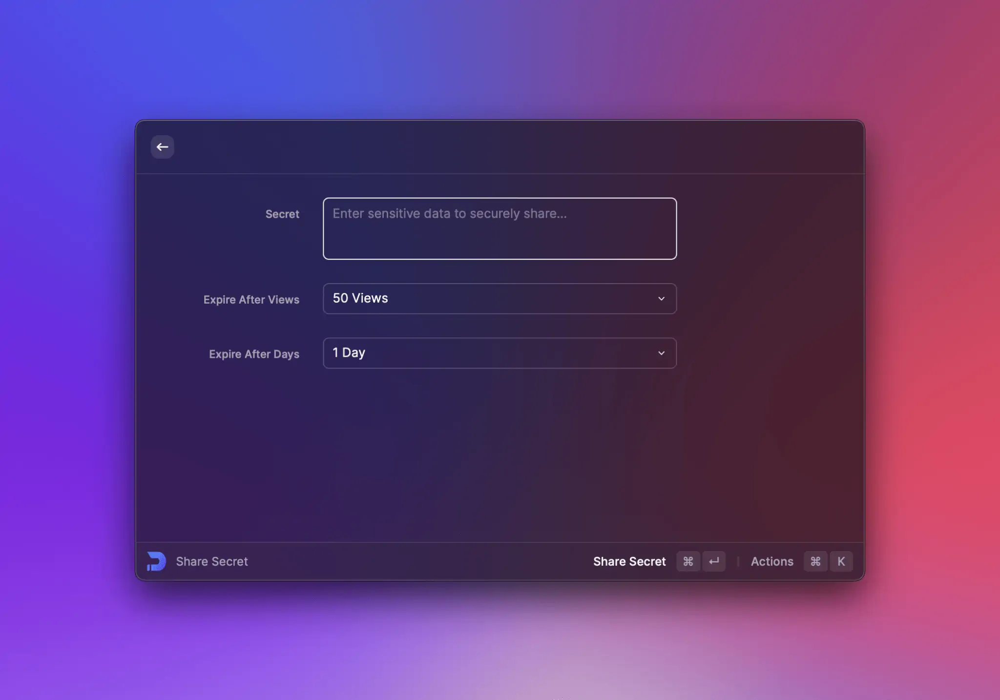

# Form

Our `Form` component provides great user experience to collect some data from a user and submit it for extensions needs.



## Two Types of Items: Controlled vs. Uncontrolled

Items in React can be one of two types: controlled or uncontrolled.

An uncontrolled item is the simpler of the two. It's the closest to a plain HTML input. React puts it on the page, and Raycast keeps track of the rest. Uncontrolled inputs require less code, but make it harder to do certain things.

With a controlled item, YOU explicitly control the `value` that the item displays. You have to write code to respond to changes with defining `onChange` callback, store the current `value` somewhere, and pass that value back to the item to be displayed. It's a feedback loop with your code in the middle. It's more manual work to wire these up, but they offer the most control.

You can take look at these two styles below under each of the supported items.

## Validation

Before submitting data, it is important to ensure all required form controls are filled out, in the correct format.

In Raycast, validation can be fully controlled from the API. To keep the same behavior as we have natively, the proper way of usage is to validate a `value` in the `onBlur` callback, update the `error` of the item and keep track of updates with the `onChange` callback to drop the `error` value. The [useForm](../../utils-reference/react-hooks/useForm.md) utils hook nicely wraps this behaviour and is the recommended way to do deal with validations.



Keep in mind that if the Form has any errors, the [`Action.SubmitForm`](./actions.md#action.submitform) `onSubmit` callback won't be triggered.


#### Example





```tsx
import { Action, ActionPanel, Form, showToast, Toast } from "@raycast/api";
import { useForm, FormValidation } from "@raycast/utils";

interface SignUpFormValues {
  name: string;
  password: string;
}

export default function Command() {
  const { handleSubmit, itemProps } = useForm<SignUpFormValues>({
    onSubmit(values) {
      showToast({
        style: Toast.Style.Success,
        title: "Yay!",
        message: `${values.name} account created`,
      });
    },
    validation: {
      name: FormValidation.Required,
      password: (value) => {
        if (value && value.length < 8) {
          return "Password must be at least 8 symbols";
        } else if (!value) {
          return "The item is required";
        }
      },
    },
  });
  return (
    <Form
      actions={
        <ActionPanel>
          <Action.SubmitForm title="Submit" onSubmit={handleSubmit} />
        </ActionPanel>
      }
    >
      <Form.TextField title="Full Name" placeholder="Tim Cook" {...itemProps.name} />
      <Form.PasswordField title="New Password" {...itemProps.password} />
    </Form>
  );
}
```





```typescript
import { Form } from "@raycast/api";
import { useState } from "react";

export default function Command() {
  const [nameError, setNameError] = useState<string | undefined>();
  const [passwordError, setPasswordError] = useState<string | undefined>();

  function dropNameErrorIfNeeded() {
    if (nameError && nameError.length > 0) {
      setNameError(undefined);
    }
  }

  function dropPasswordErrorIfNeeded() {
    if (passwordError && passwordError.length > 0) {
      setPasswordError(undefined);
    }
  }

  return (
    <Form>
      <Form.TextField
        id="nameField"
        title="Full Name"
        placeholder="Tim Cook"
        error={nameError}
        onChange={dropNameErrorIfNeeded}
        onBlur={(event) => {
          if (event.target.value?.length == 0) {
            setNameError("The field should't be empty!");
          } else {
            dropNameErrorIfNeeded();
          }
        }}
      />
      <Form.PasswordField
        id="password"
        title="New Password"
        error={passwordError}
        onChange={dropPasswordErrorIfNeeded}
        onBlur={(event) => {
          const value = event.target.value;
          if (value && value.length > 0) {
            if (!validatePassword(value)) {
              setPasswordError("Password should be at least 8 characters!");
            } else {
              dropPasswordErrorIfNeeded();
            }
          } else {
            setPasswordError("The field should't be empty!");
          }
        }}
      />
      <Form.TextArea id="bioTextArea" title="Add Bio" placeholder="Describe who you are" />
      <Form.DatePicker id="birthDate" title="Date of Birth" />
    </Form>
  );
}

function validatePassword(value: string): boolean {
  return value.length >= 8;
}
```





## Drafts

Drafts are a mechanism to preserve filled-in inputs (but not yet submitted) when an end-user exits the command. To enable this mechanism, set the `enableDrafts` prop on your Form and populate the initial values of the Form with the [top-level prop `draftValues`](../../information/lifecycle/README.md#launchprops).




- Drafts for forms nested in navigation are not supported yet. In this case, you will see a warning about it.
- Drafts won't preserve the [`Form.Password`](form.md#form.passwordfield)'s values.
- Drafts will be dropped once [`Action.SubmitForm`](./actions.md#action.submitform) is triggered.
- If you call [`popToRoot()`](../window-and-search-bar.md#poptoroot), drafts won't be preserved or updated.



#### Example




```typescript
import { Form, ActionPanel, Action, popToRoot, LaunchProps } from "@raycast/api";

interface TodoValues {
  title: string;
  description?: string;
  dueDate?: Date;
}

export default function Command(props: LaunchProps<{ draftValues: TodoValues }>) {
  const { draftValues } = props;

  return (
    <Form
      enableDrafts
      actions={
        <ActionPanel>
          <Action.SubmitForm
            onSubmit={(values: TodoValues) => {
              console.log("onSubmit", values);
              popToRoot();
            }}
          />
        </ActionPanel>
      }
    >
      <Form.TextField id="title" title="Title" defaultValue={draftValues?.title} />
      <Form.TextArea id="description" title="Description" defaultValue={draftValues?.description} />
      <Form.DatePicker id="dueDate" title="Due Date" defaultValue={draftValues?.dueDate} />
    </Form>
  );
}
```





```typescript
import { Form, ActionPanel, Action, popToRoot, LaunchProps } from "@raycast/api";
import { useState } from "react";

interface TodoValues {
  title: string;
  description?: string;
  dueDate?: Date;
}

export default function Command(props: LaunchProps<{ draftValues: TodoValues }>) {
  const { draftValues } = props;

  const [title, setTitle] = useState<string>(draftValues?.title || "");
  const [description, setDescription] = useState<string>(draftValues?.description || "");
  const [dueDate, setDueDate] = useState<Date | null>(draftValues?.dueDate || null);

  return (
    <Form
      enableDrafts
      actions={
        <ActionPanel>
          <Action.SubmitForm
            onSubmit={(values: TodoValues) => {
              console.log("onSubmit", values);
              popToRoot();
            }}
          />
        </ActionPanel>
      }
    >
      <Form.TextField id="title" title="Title" value={title} onChange={setTitle} />
      <Form.TextArea id="description" title="Description" value={description} onChange={setDescription} />
      <Form.DatePicker id="dueDate" title="Due Date" value={dueDate} onChange={setDueDate} />
    </Form>
  );
}
```




## API Reference

### Form

Shows a list of form items such as [Form.TextField](form.md#form.textfield), [Form.Checkbox](form.md#form.checkbox) or [Form.Dropdown](form.md#form.dropdown).

Optionally add a [Form.LinkAccessory](form.md#form.linkaccessory) in the right-hand side of the navigation bar.

#### Props

<PropsTableFromJSDoc component="Form" />

### Form.TextField

A form item with a text field for input.


#### Example




```typescript
import { ActionPanel, Form, Action } from "@raycast/api";

export default function Command() {
  return (
    <Form
      actions={
        <ActionPanel>
          <Action.SubmitForm title="Submit Name" onSubmit={(values) => console.log(values)} />
        </ActionPanel>
      }
    >
      <Form.TextField id="name" defaultValue="Steve" />
    </Form>
  );
}
```





```typescript
import { ActionPanel, Form, Action } from "@raycast/api";
import { useState } from "react";

export default function Command() {
  const [name, setName] = useState<string>("");

  return (
    <Form
      actions={
        <ActionPanel>
          <Action.SubmitForm title="Submit Name" onSubmit={(values) => console.log(values)} />
        </ActionPanel>
      }
    >
      <Form.TextField id="name" value={name} onChange={setName} />
    </Form>
  );
}
```




#### Props

<PropsTableFromJSDoc component="Form.TextField" />

#### Methods (Imperative API)

| Name  | Signature               | Description                                                                |
| ----- | ----------------------- | -------------------------------------------------------------------------- |
| focus | <code>() => void</code> | Makes the item request focus.                                              |
| reset | <code>() => void</code> | Resets the form item to its initial value, or `defaultValue` if specified. |

### Form.PasswordField

A form item with a secure text field for password-entry in which the entered characters must be kept secret.


#### Example




```typescript
import { ActionPanel, Form, Action } from "@raycast/api";

export default function Command() {
  return (
    <Form
      actions={
        <ActionPanel>
          <Action.SubmitForm title="Submit Password" onSubmit={(values) => console.log(values)} />
        </ActionPanel>
      }
    >
      <Form.PasswordField id="password" title="Enter Password" />
    </Form>
  );
}
```





```typescript
import { ActionPanel, Form, Action } from "@raycast/api";
import { useState } from "react";

export default function Command() {
  const [password, setPassword] = useState<string>("");

  return (
    <Form
      actions={
        <ActionPanel>
          <Action.SubmitForm title="Submit Password" onSubmit={(values) => console.log(values)} />
        </ActionPanel>
      }
    >
      <Form.PasswordField id="password" value={password} onChange={setPassword} />
    </Form>
  );
}
```




#### Props

<PropsTableFromJSDoc component="Form.PasswordField" />

#### Methods (Imperative API)

| Name  | Signature               | Description                                                                |
| ----- | ----------------------- | -------------------------------------------------------------------------- |
| focus | <code>() => void</code> | Makes the item request focus.                                              |
| reset | <code>() => void</code> | Resets the form item to its initial value, or `defaultValue` if specified. |

### Form.TextArea

A form item with a text area for input. The item supports multiline text entry.


#### Example




```typescript
import { ActionPanel, Form, Action } from "@raycast/api";

const DESCRIPTION =
  "We spend too much time staring at loading indicators. The Raycast team is dedicated to make everybody interact faster with their computers.";

export default function Command() {
  return (
    <Form
      actions={
        <ActionPanel>
          <Action.SubmitForm title="Submit Description" onSubmit={(values) => console.log(values)} />
        </ActionPanel>
      }
    >
      <Form.TextArea id="description" defaultValue={DESCRIPTION} />
    </Form>
  );
}
```





```typescript
import { ActionPanel, Form, Action } from "@raycast/api";
import { useState } from "react";

export default function Command() {
  const [description, setDescription] = useState<string>("");

  return (
    <Form
      actions={
        <ActionPanel>
          <Action.SubmitForm title="Submit Description" onSubmit={(values) => console.log(values)} />
        </ActionPanel>
      }
    >
      <Form.TextArea id="description" value={description} onChange={setDescription} />
    </Form>
  );
}
```




#### Props

<PropsTableFromJSDoc component="Form.TextArea" />

#### Methods (Imperative API)

| Name  | Signature               | Description                                                                |
| ----- | ----------------------- | -------------------------------------------------------------------------- |
| focus | <code>() => void</code> | Makes the item request focus.                                              |
| reset | <code>() => void</code> | Resets the form item to its initial value, or `defaultValue` if specified. |

### Form.Checkbox

A form item with a checkbox.


#### Example




```typescript
import { ActionPanel, Form, Action } from "@raycast/api";

export default function Command() {
  return (
    <Form
      actions={
        <ActionPanel>
          <Action.SubmitForm title="Submit Answer" onSubmit={(values) => console.log(values)} />
        </ActionPanel>
      }
    >
      <Form.Checkbox id="answer" label="Are you happy?" defaultValue={true} />
    </Form>
  );
}
```





```typescript
import { ActionPanel, Form, Action } from "@raycast/api";
import { useState } from "react";

export default function Command() {
  const [checked, setChecked] = useState(true);

  return (
    <Form
      actions={
        <ActionPanel>
          <Action.SubmitForm title="Submit Answer" onSubmit={(values) => console.log(values)} />
        </ActionPanel>
      }
    >
      <Form.Checkbox id="answer" label="Do you like orange juice?" value={checked} onChange={setChecked} />
    </Form>
  );
}
```




#### Props

<PropsTableFromJSDoc component="Form.Checkbox" />

#### Methods (Imperative API)

| Name  | Signature               | Description                                                                |
| ----- | ----------------------- | -------------------------------------------------------------------------- |
| focus | <code>() => void</code> | Makes the item request focus.                                              |
| reset | <code>() => void</code> | Resets the form item to its initial value, or `defaultValue` if specified. |

### Form.DatePicker

A form item with a date picker.


#### Example




```typescript
import { ActionPanel, Form, Action } from "@raycast/api";

export default function Command() {
  return (
    <Form
      actions={
        <ActionPanel>
          <Action.SubmitForm title="Submit Form" onSubmit={(values) => console.log(values)} />
        </ActionPanel>
      }
    >
      <Form.DatePicker id="dateOfBirth" title="Date of Birth" defaultValue={new Date(1955, 1, 24)} />
    </Form>
  );
}
```





```typescript
import { ActionPanel, Form, Action } from "@raycast/api";
import { useState } from "react";

export default function Command() {
  const [date, setDate] = useState<Date | null>(null);

  return (
    <Form
      actions={
        <ActionPanel>
          <Action.SubmitForm title="Submit Form" onSubmit={(values) => console.log(values)} />
        </ActionPanel>
      }
    >
      <Form.DatePicker id="launchDate" title="Launch Date" value={date} onChange={setDate} />
    </Form>
  );
}
```




#### Props

<PropsTableFromJSDoc component="Form.DatePicker" />

#### Methods (Imperative API)

| Name  | Signature               | Description                                                                |
| ----- | ----------------------- | -------------------------------------------------------------------------- |
| focus | <code>() => void</code> | Makes the item request focus.                                              |
| reset | <code>() => void</code> | Resets the form item to its initial value, or `defaultValue` if specified. |

#### Form.DatePicker.isFullDay

A method that determines if a given date represents a full day or a specific time.

```ts
import { ActionPanel, Form, Action } from "@raycast/api";

export default function Command() {
  return (
    <Form
      actions={
        <ActionPanel>
          <Action.SubmitForm
            title="Create Event"
            onSubmit={(values) => {
              if (Form.DatePicker.isFullDay(values.reminderDate)) {
                // the event is for a full day
              } else {
                // the event is at a specific time
              }
            }}
          />
        </ActionPanel>
      }
    >
      <Form.DatePicker id="eventTitle" title="Title" />
      <Form.DatePicker id="eventDate" title="Date" />
    </Form>
  );
}
```

### Form.Dropdown

A form item with a dropdown menu.


#### Example




```typescript
import { ActionPanel, Form, Action } from "@raycast/api";

export default function Command() {
  return (
    <Form
      actions={
        <ActionPanel>
          <Action.SubmitForm title="Submit Favorite" onSubmit={(values) => console.log(values)} />
        </ActionPanel>
      }
    >
      <Form.Dropdown id="emoji" title="Favorite Emoji" defaultValue="lol">
        <Form.Dropdown.Item value="poop" title="Pile of poop" icon="💩" />
        <Form.Dropdown.Item value="rocket" title="Rocket" icon="🚀" />
        <Form.Dropdown.Item value="lol" title="Rolling on the floor laughing face" icon="🤣" />
      </Form.Dropdown>
    </Form>
  );
}
```





```typescript
import { ActionPanel, Form, Action } from "@raycast/api";
import { useState } from "react";

export default function Command() {
  const [programmingLanguage, setProgrammingLanguage] = useState<string>("typescript");

  return (
    <Form
      actions={
        <ActionPanel>
          <Action.SubmitForm title="Submit Favorite" onSubmit={(values) => console.log(values)} />
        </ActionPanel>
      }
    >
      <Form.Dropdown
        id="dropdown"
        title="Favorite Language"
        value={programmingLanguage}
        onChange={setProgrammingLanguage}
      >
        <Form.Dropdown.Item value="cpp" title="C++" />
        <Form.Dropdown.Item value="javascript" title="JavaScript" />
        <Form.Dropdown.Item value="ruby" title="Ruby" />
        <Form.Dropdown.Item value="python" title="Python" />
        <Form.Dropdown.Item value="swift" title="Swift" />
        <Form.Dropdown.Item value="typescript" title="TypeScript" />
      </Form.Dropdown>
    </Form>
  );
}
```




#### Props

<PropsTableFromJSDoc component="Form.Dropdown" />

#### Methods (Imperative API)

| Name  | Signature               | Description                                                                |
| ----- | ----------------------- | -------------------------------------------------------------------------- |
| focus | <code>() => void</code> | Makes the item request focus.                                              |
| reset | <code>() => void</code> | Resets the form item to its initial value, or `defaultValue` if specified. |

### Form.Dropdown.Item

A dropdown item in a [Form.Dropdown](form.md#form.dropdown)

#### Example

```typescript
import { Action, ActionPanel, Form, Icon } from "@raycast/api";

export default function Command() {
  return (
    <Form
      actions={
        <ActionPanel>
          <Action.SubmitForm title="Submit Icon" onSubmit={(values) => console.log(values)} />
        </ActionPanel>
      }
    >
      <Form.Dropdown id="icon" title="Icon">
        <Form.Dropdown.Item value="circle" title="Cirlce" icon={Icon.Circle} />
      </Form.Dropdown>
    </Form>
  );
}
```

#### Props

<PropsTableFromJSDoc component="Form.Dropdown.Item" />

### Form.Dropdown.Section

Visually separated group of dropdown items.

Use sections to group related menu items together.

#### Example

```typescript
import { ActionPanel, Form, Action } from "@raycast/api";

export default function Command() {
  return (
    <Form
      actions={
        <ActionPanel>
          <Action.SubmitForm title="Submit Favorite" onSubmit={(values) => console.log(values)} />
        </ActionPanel>
      }
    >
      <Form.Dropdown id="food" title="Favorite Food">
        <Form.Dropdown.Section title="Fruits">
          <Form.Dropdown.Item value="apple" title="Apple" icon="🍎" />
          <Form.Dropdown.Item value="banana" title="Banana" icon="🍌" />
        </Form.Dropdown.Section>
        <Form.Dropdown.Section title="Vegetables">
          <Form.Dropdown.Item value="broccoli" title="Broccoli" icon="🥦" />
          <Form.Dropdown.Item value="carrot" title="Carrot" icon="🥕" />
        </Form.Dropdown.Section>
      </Form.Dropdown>
    </Form>
  );
}
```

#### Props

<PropsTableFromJSDoc component="Form.Dropdown.Section" />

### Form.TagPicker

A form item with a tag picker that allows the user to select multiple items.


#### Example




```typescript
import { ActionPanel, Form, Action } from "@raycast/api";

export default function Command() {
  return (
    <Form
      actions={
        <ActionPanel>
          <Action.SubmitForm title="Submit Favorite" onSubmit={(values) => console.log(values)} />
        </ActionPanel>
      }
    >
      <Form.TagPicker id="sports" title="Favorite Sports" defaultValue={["football"]}>
        <Form.TagPicker.Item value="basketball" title="Basketball" icon="🏀" />
        <Form.TagPicker.Item value="football" title="Football" icon="⚽️" />
        <Form.TagPicker.Item value="tennis" title="Tennis" icon="🎾" />
      </Form.TagPicker>
    </Form>
  );
}
```





```typescript
import { ActionPanel, Form, Action } from "@raycast/api";
import { useState } from "react";

export default function Command() {
  const [countries, setCountries] = useState<string[]>(["ger", "ned", "pol"]);

  return (
    <Form
      actions={
        <ActionPanel>
          <Action.SubmitForm title="Submit Countries" onSubmit={(values) => console.log(values)} />
        </ActionPanel>
      }
    >
      <Form.TagPicker id="countries" title="Visited Countries" value={countries} onChange={setCountries}>
        <Form.TagPicker.Item value="ger" title="Germany" icon="🇩🇪" />
        <Form.TagPicker.Item value="ind" title="India" icon="🇮🇳" />
        <Form.TagPicker.Item value="ned" title="Netherlands" icon="🇳🇱" />
        <Form.TagPicker.Item value="nor" title="Norway" icon="🇳🇴" />
        <Form.TagPicker.Item value="pol" title="Poland" icon="🇵🇱" />
        <Form.TagPicker.Item value="rus" title="Russia" icon="🇷🇺" />
        <Form.TagPicker.Item value="sco" title="Scotland" icon="🏴󠁧󠁢󠁳󠁣󠁴󠁿" />
      </Form.TagPicker>
    </Form>
  );
}
```




#### Props

<PropsTableFromJSDoc component="Form.TagPicker" />

#### Methods (Imperative API)

| Name  | Signature               | Description                                                                |
| ----- | ----------------------- | -------------------------------------------------------------------------- |
| focus | <code>() => void</code> | Makes the item request focus.                                              |
| reset | <code>() => void</code> | Resets the form item to its initial value, or `defaultValue` if specified. |

### Form.TagPicker.Item

A tag picker item in a [Form.TagPicker](form.md#form.tagpicker).

#### Example

```typescript
import { ActionPanel, Color, Form, Icon, Action } from "@raycast/api";

export default function Command() {
  return (
    <Form
      actions={
        <ActionPanel>
          <Action.SubmitForm title="Submit Color" onSubmit={(values) => console.log(values)} />
        </ActionPanel>
      }
    >
      <Form.TagPicker id="color" title="Color">
        <Form.TagPicker.Item value="red" title="Red" icon={{ source: Icon.Circle, tintColor: Color.Red }} />
        <Form.TagPicker.Item value="green" title="Green" icon={{ source: Icon.Circle, tintColor: Color.Green }} />
        <Form.TagPicker.Item value="blue" title="Blue" icon={{ source: Icon.Circle, tintColor: Color.Blue }} />
      </Form.TagPicker>
    </Form>
  );
}
```

#### Props

<PropsTableFromJSDoc component="Form.TagPicker.Item" />

### Form.Separator

A form item that shows a separator line. Use for grouping and visually separating form items.


#### Example

```typescript
import { ActionPanel, Form, Action } from "@raycast/api";

export default function Command() {
  return (
    <Form
      actions={
        <ActionPanel>
          <Action.SubmitForm title="Submit Form" onSubmit={(values) => console.log(values)} />
        </ActionPanel>
      }
    >
      <Form.TextField id="textfield" />
      <Form.Separator />
      <Form.TextArea id="textarea" />
    </Form>
  );
}
```

### Form.FilePicker

A form item with a button to open a dialog to pick some files and/or some directories (depending on its props).


While the user picked some items that existed, it might be possible for them to be deleted or changed when the `onSubmit` callback is called. Hence you should always make sure that the items exist before acting on them!



#### Example




```typescript
import { ActionPanel, Form, Action } from "@raycast/api";
import fs from "fs";

export default function Command() {
  return (
    <Form
      actions={
        <ActionPanel>
          <Action.SubmitForm
            title="Submit Name"
            onSubmit={(values: { files: string[] }) => {
              const files = values.files.filter((file: any) => fs.existsSync(file) && fs.lstatSync(file).isFile());
              console.log(files);
            }}
          />
        </ActionPanel>
      }
    >
      <Form.FilePicker id="files" />
    </Form>
  );
}
```





```typescript
import { ActionPanel, Form, Action } from "@raycast/api";
import fs from "fs";

export default function Command() {
  return (
    <Form
      actions={
        <ActionPanel>
          <Action.SubmitForm
            title="Submit Name"
            onSubmit={(values: { files: string[] }) => {
              const file = values.files[0];
              if (!fs.existsSync(file) || !fs.lstatSync(file).isFile()) {
                return false;
              }
              console.log(file);
            }}
          />
        </ActionPanel>
      }
    >
      <Form.FilePicker id="files" allowMultipleSelection={false} />
    </Form>
  );
}
```





```typescript
import { ActionPanel, Form, Action } from "@raycast/api";
import fs from "fs";

export default function Command() {
  return (
    <Form
      actions={
        <ActionPanel>
          <Action.SubmitForm
            title="Submit Name"
            onSubmit={(values: { folders: string[] }) => {
              const folder = values.folders[0];
              if (!fs.existsSync(folder) || fs.lstatSync(folder).isDirectory()) {
                return false;
              }
              console.log(folder);
            }}
          />
        </ActionPanel>
      }
    >
      <Form.FilePicker id="folders" allowMultipleSelection={false} canChooseDirectories canChooseFiles={false} />
    </Form>
  );
}
```





```typescript
import { ActionPanel, Form, Action } from "@raycast/api";
import { useState } from "react";

export default function Command() {
  const [files, setFiles] = useState<string[]>([]);

  return (
    <Form
      actions={
        <ActionPanel>
          <Action.SubmitForm title="Submit Name" onSubmit={(values) => console.log(values)} />
        </ActionPanel>
      }
    >
      <Form.FilePicker id="files" value={files} onChange={setFiles} />
    </Form>
  );
}
```




#### Props

<PropsTableFromJSDoc component="Form.FilePicker" />

#### Methods (Imperative API)

| Name  | Signature               | Description                                                                |
| ----- | ----------------------- | -------------------------------------------------------------------------- |
| focus | <code>() => void</code> | Makes the item request focus.                                              |
| reset | <code>() => void</code> | Resets the form item to its initial value, or `defaultValue` if specified. |

### Form.Description

A form item with a simple text label.

Do _not_ use this component to show validation messages for other form fields.


#### Example

```typescript
import { ActionPanel, Form, Action } from "@raycast/api";

export default function Command() {
  return (
    <Form
      actions={
        <ActionPanel>
          <Action.SubmitForm title="Submit" onSubmit={(values) => console.log(values)} />
        </ActionPanel>
      }
    >
      <Form.Description
        title="Import / Export"
        text="Exporting will back-up your preferences, quicklinks, snippets, floating notes, script-command folder paths, aliases, hotkeys, favorites and other data."
      />
    </Form>
  );
}
```

#### Props

<PropsTableFromJSDoc component="Form.Description" />

### Form.LinkAccessory

A link that will be shown in the right-hand side of the navigation bar.

#### Example

```typescript
import { ActionPanel, Form, Action } from "@raycast/api";

export default function Command() {
  return (
    <Form
      searchBarAccessory={
        <Form.LinkAccessory
          target="https://developers.raycast.com/api-reference/user-interface/form"
          text="Open Documentation"
        />
      }
      actions={
        <ActionPanel>
          <Action.SubmitForm title="Submit Name" onSubmit={(values) => console.log(values)} />
        </ActionPanel>
      }
    >
      <Form.TextField id="name" defaultValue="Steve" />
    </Form>
  );
}
```

#### Props

<PropsTableFromJSDoc component="Form.LinkAccessory" />

## Types

#### Form.Event

Some Form.Item callbacks (like `onFocus` and `onBlur`) can return a `Form.Event` object that you can use in a different ways.

<InterfaceTableFromJSDoc name="Form.Event" />

#### Example

```typescript
import { Form } from "@raycast/api";

export default function Main() {
  return (
    <Form>
      <Form.TextField id="textField" title="Text Field" onBlur={logEvent} onFocus={logEvent} />
      <Form.TextArea id="textArea" title="Text Area" onBlur={logEvent} onFocus={logEvent} />
      <Form.Dropdown id="dropdown" title="Dropdown" onBlur={logEvent} onFocus={logEvent}>
        {[1, 2, 3, 4, 5, 6, 7].map((num) => (
          <Form.Dropdown.Item value={String(num)} title={String(num)} key={num} />
        ))}
      </Form.Dropdown>
      <Form.TagPicker id="tagPicker" title="Tag Picker" onBlur={logEvent} onFocus={logEvent}>
        {[1, 2, 3, 4, 5, 6, 7].map((num) => (
          <Form.TagPicker.Item value={String(num)} title={String(num)} key={num} />
        ))}
      </Form.TagPicker>
    </Form>
  );
}

function logEvent(event: Form.Event<string[] | string>) {
  console.log(`Event '${event.type}' has happened for '${event.target.id}'. Current 'value': '${event.target.value}'`);
}
```

#### Form.Event.Type

The different types of [`Form.Event`](form.md#form.event). Can be `"focus"` or `"blur"`.

### Form.Values

Values of items in the form.

For type-safe form values, you can define your own interface. Use the ID's of the form items as the property name.

#### Example

```typescript
import { Form, Action, ActionPanel } from "@raycast/api";

interface Values {
  todo: string;
  due?: Date;
}

export default function Command() {
  function handleSubmit(values: Values) {
    console.log(values);
  }

  return (
    <Form
      actions={
        <ActionPanel>
          <Action.SubmitForm title="Submit" onSubmit={handleSubmit} />
        </ActionPanel>
      }
    >
      <Form.TextField id="todo" title="Todo" />
      <Form.DatePicker id="due" title="Due Date" />
    </Form>
  );
}
```

#### Properties

| Name              | Type  | Required | Description                     |
| ----------------- | ----- | -------- | ------------------------------- |
| \[itemId: string] | `any` | Yes      | The form value of a given item. |

### Form.DatePicker.Type

The types of date components the user can pick with a `Form.DatePicker`.

#### Enumeration members

| Name     | Description                                                      |
| -------- | ---------------------------------------------------------------- |
| DateTime | Hour and second can be picked in addition to year, month and day |
| Date     | Only year, month, and day can be picked                          |

---

## Imperative API

You can use React's [useRef](https://reactjs.org/docs/hooks-reference.html#useref) hook to create variables which have access to imperative APIs (such as `.focus()` or `.reset()`) exposed by the native form items.

```typescript
import { useRef } from "react";
import { ActionPanel, Form, Action } from "@raycast/api";

interface FormValues {
  nameField: string;
  bioTextArea: string;
  datePicker: string;
}

export default function Command() {
  const textFieldRef = useRef<Form.TextField>(null);
  const textAreaRef = useRef<Form.TextArea>(null);
  const datePickerRef = useRef<Form.DatePicker>(null);
  const passwordFieldRef = useRef<Form.PasswordField>(null);
  const dropdownRef = useRef<Form.Dropdown>(null);
  const tagPickerRef = useRef<Form.TagPicker>(null);
  const firstCheckboxRef = useRef<Form.Checkbox>(null);
  const secondCheckboxRef = useRef<Form.Checkbox>(null);

  async function handleSubmit(values: FormValues) {
    console.log(values);
    datePickerRef.current?.focus();
    dropdownRef.current?.reset();
  }

  return (
    <Form
      actions={
        <ActionPanel>
          <Action.SubmitForm title="Submit" onSubmit={handleSubmit} />
          <ActionPanel.Section title="Focus">
            <Action title="Focus TextField" onAction={() => textFieldRef.current?.focus()} />
            <Action title="Focus TextArea" onAction={() => textAreaRef.current?.focus()} />
            <Action title="Focus DatePicker" onAction={() => datePickerRef.current?.focus()} />
            <Action title="Focus PasswordField" onAction={() => passwordFieldRef.current?.focus()} />
            <Action title="Focus Dropdown" onAction={() => dropdownRef.current?.focus()} />
            <Action title="Focus TagPicker" onAction={() => tagPickerRef.current?.focus()} />
            <Action title="Focus First Checkbox" onAction={() => firstCheckboxRef.current?.focus()} />
            <Action title="Focus Second Checkbox" onAction={() => secondCheckboxRef.current?.focus()} />
          </ActionPanel.Section>
          <ActionPanel.Section title="Reset">
            <Action title="Reset TextField" onAction={() => textFieldRef.current?.reset()} />
            <Action title="Reset TextArea" onAction={() => textAreaRef.current?.reset()} />
            <Action title="Reset DatePicker" onAction={() => datePickerRef.current?.reset()} />
            <Action title="Reset PasswordField" onAction={() => passwordFieldRef.current?.reset()} />
            <Action title="Reset Dropdown" onAction={() => dropdownRef.current?.reset()} />
            <Action title="Reset TagPicker" onAction={() => tagPickerRef.current?.reset()} />
            <Action title="Reset First Checkbox" onAction={() => firstCheckboxRef.current?.reset()} />
            <Action title="Reset Second Checkbox" onAction={() => secondCheckboxRef.current?.reset()} />
          </ActionPanel.Section>
        </ActionPanel>
      }
    >
      <Form.TextField id="textField" title="TextField" ref={textFieldRef} />
      <Form.TextArea id="textArea" title="TextArea" ref={textAreaRef} />
      <Form.DatePicker id="datePicker" title="DatePicker" ref={datePickerRef} />
      <Form.PasswordField id="passwordField" title="PasswordField" ref={passwordFieldRef} />
      <Form.Separator />
      <Form.Dropdown
        id="dropdown"
        title="Dropdown"
        defaultValue="first"
        onChange={(newValue) => {
          console.log(newValue);
        }}
        ref={dropdownRef}
      >
        <Form.Dropdown.Item value="first" title="First" />
        <Form.Dropdown.Item value="second" title="Second" />
      </Form.Dropdown>
      <Form.Separator />
      <Form.TagPicker
        id="tagPicker"
        title="TagPicker"
        ref={tagPickerRef}
        onChange={(t) => {
          console.log(t);
        }}
      >
        {["one", "two", "three"].map((tag) => (
          <Form.TagPicker.Item key={tag} value={tag} title={tag} />
        ))}
      </Form.TagPicker>
      <Form.Separator />
      <Form.Checkbox
        id="firstCheckbox"
        title="First Checkbox"
        label="First Checkbox"
        ref={firstCheckboxRef}
        onChange={(checked) => {
          console.log("first checkbox onChange ", checked);
        }}
      />
      <Form.Checkbox
        id="secondCheckbox"
        title="Second Checkbox"
        label="Second Checkbox"
        ref={secondCheckboxRef}
        onChange={(checked) => {
          console.log("second checkbox onChange ", checked);
        }}
      />
      <Form.Separator />
    </Form>
  );
}
```
