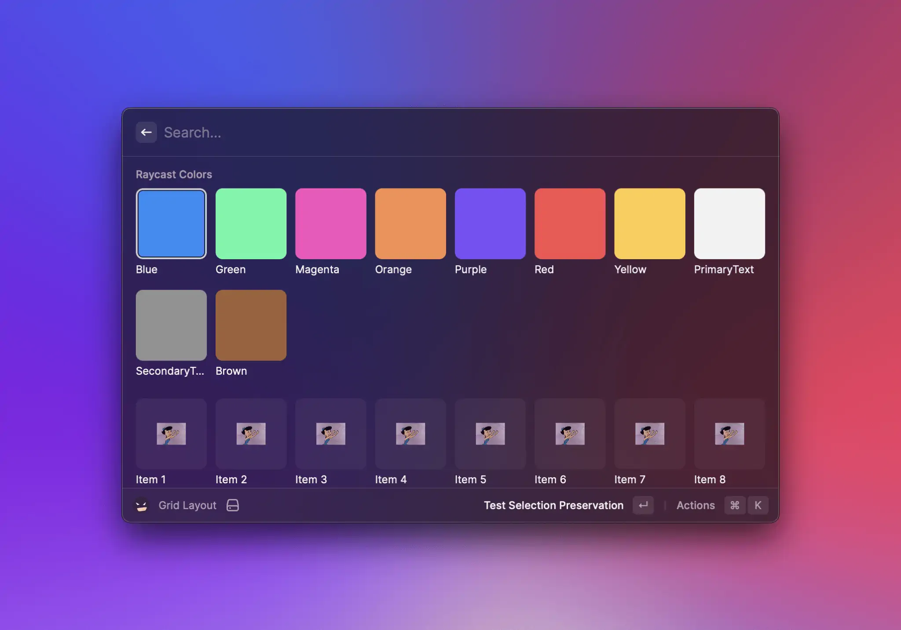

# Grid

The `Grid` component is provided as an alternative to the [List](list.md#list) component when the defining characteristic of an item is an image.


Because its API tries to stick as closely to [List](list.md#list)'s as possible, changing a view from [List](list.md#list) to [Grid](#grid) should be as simple as:

- making sure you're using at least version 1.36.0 of the `@raycast/api` package
- updating your imports from `import { List } from '@raycast/api'` to `import { Grid } from '@raycast/api'`;
- removing the `isShowingDetail` prop from the top-level `List` component, along with all [List.Item](list.md#list.item)s' `detail` prop
- renaming all [List.Item](list.md#list.item)s' h`icon` prop to `content`
- removing all [List.Item](list.md#list.item)s' `accessories`, `accessoryIcon` and `accessoryTitle props; [Grid.Item](#grid.item) does not _currently_ support accessories
- finally, replacing all usages of `List` with `Grid`.
  


## Search Bar

The search bar allows users to interact quickly with grid items. By default, [Grid.Items](#grid.item) are displayed if the user's input can be (fuzzy) matched to the item's `title` or `keywords`.

### Custom filtering

Sometimes, you may not want to rely on Raycast's filtering, but use/implement your own. If that's the case, you can set the `Grid`'s `filtering` [prop](#props) to false, and the items displayed will be independent of the search bar's text.
Note that `filtering` is also implicitly set to false if an `onSearchTextChange` listener is specified. If you want to specify a change listener and _still_ take advantage of Raycast's built-in filtering, you can explicitly set `filtering` to true.

```typescript
import { useEffect, useState } from "react";
import { Grid } from "@raycast/api";

const items = [
  { content: "🙈", keywords: ["see-no-evil", "monkey"] },
  { content: "🥳", keywords: ["partying", "face"] },
];

export default function Command() {
  const [searchText, setSearchText] = useState("");
  const [filteredList, filterList] = useState(items);

  useEffect(() => {
    filterList(items.filter((item) => item.keywords.some((keyword) => keyword.includes(searchText))));
  }, [searchText]);

  return (
    <Grid
      columns={5}
      inset={Grid.Inset.Large}
      filtering={false}
      onSearchTextChange={setSearchText}
      navigationTitle="Search Emoji"
      searchBarPlaceholder="Search your favorite emoji"
    >
      {filteredList.map((item) => (
        <Grid.Item key={item.content} content={item.content} />
      ))}
    </Grid>
  );
}
```

### Programmatically updating the search bar

Other times, you may want the content of the search bar to be updated by the extension, for example, you may store a list of the user's previous searches and, on the next visit, allow them to "continue" where they left off.

To do so, you can use the `searchText` [prop](#props).

```typescript
import { useState } from "react";
import { Action, ActionPanel, Grid } from "@raycast/api";

const items = [
  { content: "🙈", keywords: ["see-no-evil", "monkey"] },
  { content: "🥳", keywords: ["partying", "face"] },
];

export default function Command() {
  const [searchText, setSearchText] = useState("");

  return (
    <Grid
      searchText={searchText}
      onSearchTextChange={setSearchText}
      navigationTitle="Search Emoji"
      searchBarPlaceholder="Search your favorite emoji"
    >
      {items.map((item) => (
        <Grid.Item
          key={item.content}
          content={item.content}
          actions={
            <ActionPanel>
              <Action title="Select" onAction={() => setSearchText(item.content)} />
            </ActionPanel>
          }
        />
      ))}
    </Grid>
  );
}
```

### Dropdown

Some extensions may benefit from giving users a second filtering dimension. A media file management extension may allow users to view only videos or only images, an image-searching extension may allow switching ssearch engines, etc.

This is where the `searchBarAccessory` [prop](#props) is useful. Pass it a [Grid.Dropdown](#grid.dropdown) component, and it will be displayed on the right-side of the search bar. Invoke it either by using the global shortcut `⌘` `P` or by clicking on it.

### Pagination


Pagination requires version 1.69.0 or higher of the `@raycast/api` package.


`Grid`s have built-in support for pagination. To opt in to pagination, you need to pass it a `pagination` prop, which is an object providing 3 pieces of information:

- `onLoadMore` - will be called by Raycast when the user reaches the end of the grid, either using the keyboard or the mouse. When it gets called, the extension is expected to perform an async operation which eventually can result in items being appended to the end of the grid.
- `hasMore` - indicates to Raycast whether it _should_ call `onLoadMore` when the user reaches the end of the grid.
- `pageSize` - indicates how many placeholder items Raycast should add to the end of the grid when it calls `onLoadMore`. Once `onLoadMore` finishes executing, the placeholder items will be replaced by the newly-added grid items.

Note that extensions have access to a limited amount of memory. As your extension paginates, its memory usage will increase. Paginating extensively could lead to the extension eventually running out of memory and crashing. To protect against the extension crashing due to memory exhaustion, Raycast monitors the extension's memory usage and employs heuristics to determine whether it's safe to paginate further. If it's deemed unsafe to continue paginating, `onLoadMore` will not be triggered when the user scrolls to the bottom, regardless of the `hasMore` value. Additionally, during development, a warning will be printed in the terminal.

For convenience, most of the [hooks](../../utils-reference/getting-started.md) that we provide have built-in pagination support. Here's an example of how to add pagination support to a simple command using [usePromise](../../utils-reference/react-hooks/usePromise.md), and one "from scratch".





```typescript
import { setTimeout } from "node:timers/promises";
import { useState } from "react";
import { Grid } from "@raycast/api";
import { usePromise } from "@raycast/utils";

export default function Command() {
  const [searchText, setSearchText] = useState("");

  const { isLoading, data, pagination } = usePromise(
    (searchText: string) => async (options: { page: number }) => {
      await setTimeout(200);
      const newData = Array.from({ length: 25 }, (_v, index) => ({ index, page: options.page, text: searchText }));
      return { data: newData, hasMore: options.page < 10 };
    },
    [searchText]
  );

  return (
    <Grid isLoading={isLoading} onSearchTextChange={setSearchText} pagination={pagination}>
      {data?.map((item) => (
        <Grid.Item
          key={`${item.index} ${item.page} ${item.text}`}
          content=""
          title={`Page: ${item.page} Item ${item.index}`}
          subtitle={item.text}
        />
      ))}
    </Grid>
  );
}
```





```typescript
import { setTimeout } from "node:timers/promises";
import { useCallback, useEffect, useRef, useState } from "react";
import { Grid } from "@raycast/api";

type State = {
  searchText: string;
  isLoading: boolean;
  hasMore: boolean;
  data: {
    index: number;
    page: number;
    text: string;
  }[];
  nextPage: number;
};
const pageSize = 20;
export default function Command() {
  const [state, setState] = useState<State>({ searchText: "", isLoading: true, hasMore: true, data: [], nextPage: 0 });
  const cancelRef = useRef<AbortController | null>(null);

  const loadNextPage = useCallback(async (searchText: string, nextPage: number, signal?: AbortSignal) => {
    setState((previous) => ({ ...previous, isLoading: true }));
    await setTimeout(200);
    const newData = Array.from({ length: pageSize }, (_v, index) => ({
      index,
      page: nextPage,
      text: searchText,
    }));
    if (signal?.aborted) {
      return;
    }
    setState((previous) => ({
      ...previous,
      data: [...previous.data, ...newData],
      isLoading: false,
      hasMore: nextPage < 10,
    }));
  }, []);

  const onLoadMore = useCallback(() => {
    setState((previous) => ({ ...previous, nextPage: previous.nextPage + 1 }));
  }, []);

  const onSearchTextChange = useCallback(
    (searchText: string) => {
      if (searchText === state.searchText) return;
      setState((previous) => ({
        ...previous,
        data: [],
        nextPage: 0,
        searchText,
      }));
    },
    [state.searchText]
  );

  useEffect(() => {
    cancelRef.current?.abort();
    cancelRef.current = new AbortController();
    loadNextPage(state.searchText, state.nextPage, cancelRef.current?.signal);
    return () => {
      cancelRef.current?.abort();
    };
  }, [loadNextPage, state.searchText, state.nextPage]);

  return (
    <Grid
      isLoading={state.isLoading}
      onSearchTextChange={onSearchTextChange}
      pagination={{ onLoadMore, hasMore: state.hasMore, pageSize }}
    >
      {state.data.map((item) => (
        <Grid.Item
          key={`${item.index} ${item.page} ${item.text}`}
          content=""
          title={`Page: ${item.page} Item ${item.index}`}
          subtitle={item.text}
        />
      ))}
    </Grid>
  );
}
```






Pagination might not work properly if all grid items are rendered and visible at once, as `onLoadMore` won't be triggered. This typically happens when an API returns 10 results by default, all fitting within the Raycast window. To fix this, try displaying more items, like 20.


## Examples




```jsx
import { Grid } from "@raycast/api";

export default function Command() {
  return (
    <Grid columns={8} inset={Grid.Inset.Large}>
      <Grid.Item content="🥳" />
      <Grid.Item content="🙈" />
    </Grid>
  );
}
```





```typescript
import { Grid } from "@raycast/api";

export default function Command() {
  return (
    <Grid>
      <Grid.Section title="Section 1">
        <Grid.Item content="https://placekitten.com/400/400" title="Item 1" />
      </Grid.Section>
      <Grid.Section title="Section 2" subtitle="Optional subtitle">
        <Grid.Item content="https://placekitten.com/400/400" title="Item 1" />
      </Grid.Section>
    </Grid>
  );
}
```





```typescript
import { ActionPanel, Action, Grid } from "@raycast/api";

export default function Command() {
  return (
    <Grid>
      <Grid.Item
        content="https://placekitten.com/400/400"
        title="Item 1"
        actions={
          <ActionPanel>
            <Action.CopyToClipboard content="👋" />
          </ActionPanel>
        }
      />
    </Grid>
  );
}
```





```typescript
import { useEffect, useState } from "react";
import { Grid, Image } from "@raycast/api";

export default function CommandWithCustomEmptyView() {
  const [state, setState] = useState<{
    searchText: string;
    items: { content: Image.ImageLike; title: string }[];
  }>({ searchText: "", items: [] });

  useEffect(() => {
    console.log("Running effect after state.searchText changed. Current value:", JSON.stringify(state.searchText));
    // perform an API call that eventually populates `items`.
  }, [state.searchText]);

  return (
    <Grid onSearchTextChange={(newValue) => setState((previous) => ({ ...previous, searchText: newValue }))}>
      {state.searchText === "" && state.items.length === 0 ? (
        <Grid.EmptyView icon={{ source: "https://placekitten.com/500/500" }} title="Type something to get started" />
      ) : (
        state.items.map((item, index) => <Grid.Item key={index} content={item.content} title={item.title} />)
      )}
    </Grid>
  );
}
```





## API Reference

### Grid

Displays [Grid.Section](#grid.section)s or [Grid.Item](#grid.item)s.

The grid uses built-in filtering by indexing the title & keywords of its items.

#### Example

```typescript
import { Grid } from "@raycast/api";

const items = [
  { content: "🙈", keywords: ["see-no-evil", "monkey"] },
  { content: "🥳", keywords: ["partying", "face"] },
];

export default function Command() {
  return (
    <Grid
      columns={5}
      inset={Grid.Inset.Large}
      navigationTitle="Search Emoji"
      searchBarPlaceholder="Search your favorite emoji"
    >
      {items.map((item) => (
        <Grid.Item key={item.content} content={item.content} keywords={item.keywords} />
      ))}
    </Grid>
  );
}
```

#### Props

<PropsTableFromJSDoc component="Grid" />

### Grid.Dropdown

A dropdown menu that will be shown in the right-hand-side of the search bar.

#### Example

```typescript
import { Grid, Image } from "@raycast/api";
import { useState } from "react";

const types = [
  { id: 1, name: "Smileys", value: "smileys" },
  { id: 2, name: "Animals & Nature", value: "animals-and-nature" },
];

const items: { [key: string]: { content: Image.ImageLike; keywords: string[] }[] } = {
  smileys: [{ content: "🥳", keywords: ["partying", "face"] }],
  "animals-and-nature": [{ content: "🙈", keywords: ["see-no-evil", "monkey"] }],
};

export default function Command() {
  const [type, setType] = useState<string>("smileys");

  return (
    <Grid
      navigationTitle="Search Beers"
      searchBarPlaceholder="Search your favorite drink"
      searchBarAccessory={
        <Grid.Dropdown tooltip="Select Emoji Category" storeValue={true} onChange={(newValue) => setType(newValue)}>
          <Grid.Dropdown.Section title="Emoji Categories">
            {types.map((type) => (
              <Grid.Dropdown.Item key={type.id} title={type.name} value={type.value} />
            ))}
          </Grid.Dropdown.Section>
        </Grid.Dropdown>
      }
    >
      {(items[type] || []).map((item) => (
        <Grid.Item key={`${item.content}`} content={item.content} keywords={item.keywords} />
      ))}
    </Grid>
  );
}
```

#### Props

<PropsTableFromJSDoc component="Grid.Dropdown" />

### Grid.Dropdown.Item

A dropdown item in a [Grid.Dropdown](#grid.dropdown)

#### Example

```typescript
import { Grid } from "@raycast/api";

export default function Command() {
  return (
    <Grid
      searchBarAccessory={
        <Grid.Dropdown tooltip="Dropdown With Items">
          <Grid.Dropdown.Item title="One" value="one" />
          <Grid.Dropdown.Item title="Two" value="two" />
          <Grid.Dropdown.Item title="Three" value="three" />
        </Grid.Dropdown>
      }
    >
      <Grid.Item content="https://placekitten.com/400/400" title="Item in the Main Grid" />
    </Grid>
  );
}
```

#### Props

<PropsTableFromJSDoc component="Grid.Dropdown.Item" />

### Grid.Dropdown.Section

Visually separated group of dropdown items.

Use sections to group related menu items together.

#### Example

```typescript
import { Grid } from "@raycast/api";

export default function Command() {
  return (
    <Grid
      searchBarAccessory={
        <Grid.Dropdown tooltip="Dropdown With Sections">
          <Grid.Dropdown.Section title="First Section">
            <Grid.Dropdown.Item title="One" value="one" />
          </Grid.Dropdown.Section>
          <Grid.Dropdown.Section title="Second Section">
            <Grid.Dropdown.Item title="Two" value="two" />
          </Grid.Dropdown.Section>
        </Grid.Dropdown>
      }
    >
      <Grid.Item content="https://placekitten.com/400/400" title="Item in the Main Grid" />
    </Grid>
  );
}
```

#### Props

<PropsTableFromJSDoc component="Grid.Dropdown.Section" />

### Grid.EmptyView

A view to display when there aren't any items available. Use to greet users with a friendly message if the
extension requires user input before it can show any items e.g. when searching for an image, a gif etc.

Raycast provides a default `EmptyView` that will be displayed if the Grid component either has no children,
or if it has children, but none of them match the query in the search bar. This too can be overridden by passing an
empty view alongside the other `Grid.Item`s.

Note that the `EmptyView` is _never_ displayed if the `Grid`'s `isLoading` property is true and the search bar is empty.


#### Example

```typescript
import { useEffect, useState } from "react";
import { Grid, Image } from "@raycast/api";

export default function CommandWithCustomEmptyView() {
  const [state, setState] = useState<{
    searchText: string;
    items: { content: Image.ImageLike; title: string }[];
  }>({ searchText: "", items: [] });

  useEffect(() => {
    console.log("Running effect after state.searchText changed. Current value:", JSON.stringify(state.searchText));
    // perform an API call that eventually populates `items`.
  }, [state.searchText]);

  return (
    <Grid onSearchTextChange={(newValue) => setState((previous) => ({ ...previous, searchText: newValue }))}>
      {state.searchText === "" && state.items.length === 0 ? (
        <Grid.EmptyView icon={{ source: "https://placekitten.com/500/500" }} title="Type something to get started" />
      ) : (
        state.items.map((item, index) => <Grid.Item key={index} content={item.content} title={item.title} />)
      )}
    </Grid>
  );
}
```

#### Props

<PropsTableFromJSDoc component="Grid.EmptyView" />

### Grid.Item

A item in the [Grid](#grid).

This is one of the foundational UI components of Raycast. A grid item represents a single entity. It can be an image, an emoji, a GIF etc. You most likely want to perform actions on this item, so make it clear
to the user what this item is about.

#### Example

```typescript
import { Grid } from "@raycast/api";

export default function Command() {
  return (
    <Grid>
      <Grid.Item content="🥳" title="Partying Face" subtitle="Smiley" />
    </Grid>
  );
}
```

#### Props

<PropsTableFromJSDoc component="Grid.Item" />

### Grid.Section

A group of related [Grid.Item](#grid.item).

Sections are a great way to structure your grid. For example, you can group photos taken in the same place or in the same day. This way, the user can quickly access what is most relevant.

Sections can specify their own `columns`, `fit`, `aspectRatio` and `inset` props, separate from what is defined on the main [Grid](#grid) component.

#### Example






```typescript
import { Grid } from "@raycast/api";

export default function Command() {
  return (
    <Grid>
      <Grid.Section title="Section 1">
        <Grid.Item content="https://placekitten.com/400/400" title="Item 1" />
      </Grid.Section>
      <Grid.Section title="Section 2" subtitle="Optional subtitle">
        <Grid.Item content="https://placekitten.com/400/400" title="Item 1" />
      </Grid.Section>
    </Grid>
  );
}
```




```typescript
import { Grid, Color } from "@raycast/api";

export default function Command() {
  return (
    <Grid columns={6}>
      <Grid.Section aspectRatio="2/3" title="Movies">
        <Grid.Item content="https://api.lorem.space/image/movie?w=150&h=220" />
        <Grid.Item content="https://api.lorem.space/image/movie?w=150&h=220" />
        <Grid.Item content="https://api.lorem.space/image/movie?w=150&h=220" />
        <Grid.Item content="https://api.lorem.space/image/movie?w=150&h=220" />
        <Grid.Item content="https://api.lorem.space/image/movie?w=150&h=220" />
        <Grid.Item content="https://api.lorem.space/image/movie?w=150&h=220" />
      </Grid.Section>
      <Grid.Section columns={8} title="Colors">
        {Object.entries(Color).map(([key, value]) => (
          <Grid.Item key={key} content={{ color: value }} title={key} />
        ))}
      </Grid.Section>
    </Grid>
  );
}
```





#### Props

<PropsTableFromJSDoc component="Grid.Section" />

## Types

### Grid.Item.Accessory

An interface describing an accessory view in a `Grid.Item`.


### Grid.Inset

An enum representing the amount of space there should be between a Grid Item's content and its borders. The absolute value depends on the value of [Grid](#grid)'s or [Grid.Section](#grid.section)'s `columns` prop.

#### Enumeration members

| Name   | Description   |
| ------ | ------------- |
| Small  | Small insets  |
| Medium | Medium insets |
| Large  | Large insets  |

### Grid.ItemSize (deprecated)

An enum representing the size of the Grid's child [Grid.Item](#grid.item)s.

#### Enumeration members

| Name   | Description           |
| ------ | --------------------- |
| Small  | Fits 8 items per row. |
| Medium | Fits 5 items per row. |
| Large  | Fits 3 items per row. |

### Grid.Fit

An enum representing how [Grid.Item](#grid.item)'s content should be fit.

#### Enumeration members

| Name    | Description                                                                                                                     |
| ------- | ------------------------------------------------------------------------------------------------------------------------------- |
| Contain | The content will be contained within the grid cell, with vertical/horizontal bars if its aspect ratio differs from the cell's.  |
| Fill    | The content will be scaled proportionally so that it fill the entire cell; parts of the content could end up being cropped out. |
