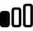
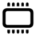

# Icons & Images

## API Reference

### Icon

List of built-in icons that can be used for actions or list items.

#### Example

```typescript
import { Icon, List } from "@raycast/api";

export default function Command() {
  return (
    <List>
      <List.Item title="Icon" icon={Icon.Circle} />
    </List>
  );
}
```

#### Enumeration members

| Name               | Image                                                            |
| :----------------- | :--------------------------------------------------------------- |
| ArrowClockwise     |            |
| TwoArrowsClockwise |          |
| ArrowRight         |                |
| Binoculars         |                 |
| Bubble             |                |
| Calendar           |                   |
| Checkmark          |           |
| ChevronDown        |               |
| ChevronUp          |                 |
| Circle             |                     |
| Clipboard          |           |
| Clock              |                      |
| Desktop            |            |
| Document           |                        |
| Dot                |                        |
| Download           |      |
| Envelope           |                   |
| ExclamationMark    |  |
| Eye                |                        |
| EyeSlash           |                  |
| Finder             |                     |
| Gear               |                  |
| Globe              |                      |
| Hammer             |                     |
| LevelMeter         |                |
| Link               |                       |
| List               |             |
| MagnifyingGlass    |            |
| MemoryChip         |                 |
| Message            |                    |
| Pencil             |                     |
| Person             |         |
| Phone              |                      |
| Pin                |                        |
| Plus               |                       |
| QuestionMark       |        |
| Sidebar            |              |
| SpeakerArrowDown   |         |
| SpeakerArrowUp     |           |
| SpeakerSlash       |              |
| Star               |                       |
| Terminal           |                   |
| Text               |             |
| TextDocument       |              |
| Trash              |                      |
| Upload             |        |
| Video              |                      |
| Window             |                  |
| XmarkCircle        |               |

### Image.Mask

Available masks that can be used to change the shape of an image.

Can be handy to shape avatars or other items in a list.

#### Example

```typescript
import { Image, List } from "@raycast/api";

export default function Command() {
  return (
    <List>
      <List.Item
        title="Icon"
        icon={{
          source: "https://raycast.com/uploads/avatar.png",
          mask: Image.Mask.Circle,
        }}
      />
    </List>
  );
}
```

#### Enumeration members

| Name             | Value              |
| :--------------- | :----------------- |
| Circle           | "circle"           |
| RoundedRectangle | "roundedRectangle" |

## Types

### Image

Display different types of images, including network images or bundled assets.

Apply image transforms to the source, such as a `mask` or a `tintColor`.

#### Example

```typescript
// Built-in icon
const icon = Icon.Eye;

// Built-in icon with tint color
const tintedIcon = { source: Icon.Bubble, tintColor: Color.Red };

// Bundled asset with circular mask
const avatar = { source: "avatar.png", mask: ImageMask.Circle };

// Theme-aware icon
const icon = { source: { light: "icon-light.png", dark: "icon-dark.png" } };
```

#### Properties

<InterfaceTableFromJSDoc name="Image" />

### FileIcon

An icon as it's used in the Finder.

#### Example

```typescript
import { List } from "@raycast/api";

export default function Command() {
  return (
    <List>
      <List.Item title="File icon" icon={{ fileIcon: __filename }} />
    </List>
  );
}
```

#### Properties

<InterfaceTableFromJSDoc name="FileIcon" />

### Image.ImageLike

```typescript
ImageLike: URL | Asset | Icon | FileIcon | Image;
```

Union type for the supported image types.

#### Example

```typescript
import { Icon, Image, List } from "@raycast/api";

export default function Command() {
  return (
    <List>
      <List.Item title="URL" icon="https://raycast.com/uploads/avatar.png" />
      <List.Item title="Asset" icon="avatar.png" />
      <List.Item title="Icon" icon={Icon.Circle} />
      <List.Item title="FileIcon" icon={{ fileIcon: __filename }} />
      <List.Item
        title="Image"
        icon={{
          source: "https://raycast.com/uploads/avatar.png",
          mask: Image.Mask.Circle,
        }}
      />
    </List>
  );
}
```

### Image.Source

```typescript
Image.Source: URL | Asset | Icon | { light: URL | Asset; dark: URL | Asset }
```

The source of an [Image](#image). Can be either a remote URL, a local file resource, a built-in [Icon](#icon) or
a single emoji.

For consistency, it's best to use the built-in [Icon](#icon) in lists, the Action Panel, and other places. If a
specific icon isn't built-in, you can reference custom ones from the `assets` folder of the extension by file name,
e.g. `my-icon.png`. Alternatively, you can reference an absolute HTTPS URL that points to an image or use an emoji.
You can also specify different remote or local assets for light and dark theme.

#### Example

```typescript
import { Icon, List } from "@raycast/api";

export default function Command() {
  return (
    <List>
      <List.Item
        title="URL"
        icon={{ source: "https://raycast.com/uploads/avatar.png" }}
      />
      <List.Item title="Asset" icon={{ source: "avatar.png" }} />
      <List.Item title="Icon" icon={{ source: Icon.Circle }} />
      <List.Item
        title="Theme"
        icon={{
          source: {
            light: "https://raycast.com/uploads/avatar.png",
            dark: "https://raycast.com/uploads/avatar.png",
          },
        }}
      />
    </List>
  );
}
```

### Image.Fallback

```typescript
Image.Fallback: Asset | Icon | { light: Asset; dark: Asset }
```

A fallback [Image](#image) that will be displayed in case the source image cannot be loaded. Can be either a local file resource, a built-in [Icon](#icon), a single emoji, or a theme-aware asset. Any specified `mask` or `tintColor` will also apply to the fallback image.

#### Example

```typescript
import { Icon, List } from "@raycast/api";

export default function Command() {
  return (
    <List>
      <List.Item
        title="URL Source With Asset Fallback"
        icon={{
          source: "https://raycast.com/uploads/avatar.png",
          fallback: "default-avatar.png",
        }}
      />
    </List>
  );
}
```

### Image.URL

Image is a string representing a URL.

#### Example

```typescript
import { Icon, List } from "@raycast/api";

export default function Command() {
  return (
    <List>
      <List.Item
        title="URL"
        icon={{ source: "https://raycast.com/uploads/avatar.png" }}
      />
    </List>
  );
}
```

### Image.Asset

Image is a string representing an asset from the `assets/` folder

#### Example

```typescript
import { Icon, List } from "@raycast/api";

export default function Command() {
  return (
    <List>
      <List.Item title="Asset" icon={{ source: "avatar.png" }} />
    </List>
  );
}
```
