# Icons & Images

## API Reference

### Icon

List of built-in icons that can be used for actions or list items.

#### Example

```typescript
import { Icon, List } from "@raycast/api";

export default function Command() {
  return (
    <List>
      <List.Item title="Icon" icon={Icon.Circle} />
    </List>
  );
}
```

#### Enumeration members

| <p><picture><source srcset="../../.gitbook/assets/icon-add-person-16@dark.svg" media="(prefers-color-scheme: dark)"></picture><br>AddPerson</p> | <p><picture><source srcset="../../.gitbook/assets/icon-airplane-16@dark.svg" media="(prefers-color-scheme: dark)"></picture><br>Airplane</p> | <p><picture><source srcset="../../.gitbook/assets/icon-airplane-filled-16@dark.svg" media="(prefers-color-scheme: dark)"></picture><br>AirplaneFilled</p> |
| :---: | :---: | :---: |
| <p><picture><source srcset="../../.gitbook/assets/icon-airplane-landing-16@dark.svg" media="(prefers-color-scheme: dark)"></picture><br>AirplaneLanding</p> | <p><picture><source srcset="../../.gitbook/assets/icon-airplane-takeoff-16@dark.svg" media="(prefers-color-scheme: dark)"></picture><br>AirplaneTakeoff</p> | <p><picture><source srcset="../../.gitbook/assets/icon-airpods-16@dark.svg" media="(prefers-color-scheme: dark)"></picture><br>Airpods</p> |
| <p><picture><source srcset="../../.gitbook/assets/icon-alarm-16@dark.svg" media="(prefers-color-scheme: dark)"></picture><br>Alarm</p> | <p><picture><source srcset="../../.gitbook/assets/icon-alarm-ringing-16@dark.svg" media="(prefers-color-scheme: dark)"></picture><br>AlarmRinging</p> | <p><picture><source srcset="../../.gitbook/assets/icon-align-centre-16@dark.svg" media="(prefers-color-scheme: dark)">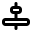</picture><br>AlignCentre</p> |
| <p><picture><source srcset="../../.gitbook/assets/icon-align-left-16@dark.svg" media="(prefers-color-scheme: dark)">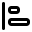</picture><br>AlignLeft</p> | <p><picture><source srcset="../../.gitbook/assets/icon-align-right-16@dark.svg" media="(prefers-color-scheme: dark)"></picture><br>AlignRight</p> | <p><picture><source srcset="../../.gitbook/assets/icon-american-football-16@dark.svg" media="(prefers-color-scheme: dark)"></picture><br>AmericanFootball</p> |
| <p><picture><source srcset="../../.gitbook/assets/icon-anchor-16@dark.svg" media="(prefers-color-scheme: dark)"></picture><br>Anchor</p> | <p><picture><source srcset="../../.gitbook/assets/icon-app-window-16@dark.svg" media="(prefers-color-scheme: dark)"></picture><br>AppWindow</p> | <p><picture><source srcset="../../.gitbook/assets/icon-app-window-grid-2x2-16@dark.svg" media="(prefers-color-scheme: dark)"></picture><br>AppWindowGrid2x2</p> |
| <p><picture><source srcset="../../.gitbook/assets/icon-app-window-grid-3x3-16@dark.svg" media="(prefers-color-scheme: dark)"></picture><br>AppWindowGrid3x3</p> | <p><picture><source srcset="../../.gitbook/assets/icon-app-window-list-16@dark.svg" media="(prefers-color-scheme: dark)"></picture><br>AppWindowList</p> | <p><picture><source srcset="../../.gitbook/assets/icon-app-window-sidebar-left-16@dark.svg" media="(prefers-color-scheme: dark)"></picture><br>AppWindowSidebarLeft</p> |
| <p><picture><source srcset="../../.gitbook/assets/icon-app-window-sidebar-right-16@dark.svg" media="(prefers-color-scheme: dark)"></picture><br>AppWindowSidebarRight</p> | <p><picture><source srcset="../../.gitbook/assets/icon-arrow-clockwise-16@dark.svg" media="(prefers-color-scheme: dark)"></picture><br>ArrowClockwise</p> | <p><picture><source srcset="../../.gitbook/assets/icon-arrow-counter-clockwise-16@dark.svg" media="(prefers-color-scheme: dark)"></picture><br>ArrowCounterClockwise</p> |
| <p><picture><source srcset="../../.gitbook/assets/icon-arrow-down-16@dark.svg" media="(prefers-color-scheme: dark)"></picture><br>ArrowDown</p> | <p><picture><source srcset="../../.gitbook/assets/icon-arrow-down-circle-16@dark.svg" media="(prefers-color-scheme: dark)"></picture><br>ArrowDownCircle</p> | <p><picture><source srcset="../../.gitbook/assets/icon-arrow-down-circle-filled-16@dark.svg" media="(prefers-color-scheme: dark)"></picture><br>ArrowDownCircleFilled</p> |
| <p><picture><source srcset="../../.gitbook/assets/icon-arrow-left-16@dark.svg" media="(prefers-color-scheme: dark)"></picture><br>ArrowLeft</p> | <p><picture><source srcset="../../.gitbook/assets/icon-arrow-left-circle-16@dark.svg" media="(prefers-color-scheme: dark)"></picture><br>ArrowLeftCircle</p> | <p><picture><source srcset="../../.gitbook/assets/icon-arrow-left-circle-filled-16@dark.svg" media="(prefers-color-scheme: dark)"></picture><br>ArrowLeftCircleFilled</p> |
| <p><picture><source srcset="../../.gitbook/assets/icon-arrow-ne-16@dark.svg" media="(prefers-color-scheme: dark)"></picture><br>ArrowNe</p> | <p><picture><source srcset="../../.gitbook/assets/icon-arrow-right-16@dark.svg" media="(prefers-color-scheme: dark)"></picture><br>ArrowRight</p> | <p><picture><source srcset="../../.gitbook/assets/icon-arrow-right-circle-16@dark.svg" media="(prefers-color-scheme: dark)"></picture><br>ArrowRightCircle</p> |
| <p><picture><source srcset="../../.gitbook/assets/icon-arrow-right-circle-filled-16@dark.svg" media="(prefers-color-scheme: dark)"></picture><br>ArrowRightCircleFilled</p> | <p><picture><source srcset="../../.gitbook/assets/icon-arrow-up-16@dark.svg" media="(prefers-color-scheme: dark)"></picture><br>ArrowUp</p> | <p><picture><source srcset="../../.gitbook/assets/icon-arrow-up-circle-16@dark.svg" media="(prefers-color-scheme: dark)"></picture><br>ArrowUpCircle</p> |
| <p><picture><source srcset="../../.gitbook/assets/icon-arrow-up-circle-filled-16@dark.svg" media="(prefers-color-scheme: dark)"></picture><br>ArrowUpCircleFilled</p> | <p><picture><source srcset="../../.gitbook/assets/icon-arrows-contract-16@dark.svg" media="(prefers-color-scheme: dark)">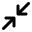</picture><br>ArrowsContract</p> | <p><picture><source srcset="../../.gitbook/assets/icon-arrows-expand-16@dark.svg" media="(prefers-color-scheme: dark)"></picture><br>ArrowsExpand</p> |
| <p><picture><source srcset="../../.gitbook/assets/icon-at-symbol-16@dark.svg" media="(prefers-color-scheme: dark)"></picture><br>AtSymbol</p> | <p><picture><source srcset="../../.gitbook/assets/icon-band-aid-16@dark.svg" media="(prefers-color-scheme: dark)"></picture><br>BandAid</p> | <p><picture><source srcset="../../.gitbook/assets/icon-bank-note-16@dark.svg" media="(prefers-color-scheme: dark)"></picture><br>BankNote</p> |
| <p><picture><source srcset="../../.gitbook/assets/icon-bar-chart-16@dark.svg" media="(prefers-color-scheme: dark)"></picture><br>BarChart</p> | <p><picture><source srcset="../../.gitbook/assets/icon-bar-code-16@dark.svg" media="(prefers-color-scheme: dark)"></picture><br>BarCode</p> | <p><picture><source srcset="../../.gitbook/assets/icon-bath-tub-16@dark.svg" media="(prefers-color-scheme: dark)"></picture><br>BathTub</p> |
| <p><picture><source srcset="../../.gitbook/assets/icon-battery-16@dark.svg" media="(prefers-color-scheme: dark)"></picture><br>Battery</p> | <p><picture><source srcset="../../.gitbook/assets/icon-battery-charging-16@dark.svg" media="(prefers-color-scheme: dark)"></picture><br>BatteryCharging</p> | <p><picture><source srcset="../../.gitbook/assets/icon-battery-disabled-16@dark.svg" media="(prefers-color-scheme: dark)"></picture><br>BatteryDisabled</p> |
| <p><picture><source srcset="../../.gitbook/assets/icon-bell-16@dark.svg" media="(prefers-color-scheme: dark)"></picture><br>Bell</p> | <p><picture><source srcset="../../.gitbook/assets/icon-bell-disabled-16@dark.svg" media="(prefers-color-scheme: dark)"></picture><br>BellDisabled</p> | <p><picture><source srcset="../../.gitbook/assets/icon-bike-16@dark.svg" media="(prefers-color-scheme: dark)"></picture><br>Bike</p> |
| <p><picture><source srcset="../../.gitbook/assets/icon-binoculars-16@dark.svg" media="(prefers-color-scheme: dark)"></picture><br>Binoculars</p> | <p><picture><source srcset="../../.gitbook/assets/icon-bird-16@dark.svg" media="(prefers-color-scheme: dark)">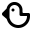</picture><br>Bird</p> | <p><picture><source srcset="../../.gitbook/assets/icon-blank-document-16@dark.svg" media="(prefers-color-scheme: dark)"></picture><br>BlankDocument</p> |
| <p><picture><source srcset="../../.gitbook/assets/icon-bluetooth-16@dark.svg" media="(prefers-color-scheme: dark)">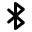</picture><br>Bluetooth</p> | <p><picture><source srcset="../../.gitbook/assets/icon-boat-16@dark.svg" media="(prefers-color-scheme: dark)"></picture><br>Boat</p> | <p><picture><source srcset="../../.gitbook/assets/icon-bold-16@dark.svg" media="(prefers-color-scheme: dark)"></picture><br>Bold</p> |
| <p><picture><source srcset="../../.gitbook/assets/icon-bolt-16@dark.svg" media="(prefers-color-scheme: dark)"></picture><br>Bolt</p> | <p><picture><source srcset="../../.gitbook/assets/icon-bolt-disabled-16@dark.svg" media="(prefers-color-scheme: dark)"></picture><br>BoltDisabled</p> | <p><picture><source srcset="../../.gitbook/assets/icon-book-16@dark.svg" media="(prefers-color-scheme: dark)"></picture><br>Book</p> |
| <p><picture><source srcset="../../.gitbook/assets/icon-bookmark-16@dark.svg" media="(prefers-color-scheme: dark)"></picture><br>Bookmark</p> | <p><picture><source srcset="../../.gitbook/assets/icon-box-16@dark.svg" media="(prefers-color-scheme: dark)"></picture><br>Box</p> | <p><picture><source srcset="../../.gitbook/assets/icon-brush-16@dark.svg" media="(prefers-color-scheme: dark)"></picture><br>Brush</p> |
| <p><picture><source srcset="../../.gitbook/assets/icon-speech-bubble-16@dark.svg" media="(prefers-color-scheme: dark)"></picture><br>Bubble</p> | <p><picture><source srcset="../../.gitbook/assets/icon-bug-16@dark.svg" media="(prefers-color-scheme: dark)">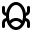</picture><br>Bug</p> | <p><picture><source srcset="../../.gitbook/assets/icon-building-16@dark.svg" media="(prefers-color-scheme: dark)"></picture><br>Building</p> |
| <p><picture><source srcset="../../.gitbook/assets/icon-bullet-points-16@dark.svg" media="(prefers-color-scheme: dark)"></picture><br>BulletPoints</p> | <p><picture><source srcset="../../.gitbook/assets/icon-bulls-eye-16@dark.svg" media="(prefers-color-scheme: dark)"></picture><br>BullsEye</p> | <p><picture><source srcset="../../.gitbook/assets/icon-bulls-eye-missed-16@dark.svg" media="(prefers-color-scheme: dark)"></picture><br>BullsEyeMissed</p> |
| <p><picture><source srcset="../../.gitbook/assets/icon-buoy-16@dark.svg" media="(prefers-color-scheme: dark)"></picture><br>Buoy</p> | <p><picture><source srcset="../../.gitbook/assets/icon-calculator-16@dark.svg" media="(prefers-color-scheme: dark)"></picture><br>Calculator</p> | <p><picture><source srcset="../../.gitbook/assets/icon-calendar-16@dark.svg" media="(prefers-color-scheme: dark)"></picture><br>Calendar</p> |
| <p><picture><source srcset="../../.gitbook/assets/icon-camera-16@dark.svg" media="(prefers-color-scheme: dark)"></picture><br>Camera</p> | <p><picture><source srcset="../../.gitbook/assets/icon-car-16@dark.svg" media="(prefers-color-scheme: dark)"></picture><br>Car</p> | <p><picture><source srcset="../../.gitbook/assets/icon-cart-16@dark.svg" media="(prefers-color-scheme: dark)"></picture><br>Cart</p> |
| <p><picture><source srcset="../../.gitbook/assets/icon-cd-16@dark.svg" media="(prefers-color-scheme: dark)"></picture><br>Cd</p> | <p><picture><source srcset="../../.gitbook/assets/icon-center-16@dark.svg" media="(prefers-color-scheme: dark)"></picture><br>Center</p> | <p><picture><source srcset="../../.gitbook/assets/icon-check-16@dark.svg" media="(prefers-color-scheme: dark)"></picture><br>Check</p> |
| <p><picture><source srcset="../../.gitbook/assets/icon-check-circle-16@dark.svg" media="(prefers-color-scheme: dark)"></picture><br>CheckCircle</p> | <p><picture><source srcset="../../.gitbook/assets/icon-check-list-16@dark.svg" media="(prefers-color-scheme: dark)"></picture><br>CheckList</p> | <p><picture><source srcset="../../.gitbook/assets/icon-check-rosette-16@dark.svg" media="(prefers-color-scheme: dark)"></picture><br>CheckRosette</p> |
| <p><picture><source srcset="../../.gitbook/assets/icon-checkmark-16@dark.svg" media="(prefers-color-scheme: dark)"></picture><br>Checkmark</p> | <p><picture><source srcset="../../.gitbook/assets/icon-chess-piece-16@dark.svg" media="(prefers-color-scheme: dark)"></picture><br>ChessPiece</p> | <p><picture><source srcset="../../.gitbook/assets/icon-chevron-down-16@dark.svg" media="(prefers-color-scheme: dark)"></picture><br>ChevronDown</p> |
| <p><picture><source srcset="../../.gitbook/assets/icon-chevron-down-small-16@dark.svg" media="(prefers-color-scheme: dark)"></picture><br>ChevronDownSmall</p> | <p><picture><source srcset="../../.gitbook/assets/icon-chevron-left-16@dark.svg" media="(prefers-color-scheme: dark)"></picture><br>ChevronLeft</p> | <p><picture><source srcset="../../.gitbook/assets/icon-chevron-left-small-16@dark.svg" media="(prefers-color-scheme: dark)"></picture><br>ChevronLeftSmall</p> |
| <p><picture><source srcset="../../.gitbook/assets/icon-chevron-right-16@dark.svg" media="(prefers-color-scheme: dark)"></picture><br>ChevronRight</p> | <p><picture><source srcset="../../.gitbook/assets/icon-chevron-right-small-16@dark.svg" media="(prefers-color-scheme: dark)"></picture><br>ChevronRightSmall</p> | <p><picture><source srcset="../../.gitbook/assets/icon-chevron-up-16@dark.svg" media="(prefers-color-scheme: dark)">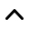</picture><br>ChevronUp</p> |
| <p><picture><source srcset="../../.gitbook/assets/icon-chevron-up-down-16@dark.svg" media="(prefers-color-scheme: dark)"></picture><br>ChevronUpDown</p> | <p><picture><source srcset="../../.gitbook/assets/icon-chevron-up-small-16@dark.svg" media="(prefers-color-scheme: dark)"></picture><br>ChevronUpSmall</p> | <p><picture><source srcset="../../.gitbook/assets/icon-circle-16@dark.svg" media="(prefers-color-scheme: dark)"></picture><br>Circle</p> |
| <p><picture><source srcset="../../.gitbook/assets/icon-circle-disabled-16@dark.svg" media="(prefers-color-scheme: dark)"></picture><br>CircleDisabled</p> | <p><picture><source srcset="../../.gitbook/assets/icon-circle-ellipsis-16@dark.svg" media="(prefers-color-scheme: dark)"></picture><br>CircleEllipsis</p> | <p><picture><source srcset="../../.gitbook/assets/icon-circle-filled-16@dark.svg" media="(prefers-color-scheme: dark)"></picture><br>CircleFilled</p> |
| <p><picture><source srcset="../../.gitbook/assets/icon-circle-progress-16@dark.svg" media="(prefers-color-scheme: dark)"></picture><br>CircleProgress</p> | <p><picture><source srcset="../../.gitbook/assets/icon-circle-progress-100-16@dark.svg" media="(prefers-color-scheme: dark)"></picture><br>CircleProgress100</p> | <p><picture><source srcset="../../.gitbook/assets/icon-circle-progress-25-16@dark.svg" media="(prefers-color-scheme: dark)"></picture><br>CircleProgress25</p> |
| <p><picture><source srcset="../../.gitbook/assets/icon-circle-progress-50-16@dark.svg" media="(prefers-color-scheme: dark)"></picture><br>CircleProgress50</p> | <p><picture><source srcset="../../.gitbook/assets/icon-circle-progress-75-16@dark.svg" media="(prefers-color-scheme: dark)"></picture><br>CircleProgress75</p> | <p><picture><source srcset="../../.gitbook/assets/icon-clear-formatting-16@dark.svg" media="(prefers-color-scheme: dark)"></picture><br>ClearFormatting</p> |
| <p><picture><source srcset="../../.gitbook/assets/icon-copy-clipboard-16@dark.svg" media="(prefers-color-scheme: dark)"></picture><br>Clipboard</p> | <p><picture><source srcset="../../.gitbook/assets/icon-clock-16@dark.svg" media="(prefers-color-scheme: dark)"></picture><br>Clock</p> | <p><picture><source srcset="../../.gitbook/assets/icon-cloud-16@dark.svg" media="(prefers-color-scheme: dark)"></picture><br>Cloud</p> |
| <p><picture><source srcset="../../.gitbook/assets/icon-cloud-lightning-16@dark.svg" media="(prefers-color-scheme: dark)">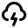</picture><br>CloudLightning</p> | <p><picture><source srcset="../../.gitbook/assets/icon-cloud-rain-16@dark.svg" media="(prefers-color-scheme: dark)"></picture><br>CloudRain</p> | <p><picture><source srcset="../../.gitbook/assets/icon-cloud-snow-16@dark.svg" media="(prefers-color-scheme: dark)"></picture><br>CloudSnow</p> |
| <p><picture><source srcset="../../.gitbook/assets/icon-cloud-sun-16@dark.svg" media="(prefers-color-scheme: dark)"></picture><br>CloudSun</p> | <p><picture><source srcset="../../.gitbook/assets/icon-code-16@dark.svg" media="(prefers-color-scheme: dark)"></picture><br>Code</p> | <p><picture><source srcset="../../.gitbook/assets/icon-code-block-16@dark.svg" media="(prefers-color-scheme: dark)"></picture><br>CodeBlock</p> |
| <p><picture><source srcset="../../.gitbook/assets/icon-cog-16@dark.svg" media="(prefers-color-scheme: dark)"></picture><br>Cog</p> | <p><picture><source srcset="../../.gitbook/assets/icon-coin-16@dark.svg" media="(prefers-color-scheme: dark)">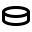</picture><br>Coin</p> | <p><picture><source srcset="../../.gitbook/assets/icon-coins-16@dark.svg" media="(prefers-color-scheme: dark)"></picture><br>Coins</p> |
| <p><picture><source srcset="../../.gitbook/assets/icon-command-symbol-16@dark.svg" media="(prefers-color-scheme: dark)">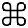</picture><br>CommandSymbol</p> | <p><picture><source srcset="../../.gitbook/assets/icon-compass-16@dark.svg" media="(prefers-color-scheme: dark)"></picture><br>Compass</p> | <p><picture><source srcset="../../.gitbook/assets/icon-computer-chip-16@dark.svg" media="(prefers-color-scheme: dark)"></picture><br>ComputerChip</p> |
| <p><picture><source srcset="../../.gitbook/assets/icon-contrast-16@dark.svg" media="(prefers-color-scheme: dark)"></picture><br>Contrast</p> | <p><picture><source srcset="../../.gitbook/assets/icon-copy-clipboard-16@dark.svg" media="(prefers-color-scheme: dark)"></picture><br>CopyClipboard</p> | <p><picture><source srcset="../../.gitbook/assets/icon-credit-card-16@dark.svg" media="(prefers-color-scheme: dark)"></picture><br>CreditCard</p> |
| <p><picture><source srcset="../../.gitbook/assets/icon-cricket-ball-16@dark.svg" media="(prefers-color-scheme: dark)"></picture><br>CricketBall</p> | <p><picture><source srcset="../../.gitbook/assets/icon-crop-16@dark.svg" media="(prefers-color-scheme: dark)"></picture><br>Crop</p> | <p><picture><source srcset="../../.gitbook/assets/icon-crown-16@dark.svg" media="(prefers-color-scheme: dark)"></picture><br>Crown</p> |
| <p><picture><source srcset="../../.gitbook/assets/icon-crypto-16@dark.svg" media="(prefers-color-scheme: dark)"></picture><br>Crypto</p> | <p><picture><source srcset="../../.gitbook/assets/icon-delete-document-16@dark.svg" media="(prefers-color-scheme: dark)"></picture><br>DeleteDocument</p> | <p><picture><source srcset="../../.gitbook/assets/icon-desktop-16@dark.svg" media="(prefers-color-scheme: dark)"></picture><br>Desktop</p> |
| <p><picture><source srcset="../../.gitbook/assets/icon-devices-16@dark.svg" media="(prefers-color-scheme: dark)">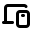</picture><br>Devices</p> | <p><picture><source srcset="../../.gitbook/assets/icon-dna-16@dark.svg" media="(prefers-color-scheme: dark)">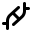</picture><br>Dna</p> | <p><picture><source srcset="../../.gitbook/assets/icon-blank-document-16@dark.svg" media="(prefers-color-scheme: dark)"></picture><br>Document</p> |
| <p><picture><source srcset="../../.gitbook/assets/icon-dot-16@dark.svg" media="(prefers-color-scheme: dark)"></picture><br>Dot</p> | <p><picture><source srcset="../../.gitbook/assets/icon-download-16@dark.svg" media="(prefers-color-scheme: dark)"></picture><br>Download</p> | <p><picture><source srcset="../../.gitbook/assets/icon-droplets-16@dark.svg" media="(prefers-color-scheme: dark)"></picture><br>Droplets</p> |
| <p><picture><source srcset="../../.gitbook/assets/icon-duplicate-16@dark.svg" media="(prefers-color-scheme: dark)"></picture><br>Duplicate</p> | <p><picture><source srcset="../../.gitbook/assets/icon-edit-shape-16@dark.svg" media="(prefers-color-scheme: dark)"></picture><br>EditShape</p> | <p><picture><source srcset="../../.gitbook/assets/icon-eject-16@dark.svg" media="(prefers-color-scheme: dark)">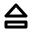</picture><br>Eject</p> |
| <p><picture><source srcset="../../.gitbook/assets/icon-ellipsis-16@dark.svg" media="(prefers-color-scheme: dark)"></picture><br>Ellipsis</p> | <p><picture><source srcset="../../.gitbook/assets/icon-ellipsis-vertical-16@dark.svg" media="(prefers-color-scheme: dark)"></picture><br>EllipsisVertical</p> | <p><picture><source srcset="../../.gitbook/assets/icon-emoji-16@dark.svg" media="(prefers-color-scheme: dark)"></picture><br>Emoji</p> |
| <p><picture><source srcset="../../.gitbook/assets/icon-emoji-sad-16@dark.svg" media="(prefers-color-scheme: dark)"></picture><br>EmojiSad</p> | <p><picture><source srcset="../../.gitbook/assets/icon-envelope-16@dark.svg" media="(prefers-color-scheme: dark)"></picture><br>Envelope</p> | <p><picture><source srcset="../../.gitbook/assets/icon-eraser-16@dark.svg" media="(prefers-color-scheme: dark)"></picture><br>Eraser</p> |
| <p><picture><source srcset="../../.gitbook/assets/icon-important-01-16@dark.svg" media="(prefers-color-scheme: dark)"></picture><br>ExclamationMark</p> | <p><picture><source srcset="../../.gitbook/assets/icon-exclamationmark-16@dark.svg" media="(prefers-color-scheme: dark)"></picture><br>Exclamationmark</p> | <p><picture><source srcset="../../.gitbook/assets/icon-exclamationmark-2-16@dark.svg" media="(prefers-color-scheme: dark)"></picture><br>Exclamationmark2</p> |
| <p><picture><source srcset="../../.gitbook/assets/icon-exclamationmark-3-16@dark.svg" media="(prefers-color-scheme: dark)"></picture><br>Exclamationmark3</p> | <p><picture><source srcset="../../.gitbook/assets/icon-eye-16@dark.svg" media="(prefers-color-scheme: dark)"></picture><br>Eye</p> | <p><picture><source srcset="../../.gitbook/assets/icon-eye-disabled-16@dark.svg" media="(prefers-color-scheme: dark)"></picture><br>EyeDisabled</p> |
| <p><picture><source srcset="../../.gitbook/assets/icon-eye-dropper-16@dark.svg" media="(prefers-color-scheme: dark)"></picture><br>EyeDropper</p> | <p><picture><source srcset="../../.gitbook/assets/icon-female-16@dark.svg" media="(prefers-color-scheme: dark)">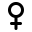</picture><br>Female</p> | <p><picture><source srcset="../../.gitbook/assets/icon-film-strip-16@dark.svg" media="(prefers-color-scheme: dark)"></picture><br>FilmStrip</p> |
| <p><picture><source srcset="../../.gitbook/assets/icon-filter-16@dark.svg" media="(prefers-color-scheme: dark)"></picture><br>Filter</p> | <p><picture><source srcset="../../.gitbook/assets/icon-finder-16@dark.svg" media="(prefers-color-scheme: dark)"></picture><br>Finder</p> | <p><picture><source srcset="../../.gitbook/assets/icon-fingerprint-16@dark.svg" media="(prefers-color-scheme: dark)"></picture><br>Fingerprint</p> |
| <p><picture><source srcset="../../.gitbook/assets/icon-flag-16@dark.svg" media="(prefers-color-scheme: dark)"></picture><br>Flag</p> | <p><picture><source srcset="../../.gitbook/assets/icon-folder-16@dark.svg" media="(prefers-color-scheme: dark)"></picture><br>Folder</p> | <p><picture><source srcset="../../.gitbook/assets/icon-footprints-16@dark.svg" media="(prefers-color-scheme: dark)"></picture><br>Footprints</p> |
| <p><picture><source srcset="../../.gitbook/assets/icon-forward-16@dark.svg" media="(prefers-color-scheme: dark)"></picture><br>Forward</p> | <p><picture><source srcset="../../.gitbook/assets/icon-forward-filled-16@dark.svg" media="(prefers-color-scheme: dark)"></picture><br>ForwardFilled</p> | <p><picture><source srcset="../../.gitbook/assets/icon-fountain-tip-16@dark.svg" media="(prefers-color-scheme: dark)">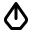</picture><br>FountainTip</p> |
| <p><picture><source srcset="../../.gitbook/assets/icon-full-signal-16@dark.svg" media="(prefers-color-scheme: dark)"></picture><br>FullSignal</p> | <p><picture><source srcset="../../.gitbook/assets/icon-game-controller-16@dark.svg" media="(prefers-color-scheme: dark)"></picture><br>GameController</p> | <p><picture><source srcset="../../.gitbook/assets/icon-gauge-16@dark.svg" media="(prefers-color-scheme: dark)"></picture><br>Gauge</p> |
| <p><picture><source srcset="../../.gitbook/assets/icon-cog-16@dark.svg" media="(prefers-color-scheme: dark)"></picture><br>Gear</p> | <p><picture><source srcset="../../.gitbook/assets/icon-geopin-16@dark.svg" media="(prefers-color-scheme: dark)"></picture><br>Geopin</p> | <p><picture><source srcset="../../.gitbook/assets/icon-germ-16@dark.svg" media="(prefers-color-scheme: dark)"></picture><br>Germ</p> |
| <p><picture><source srcset="../../.gitbook/assets/icon-gift-16@dark.svg" media="(prefers-color-scheme: dark)"></picture><br>Gift</p> | <p><picture><source srcset="../../.gitbook/assets/icon-glasses-16@dark.svg" media="(prefers-color-scheme: dark)"></picture><br>Glasses</p> | <p><picture><source srcset="../../.gitbook/assets/icon-globe-01-16@dark.svg" media="(prefers-color-scheme: dark)"></picture><br>Globe</p> |
| <p><picture><source srcset="../../.gitbook/assets/icon-goal-16@dark.svg" media="(prefers-color-scheme: dark)"></picture><br>Goal</p> | <p><picture><source srcset="../../.gitbook/assets/icon-hammer-16@dark.svg" media="(prefers-color-scheme: dark)"></picture><br>Hammer</p> | <p><picture><source srcset="../../.gitbook/assets/icon-hard-drive-16@dark.svg" media="(prefers-color-scheme: dark)"></picture><br>HardDrive</p> |
| <p><picture><source srcset="../../.gitbook/assets/icon-hashtag-16@dark.svg" media="(prefers-color-scheme: dark)"></picture><br>Hashtag</p> | <p><picture><source srcset="../../.gitbook/assets/icon-heading-16@dark.svg" media="(prefers-color-scheme: dark)"></picture><br>Heading</p> | <p><picture><source srcset="../../.gitbook/assets/icon-headphones-16@dark.svg" media="(prefers-color-scheme: dark)"></picture><br>Headphones</p> |
| <p><picture><source srcset="../../.gitbook/assets/icon-heart-16@dark.svg" media="(prefers-color-scheme: dark)"></picture><br>Heart</p> | <p><picture><source srcset="../../.gitbook/assets/icon-heart-disabled-16@dark.svg" media="(prefers-color-scheme: dark)"></picture><br>HeartDisabled</p> | <p><picture><source srcset="../../.gitbook/assets/icon-heartbeat-16@dark.svg" media="(prefers-color-scheme: dark)"></picture><br>Heartbeat</p> |
| <p><picture><source srcset="../../.gitbook/assets/icon-highlight-16@dark.svg" media="(prefers-color-scheme: dark)"></picture><br>Highlight</p> | <p><picture><source srcset="../../.gitbook/assets/icon-hourglass-16@dark.svg" media="(prefers-color-scheme: dark)">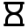</picture><br>Hourglass</p> | <p><picture><source srcset="../../.gitbook/assets/icon-house-16@dark.svg" media="(prefers-color-scheme: dark)"></picture><br>House</p> |
| <p><picture><source srcset="../../.gitbook/assets/icon-humidity-16@dark.svg" media="(prefers-color-scheme: dark)"></picture><br>Humidity</p> | <p><picture><source srcset="../../.gitbook/assets/icon-image-16@dark.svg" media="(prefers-color-scheme: dark)"></picture><br>Image</p> | <p><picture><source srcset="../../.gitbook/assets/icon-important-01-16@dark.svg" media="(prefers-color-scheme: dark)"></picture><br>Important</p> |
| <p><picture><source srcset="../../.gitbook/assets/icon-info-01-16@dark.svg" media="(prefers-color-scheme: dark)"></picture><br>Info</p> | <p><picture><source srcset="../../.gitbook/assets/icon-italics-16@dark.svg" media="(prefers-color-scheme: dark)">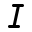</picture><br>Italics</p> | <p><picture><source srcset="../../.gitbook/assets/icon-key-16@dark.svg" media="(prefers-color-scheme: dark)"></picture><br>Key</p> |
| <p><picture><source srcset="../../.gitbook/assets/icon-keyboard-16@dark.svg" media="(prefers-color-scheme: dark)"></picture><br>Keyboard</p> | <p><picture><source srcset="../../.gitbook/assets/icon-layers-16@dark.svg" media="(prefers-color-scheme: dark)"></picture><br>Layers</p> | <p><picture><source srcset="../../.gitbook/assets/icon-leaderboard-16@dark.svg" media="(prefers-color-scheme: dark)"></picture><br>Leaderboard</p> |
| <p><picture><source srcset="../../.gitbook/assets/icon-leaf-16@dark.svg" media="(prefers-color-scheme: dark)"></picture><br>Leaf</p> | <p><picture><source srcset="../../.gitbook/assets/icon-signal-2-16@dark.svg" media="(prefers-color-scheme: dark)"></picture><br>LevelMeter</p> | <p><picture><source srcset="../../.gitbook/assets/icon-light-bulb-16@dark.svg" media="(prefers-color-scheme: dark)">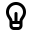</picture><br>LightBulb</p> |
| <p><picture><source srcset="../../.gitbook/assets/icon-light-bulb-off-16@dark.svg" media="(prefers-color-scheme: dark)"></picture><br>LightBulbOff</p> | <p><picture><source srcset="../../.gitbook/assets/icon-line-chart-16@dark.svg" media="(prefers-color-scheme: dark)"></picture><br>LineChart</p> | <p><picture><source srcset="../../.gitbook/assets/icon-link-16@dark.svg" media="(prefers-color-scheme: dark)">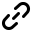</picture><br>Link</p> |
| <p><picture><source srcset="../../.gitbook/assets/icon-app-window-list-16@dark.svg" media="(prefers-color-scheme: dark)"></picture><br>List</p> | <p><picture><source srcset="../../.gitbook/assets/icon-livestream-01-16@dark.svg" media="(prefers-color-scheme: dark)"></picture><br>Livestream</p> | <p><picture><source srcset="../../.gitbook/assets/icon-livestream-disabled-01-16@dark.svg" media="(prefers-color-scheme: dark)">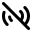</picture><br>LivestreamDisabled</p> |
| <p><picture><source srcset="../../.gitbook/assets/icon-lock-16@dark.svg" media="(prefers-color-scheme: dark)"></picture><br>Lock</p> | <p><picture><source srcset="../../.gitbook/assets/icon-lock-disabled-16@dark.svg" media="(prefers-color-scheme: dark)"></picture><br>LockDisabled</p> | <p><picture><source srcset="../../.gitbook/assets/icon-lock-unlocked-16@dark.svg" media="(prefers-color-scheme: dark)"></picture><br>LockUnlocked</p> |
| <p><picture><source srcset="../../.gitbook/assets/icon-logout-16@dark.svg" media="(prefers-color-scheme: dark)">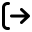</picture><br>Logout</p> | <p><picture><source srcset="../../.gitbook/assets/icon-lorry-16@dark.svg" media="(prefers-color-scheme: dark)"></picture><br>Lorry</p> | <p><picture><source srcset="../../.gitbook/assets/icon-lowercase-16@dark.svg" media="(prefers-color-scheme: dark)"></picture><br>Lowercase</p> |
| <p><picture><source srcset="../../.gitbook/assets/icon-magnifying-glass-16@dark.svg" media="(prefers-color-scheme: dark)"></picture><br>MagnifyingGlass</p> | <p><picture><source srcset="../../.gitbook/assets/icon-male-16@dark.svg" media="(prefers-color-scheme: dark)"></picture><br>Male</p> | <p><picture><source srcset="../../.gitbook/assets/icon-map-16@dark.svg" media="(prefers-color-scheme: dark)"></picture><br>Map</p> |
| <p><picture><source srcset="../../.gitbook/assets/icon-mask-16@dark.svg" media="(prefers-color-scheme: dark)"></picture><br>Mask</p> | <p><picture><source srcset="../../.gitbook/assets/icon-maximize-16@dark.svg" media="(prefers-color-scheme: dark)"></picture><br>Maximize</p> | <p><picture><source srcset="../../.gitbook/assets/icon-medical-support-16@dark.svg" media="(prefers-color-scheme: dark)"></picture><br>MedicalSupport</p> |
| <p><picture><source srcset="../../.gitbook/assets/icon-megaphone-16@dark.svg" media="(prefers-color-scheme: dark)"></picture><br>Megaphone</p> | <p><picture><source srcset="../../.gitbook/assets/icon-computer-chip-16@dark.svg" media="(prefers-color-scheme: dark)"></picture><br>MemoryChip</p> | <p><picture><source srcset="../../.gitbook/assets/icon-memory-stick-16@dark.svg" media="(prefers-color-scheme: dark)"></picture><br>MemoryStick</p> |
| <p><picture><source srcset="../../.gitbook/assets/icon-speech-bubble-16@dark.svg" media="(prefers-color-scheme: dark)"></picture><br>Message</p> | <p><picture><source srcset="../../.gitbook/assets/icon-microphone-16@dark.svg" media="(prefers-color-scheme: dark)">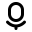</picture><br>Microphone</p> | <p><picture><source srcset="../../.gitbook/assets/icon-microphone-disabled-16@dark.svg" media="(prefers-color-scheme: dark)"></picture><br>MicrophoneDisabled</p> |
| <p><picture><source srcset="../../.gitbook/assets/icon-minimize-16@dark.svg" media="(prefers-color-scheme: dark)"></picture><br>Minimize</p> | <p><picture><source srcset="../../.gitbook/assets/icon-minus-16@dark.svg" media="(prefers-color-scheme: dark)">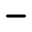</picture><br>Minus</p> | <p><picture><source srcset="../../.gitbook/assets/icon-minus-circle-16@dark.svg" media="(prefers-color-scheme: dark)"></picture><br>MinusCircle</p> |
| <p><picture><source srcset="../../.gitbook/assets/icon-minus-circle-filled-16@dark.svg" media="(prefers-color-scheme: dark)"></picture><br>MinusCircleFilled</p> | <p><picture><source srcset="../../.gitbook/assets/icon-mobile-16@dark.svg" media="(prefers-color-scheme: dark)"></picture><br>Mobile</p> | <p><picture><source srcset="../../.gitbook/assets/icon-monitor-16@dark.svg" media="(prefers-color-scheme: dark)"></picture><br>Monitor</p> |
| <p><picture><source srcset="../../.gitbook/assets/icon-moon-16@dark.svg" media="(prefers-color-scheme: dark)">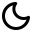</picture><br>Moon</p> | <p><picture><source srcset="../../.gitbook/assets/icon-moon-down-16@dark.svg" media="(prefers-color-scheme: dark)"></picture><br>MoonDown</p> | <p><picture><source srcset="../../.gitbook/assets/icon-moon-up-16@dark.svg" media="(prefers-color-scheme: dark)"></picture><br>MoonUp</p> |
| <p><picture><source srcset="../../.gitbook/assets/icon-moonrise-16@dark.svg" media="(prefers-color-scheme: dark)"></picture><br>Moonrise</p> | <p><picture><source srcset="../../.gitbook/assets/icon-mountain-16@dark.svg" media="(prefers-color-scheme: dark)"></picture><br>Mountain</p> | <p><picture><source srcset="../../.gitbook/assets/icon-mouse-16@dark.svg" media="(prefers-color-scheme: dark)"></picture><br>Mouse</p> |
| <p><picture><source srcset="../../.gitbook/assets/icon-move-16@dark.svg" media="(prefers-color-scheme: dark)">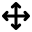</picture><br>Move</p> | <p><picture><source srcset="../../.gitbook/assets/icon-mug-16@dark.svg" media="(prefers-color-scheme: dark)"></picture><br>Mug</p> | <p><picture><source srcset="../../.gitbook/assets/icon-mug-steam-16@dark.svg" media="(prefers-color-scheme: dark)"></picture><br>MugSteam</p> |
| <p><picture><source srcset="../../.gitbook/assets/icon-multiply-16@dark.svg" media="(prefers-color-scheme: dark)"></picture><br>Multiply</p> | <p><picture><source srcset="../../.gitbook/assets/icon-music-16@dark.svg" media="(prefers-color-scheme: dark)"></picture><br>Music</p> | <p><picture><source srcset="../../.gitbook/assets/icon-network-16@dark.svg" media="(prefers-color-scheme: dark)"></picture><br>Network</p> |
| <p><picture><source srcset="../../.gitbook/assets/icon-new-document-16@dark.svg" media="(prefers-color-scheme: dark)"></picture><br>NewDocument</p> | <p><picture><source srcset="../../.gitbook/assets/icon-new-folder-16@dark.svg" media="(prefers-color-scheme: dark)"></picture><br>NewFolder</p> | <p><picture><source srcset="../../.gitbook/assets/icon-paperclip-16@dark.svg" media="(prefers-color-scheme: dark)"></picture><br>Paperclip</p> |
| <p><picture><source srcset="../../.gitbook/assets/icon-paragraph-16@dark.svg" media="(prefers-color-scheme: dark)"></picture><br>Paragraph</p> | <p><picture><source srcset="../../.gitbook/assets/icon-patch-16@dark.svg" media="(prefers-color-scheme: dark)"></picture><br>Patch</p> | <p><picture><source srcset="../../.gitbook/assets/icon-pause-16@dark.svg" media="(prefers-color-scheme: dark)"></picture><br>Pause</p> |
| <p><picture><source srcset="../../.gitbook/assets/icon-pause-filled-16@dark.svg" media="(prefers-color-scheme: dark)"></picture><br>PauseFilled</p> | <p><picture><source srcset="../../.gitbook/assets/icon-pencil-16@dark.svg" media="(prefers-color-scheme: dark)"></picture><br>Pencil</p> | <p><picture><source srcset="../../.gitbook/assets/icon-person-16@dark.svg" media="(prefers-color-scheme: dark)"></picture><br>Person</p> |
| <p><picture><source srcset="../../.gitbook/assets/icon-person-circle-16@dark.svg" media="(prefers-color-scheme: dark)"></picture><br>PersonCircle</p> | <p><picture><source srcset="../../.gitbook/assets/icon-person-lines-16@dark.svg" media="(prefers-color-scheme: dark)"></picture><br>PersonLines</p> | <p><picture><source srcset="../../.gitbook/assets/icon-phone-16@dark.svg" media="(prefers-color-scheme: dark)"></picture><br>Phone</p> |
| <p><picture><source srcset="../../.gitbook/assets/icon-phone-ringing-16@dark.svg" media="(prefers-color-scheme: dark)"></picture><br>PhoneRinging</p> | <p><picture><source srcset="../../.gitbook/assets/icon-pie-chart-16@dark.svg" media="(prefers-color-scheme: dark)">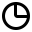</picture><br>PieChart</p> | <p><picture><source srcset="../../.gitbook/assets/icon-pill-16@dark.svg" media="(prefers-color-scheme: dark)"></picture><br>Pill</p> |
| <p><picture><source srcset="../../.gitbook/assets/icon-pin-16@dark.svg" media="(prefers-color-scheme: dark)"></picture><br>Pin</p> | <p><picture><source srcset="../../.gitbook/assets/icon-pin-disabled-16@dark.svg" media="(prefers-color-scheme: dark)">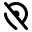</picture><br>PinDisabled</p> | <p><picture><source srcset="../../.gitbook/assets/icon-play-16@dark.svg" media="(prefers-color-scheme: dark)"></picture><br>Play</p> |
| <p><picture><source srcset="../../.gitbook/assets/icon-play-filled-16@dark.svg" media="(prefers-color-scheme: dark)"></picture><br>PlayFilled</p> | <p><picture><source srcset="../../.gitbook/assets/icon-plug-16@dark.svg" media="(prefers-color-scheme: dark)"></picture><br>Plug</p> | <p><picture><source srcset="../../.gitbook/assets/icon-plus-16@dark.svg" media="(prefers-color-scheme: dark)">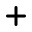</picture><br>Plus</p> |
| <p><picture><source srcset="../../.gitbook/assets/icon-plus-circle-16@dark.svg" media="(prefers-color-scheme: dark)"></picture><br>PlusCircle</p> | <p><picture><source srcset="../../.gitbook/assets/icon-plus-circle-filled-16@dark.svg" media="(prefers-color-scheme: dark)"></picture><br>PlusCircleFilled</p> | <p><picture><source srcset="../../.gitbook/assets/icon-plus-minus-divide-multiply-16@dark.svg" media="(prefers-color-scheme: dark)">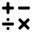</picture><br>PlusMinusDivideMultiply</p> |
| <p><picture><source srcset="../../.gitbook/assets/icon-plus-square-16@dark.svg" media="(prefers-color-scheme: dark)"></picture><br>PlusSquare</p> | <p><picture><source srcset="../../.gitbook/assets/icon-plus-top-right-square-16@dark.svg" media="(prefers-color-scheme: dark)"></picture><br>PlusTopRightSquare</p> | <p><picture><source srcset="../../.gitbook/assets/icon-power-16@dark.svg" media="(prefers-color-scheme: dark)"></picture><br>Power</p> |
| <p><picture><source srcset="../../.gitbook/assets/icon-print-16@dark.svg" media="(prefers-color-scheme: dark)"></picture><br>Print</p> | <p><picture><source srcset="../../.gitbook/assets/icon-question-mark-circle-16@dark.svg" media="(prefers-color-scheme: dark)"></picture><br>QuestionMark</p> | <p><picture><source srcset="../../.gitbook/assets/icon-question-mark-circle-16@dark.svg" media="(prefers-color-scheme: dark)"></picture><br>QuestionMarkCircle</p> |
| <p><picture><source srcset="../../.gitbook/assets/icon-quicklink-16@dark.svg" media="(prefers-color-scheme: dark)"></picture><br>Quicklink</p> | <p><picture><source srcset="../../.gitbook/assets/icon-quotation-marks-16@dark.svg" media="(prefers-color-scheme: dark)"></picture><br>QuotationMarks</p> | <p><picture><source srcset="../../.gitbook/assets/icon-quote-block-16@dark.svg" media="(prefers-color-scheme: dark)"></picture><br>QuoteBlock</p> |
| <p><picture><source srcset="../../.gitbook/assets/icon-racket-16@dark.svg" media="(prefers-color-scheme: dark)"></picture><br>Racket</p> | <p><picture><source srcset="../../.gitbook/assets/icon-raindrop-16@dark.svg" media="(prefers-color-scheme: dark)">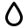</picture><br>Raindrop</p> | <p><picture><source srcset="../../.gitbook/assets/icon-raycast-logo-neg-16@dark.svg" media="(prefers-color-scheme: dark)"></picture><br>RaycastLogoNeg</p> |
| <p><picture><source srcset="../../.gitbook/assets/icon-raycast-logo-pos-16@dark.svg" media="(prefers-color-scheme: dark)"></picture><br>RaycastLogoPos</p> | <p><picture><source srcset="../../.gitbook/assets/icon-receipt-16@dark.svg" media="(prefers-color-scheme: dark)"></picture><br>Receipt</p> | <p><picture><source srcset="../../.gitbook/assets/icon-redo-16@dark.svg" media="(prefers-color-scheme: dark)">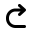</picture><br>Redo</p> |
| <p><picture><source srcset="../../.gitbook/assets/icon-remove-person-16@dark.svg" media="(prefers-color-scheme: dark)"></picture><br>RemovePerson</p> | <p><picture><source srcset="../../.gitbook/assets/icon-repeat-16@dark.svg" media="(prefers-color-scheme: dark)">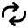</picture><br>Repeat</p> | <p><picture><source srcset="../../.gitbook/assets/icon-replace-16@dark.svg" media="(prefers-color-scheme: dark)"></picture><br>Replace</p> |
| <p><picture><source srcset="../../.gitbook/assets/icon-replace-one-16@dark.svg" media="(prefers-color-scheme: dark)"></picture><br>ReplaceOne</p> | <p><picture><source srcset="../../.gitbook/assets/icon-reply-16@dark.svg" media="(prefers-color-scheme: dark)"></picture><br>Reply</p> | <p><picture><source srcset="../../.gitbook/assets/icon-rewind-16@dark.svg" media="(prefers-color-scheme: dark)"></picture><br>Rewind</p> |
| <p><picture><source srcset="../../.gitbook/assets/icon-rewind-filled-16@dark.svg" media="(prefers-color-scheme: dark)"></picture><br>RewindFilled</p> | <p><picture><source srcset="../../.gitbook/assets/icon-rocket-16@dark.svg" media="(prefers-color-scheme: dark)"></picture><br>Rocket</p> | <p><picture><source srcset="../../.gitbook/assets/icon-rosette-16@dark.svg" media="(prefers-color-scheme: dark)">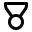</picture><br>Rosette</p> |
| <p><picture><source srcset="../../.gitbook/assets/icon-rotate-anti-clockwise-16@dark.svg" media="(prefers-color-scheme: dark)"></picture><br>RotateAntiClockwise</p> | <p><picture><source srcset="../../.gitbook/assets/icon-rotate-clockwise-16@dark.svg" media="(prefers-color-scheme: dark)"></picture><br>RotateClockwise</p> | <p><picture><source srcset="../../.gitbook/assets/icon-rss-16@dark.svg" media="(prefers-color-scheme: dark)"></picture><br>Rss</p> |
| <p><picture><source srcset="../../.gitbook/assets/icon-ruler-16@dark.svg" media="(prefers-color-scheme: dark)"></picture><br>Ruler</p> | <p><picture><source srcset="../../.gitbook/assets/icon-save-document-16@dark.svg" media="(prefers-color-scheme: dark)"></picture><br>SaveDocument</p> | <p><picture><source srcset="../../.gitbook/assets/icon-shield-01-16@dark.svg" media="(prefers-color-scheme: dark)"></picture><br>Shield</p> |
| <p><picture><source srcset="../../.gitbook/assets/icon-short-paragraph-16@dark.svg" media="(prefers-color-scheme: dark)"></picture><br>ShortParagraph</p> | <p><picture><source srcset="../../.gitbook/assets/icon-shuffle-16@dark.svg" media="(prefers-color-scheme: dark)"></picture><br>Shuffle</p> | <p><picture><source srcset="../../.gitbook/assets/icon-app-window-sidebar-right-16@dark.svg" media="(prefers-color-scheme: dark)"></picture><br>Sidebar</p> |
| <p><picture><source srcset="../../.gitbook/assets/icon-signal-0-16@dark.svg" media="(prefers-color-scheme: dark)"></picture><br>Signal0</p> | <p><picture><source srcset="../../.gitbook/assets/icon-signal-1-16@dark.svg" media="(prefers-color-scheme: dark)"></picture><br>Signal1</p> | <p><picture><source srcset="../../.gitbook/assets/icon-signal-2-16@dark.svg" media="(prefers-color-scheme: dark)"></picture><br>Signal2</p> |
| <p><picture><source srcset="../../.gitbook/assets/icon-signal-3-16@dark.svg" media="(prefers-color-scheme: dark)"></picture><br>Signal3</p> | <p><picture><source srcset="../../.gitbook/assets/icon-snippets-16@dark.svg" media="(prefers-color-scheme: dark)"></picture><br>Snippets</p> | <p><picture><source srcset="../../.gitbook/assets/icon-snowflake-16@dark.svg" media="(prefers-color-scheme: dark)"></picture><br>Snowflake</p> |
| <p><picture><source srcset="../../.gitbook/assets/icon-soccer-ball-16@dark.svg" media="(prefers-color-scheme: dark)"></picture><br>SoccerBall</p> | <p><picture><source srcset="../../.gitbook/assets/icon-speaker-16@dark.svg" media="(prefers-color-scheme: dark)"></picture><br>Speaker</p> | <p><picture><source srcset="../../.gitbook/assets/icon-speaker-down-16@dark.svg" media="(prefers-color-scheme: dark)"></picture><br>SpeakerDown</p> |
| <p><picture><source srcset="../../.gitbook/assets/icon-speaker-high-16@dark.svg" media="(prefers-color-scheme: dark)"></picture><br>SpeakerHigh</p> | <p><picture><source srcset="../../.gitbook/assets/icon-speaker-low-16@dark.svg" media="(prefers-color-scheme: dark)"></picture><br>SpeakerLow</p> | <p><picture><source srcset="../../.gitbook/assets/icon-speaker-off-16@dark.svg" media="(prefers-color-scheme: dark)"></picture><br>SpeakerOff</p> |
| <p><picture><source srcset="../../.gitbook/assets/icon-speaker-on-16@dark.svg" media="(prefers-color-scheme: dark)"></picture><br>SpeakerOn</p> | <p><picture><source srcset="../../.gitbook/assets/icon-speaker-up-16@dark.svg" media="(prefers-color-scheme: dark)"></picture><br>SpeakerUp</p> | <p><picture><source srcset="../../.gitbook/assets/icon-speech-bubble-16@dark.svg" media="(prefers-color-scheme: dark)"></picture><br>SpeechBubble</p> |
| <p><picture><source srcset="../../.gitbook/assets/icon-speech-bubble-active-16@dark.svg" media="(prefers-color-scheme: dark)"></picture><br>SpeechBubbleActive</p> | <p><picture><source srcset="../../.gitbook/assets/icon-speech-bubble-important-16@dark.svg" media="(prefers-color-scheme: dark)"></picture><br>SpeechBubbleImportant</p> | <p><picture><source srcset="../../.gitbook/assets/icon-square-ellipsis-16@dark.svg" media="(prefers-color-scheme: dark)"></picture><br>SquareEllipsis</p> |
| <p><picture><source srcset="../../.gitbook/assets/icon-stacked-bars-1-16@dark.svg" media="(prefers-color-scheme: dark)"></picture><br>StackedBars1</p> | <p><picture><source srcset="../../.gitbook/assets/icon-stacked-bars-2-16@dark.svg" media="(prefers-color-scheme: dark)"></picture><br>StackedBars2</p> | <p><picture><source srcset="../../.gitbook/assets/icon-stacked-bars-3-16@dark.svg" media="(prefers-color-scheme: dark)"></picture><br>StackedBars3</p> |
| <p><picture><source srcset="../../.gitbook/assets/icon-stacked-bars-4-16@dark.svg" media="(prefers-color-scheme: dark)"></picture><br>StackedBars4</p> | <p><picture><source srcset="../../.gitbook/assets/icon-star-16@dark.svg" media="(prefers-color-scheme: dark)"></picture><br>Star</p> | <p><picture><source srcset="../../.gitbook/assets/icon-star-circle-16@dark.svg" media="(prefers-color-scheme: dark)"></picture><br>StarCircle</p> |
| <p><picture><source srcset="../../.gitbook/assets/icon-star-disabled-16@dark.svg" media="(prefers-color-scheme: dark)"></picture><br>StarDisabled</p> | <p><picture><source srcset="../../.gitbook/assets/icon-stars-16@dark.svg" media="(prefers-color-scheme: dark)"></picture><br>Stars</p> | <p><picture><source srcset="../../.gitbook/assets/icon-stop-16@dark.svg" media="(prefers-color-scheme: dark)"></picture><br>Stop</p> |
| <p><picture><source srcset="../../.gitbook/assets/icon-stop-filled-16@dark.svg" media="(prefers-color-scheme: dark)"></picture><br>StopFilled</p> | <p><picture><source srcset="../../.gitbook/assets/icon-stopwatch-16@dark.svg" media="(prefers-color-scheme: dark)"></picture><br>Stopwatch</p> | <p><picture><source srcset="../../.gitbook/assets/icon-store-16@dark.svg" media="(prefers-color-scheme: dark)"></picture><br>Store</p> |
| <p><picture><source srcset="../../.gitbook/assets/icon-strike-through-16@dark.svg" media="(prefers-color-scheme: dark)"></picture><br>StrikeThrough</p> | <p><picture><source srcset="../../.gitbook/assets/icon-sun-16@dark.svg" media="(prefers-color-scheme: dark)"></picture><br>Sun</p> | <p><picture><source srcset="../../.gitbook/assets/icon-sunrise-16@dark.svg" media="(prefers-color-scheme: dark)"></picture><br>Sunrise</p> |
| <p><picture><source srcset="../../.gitbook/assets/icon-swatch-16@dark.svg" media="(prefers-color-scheme: dark)"></picture><br>Swatch</p> | <p><picture><source srcset="../../.gitbook/assets/icon-switch-16@dark.svg" media="(prefers-color-scheme: dark)">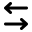</picture><br>Switch</p> | <p><picture><source srcset="../../.gitbook/assets/icon-syringe-16@dark.svg" media="(prefers-color-scheme: dark)"></picture><br>Syringe</p> |
| <p><picture><source srcset="../../.gitbook/assets/icon-tack-16@dark.svg" media="(prefers-color-scheme: dark)"></picture><br>Tack</p> | <p><picture><source srcset="../../.gitbook/assets/icon-tack-disabled-16@dark.svg" media="(prefers-color-scheme: dark)"></picture><br>TackDisabled</p> | <p><picture><source srcset="../../.gitbook/assets/icon-tag-16@dark.svg" media="(prefers-color-scheme: dark)"></picture><br>Tag</p> |
| <p><picture><source srcset="../../.gitbook/assets/icon-temperature-16@dark.svg" media="(prefers-color-scheme: dark)"></picture><br>Temperature</p> | <p><picture><source srcset="../../.gitbook/assets/icon-tennis-ball-16@dark.svg" media="(prefers-color-scheme: dark)"></picture><br>TennisBall</p> | <p><picture><source srcset="../../.gitbook/assets/icon-terminal-16@dark.svg" media="(prefers-color-scheme: dark)"></picture><br>Terminal</p> |
| <p><picture><source srcset="../../.gitbook/assets/icon-text-16@dark.svg" media="(prefers-color-scheme: dark)"></picture><br>Text</p> | <p><picture><source srcset="../../.gitbook/assets/icon-text-cursor-16@dark.svg" media="(prefers-color-scheme: dark)">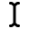</picture><br>TextCursor</p> | <p><picture><source srcset="../../.gitbook/assets/icon-text-input-16@dark.svg" media="(prefers-color-scheme: dark)"></picture><br>TextInput</p> |
| <p><picture><source srcset="../../.gitbook/assets/icon-text-selection-16@dark.svg" media="(prefers-color-scheme: dark)">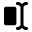</picture><br>TextSelection</p> | <p><picture><source srcset="../../.gitbook/assets/icon-thumbs-down-16@dark.svg" media="(prefers-color-scheme: dark)"></picture><br>ThumbsDown</p> | <p><picture><source srcset="../../.gitbook/assets/icon-thumbs-down-filled-16@dark.svg" media="(prefers-color-scheme: dark)"></picture><br>ThumbsDownFilled</p> |
| <p><picture><source srcset="../../.gitbook/assets/icon-thumbs-up-16@dark.svg" media="(prefers-color-scheme: dark)"></picture><br>ThumbsUp</p> | <p><picture><source srcset="../../.gitbook/assets/icon-thumbs-up-filled-16@dark.svg" media="(prefers-color-scheme: dark)"></picture><br>ThumbsUpFilled</p> | <p><picture><source srcset="../../.gitbook/assets/icon-ticket-16@dark.svg" media="(prefers-color-scheme: dark)"></picture><br>Ticket</p> |
| <p><picture><source srcset="../../.gitbook/assets/icon-torch-16@dark.svg" media="(prefers-color-scheme: dark)"></picture><br>Torch</p> | <p><picture><source srcset="../../.gitbook/assets/icon-train-16@dark.svg" media="(prefers-color-scheme: dark)"></picture><br>Train</p> | <p><picture><source srcset="../../.gitbook/assets/icon-trash-16@dark.svg" media="(prefers-color-scheme: dark)"></picture><br>Trash</p> |
| <p><picture><source srcset="../../.gitbook/assets/icon-tray-16@dark.svg" media="(prefers-color-scheme: dark)"></picture><br>Tray</p> | <p><picture><source srcset="../../.gitbook/assets/icon-tree-16@dark.svg" media="(prefers-color-scheme: dark)">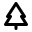</picture><br>Tree</p> | <p><picture><source srcset="../../.gitbook/assets/icon-trophy-16@dark.svg" media="(prefers-color-scheme: dark)"></picture><br>Trophy</p> |
| <p><picture><source srcset="../../.gitbook/assets/icon-two-people-16@dark.svg" media="(prefers-color-scheme: dark)"></picture><br>TwoPeople</p> | <p><picture><source srcset="../../.gitbook/assets/icon-umbrella-16@dark.svg" media="(prefers-color-scheme: dark)">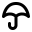</picture><br>Umbrella</p> | <p><picture><source srcset="../../.gitbook/assets/icon-underline-16@dark.svg" media="(prefers-color-scheme: dark)">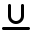</picture><br>Underline</p> |
| <p><picture><source srcset="../../.gitbook/assets/icon-undo-16@dark.svg" media="(prefers-color-scheme: dark)">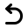</picture><br>Undo</p> | <p><picture><source srcset="../../.gitbook/assets/icon-upload-16@dark.svg" media="(prefers-color-scheme: dark)"></picture><br>Upload</p> | <p><picture><source srcset="../../.gitbook/assets/icon-uppercase-16@dark.svg" media="(prefers-color-scheme: dark)"></picture><br>Uppercase</p> |
| <p><picture><source srcset="../../.gitbook/assets/icon-video-16@dark.svg" media="(prefers-color-scheme: dark)"></picture><br>Video</p> | <p><picture><source srcset="../../.gitbook/assets/icon-video-disabled-16@dark.svg" media="(prefers-color-scheme: dark)"></picture><br>VideoDisabled</p> | <p><picture><source srcset="../../.gitbook/assets/icon-wallet-16@dark.svg" media="(prefers-color-scheme: dark)"></picture><br>Wallet</p> |
| <p><picture><source srcset="../../.gitbook/assets/icon-wand-16@dark.svg" media="(prefers-color-scheme: dark)"></picture><br>Wand</p> | <p><picture><source srcset="../../.gitbook/assets/icon-warning-16@dark.svg" media="(prefers-color-scheme: dark)"></picture><br>Warning</p> | <p><picture><source srcset="../../.gitbook/assets/icon-waveform-16@dark.svg" media="(prefers-color-scheme: dark)"></picture><br>Waveform</p> |
| <p><picture><source srcset="../../.gitbook/assets/icon-weights-16@dark.svg" media="(prefers-color-scheme: dark)">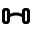</picture><br>Weights</p> | <p><picture><source srcset="../../.gitbook/assets/icon-wifi-16@dark.svg" media="(prefers-color-scheme: dark)"></picture><br>Wifi</p> | <p><picture><source srcset="../../.gitbook/assets/icon-wifi-disabled-16@dark.svg" media="(prefers-color-scheme: dark)"></picture><br>WifiDisabled</p> |
| <p><picture><source srcset="../../.gitbook/assets/icon-wind-16@dark.svg" media="(prefers-color-scheme: dark)"></picture><br>Wind</p> | <p><picture><source srcset="../../.gitbook/assets/icon-app-window-16@dark.svg" media="(prefers-color-scheme: dark)"></picture><br>Window</p> | <p><picture><source srcset="../../.gitbook/assets/icon-windsock-16@dark.svg" media="(prefers-color-scheme: dark)"></picture><br>Windsock</p> |
| <p><picture><source srcset="../../.gitbook/assets/icon-wrench-screwdriver-16@dark.svg" media="(prefers-color-scheme: dark)"></picture><br>WrenchScrewdriver</p> | <p><picture><source srcset="../../.gitbook/assets/icon-wrist-watch-16@dark.svg" media="(prefers-color-scheme: dark)"></picture><br>WristWatch</p> | <p><picture><source srcset="../../.gitbook/assets/icon-x-mark-circle-16@dark.svg" media="(prefers-color-scheme: dark)"></picture><br>XMarkCircle</p> |
| <p><picture><source srcset="../../.gitbook/assets/icon-x-mark-circle-filled-16@dark.svg" media="(prefers-color-scheme: dark)"></picture><br>XMarkCircleFilled</p> | <p><picture><source srcset="../../.gitbook/assets/icon-x-mark-circle-half-dash-16@dark.svg" media="(prefers-color-scheme: dark)"></picture><br>XMarkCircleHalfDash</p> | <p><picture><source srcset="../../.gitbook/assets/icon-x-mark-top-right-square-16@dark.svg" media="(prefers-color-scheme: dark)"></picture><br>XMarkTopRightSquare</p> |
| <p><picture><source srcset="../../.gitbook/assets/icon-xmark-16@dark.svg" media="(prefers-color-scheme: dark)"></picture><br>Xmark</p> |

### Image.Mask

Available masks that can be used to change the shape of an image.

Can be handy to shape avatars or other items in a list.

#### Example

```typescript
import { Image, List } from "@raycast/api";

export default function Command() {
  return (
    <List>
      <List.Item
        title="Icon"
        icon={{
          source: "https://raycast.com/uploads/avatar.png",
          mask: Image.Mask.Circle,
        }}
      />
    </List>
  );
}
```

#### Enumeration members

| Name             | Value              |
| :--------------- | :----------------- |
| Circle           | "circle"           |
| RoundedRectangle | "roundedRectangle" |

## Types

### Image

Display different types of images, including network images or bundled assets.

Apply image transforms to the source, such as a `mask` or a `tintColor`.


Tip: Suffix your local assets with `@dark` to automatically provide a dark theme option, eg: `icon.png` and `icon@dark.png`.


#### Example

```typescript
// Built-in icon
const icon = Icon.Eye;

// Built-in icon with tint color
const tintedIcon = { source: Icon.Bubble, tintColor: Color.Red };

// Bundled asset with circular mask
const avatar = { source: "avatar.png", mask: Image.Mask.Circle };

// Implicit theme-aware icon
// with 'icon.png' and 'icon@dark.png' in the `assets` folder
const icon = "icon.png";

// Explicit theme-aware icon
const icon = { source: { light: "https://example.com/icon-light.png", dark: "https://example.com/icon-dark.png" } };
```

#### Properties

<InterfaceTableFromJSDoc name="Image" />

### FileIcon

An icon as it's used in the Finder.

#### Example

```typescript
import { List } from "@raycast/api";

export default function Command() {
  return (
    <List>
      <List.Item title="File icon" icon={{ fileIcon: __filename }} />
    </List>
  );
}
```

#### Properties

<InterfaceTableFromJSDoc name="FileIcon" />

### Image.ImageLike

```typescript
ImageLike: URL | Asset | Icon | FileIcon | Image;
```

Union type for the supported image types.

#### Example

```typescript
import { Icon, Image, List } from "@raycast/api";

export default function Command() {
  return (
    <List>
      <List.Item title="URL" icon="https://raycast.com/uploads/avatar.png" />
      <List.Item title="Asset" icon="avatar.png" />
      <List.Item title="Icon" icon={Icon.Circle} />
      <List.Item title="FileIcon" icon={{ fileIcon: __filename }} />
      <List.Item
        title="Image"
        icon={{
          source: "https://raycast.com/uploads/avatar.png",
          mask: Image.Mask.Circle,
        }}
      />
    </List>
  );
}
```

### Image.Source

```typescript
Image.Source: URL | Asset | Icon | { light: URL | Asset; dark: URL | Asset }
```

The source of an [Image](#image). Can be either a remote URL, a local file resource, a built-in [Icon](#icon) or
a single emoji.

For consistency, it's best to use the built-in [Icon](#icon) in lists, the Action Panel, and other places. If a
specific icon isn't built-in, you can reference custom ones from the `assets` folder of the extension by file name,
e.g. `my-icon.png`. Alternatively, you can reference an absolute HTTPS URL that points to an image or use an emoji.
You can also specify different remote or local assets for light and dark theme.

#### Example

```typescript
import { Icon, List } from "@raycast/api";

export default function Command() {
  return (
    <List>
      <List.Item title="URL" icon={{ source: "https://raycast.com/uploads/avatar.png" }} />
      <List.Item title="Asset" icon={{ source: "avatar.png" }} />
      <List.Item title="Icon" icon={{ source: Icon.Circle }} />
      <List.Item
        title="Theme"
        icon={{
          source: {
            light: "https://raycast.com/uploads/avatar.png",
            dark: "https://raycast.com/uploads/avatar.png",
          },
        }}
      />
    </List>
  );
}
```

### Image.Fallback

```typescript
Image.Fallback: Asset | Icon | { light: Asset; dark: Asset }
```

A fallback [Image](#image) that will be displayed in case the source image cannot be loaded. Can be either a local file resource, a built-in [Icon](#icon), a single emoji, or a theme-aware asset. Any specified `mask` or `tintColor` will also apply to the fallback image.

#### Example

```typescript
import { List } from "@raycast/api";

export default function Command() {
  return (
    <List>
      <List.Item
        title="URL Source With Asset Fallback"
        icon={{
          source: "https://raycast.com/uploads/avatar.png",
          fallback: "default-avatar.png",
        }}
      />
    </List>
  );
}
```

### Image.URL

Image is a string representing a URL.

#### Example

```typescript
import { List } from "@raycast/api";

export default function Command() {
  return (
    <List>
      <List.Item title="URL" icon={{ source: "https://raycast.com/uploads/avatar.png" }} />
    </List>
  );
}
```

### Image.Asset

Image is a string representing an asset from the `assets/` folder

#### Example

```typescript
import { List } from "@raycast/api";

export default function Command() {
  return (
    <List>
      <List.Item title="Asset" icon={{ source: "avatar.png" }} />
    </List>
  );
}
```
