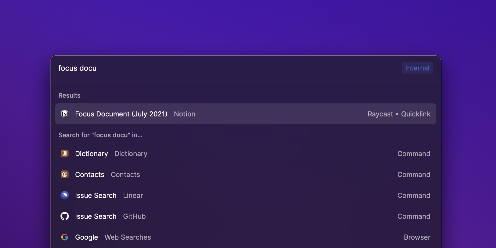

# List

2 Lorem ipsum dolor sit amet, consectetur adipiscing elit, sed do eiusmod tempor incididunt ut labore et dolore magna aliqua. Luctus accumsan tortor posuere ac ut consequat. Quam id leo in vitae turpis massa sed elementum tempus. Quisque id diam vel quam. Congue quisque egestas diam in arcu cursus euismod quis viverra. Pellentesque diam volutpat commodo sed egestas egestas fringilla phasellus faucibus. Iaculis nunc sed augue lacus viverra vitae congue eu consequat. Tristique et egestas quis ipsum suspendisse ultrices gravida dictum. Nunc vel risus commodo viverra maecenas accumsan. Nunc faucibus a pellentesque sit amet.



## Features

Our `List` component provides great user experience out of the box:

* Use built-in filtering for best performance.
* Group related items in sections with titles and subtitles.
* Show loading indicator for longer operations.
* Use the search query for typeahead experiences.

## Examples



```jsx
import { List, render } from "@raycast/api"

function MyList() {
    return (
        <List>
            <List.Item title="Item 1" />
            <List.Item title="Item 2" subtitle="Optional subtitle" />
        </List>
    )
}

render(<MyList />)
```



```jsx
import { List, render } from "@raycast/api"

function MyList() {
    return (
        <List>
            <List.Section title="Section 1">
                <List.Item title="Item 1" />
            </List.Section>
            <List.Section title="Section 2" subtitle="Optional subtitle">
                <List.Item title="Item 1" />
            </List.Section>
        </List>
    )
}

render(<MyList />)
```



```jsx
import { ActionPanel, CopyToClipboardAction, List, render } from "@raycast/api"

function MyList() {
    return (
        <List>
            <List.Item title="Item 1">
                <ActionPanel>
                    <CopyToClipboardAction content="👋" />
                </ActionPanel>
            </List.Item>
        </List>
    )
}

render(<MyList />)
```



## API Reference

### List

Shows sections and items with built-in or custom filtering through an optional search bar.

| Prop | Type | Required | Default | Description |
| :--- | :--- | :--- | :--- | :--- |
| actions | `null` or `ActionPanel` | No | - | A reference to an [ActionPanel](../user-interface/action-panel.md#actionpanel). |
| children | `null` or `List.Section` or `List.Section[]` or `List.Item` or `List.Item[]` | No | - | List sections or items. If [ListItem](../user-interface/list.md#listitem) elements are specified, a default section is automatically created. |
| isLoading | `boolean` | No | - | Indicates whether a loading bar should be shown or hidden below the search bar |
| navigationTitle | `string` | No | - | The main title for that view displayed in Raycast |
| searchBarPlaceholder | `string` | No | - | Placeholder text that will be shown in the search bar. |
| selectedItemId | `string` | No | - | Selects the item with the specified id. |
| throttle | `boolean` | No | false | Defines whether the [ListProps.onSearchTextChange](../user-interface/list.md#listprops) will be triggered on every keyboard press or with a delay for throttling the events. Recommended to set to `true` when using custom filtering logic with asynchronous operations (e.g. network requests). |
| onSearchTextChange | <code>(text: string) => void</code> | No | - |  |
| onSelectionChange | <code>(id: string) => void</code> | No | - |  |

### List.Item

Represents an item within a list section.

#### Example

```typescript
import { Icon, List } from "@raycast/api";

export default function Command() {
  return (
    <List>
      <List.Item icon={Icon.Star} title="Augustiner Helles" subtitle="0,5 Liter" accessoryTitle="Germany" />
    </List>
  );
}
```

| Prop | Type | Required | Default | Description |
| :--- | :--- | :--- | :--- | :--- |
| accessoryIcon | `ImageLike` | No | - | A optional icon displayed as accessory for the list item. See [ImageLike](../user-interface/icons-and-images.md#imagelike) for the supported formats and types. |
| accessoryTitle | `string` | No | - | An additional icon displayed for the item. See [ImageLike](../user-interface/icons-and-images.md#imagelike) for the supported formats and types. |
| actions | `null` or `ActionPanel` | No | - | An [ActionPanel](../user-interface/action-panel.md#actionpanel) that will be updated for the selected list item. |
| children | `null` or `ActionPanel` | No | - |  |
| icon | `ImageLike` | No | - | A optional icon displayed for the list item. See [ImageLike](../user-interface/icons-and-images.md#imagelike) for the supported formats and types. |
| id | `string` | No | - | ID of the item. Make sure to assign each item a unique ID or a UUID will be auto generated. |
| keywords | `string[]` | No | - | An optional property used for providing additional indexable strings for search. When filtering the list in Raycast through the search bar, the keywords will be searched in addition to the title. |
| subtitle | `string` | No | - | An optional subtitle displayed next to the main title. |
| title | `string` | Yes | - | The main title displayed for that item. |

### List.Section

Visually separated group of list items. Use sections to group related list items together.

| Prop | Type | Required | Default | Description |
| :--- | :--- | :--- | :--- | :--- |
| children | `null` or `List.Item` or `List.Item[]` | No | - | The [ListItem](../user-interface/list.md#listitem) elements of the section. |
| id | `string` | No | - | ID of the section. Make sure to assign each section a unique ID or a UUID will be auto generated. |
| subtitle | `string` | No | - | An optional subtitle displayed next to the title of the section. |
| title | `string` | No | - | Title displayed above the section. |
