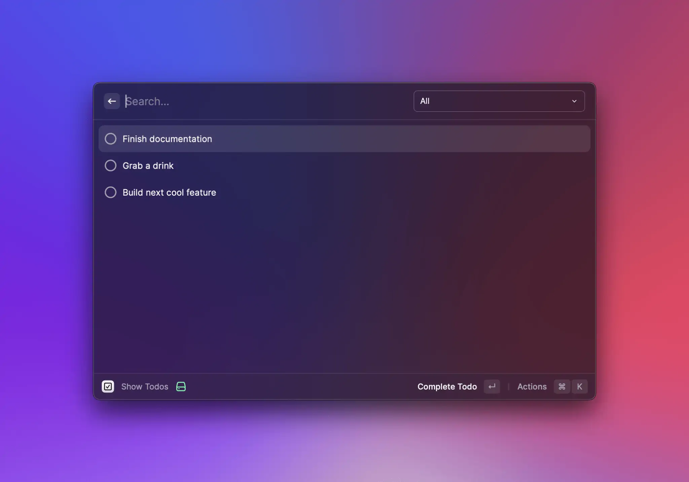
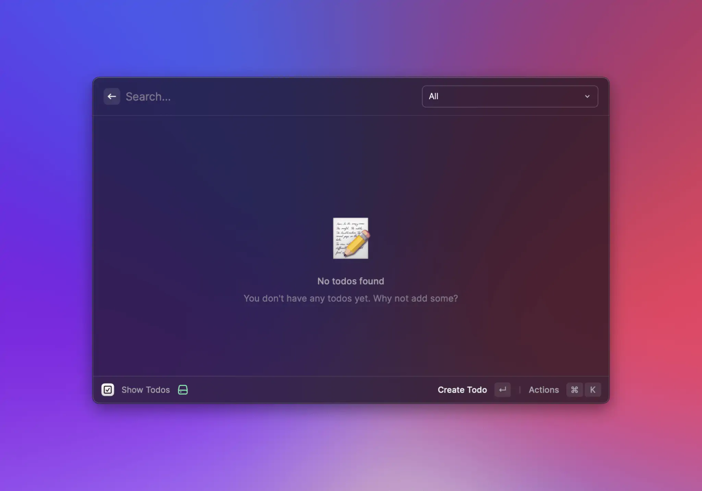
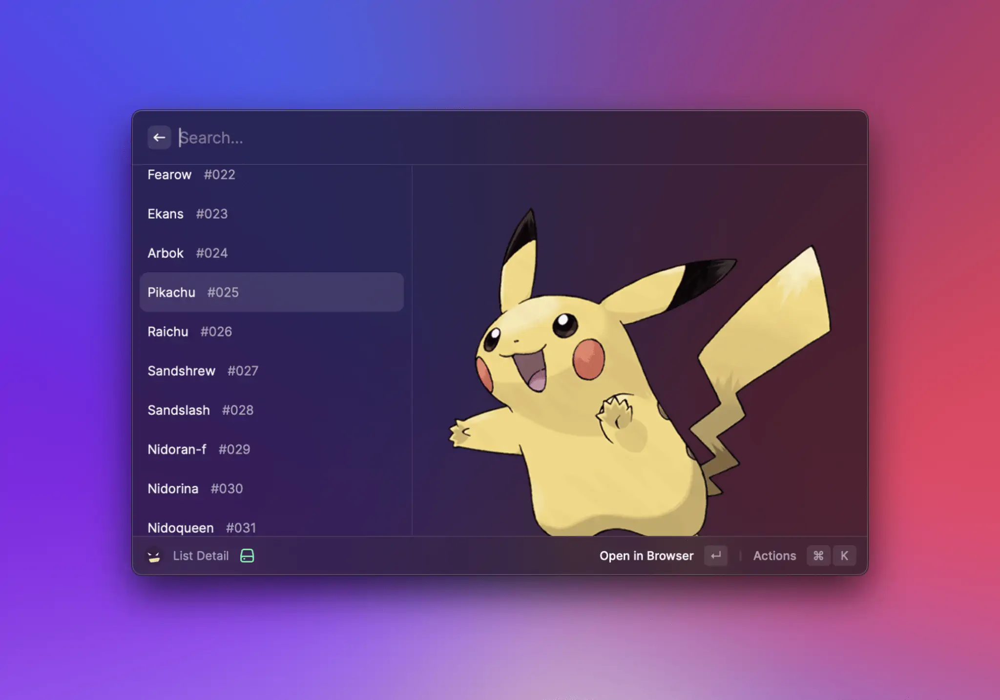
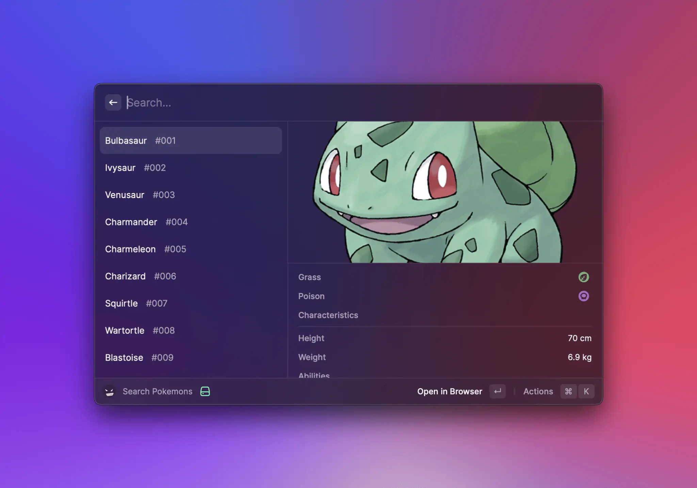
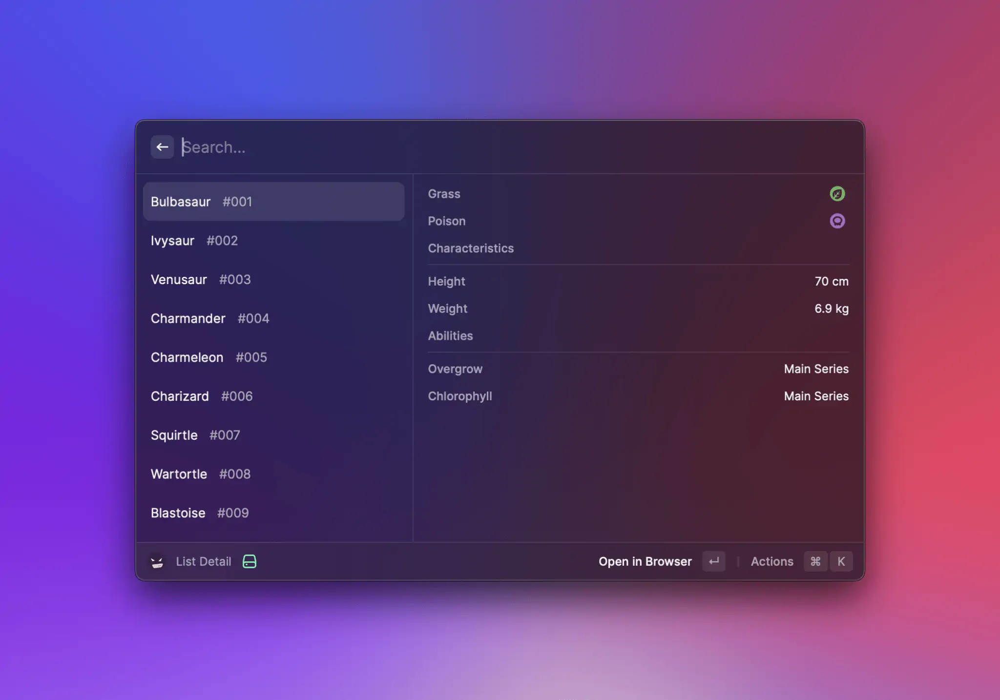
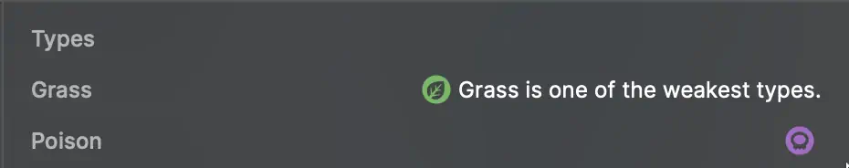
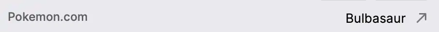
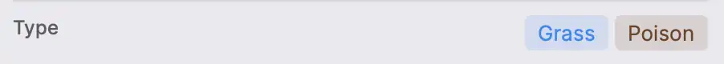
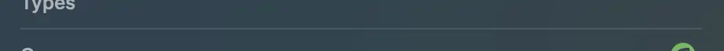

# List

Our `List` component provides great user experience out of the box:

- Use built-in filtering for best performance.
- Group-related items in sections with titles and subtitles.
- Show loading indicator for longer operations.
- Use the search query for typeahead experiences, optionally throttled.



## Search Bar

The search bar allows users to interact quickly with list items. By default, [List.Items](#list.item) are displayed if the user's input can be (fuzzy) matched to the item's `title` or `keywords`.

### Custom filtering

Sometimes, you may not want to rely on Raycast's filtering, but use/implement your own. If that's the case, you can set the `List`'s `filtering` [prop](#props) to false, and the items displayed will be independent of the search bar's text.
Note that `filtering` is also implicitly set to false if an `onSearchTextChange` listener is specified. If you want to specify a change listener and _still_ take advantage of Raycast's built-in filtering, you can explicitly set `filtering` to true.

```typescript
import { useEffect, useState } from "react";
import { Action, ActionPanel, List } from "@raycast/api";

const items = ["Augustiner Helles", "Camden Hells", "Leffe Blonde", "Sierra Nevada IPA"];

export default function Command() {
  const [searchText, setSearchText] = useState("");
  const [filteredList, filterList] = useState(items);

  useEffect(() => {
    filterList(items.filter((item) => item.includes(searchText)));
  }, [searchText]);

  return (
    <List
      filtering={false}
      onSearchTextChange={setSearchText}
      navigationTitle="Search Beers"
      searchBarPlaceholder="Search your favorite beer"
    >
      {filteredList.map((item) => (
        <List.Item
          key={item}
          title={item}
          actions={
            <ActionPanel>
              <Action title="Select" onAction={() => console.log(`${item} selected`)} />
            </ActionPanel>
          }
        />
      ))}
    </List>
  );
}
```

### Programmatically updating the search bar

Other times, you may want the content of the search bar to be updated by the extension, for example, you may store a list of the user's previous searches and, on the next visit, allow them to "continue" where they left off.

To do so, you can use the `searchText` [prop](#props).

```typescript
import { useEffect, useState } from "react";
import { Action, ActionPanel, List } from "@raycast/api";

const items = ["Augustiner Helles", "Camden Hells", "Leffe Blonde", "Sierra Nevada IPA"];

export default function Command() {
  const [searchText, setSearchText] = useState("");

  return (
    <List
      searchText={searchText}
      onSearchTextChange={setSearchText}
      navigationTitle="Search Beers"
      searchBarPlaceholder="Search your favorite beer"
    >
      {items.map((item) => (
        <List.Item
          key={item}
          title={item}
          actions={
            <ActionPanel>
              <Action title="Select" onAction={() => setSearchText(item)} />
            </ActionPanel>
          }
        />
      ))}
    </List>
  );
}
```

### Dropdown

Some extensions may benefit from giving users a second filtering dimension. A todo extension may allow users to use different groups, a newspaper-reading extension may want to allow quickly switching categories, etc.

This is where the `searchBarAccessory` [prop](#props) is useful. Pass it a [List.Dropdown](#list.dropdown) component, and it will be displayed on the right-side of the search bar. Invoke it either by using the global shortcut `⌘` `P` or by clicking on it.

### Pagination


Pagination requires version 1.69.0 or higher of the `@raycast/api` package.


`List`s have built-in support for pagination. To opt in to pagination, you need to pass it a `pagination` prop, which is an object providing 3 pieces of information:

- `onLoadMore` - will be called by Raycast when the user reaches the end of the list, either using the keyboard or the mouse. When it gets called, the extension is expected to perform an async operation which eventually can result in items being appended to the end of the list.
- `hasMore` - indicates to Raycast whether it _should_ call `onLoadMore` when the user reaches the end of the list.
- `pageSize` - indicates how many placeholder items Raycast should add to the end of the list when it calls `onLoadMore`. Once `onLoadMore` finishes executing, the placeholder items will be replaced by the newly-added list items.

Note that extensions have access to a limited amount of memory. As your extension paginates, its memory usage will increase. Paginating extensively could lead to the extension eventually running out of memory and crashing. To protect against the extension crashing due to memory exhaustion, Raycast monitors the extension's memory usage and employs heuristics to determine whether it's safe to paginate further. If it's deemed unsafe to continue paginating, `onLoadMore` will not be triggered when the user scrolls to the bottom, regardless of the `hasMore` value. Additionally, during development, a warning will be printed in the terminal.

For convenience, most of the [hooks](../../utils-reference/getting-started.md) that we provide have built-in pagination support. Here's an example of how to add pagination support to a simple command using [usePromise](../../utils-reference/react-hooks/usePromise.md), and one "from scratch".





```typescript
import { setTimeout } from "node:timers/promises";
import { useState } from "react";
import { List } from "@raycast/api";
import { usePromise } from "@raycast/utils";

export default function Command() {
  const [searchText, setSearchText] = useState("");

  const { isLoading, data, pagination } = usePromise(
    (searchText: string) => async (options: { page: number }) => {
      await setTimeout(200);
      const newData = Array.from({ length: 25 }, (_v, index) => ({
        index,
        page: options.page,
        text: searchText,
      }));
      return { data: newData, hasMore: options.page < 10 };
    },
    [searchText]
  );

  return (
    <List isLoading={isLoading} onSearchTextChange={setSearchText} pagination={pagination}>
      {data?.map((item) => (
        <List.Item
          key={`${item.page} ${item.index} ${item.text}`}
          title={`Page ${item.page} Item ${item.index}`}
          subtitle={item.text}
        />
      ))}
    </List>
  );
}
```




```typescript
import { setTimeout } from "node:timers/promises";
import { useCallback, useEffect, useRef, useState } from "react";
import { List } from "@raycast/api";

type State = {
  searchText: string;
  isLoading: boolean;
  hasMore: boolean;
  data: {
    index: number;
    page: number;
    text: string;
  }[];
  nextPage: number;
};
const pageSize = 20;
export default function Command() {
  const [state, setState] = useState<State>({ searchText: "", isLoading: true, hasMore: true, data: [], nextPage: 0 });
  const cancelRef = useRef<AbortController | null>(null);

  const loadNextPage = useCallback(async (searchText: string, nextPage: number, signal?: AbortSignal) => {
    setState((previous) => ({ ...previous, isLoading: true }));
    await setTimeout(500);
    const newData = Array.from({ length: pageSize }, (_v, index) => ({
      index,
      page: nextPage,
      text: searchText,
    }));
    if (signal?.aborted) {
      return;
    }
    setState((previous) => ({
      ...previous,
      data: [...previous.data, ...newData],
      isLoading: false,
      hasMore: nextPage < 10,
    }));
  }, []);

  const onLoadMore = useCallback(() => {
    setState((previous) => ({ ...previous, nextPage: previous.nextPage + 1 }));
  }, []);

  const onSearchTextChange = useCallback(
    (searchText: string) => {
      if (searchText === state.searchText) return;
      setState((previous) => ({
        ...previous,
        data: [],
        nextPage: 0,
        searchText,
      }));
    },
    [state.searchText]
  );

  useEffect(() => {
    cancelRef.current?.abort();
    cancelRef.current = new AbortController();
    loadNextPage(state.searchText, state.nextPage, cancelRef.current?.signal);
    return () => {
      cancelRef.current?.abort();
    };
  }, [loadNextPage, state.searchText, state.nextPage]);

  return (
    <List
      isLoading={state.isLoading}
      onSearchTextChange={onSearchTextChange}
      pagination={{ onLoadMore, hasMore: state.hasMore, pageSize }}
    >
      {state.data.map((item) => (
        <List.Item
          key={`${item.page} ${item.index} ${item.text}`}
          title={`Page ${item.page} Item ${item.index}`}
          subtitle={item.text}
        />
      ))}
    </List>
  );
}
```





Pagination might not work properly if all list items are rendered and visible at once, as `onLoadMore` won't be triggered. This typically happens when an API returns 10 results by default, all fitting within the Raycast window. To fix this, try displaying more items, like 20.


## Examples




```jsx
import { List } from "@raycast/api";

export default function Command() {
  return (
    <List>
      <List.Item title="Item 1" />
      <List.Item title="Item 2" subtitle="Optional subtitle" />
    </List>
  );
}
```





```jsx
import { List } from "@raycast/api";

export default function Command() {
  return (
    <List>
      <List.Section title="Section 1">
        <List.Item title="Item 1" />
      </List.Section>
      <List.Section title="Section 2" subtitle="Optional subtitle">
        <List.Item title="Item 1" />
      </List.Section>
    </List>
  );
}
```





```jsx
import { ActionPanel, Action, List } from "@raycast/api";

export default function Command() {
  return (
    <List>
      <List.Item
        title="Item 1"
        actions={
          <ActionPanel>
            <Action.CopyToClipboard content="👋" />
          </ActionPanel>
        }
      />
    </List>
  );
}
```





```jsx
import { useState } from "react";
import { Action, ActionPanel, List } from "@raycast/api";
import { useCachedPromise } from "@raycast/utils";

interface Pokemon {
  name: string;
  height: number;
  weight: number;
  id: string;
  types: string[];
  abilities: Array<{ name: string; isMainSeries: boolean }>;
}

const pokemons: Pokemon[] = [
  {
    name: "bulbasaur",
    height: 7,
    weight: 69,
    id: "001",
    types: ["Grass", "Poison"],
    abilities: [
      { name: "Chlorophyll", isMainSeries: true },
      { name: "Overgrow", isMainSeries: true },
    ],
  },
  {
    name: "ivysaur",
    height: 10,
    weight: 130,
    id: "002",
    types: ["Grass", "Poison"],
    abilities: [
      { name: "Chlorophyll", isMainSeries: true },
      { name: "Overgrow", isMainSeries: true },
    ],
  },
];

export default function Command() {
  const [showingDetail, setShowingDetail] = useState(true);
  const { data, isLoading } = useCachedPromise(() => new Promise<Pokemon[]>((resolve) => resolve(pokemons)));

  return (
    <List isLoading={isLoading} isShowingDetail={showingDetail}>
      {data &&
        data.map((pokemon) => {
          const props: Partial<List.Item.Props> = showingDetail
            ? {
                detail: (
                  <List.Item.Detail
                    markdown={`\n\n${pokemon.types.join(" ")}`}
                  />
                ),
              }
            : { accessories: [{ text: pokemon.types.join(" ") }] };
          return (
            <List.Item
              key={pokemon.id}
              title={pokemon.name}
              subtitle={`#${pokemon.id}`}
              {...props}
              actions={
                <ActionPanel>
                  <Action.OpenInBrowser url={`https://www.pokemon.com/us/pokedex/${pokemon.name}`} />
                  <Action title="Toggle Detail" onAction={() => setShowingDetail(!showingDetail)} />
                </ActionPanel>
              }
            />
          );
        })}
    </List>
  );
}

```





```typescript
import { useEffect, useState } from "react";
import { List } from "@raycast/api";

export default function CommandWithCustomEmptyView() {
  const [state, setState] = useState({ searchText: "", items: [] });

  useEffect(() => {
    // perform an API call that eventually populates `items`.
  }, [state.searchText]);

  return (
    <List onSearchTextChange={(newValue) => setState((previous) => ({ ...previous, searchText: newValue }))}>
      {state.searchText === "" && state.items.length === 0 ? (
        <List.EmptyView icon={{ source: "https://placekitten.com/500/500" }} title="Type something to get started" />
      ) : (
        state.items.map((item) => <List.Item key={item} title={item} />)
      )}
    </List>
  );
}
```





## API Reference

### List

Displays [List.Section](#list.section) or [List.Item](#list.item).

The list uses built-in filtering by indexing the title of list items and additionally keywords.

#### Example

```typescript
import { List } from "@raycast/api";

export default function Command() {
  return (
    <List navigationTitle="Search Beers" searchBarPlaceholder="Search your favorite beer">
      <List.Item title="Augustiner Helles" />
      <List.Item title="Camden Hells" />
      <List.Item title="Leffe Blonde" />
      <List.Item title="Sierra Nevada IPA" />
    </List>
  );
}
```

#### Props

<PropsTableFromJSDoc component="List" />

### List.Dropdown

A dropdown menu that will be shown in the right-hand-side of the search bar.

#### Example

```typescript
import { List } from "@raycast/api";

type DrinkType = { id: string; name: string };

function DrinkDropdown(props: { drinkTypes: DrinkType[]; onDrinkTypeChange: (newValue: string) => void }) {
  const { drinkTypes, onDrinkTypeChange } = props;
  return (
    <List.Dropdown
      tooltip="Select Drink Type"
      storeValue={true}
      onChange={(newValue) => {
        onDrinkTypeChange(newValue);
      }}
    >
      <List.Dropdown.Section title="Alcoholic Beverages">
        {drinkTypes.map((drinkType) => (
          <List.Dropdown.Item key={drinkType.id} title={drinkType.name} value={drinkType.id} />
        ))}
      </List.Dropdown.Section>
    </List.Dropdown>
  );
}

export default function Command() {
  const drinkTypes: DrinkType[] = [
    { id: "1", name: "Beer" },
    { id: "2", name: "Wine" },
  ];
  const onDrinkTypeChange = (newValue: string) => {
    console.log(newValue);
  };
  return (
    <List
      navigationTitle="Search Beers"
      searchBarPlaceholder="Search your favorite drink"
      searchBarAccessory={<DrinkDropdown drinkTypes={drinkTypes} onDrinkTypeChange={onDrinkTypeChange} />}
    >
      <List.Item title="Augustiner Helles" />
      <List.Item title="Camden Hells" />
      <List.Item title="Leffe Blonde" />
      <List.Item title="Sierra Nevada IPA" />
    </List>
  );
}
```

#### Props

<PropsTableFromJSDoc component="List.Dropdown" />

### List.Dropdown.Item

A dropdown item in a [List.Dropdown](#list.dropdown)

#### Example

```typescript
import { List } from "@raycast/api";

export default function Command() {
  return (
    <List
      searchBarAccessory={
        <List.Dropdown tooltip="Dropdown With Items">
          <List.Dropdown.Item title="One" value="one" />
          <List.Dropdown.Item title="Two" value="two" />
          <List.Dropdown.Item title="Three" value="three" />
        </List.Dropdown>
      }
    >
      <List.Item title="Item in the Main List" />
    </List>
  );
}
```

#### Props

<PropsTableFromJSDoc component="List.Dropdown.Item" />

### List.Dropdown.Section

Visually separated group of dropdown items.

Use sections to group related menu items together.

#### Example

```typescript
import { List } from "@raycast/api";

export default function Command() {
  return (
    <List
      searchBarAccessory={
        <List.Dropdown tooltip="Dropdown With Sections">
          <List.Dropdown.Section title="First Section">
            <List.Dropdown.Item title="One" value="one" />
          </List.Dropdown.Section>
          <List.Dropdown.Section title="Second Section">
            <List.Dropdown.Item title="Two" value="two" />
          </List.Dropdown.Section>
        </List.Dropdown>
      }
    >
      <List.Item title="Item in the Main List" />
    </List>
  );
}
```

#### Props

<PropsTableFromJSDoc component="List.Dropdown.Section" />

### List.EmptyView

A view to display when there aren't any items available. Use to greet users with a friendly message if the
extension requires user input before it can show any list items e.g. when searching for a package, an article etc.

Raycast provides a default `EmptyView` that will be displayed if the List component either has no children,
or if it has children, but none of them match the query in the search bar. This too can be overridden by passing an
empty view alongside the other `List.Item`s.

Note that the `EmptyView` is _never_ displayed if the `List`'s `isLoading` property is true and the search bar is empty.



#### Example

```typescript
import { useEffect, useState } from "react";
import { List } from "@raycast/api";

export default function CommandWithCustomEmptyView() {
  const [state, setState] = useState({ searchText: "", items: [] });

  useEffect(() => {
    // perform an API call that eventually populates `items`.
  }, [state.searchText]);

  return (
    <List onSearchTextChange={(newValue) => setState((previous) => ({ ...previous, searchText: newValue }))}>
      {state.searchText === "" && state.items.length === 0 ? (
        <List.EmptyView icon={{ source: "https://placekitten.com/500/500" }} title="Type something to get started" />
      ) : (
        state.items.map((item) => <List.Item key={item} title={item} />)
      )}
    </List>
  );
}
```

#### Props

<PropsTableFromJSDoc component="List.EmptyView" />

### List.Item

A item in the [List](#list).

This is one of the foundational UI components of Raycast. A list item represents a single entity. It can be a
GitHub pull request, a file, or anything else. You most likely want to perform actions on this item, so make it clear
to the user what this list item is about.

#### Example

```typescript
import { Icon, List } from "@raycast/api";

export default function Command() {
  return (
    <List>
      <List.Item icon={Icon.Star} title="Augustiner Helles" subtitle="0,5 Liter" accessories={[{ text: "Germany" }]} />
    </List>
  );
}
```

#### Props

<PropsTableFromJSDoc component="List.Item" />

### List.Item.Detail

A Detail view that will be shown in the right-hand-side of the `List`.

When shown, it is recommended not to show any accessories on the `List.Item` and instead bring those additional information in the `List.Item.Detail` view.



#### Example

```typescript
import { List } from "@raycast/api";

export default function Command() {
  return (
    <List isShowingDetail>
      <List.Item
        title="Pikachu"
        subtitle="Electric"
        detail={
          <List.Item.Detail markdown="" />
        }
      />
    </List>
  );
}
```

#### Props

<PropsTableFromJSDoc component="List.Item.Detail" />

### List.Item.Detail.Metadata

A Metadata view that will be shown in the bottom side of the `List.Item.Detail`.

Use it to display additional structured data about the content of the `List.Item`.

#### Example







```typescript
import { List } from "@raycast/api";

export default function Metadata() {
  const markdown = `

There is a plant seed on its back right from the day this Pokémon is born. The seed slowly grows larger.
`;
  return (
    <List isShowingDetail>
      <List.Item
        title="Bulbasaur"
        detail={
          <List.Item.Detail
            markdown={markdown}
            metadata={
              <List.Item.Detail.Metadata>
                <List.Item.Detail.Metadata.Label title="Types" />
                <List.Item.Detail.Metadata.Label title="Grass" icon="pokemon_types/grass.svg" />
                <List.Item.Detail.Metadata.Separator />
                <List.Item.Detail.Metadata.Label title="Poison" icon="pokemon_types/poison.svg" />
                <List.Item.Detail.Metadata.Separator />
                <List.Item.Detail.Metadata.Label title="Chracteristics" />
                <List.Item.Detail.Metadata.Label title="Height" text="70cm" />
                <List.Item.Detail.Metadata.Separator />
                <List.Item.Detail.Metadata.Label title="Weight" text="6.9 kg" />
                <List.Item.Detail.Metadata.Separator />
                <List.Item.Detail.Metadata.Label title="Abilities" />
                <List.Item.Detail.Metadata.Label title="Chlorophyll" text="Main Series" />
                <List.Item.Detail.Metadata.Separator />
                <List.Item.Detail.Metadata.Label title="Overgrow" text="Main Series" />
                <List.Item.Detail.Metadata.Separator />
              </List.Item.Detail.Metadata>
            }
          />
        }
      />
    </List>
  );
}
```







```typescript
import { List } from "@raycast/api";

export default function Metadata() {
  return (
    <List isShowingDetail>
      <List.Item
        title="Bulbasaur"
        detail={
          <List.Item.Detail
            metadata={
              <List.Item.Detail.Metadata>
                <List.Item.Detail.Metadata.Label title="Types" />
                <List.Item.Detail.Metadata.Label title="Grass" icon="pokemon_types/grass.svg" />
                <List.Item.Detail.Metadata.Separator />
                <List.Item.Detail.Metadata.Label title="Poison" icon="pokemon_types/poison.svg" />
                <List.Item.Detail.Metadata.Separator />
                <List.Item.Detail.Metadata.Label title="Chracteristics" />
                <List.Item.Detail.Metadata.Label title="Height" text="70cm" />
                <List.Item.Detail.Metadata.Separator />
                <List.Item.Detail.Metadata.Label title="Weight" text="6.9 kg" />
                <List.Item.Detail.Metadata.Separator />
                <List.Item.Detail.Metadata.Label title="Abilities" />
                <List.Item.Detail.Metadata.Label title="Chlorophyll" text="Main Series" />
                <List.Item.Detail.Metadata.Separator />
                <List.Item.Detail.Metadata.Label title="Overgrow" text="Main Series" />
                <List.Item.Detail.Metadata.Separator />
              </List.Item.Detail.Metadata>
            }
          />
        }
      />
    </List>
  );
}
```





#### Props

<PropsTableFromJSDoc component="List.Item.Detail.Metadata" />

### List.Item.Detail.Metadata.Label

A title with, optionally, an icon and/or text to its right.



#### Example

```typescript
import { List } from "@raycast/api";

export default function Metadata() {
  return (
    <List isShowingDetail>
      <List.Item
        title="Bulbasaur"
        detail={
          <List.Item.Detail
            metadata={
              <List.Item.Detail.Metadata>
                <List.Item.Detail.Metadata.Label title="Type" icon="pokemon_types/grass.svg" text="Grass" />
              </List.Item.Detail.Metadata>
            }
          />
        }
      />
    </List>
  );
}
```

#### Props

<PropsTableFromJSDoc component="List.Item.Detail.Metadata.Label" />

### List.Item.Detail.Metadata.Link

An item to display a link.



#### Example

```typescript
import { List } from "@raycast/api";

export default function Metadata() {
  return (
    <List isShowingDetail>
      <List.Item
        title="Bulbasaur"
        detail={
          <List.Item.Detail
            metadata={
              <List.Item.Detail.Metadata>
                <List.Item.Detail.Metadata.Link
                  title="Evolution"
                  target="https://www.pokemon.com/us/pokedex/pikachu"
                  text="Raichu"
                />
              </List.Item.Detail.Metadata>
            }
          />
        }
      />
    </List>
  );
}
```

#### Props

<PropsTableFromJSDoc component="List.Item.Detail.Metadata.Link" />

### List.Item.Detail.Metadata.TagList

A list of [`Tags`](list.md#list.item.detail.metadata.taglist.item) displayed in a row.



#### Example

```typescript
import { List } from "@raycast/api";

export default function Metadata() {
  return (
    <List isShowingDetail>
      <List.Item
        title="Bulbasaur"
        detail={
          <List.Item.Detail
            metadata={
              <List.Item.Detail.Metadata>
                <List.Item.Detail.Metadata.TagList title="Type">
                  <List.Item.Detail.Metadata.TagList.Item text="Electric" color={"#eed535"} />
                </List.Item.Detail.Metadata.TagList>
              </List.Item.Detail.Metadata>
            }
          />
        }
      />
    </List>
  );
}
```

#### Props

<PropsTableFromJSDoc component="List.Item.Detail.Metadata.TagList" />

### List.Item.Detail.Metadata.TagList.Item

A Tag in a `List.Item.Detail.Metadata.TagList`.

#### Props

<PropsTableFromJSDoc component="List.Item.Detail.Metadata.TagList.Item" />

### List.Item.Detail.Metadata.Separator

A metadata item that shows a separator line. Use it for grouping and visually separating metadata items.



#### Example

```typescript
import { List } from "@raycast/api";

export default function Metadata() {
  return (
    <List isShowingDetail>
      <List.Item
        title="Bulbasaur"
        detail={
          <List.Item.Detail
            metadata={
              <List.Item.Detail.Metadata>
                <List.Item.Detail.Metadata.Label title="Type" icon="pokemon_types/grass.svg" text="Grass" />
                <List.Item.Detail.Metadata.Separator />
                <List.Item.Detail.Metadata.Label title="Type" icon="pokemon_types/poison.svg" text="Poison" />
              </List.Item.Detail.Metadata>
            }
          />
        }
      />
    </List>
  );
}
```

### List.Section

A group of related [List.Item](#list.item).

Sections are a great way to structure your list. For example, group GitHub issues with the same status and order them by priority.
This way, the user can quickly access what is most relevant.

#### Example

```typescript
import { List } from "@raycast/api";

export default function Command() {
  return (
    <List>
      <List.Section title="Lager">
        <List.Item title="Camden Hells" />
      </List.Section>
      <List.Section title="IPA">
        <List.Item title="Sierra Nevada IPA" />
      </List.Section>
    </List>
  );
}
```

#### Props

<PropsTableFromJSDoc component="List.Section" />

## Types

### List.Item.Accessory

An interface describing an accessory view in a `List.Item`.


#### Properties

<InterfaceTableFromJSDoc name="List.Item.Accessory" />

#### Example

```typescript
import { Color, Icon, List } from "@raycast/api";

export default function Command() {
  return (
    <List>
      <List.Item
        title="An Item with Accessories"
        accessories={[
          { text: `An Accessory Text`, icon: Icon.Hammer },
          { text: { value: `A Colored Accessory Text`, color: Color.Orange }, icon: Icon.Hammer },
          { icon: Icon.Person, tooltip: "A person" },
          { text: "Just Do It!" },
          { date: new Date() },
          { tag: new Date() },
          { tag: { value: new Date(), color: Color.Magenta } },
          { tag: { value: "User", color: Color.Magenta }, tooltip: "Tag with tooltip" },
        ]}
      />
    </List>
  );
}
```
