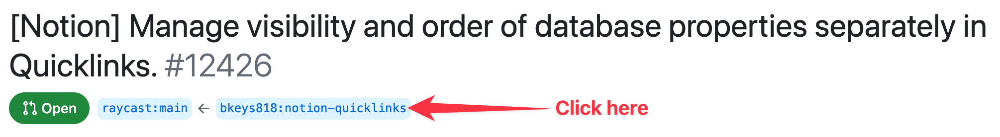

# Checkout PR

All updates to an extension is made through a [Pull Request](https://github.com/raycast/extensions/pulls) - if you need to review that the PR works as expected, then you can checkout the fork within a few seconds.

## Steps

1) Open a terminal window
2) Navigate to a folder where you want the extension to land
3) Run the above commands

_There is a few things you'll need to find and insert manually in below snippet_

**{FORK_URL}**

Open the PR and click on the incomming ref as shown below



Now click the code button and copy the HTTPS path from the dropdown

**{BRANCH}**

You can see the branch on the above image, in this example it's `notion-quicklinks`

**[EXTENSION_PATH]**

Click the `Files Changed` tab and see which directy files is changed in, in this example it's `extensions/notion`

```
git clone -n --depth=1 --filter=tree:0 -b {BRANCH} {FORK_URL}
cd raycast-extensions
git sparse-checkout set --no-cone {EXTENSION_PATH}
git checkout
cd {EXTENSION_PATH}
npm install && npm run dev
```

4) That's it, the extension should now be attached in Raycast
