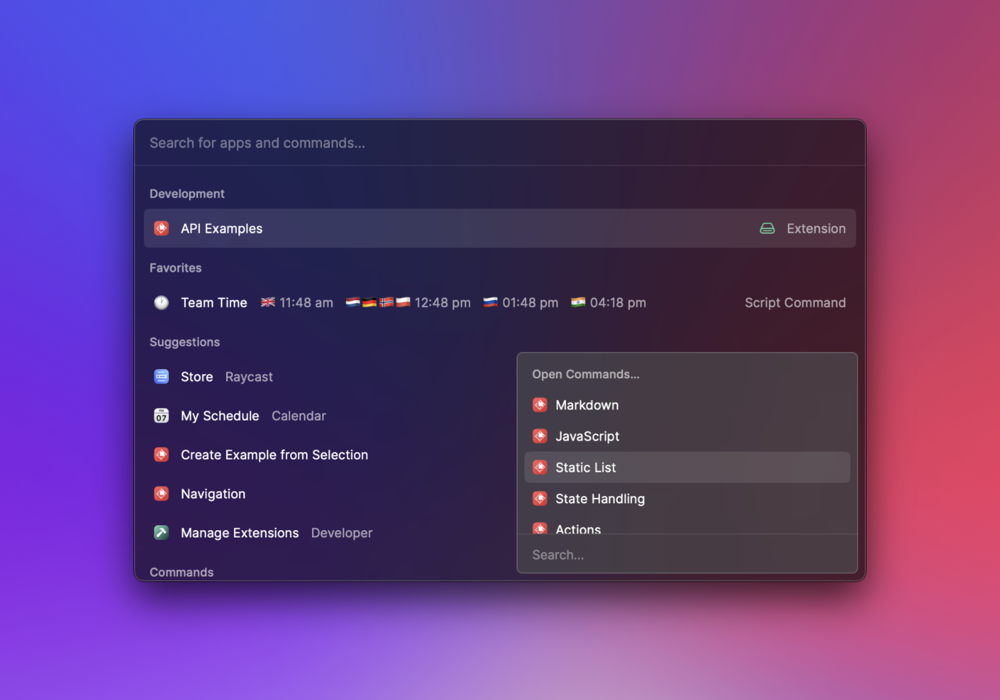
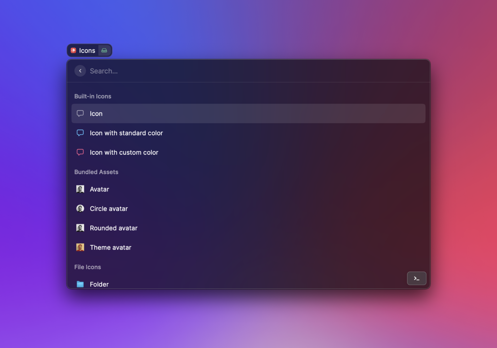

# Contribute to an Extension

All published extensions are open source and can be found in [this repository](https://github.com/raycast/extensions). This makes it easy for multiple developers to collaborate. This guide explains how to import an extension in order to fix a bug, add a new feature or otherwise contribute to it.

## Get source code

First, you need to find the source code of the extension. The easiest way to do this, is to open the store, search for the extension you want, and perform the "View Source Code" action to show the code in your browser.

Then, you need to [fork our repository](https://docs.github.com/en/get-started/quickstart/fork-a-repo) to have the source code locally.

## Develop the extension

After you've cloned the repository, open the Terminal and navigate to the extension's folder. For this guide, we are modifying the [API Examples](https://github.com/raycast/extensions/tree/main/examples/api-examples) extension. Once there, run `npm install && npm run dev` from the extension folder in your Terminal to start developing the extension.

 

You should see your imported extension at the top of your root search and can open its commands. When you're done editing the extension, make sure to add yourself to the contributors section of its [manifest](../information/manifest.md#extension-properties), and then submit a pull request to [publish your changes to the store](publish-an-extension.md).
