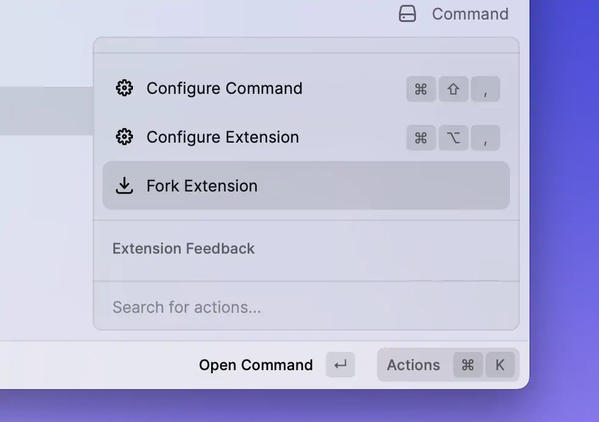
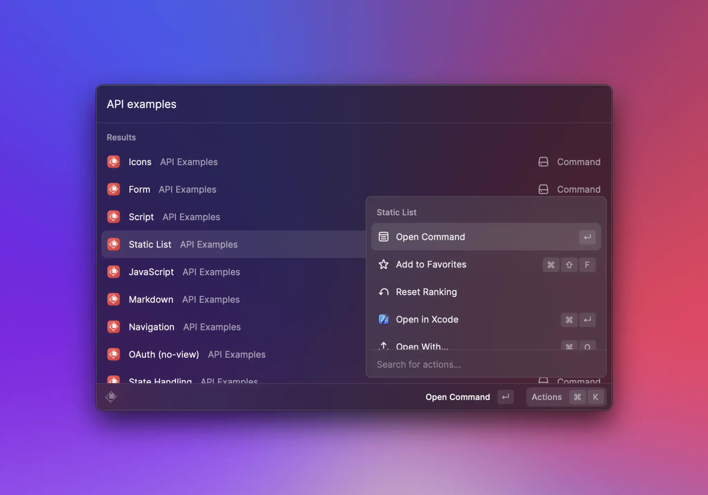
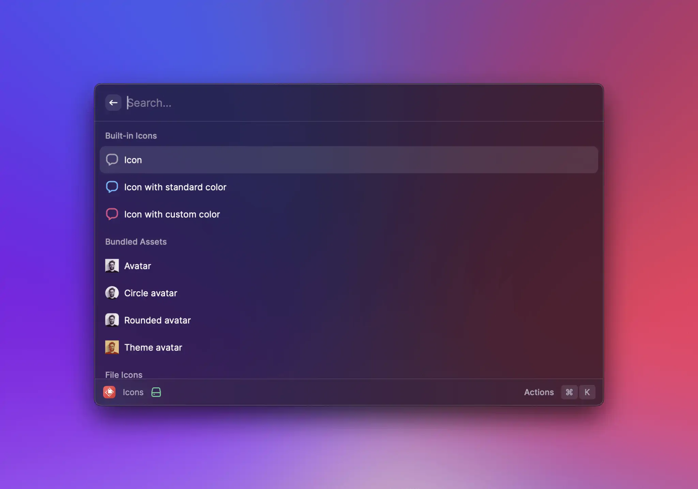

# Contribute to an Extension

All published extensions are open-source and can be found in [this repository](https://github.com/raycast/extensions). This makes it easy for multiple developers to collaborate. This guide explains how to import an extension in order to fix a bug, add a new feature or otherwise contribute to it.

## Get source code

First, you need to find the source code of the extension. The easiest way to do this is to use the `Fork Extension` action in the Raycast's root search.

## Develop the extension

After you have the source code locally, open the Terminal and navigate to the extension's folder. Once there, run `npm install && npm run dev` from the extension folder in your Terminal to start developing the extension.

 

You should see your forked extension at the top of your root search and can open its commands.

When you're done editing the extension, make sure to add yourself to the contributors section of its [manifest](../information/manifest.md#extension-properties). If you used the `Fork Extension` action, this should have happened automatically.

Additionally, ensure the `CHANGELOG.md` file is updated with your changes; create it if it doesn't exist. Use the `{PR_MERGE_DATE}` placeholder for the date – see the [Version History documentation](prepare-an-extension-for-store.md#version-history) for details.

Once everything is ready, see [how to publish an extension](publish-an-extension.md) for instructions on validating and publishing the changes.
