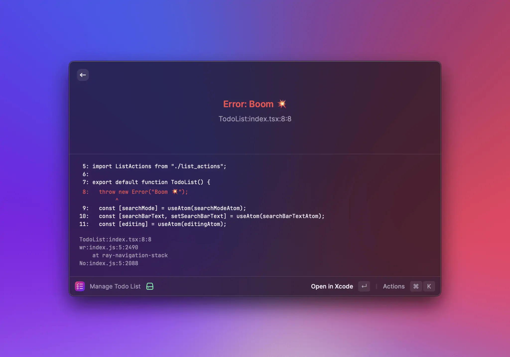
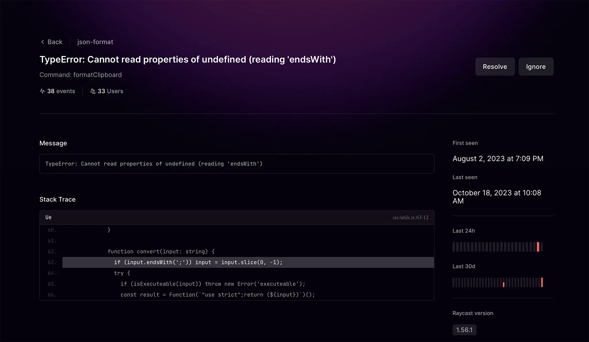
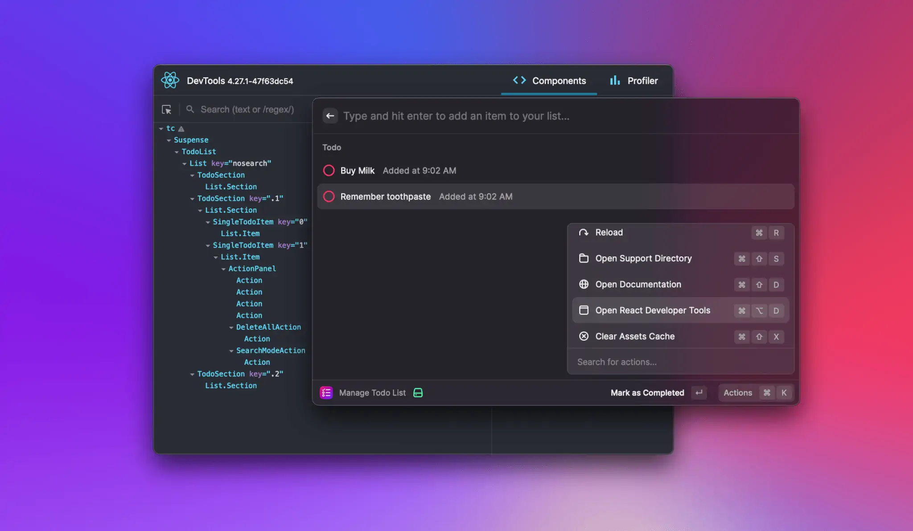

# Debug an Extension

Bugs are unavoidable. Therefore it's important to have an easy way to discover and fix them. This guide shows you how to find problems in your extensions.

## Console

Use the `console` for simple debugging such as logging variables, function calls, or other helpful messages. All logs are shown in the terminal during [development mode](../information/developer-tools/cli.md#development). Here are a few examples:

```typescript
console.log("Hello World"); // Prints: Hello World

const name = "Thomas";
console.debug(`Hello ${name}`); // Prints: Hello Thomas

const error = new Error("Boom 💥");
console.error(error); // Prints: Boom 💥
```

For more, checkout the [Node.js documentation](https://nodejs.org/dist/latest-v16.x/docs/api/console.html).

We automatically disable console logging for store extensions.

## Visual Studio Code

For more complex debugging you can install the [VSCode extension](https://marketplace.visualstudio.com/items?itemName=tonka3000.raycast) to be able to attach a node.js debugger to the running Raycast session.

1. Activate your extension in dev mode via `npm run dev` or via the VSCode command `Raycast: Start Development Mode`
2. Start the VSCode command `Raycast: Attach Debugger`
3. Set your breakpoint like in any other node.js base project
4. Activate your command

## Unhandled exceptions and Promise rejections

All unhandled exceptions and Promise rejections are shown with an error overlay in Raycast.



During development, we show the stack trace and add an action to jump to the error to make it easy to fix it. In production, only the error message is shown. You should [show a toast](../api-reference/feedback/toast.md#showtoast) for all expected errors, e.g. a failing network request.

### Extension Issue Dashboard

When unhandled exceptions and Promise rejections occur in the production build of a public extension, Raycast tries to redact all potentially sensitive information they may include, and reports them to our error backend. As an extension author, or as the manager of an organisation, you can view and manage error reports for your public extensions by going to https://www.raycast.com/extension-issues, or by finding your extension in Raycast's root, `Store` command, or `Manage Extensions` command, and using the `View Issues` action.
The dashboard should give you an overview of what issues occurred, how many times, how many users were affected, and more. Each issue additionally has a detail view, including a stack trace, breadcrumbs (typically the actions performed before the crash), extension release date, Raycast version, macOS version.



## React Developer Tools

We support [React Developer Tools](https://github.com/facebook/react/tree/main/packages/react-devtools) out-of-the-box. Use the tools to inspect and change the props of your React components, and see the results immediately in Raycast. This is especially useful for complex commands with a lot of states.



To get started, add the `react-devtools` to your extension. Open a terminal, navigate to your extension directory and run the following command:

```typescript
npm install --save-dev react-devtools@6.1.1
```

Then re-build your extension with `npm run dev`, open the command you want to debug in Raycast, and launch the React Developer Tools with `⌘` `⌥` `D`. Now select one of the React components, change a prop in the right sidebar, and hit enter. You'll notice the change immediately in Raycast.

### Alternative: Global installation of React Developer Tools

If you prefer to install the `react-devtools` globally, you can do the following:

```bash
npm install -g react-devtools@6.1.1
```

Then you can run `react-devtools` from a terminal to launch the standalone DevTools app. Raycast connects automatically, and you can start debugging your component tree.

## Environments

By default, extensions installed from the store run in Node production mode and development extensions in development mode. In development mode, the CLI output shows you additional errors and warnings (e.g. the infamous warning when you're missing the React `key` property for your list items); performance is generally better when running in production mode. You can force development extensions to run in Node production mode by going to Raycast Preferences > Advanced > "Use Node production environment".

At runtime, you can check which Node environment you're running in:

```typescript
if (process.env.NODE_ENV === "development") {
  // running in development Node environment
}
```

To check whether you're running the store or local development version:

```typescript
import { environment } from "@raycast/api";

if (environment.isDevelopment) {
  // running the development version
}
```
