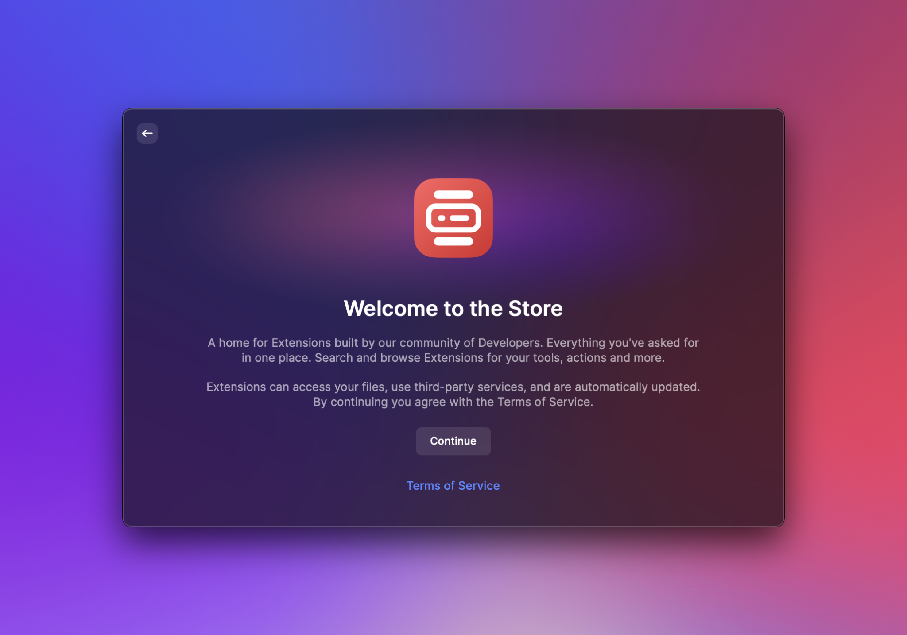

# Getting Started

## System Requirements

Before you can create your first extension, make sure you have the following prerequisites.

- You have Raycast 1.26.0 or higher installed.
- You have [Node.js](https://nodejs.org) 16.10 or higher installed. We recommend [nvm](https://github.com/nvm-sh/nvm) to install Node.
- You have [npm](http://npmjs.com) 7.0 or higher installed. If you used nvm to install Node, this is the case.
- You are familiar with [React](https://reactjs.org) and [TypeScript](https://www.typescriptlang.org). Don't worry, you don't need to be an expert. If you need some help with the basics, check out TypeScript's [Handbook](https://www.typescriptlang.org/docs/handbook/intro.html) and React's [Getting Started](https://reactjs.org/docs/getting-started.html) guide.

## Sign In

You need to be signed in to use the following extension development commands.

- **Store:** Search and install all published extensions
- **Create Extension:** Create new extensions from templates
- **Import Extension:** Import extensions from source code
- **Manage Extensions**: List and edit your published extensions

## Editor/IDE Extensions

You can enhance your extension development experience by installing extensions for common editors.

- [Visual Studio Code](https://marketplace.visualstudio.com/items?itemName=tonka3000.raycast)
  - Intellisense for image assets
  - A treeview for easier navigation (commands and preferences)
  - VSCode commands for creating new commands and preferences
  - The possibility to attach a node.js debugger
  - VSCode command for command `ray` operations like `build`, `dev`, `lint`or `fix-lint`
