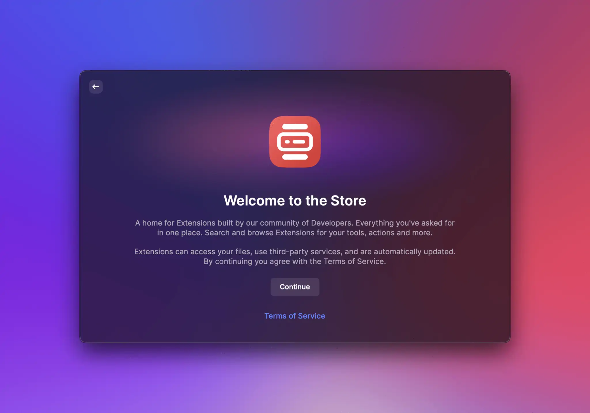

# Getting Started

## System Requirements

Before you can create your first extension, make sure you have the following prerequisites.

- You have Raycast 1.26.0 or higher installed.
- You have [Node.js](https://nodejs.org) 22.14 or higher installed. We recommend [nvm](https://github.com/nvm-sh/nvm) to install Node.
- You have [npm](http://npmjs.com) 7 or higher
- You are familiar with [React](https://reactjs.org) and [TypeScript](https://www.typescriptlang.org). Don't worry, you don't need to be an expert. If you need some help with the basics, check out TypeScript's [Handbook](https://www.typescriptlang.org/docs/handbook/intro.html) and React's [Getting Started](https://react.dev/learn) guide.

## Sign In

You need to be signed in to use the following extension development commands.

- **Store:** Search and install all published extensions
- **Create Extension:** Create new extensions from templates
- **Import Extension:** Import extensions from source code
- **Manage Extensions**: List and edit your published extensions
