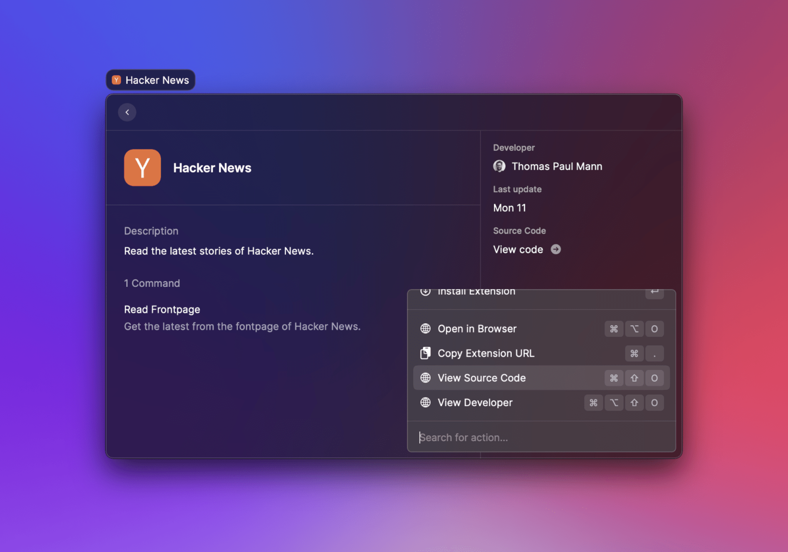
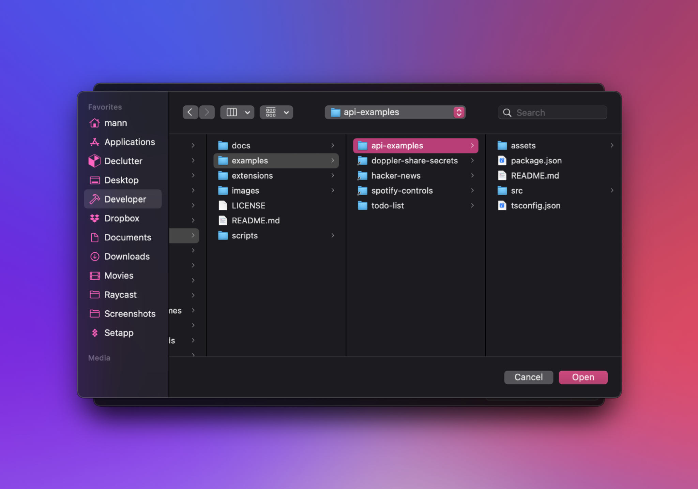

# Import an Extension

All published extensions are open source and can be found in [this repository](https://github.com/raycast/extensions). This makes it easy for multiple developers to collaborate. This guide explains how to import an extension to develop on it.

### Get source code

First, you need to find the source code of the extension. The easiest way to do this, is to open the store, search for the extension you want and perform the View Source Code action to show the code in your browser.

Then, you need to [clone our repository](https://docs.github.com/en/repositories/creating-and-managing-repositories/cloning-a-repository) to have the source code locally.

### Import the extension

After you cloned the repository, open the Import Extension command and select the folder of the extension that you want to import. For this guide, we add the [API Examples](https://github.com/raycast/extensions/tree/main/examples/api-examples) extension.

### Develop the extension

Continue to the Manage Extensions command, select the imported extension and press `↵` to open it in your default text editor. Then run `npm install && npm run dev` from the extension folder in your Terminal to start developing the extension.&#x20;

 

You should see your imported extension at the top of your root search and can open it's commands. When you're done remixing the extension, submit a pull request to [publish your changes to the store](publish-an-extension.md).
