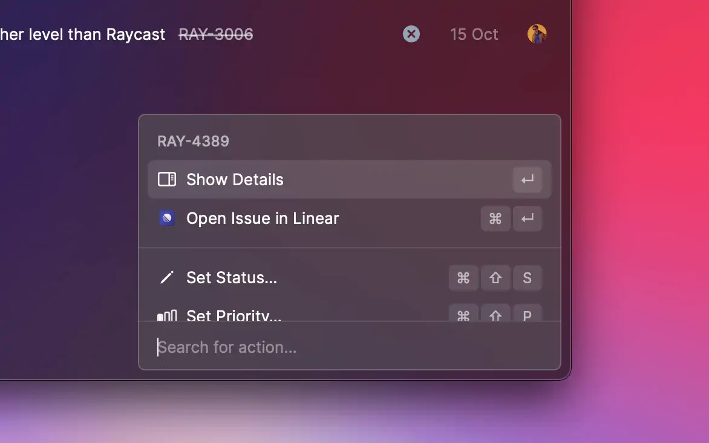

# Prepare an Extension for Store

Here you will find requirements and guidelines that you'll need to follow in order to get through the review before your extension becomes available in the Store. Please read it carefully because it will save time for you and for us. This document is constantly evolving so please do visit it from time to time.

## Metadata and Configuration

- Things to double-check in your `package.json`
  - Ensure you use your **Raycast** account username in the `author` field
  - Ensure you use `MIT` in the `license` field
  - Ensure you are using the latest Raycast API version
- Please use `npm` for installing dependencies and include `package-lock.json` in your pull request. We use `npm` on our Continuous Integration (CI) environment when building and publishing extensions so, by providing a `package-lock.json` file, we ensure that the dependencies on the server match the same versions as your local dependencies.
- Please check the terms of service of third-party services that your extension uses.
- Read the [Extension Guidelines](https://manual.raycast.com/extensions) and make sure that your Extension comply with it.
- Make sure to **run a distribution build** with `npm run build` locally before submitting the extension for review. This will perform additional type checking and create an optimized build. Open the extension in Raycast to check whether everything works as expected with the distribution build. In addition, you can perform linting and code style checks by running `npm run lint`. (Those checks will later also run via automated GitHub checks.)

## Extensions and Commands Naming

- Extension and command titles should follow [**Apple Style Guide**](https://help.apple.com/applestyleguide/#/apsgb744e4a3?sub=apdca93e113f1d64) convention
  - ✅ `Google Workplace`, `Doppler Share Secrets`, `Search in Database`
  - ❌ `Hacker news`, `my issues`
  - 🤔 It's okay to use lower case for names and trademarks that are canonically written with lower case letters. E.g. `iOS` , `macOS` , `npm`.
- **Extension title**
  - It will be used only in the Store and in the preferences
  - Make it easy for people to understand what it does when they see it in the Store
    - ✅ `Emoji Search`, `Airport - Discover Testflight Apps`, `Hacker News`
    - ❌ `Converter`, `Images`, `Code Review`, `Utils`
    - 🤔 In some cases, you can add additional information to the title similar to the Airport example above. Only do so if it adds context.
    - 💡 You can use more creative titles to differentiate your extension from other extensions with similar names.
  - Aim to use nouns rather than verbs
    - `Emoji Search` is better than `Search Emoji`
  - Avoid generic names for an extension when your extension doesn't provide a lot of commands
    - E.g. if your extension can only search pages in Notion, name it `Notion Search` instead of just `Notion`. This will help users to form the right expectations about your extension. If your extension covers a lot of functionality, it's okay to use a generic name like `Notion`. Example: [GitLab](https://www.raycast.com/tonka3000/gitlab).
    - **Rule of thumb:** If your extension has only one command, you probably need to name the extension close to what this command does. Example: [Visual Studio Code Recent Projects](https://www.raycast.com/thomas/visual-studio-code) instead of just `Visual Studio Code`.
- **Extension description**
  - In one sentence, what does your extension do? This will be shown in the list of extensions in the Store. Keep it short and descriptive. See how other approved extensions in the Store do it for inspiration.
- **Command title**
  - Usually it's `<verb> <noun>` structure or just `<noun>`
  - The best approach is to see how other commands are named in Raycast to get inspiration
    - ✅ `Search Recent Projects`, `Translate`, `Open Issues`, `Create Task`
    - ❌ `Recent Projects Search`, `Translation`, `New Task`
  - Avoid articles
    - ✅ `Search Emoji`, `Create Issue`
    - ❌ `Search an Emoji`, `Create an Issue`
  - Avoid just giving it a service name, be more specific about what the command does
    - ✅ `Search Packages`
    - ❌ `NPM`
- **Command subtitle**
  - Use subtitles to add context to your command. Usually, it's an app or service name that you integrate with. It makes command names more lightweight and removes the need to specify a service name in the command title.
  - The subtitle is indexed so you can still search using subtitle and title: `xcode recent projects` would return `Search Recent Projects` in the example above.
  - Don't use subtitles as descriptions for your command
    - ❌ `Quickly open Xcode recent projects`
  - Don't use a subtitle if it doesn't add context. Usually, this is the case with single command extensions.
    - There is no need for a subtitle for the `Search Emoji` command since it's self-explanatory
    - **Rule of thumb:** If your subtitle is almost a duplication of your command title, you probably don't need it


## Extension Icon


We made a new icon generator tool to ease the process of creating icons for your extensions. You can find it [here](https://icon.ray.so/).


- The published extension in the Store should have a 512x512px icon in `png` format
- The icon should look good in both light and dark themes (you can switch the theme in Raycast Preferences → Appearance)
- If you have separate light and dark icons, refer to the `package.json` [manifest](https://developers.raycast.com/information/manifest#extension-properties) documentation on how to configure them
- Extensions that use the default Raycast icon will be rejected
- This [Icon Template](https://www.figma.com/community/file/1030764827259035122/Extensions-Icon-Template) can help you with making and exporting a proper icon
- Make sure to remove unused assets and icons
- 💡 If you feel like designing icons is not up to your alley, ask [community](https://raycast.com/community) for help (#extensions channel)

## Provide README if Additional Configuration Required

- If your extension requires additional setup, such as getting an API access token, enabling some preferences in other applications, or has non-trivial use cases, please provide a README file at the root folder of your extension. When a README is provided, users will see the "About This Extension" button on the preferences onboarding screen.
- Supporting README media: Put all linked media files in a top-level `media` folder inside your extension directory. (This is different from assets that are required at runtime in your extension: they go inside the assets folder and will be bundled into your extension.)


## Categories


- All extensions should be published with at least one category
- Categories are case-sensitive and should follow the [Title Case](https://titlecaseconverter.com/rules/) convention
- Add categories in the `package.json` [manifest](https://developers.raycast.com/information/manifest) file or select the categories when you create a new extension using the **Create Extension** command

### All Categories

| Category        | Example                                                                                                                                                         |
| --------------- | --------------------------------------------------------------------------------------------------------------------------------------------------------------- |
| Applications    | [Cleanshot X](https://www.raycast.com/Aayush9029/cleanshotx) – Capture and record your screen                                                                   |
| Communication   | [Slack Status](https://www.raycast.com/petr/slack-status) – Quickly change your Slack status.                                                                   |
| Data            | [Random Data Generator](https://www.raycast.com/loris/random) – Generate random data using Faker library.                                                       |
| Documentation   | [Tailwind CSS Documentation](https://www.raycast.com/vimtor/tailwindcss) – Quickly search Tailwind CSS documentation and open it in the browser.                |
| Design Tools    | [Figma File Search](https://www.raycast.com/michaelschultz/figma-files-raycast-extension) – Lists Figma files allowing you to search and navigate to them.      |
| Developer Tools | [Brew](https://www.raycast.com/nhojb/brew) – Search and install Homebrew formulae.                                                                              |
| Finance         | [Coinbase Pro](https://www.raycast.com/farisaziz12/coinbase-pro) – View your Coinbase Pro portfolio.                                                            |
| Fun             | [8 Ball](https://www.raycast.com/rocksack/8-ball) – Returns an 8 ball like answer to questions.                                                                 |
| Media           | [Unsplash](https://www.raycast.com/eggsy/unsplash) – Search images or collections on Unsplash, download, copy or set them as wallpaper without leaving Raycast. |
| News            | [Hacker News](https://www.raycast.com/thomas/hacker-news) – Read the latest stories of Hacker News.                                                             |
| Productivity    | [Todoist](https://www.raycast.com/thomaslombart/todoist) – Check your Todoist tasks and quickly create new ones.                                                |
| Security        | [1Password 7](https://www.raycast.com/khasbilegt/1password7) – Search, open or edit your 1Password 7 passwords from Raycast.                                    |
| System          | [Coffee](https://www.raycast.com/mooxl/coffee) – Prevent the sleep function on your mac.                                                                        |
| Web             | [Wikipedia](https://www.raycast.com/vimtor/wikipedia) – Search Wikipedia articles and view them.                                                                |
| Other           | To be used if you think your extension doesn’t fit in any of the above categories.                                                                              |

## Screenshots


- Screenshots are displayed in the metadata of an extension details screen, where users can click and browse through them to understand what your extension does in greater detail, before installing
- You can add a maximum of six screenshots. We recommend adding at least three, so your extensions detail screen looks beautiful.

### Adding Screenshots

In Raycast 1.37.0+ we made it easy for you to take beautiful pixel perfect screenshots of your extension with an ease.

#### How to use it?

1. Set up Window Capture in Advanced Preferences (Hotkey e.g.: `⌘⇧⌥+M`)
2. Ensure your extension is opened in development mode (Window Capture eliminates dev-related menus/icons).
3. Open the command
4. Press the hotkey, remember to tick `Save to Metadata`


This tool will use your current background. Choose a background image with a good contrast that makes it clear and easy to see the app and extension you've made.

You can use [Raycast Wallpapers](https://www.raycast.com/wallpapers) to make your background look pretty


### Specifications

| Screenshot size                | Aspect ratio | Format | Dark mode support |
| ------------------------------ | ------------ | ------ | ----------------- |
| 2000 x 1250 pixels (landscape) | 16:10        | PNG    | No                |

### Do's & Dont's

- ✅ Choose a background with good contrast, that makes it clear and easy to see the app and extension you’ve made
- ✅ Select the most informative commands to showcase what your extension does – focus on giving the user as much detail as possible
- ❌ Do not use multiple backgrounds for different screenshots – be consistent and use the same across all screenshots
- ❌ Do not share sensitive data in your screenshots – these will be visible in the Store, as well as the Extension repository on GitHub
- ❌ Do not include screenshots of other applications - keep the focus entirely on your extension within Raycast
- ❌ Avoid using screenshots in different themes (light and dark), unless it is to demonstrate what your extension does

## Version History


- Make it easier for users to see exactly what notable changes have been made between each release of your extension with a `CHANGELOG.md` file in your extension metadata
  - To add Version History to your extension, add a `CHANGELOG.md` file to the root folder of your extension
- See an extension files structure with [screenshots and a changelog file](prepare-an-extension-for-store.md#adding-screenshots)
- With each modification, provide clear and descriptive details regarding the latest update, accompanied by a title formatted as an h2 header followed by `{PR_MERGE_DATE}`. This placeholder will be automatically replaced when the pull request is merged. While you may still use the date timestamp format YYYY-MM-DD, it is often more practical to use `{PR_MERGE_DATE}` since merging of a pull request can take several days (depending on the review comments, etc.).
  - Make sure your change title is within square brackets
  - Separate your title and date with a hyphen `-` and spaces either side of the hyphen
- Below is an example of a changelog that follows the correct format

```markdown
# Brew Changelog

## [Added a bunch of new feedback] - {PR_MERGE_DATE}

- Improve reliability of `outdated` command
- Add action to copy formula/cask name
- Add cask name & tap to cask details
- Add Toast action to cancel current action
- Add Toast action to copy error log after failure

## [New Additions] - 2022-12-13

- Add greedy upgrade preference
- Add `upgrade` command

## [Fixes & Bits] - 2021-11-19

- Improve discovery of brew prefix
- Update Cask.installed correctly after installation
- Fix installed state after uninstalling search result
- Fix cache check after installing/uninstalling cask
- Add uninstall action to outdated action panel

## [New Commands] - 2021-11-04

Add support for searching and managing casks

## [Added Brew] - 2021-10-26

Initial version code
```



You can use [Keep a Changelog](https://keepachangelog.com/en/1.0.0/) to help you format your changelog correctly


## Contributing to Existing Extensions vs Creating a New One

- **When you should contribute to an existing extension instead of creating a new one**
  - You want to make a small improvement to an extension that is already published, e.g. extra actions, new preference, UX improvements, etc.. Usually, it's a non-significant change.
  - You want to add a simple command that compliments an existing extension without changing the extension title or description, e.g. you want to add "Like Current Track" command for Spotify. It wouldn't make sense to create a whole new extension just for this when there is already the [Spotify Controls](https://www.raycast.com/thomas/spotify-controls) extension.
  - **Important:** If your change is significant, it makes sense to contact the author of the extension before you invest a lot of time into it. We cannot merge significant contributions without the author's sign-off.
- **When you should consider creating a new extension instead of contributing to an existing one**
  - The changes to an existing extension would be significant and might break other people's workflows. Check with the author if you want to proceed with the collaboration path.
  - Your extension provides an integration with the same service but has a different configuration, e.g. one extension could be "GitHub Cloud", another "GitHub Enterprise". One extension could be "Spotify Controls" and only uses AppleScript to play/pause songs, while another extension can provide deeper integration via the API and require an access token setup. There is no reason to try to merge everything together as this would only make things more complicated.
- **Multiple simple extensions vs one large one**
  - If your extension works standalone and brings something new to the Store, it's acceptable to create a new one instead of adding commands to an existing one. E.g. one extension could be "GitHub Repository Search", another one could be "GitHub Issue Search". It should not be the goal to merge all extensions connecting with one service into one mega extension. However, it's also acceptable to merge two extensions under one if the authors decide to do so.

## Binary Dependencies and Additional Configuration

- Avoid asking users to perform additional downloads and try to automate as much as possible from the extension, especially if you are targeting non-developers. See the [Speedtest](https://github.com/raycast/extensions/pull/302) extension that downloads a CLI in the background and later uses it under the hood.
- If you do end up downloading executable binaries in the background, please make sure it's done from a server that you don't have access to. Otherwise, we cannot guarantee that you won't replace the binary with malicious code after the review. E.g. downloading `speedtest-cli` from [`install.speedtest.net`](http://install.speedtest.net) is acceptable, but doing this from some custom AWS server would lead to a rejection. Add additional integrity checks through hashes.
- Don't bundle opaque binaries where sources are unavailable or where it's unclear how they have been built.
- Don't bundle heavy binary dependencies in the extension – this would lead to an increased extension download size.
- **Examples for interacting with binaries**
  - ✅ Calling known system binaries
  - ✅ Binary downloaded or installed from a trusted location with additional integrity checking through hashes (that is, verify whether the downloaded binary really matches the expected binary)
  - ✅ Binary extracted from an npm package and copied to assets, with traceable sources how the binary is built; **note**: we have yet to integrate CI actions for copying and comparing the files; meanwhile, ask a member of the Raycast team to add the binary for you
  - ❌ Any binary with unavailable sources or unclear builds just added to the assets folder

## Keychain Access

- Extensions requesting Keychain Access will be rejected due to security concerns. If you can't work around this limitation, reach out to us on [Slack](https://raycast.com/community) or via `feedback@raycast.com`.

## UI/UX Guidelines

### Preferences


- Use the [preferences API](https://developers.raycast.com/api-reference/preferences) to let your users configure your extension or for providing credentials like API tokens
  - When using `required: true`, Raycast will ask the user to set preferences before continuing with an extension. See the example [here](https://github.com/raycast/extensions/blob/main/extensions/gitlab/package.json#L150).
- You should not build separate commands for configuring your extension. If you miss some API to achieve the preferences setup you want, please file a [GitHub issue](https://github.com/raycast/extensions/issues) with a feature request.

### Action Panel



- Actions in the action panel should also follow the **Title Case** naming convention
  - ✅ `Open in Browser`, `Copy to Clipboard`
  - ❌ `Copy url`, `set project`, `Set priority`
- Provide icons for actions if there are other actions with icons in the list
  - Avoid having a list of actions where some have icons and some don't
- Add ellipses `…` for actions that will have a submenu. Don't repeat the parent action name in the submenu
  - ✅ `Set Priority…` and submenu would have `Low`, `Medium`, `High`
  - ❌ `Set Priority` and submenu would have `Set Priority Low`, `Set Priority Medium`, etc

### Navigation

- Use the [Navigation API](https://developers.raycast.com/api-reference/user-interface/navigation) for pushing new screens. This will ensure that a user can navigate within your extension the same way as in the rest of the application.
- Avoid introducing your own navigation stack. Extensions that just replace the view's content when it's expected to push a new screen will be rejected.

### Empty States

- When you update lists with an empty array of elements, the "No results" view will be shown. You can customize this view by using the [List.EmptyView](../api-reference/user-interface/list.md#list.emptyview) or [Grid.EmptyView](../api-reference/user-interface/grid.md#grid.emptyview) components.
- **Common mistake** - "flickering empty state view" on start
  - If you try rendering an empty list before real data arrives (e.g. from the network or disk), you might see a flickering "No results" view when opening the extension. To prevent this, make sure not to return an empty list of items before you get the data you want to display. In the meantime, you can show the loading indicator. See [this example](https://developers.raycast.com/information/best-practices#show-loading-indicator).

### Navigation Title

- Don't change the `navigationTitle` in the root command - it will be automatically set to the command name. Use `navigationTitle` only in nested screens to provide additional context. See [Slack Status extension](https://github.com/raycast/extensions/blob/020f2232aa5579b5c63b4b3c08d23ad719bce1f8/extensions/slack-status/src/setStatusForm.tsx#L95) as an example of correct usage of the `navigationTitle` property.
- Avoid long titles. If you can't predict how long the navigation title string will be, consider using something else. E.g. in the Jira extension, we use the issue key instead of the issue title to keep it short.
- Avoid updating the navigation title multiple times on one screen depending on some state. If you find yourself doing it, there is a high chance you are misusing it.

### Placeholders in Text Fields

- For a better visual experience, add placeholders in text field and text area components. This includes preferences.
- Don't leave the search bar without a placeholder

### Analytics

- It’s not allowed to include external analytics in extensions. Later on, we will add support to give developers more insights into how their extension is being used.

### Localization / Language

- At the moment, Raycast doesn't support localization and only supports US English. Therefore, please avoid introducing your custom way to localize your extension. If the locale might affect functionality (e.g. using the correct unit of measurement), please use the preferences API.
- Use US English spelling (not British)
