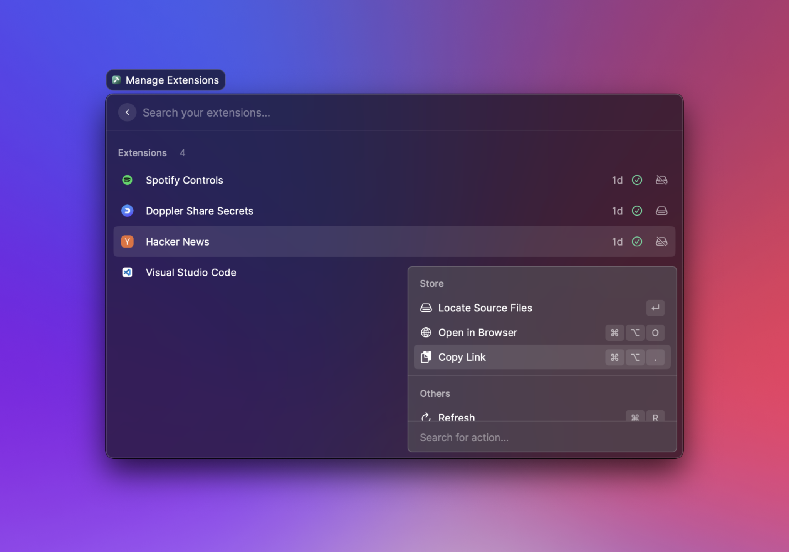

# Publish an Extension

Before you publish your extension, take a look at [how to prepare your extension](prepare-an-extension-for-store.md) for the Store. Making sure you follow the guidelines is the best way to help your extension pass the review.

### Validate your extension

Open your terminal, navigate to your extension directory and run `npm run build` to verify your extension. The command should complete without any errors.


`npm run build` validates your extension for distribution without publishing it to the store. Read more about it [here](../information/cli.md#build).


### Publish your extension

To share your extension with others, you need to open a pull request in our [repository](https://github.com/raycast/extensions). For this, [fork our repository](https://docs.github.com/en/get-started/quickstart/fork-a-repo), add your extension to your fork, push your changes and open a pull request [via the GitHub web interface](https://docs.github.com/en/github/collaborating-with-pull-requests/proposing-changes-to-your-work-with-pull-requests/creating-a-pull-request-from-a-fork) into our `main` branch.

#### Alternative way
The extensions repository is big and to avoid pulling all its content, you can do a sparse checkout with the following steps. This is also useful when iterating on an existing extension.

```bash
git clone --filter=blob:none --no-checkout https://github.com/raycast/extensions && cd extensions && mkdir extensions
```
Then add your `<extension-folder>` in the /extensions child folder.
```bash
git sparse-checkout set --cone extensions/<extension-folder>
git checkout main
```
Then push your changes.


### Waiting for review

After you opened a pull request, we'll review your extension and request changes when required. Once accepted, the pull request is merged and your extension will be automatically published to the [Raycast Store](https://raycast.com/store).


We're still figuring things out and updating our guidelines. If something is unclear, please tell us in [our community](https://raycast.com/community).


### Share your extension

Once your extension is published in the Raycast Store, you can share it with our community. Open the Manage Extensions command, search for your extension and press `⌘` `⌥` `.` to copy the link.



🚀 Now it's time to share your work! Tweet about your extension, share it with our [Slack community](https://raycast.com/community) or send it to your teammates.
