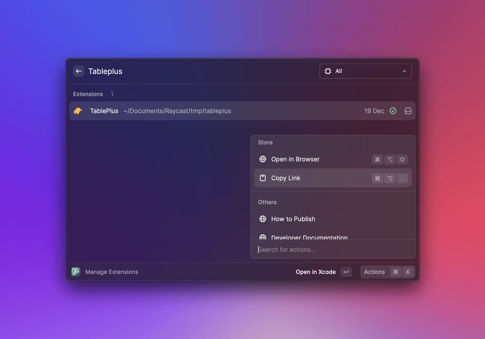

# Publish an Extension

Before you publish your extension, take a look at [how to prepare your extension](prepare-an-extension-for-store.md) for the Store. Making sure you follow the guidelines is the best way to help your extension pass the review.

### Validate your extension

Open your terminal, navigate to your extension directory, and run `npm run build` to verify your extension. The command should complete without any errors.


`npm run build` validates your extension for distribution without publishing it to the store. Read more about it [here](../information/developer-tools/cli.md#build).


### Publish your extension

To share your extension with others, navigate to your extension directory, and run `npm run publish` to publish your extension. 



It is possible that the `publish` script doesn't exist (usually because the extension was created before the template was updated to include it). In that case, you can add the following line in the `scripts` object of the package.json `"publish": "npx @raycast/api@latest publish"` and then run `npm run publish` again.



You will be asked to authenticate with GitHub because the script will automatically open a pull request in our [`raycast/extensions`](https://github.com/raycast/extensions) repository.

The command will squash commits and their commit messages. If you want more control, see the [alternative way](#alternative-way) below.


If someone contributes to your extension, or you make edits directly on GitHub, running `npm run publish` will fail until you run

```bash
npx @raycast/api@latest pull-contributions
```

in your git repository. This will merge the contributions with your code, asking you to fix the conflicts if any.


Once the pull request is opened, you can continue pushing more commits to it by running `npm run publish` again.

#### Alternative way

If you want more control over the publishing process, you can manually do what `npm run publish` does. You need to open a pull request in our [repository](https://github.com/raycast/extensions). For this, [fork our repository](https://docs.github.com/en/get-started/quickstart/fork-a-repo), add your extension to your fork, push your changes, and open a pull request [via the GitHub web interface](https://docs.github.com/en/github/collaborating-with-pull-requests/proposing-changes-to-your-work-with-pull-requests/creating-a-pull-request-from-a-fork) into our `main` branch.

### Waiting for review

After you opened a pull request, we'll review your extension and request changes when required. Once accepted, the pull request is merged and your extension will be automatically published to the [Raycast Store](https://raycast.com/store).


We're still figuring things out and updating our guidelines. If something is unclear, please tell us in [our community](https://raycast.com/community).


### Share your extension

Once your extension is published in the Raycast Store, you can share it with our community. Open the Manage Extensions command, search for your extension and press `⌘` `⌥` `.` to copy the link.



🚀 Now it's time to share your work! Tweet about your extension, share it with our [Slack community](https://raycast.com/community) or send it to your teammates.
