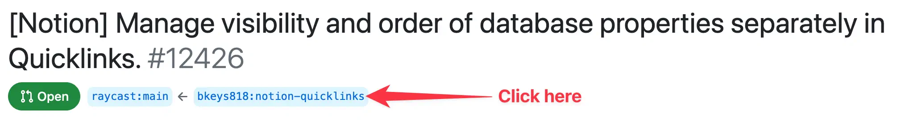

# Review an extension in a Pull Request

All updates to an extension are made through a [Pull Request](https://github.com/raycast/extensions/pulls) - if you need to review whether the Pull Request works as expected, then you can checkout the fork within a few seconds.

## Steps

1. Open a terminal window
2. Navigate to a folder where you want the repository to land
3. Run the below commands

_There are a few things you'll need to find and insert manually in the snippet below_

**FORK_URL**

Open the PR and click on the incomming ref as shown below



Now click the code button and copy the HTTPS path from the dropdown

**BRANCH**

You can see the branch on the above image (in this example it’s `notion-quicklinks`)

**EXTENSION_NAME**

Click the `Files Changed` tab to see in which directory files have been changed (in this example it’s `notion`)

```
BRANCH="ext/soundboard"
FORK_URL="https://github.com/pernielsentikaer/raycast-extensions.git"
EXTENSION_NAME="soundboard"

git clone -n --depth=1 --filter=tree:0 -b ${BRANCH} ${FORK_URL}
cd raycast-extensions
git sparse-checkout set --no-cone "extensions/${EXTENSION_NAME}"
git checkout
cd "extensions/${EXTENSION_NAME}"
npm install && npm run dev
```

4. That's it, the extension should now be attached in Raycast
