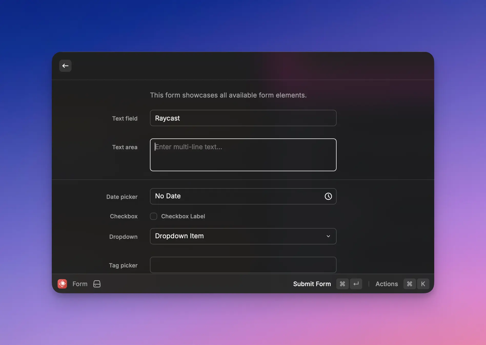
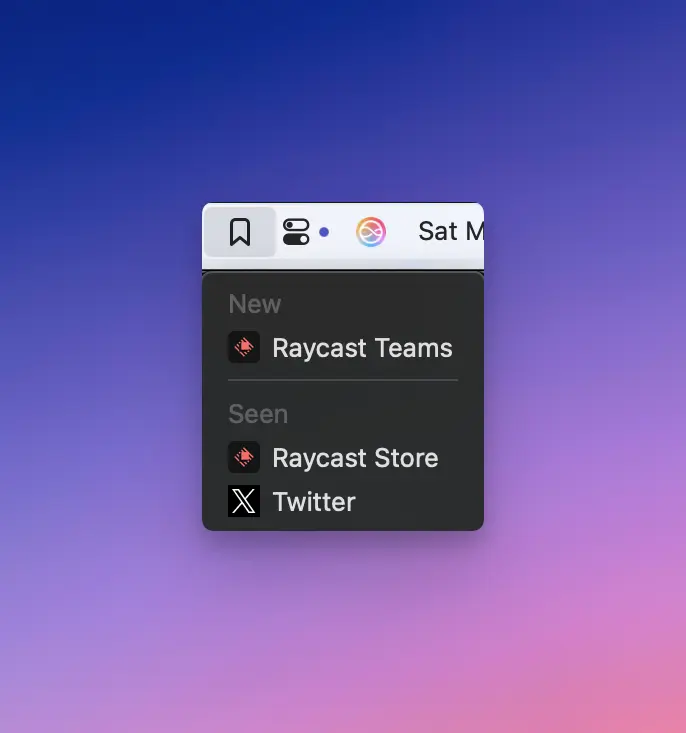
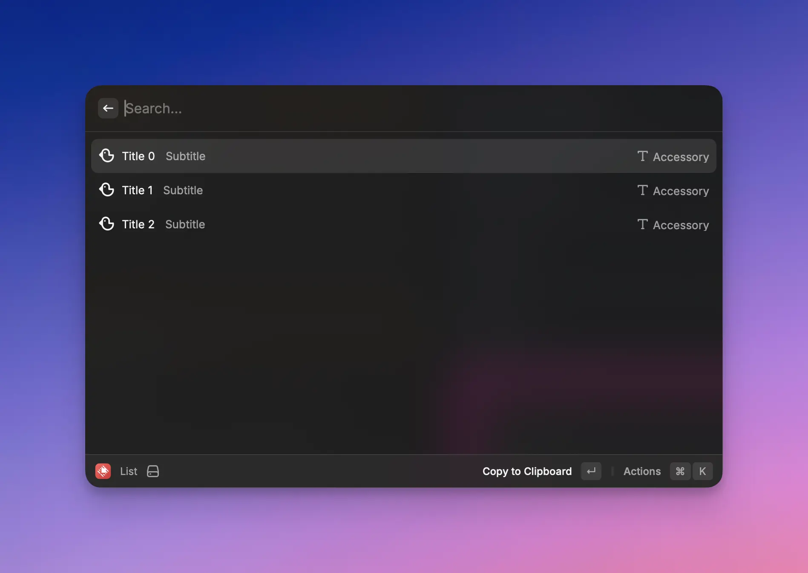

# Templates and Boilerplates

Raycast provides developers with a variety of templates to assist in kick-starting your extension development journey.

Raycast provides 3 types of templates:

- **Commands:** These are templates for different views for commands within your extension.
- **Tools:** Tools are a type of entry point for an extension different from a command. Learn more about Tools [here](../api-reference/tool.md).
- **Extension Boilerplates:** These are fully built extension templates designed for use by organizations.

## Commands

### Show Detail

Renders a simple Hello World from a markdown string. 


See the [API Reference](../api-reference/user-interface/detail.md) for more information about customization.


### Submit Form

Renders a form that showcases all available form elements.


See the [API Reference](../api-reference/user-interface/form.md) for more information about customization.


### Show Grid

Renders a grid of Icons available from Raycast.

Defaults to a large grid, but provides a selection menu to change the size.


See the [API Reference](../api-reference/user-interface/grid.md) for more information about customization.

See here for information about [Icons](../api-reference/user-interface/icons-and-images.md).


### Show List and Detail

Renders a list of options. When an option is selected, a Detail view is displayed.


See the [API Reference](../api-reference/user-interface/list.md) for more information about customization.


### Menu Bar Extra

Adds a simple Menu Bar Extra with a menu.


See the [API Reference](../api-reference/menu-bar-commands.md) for more information about customization.


### Run Script

Renders a simple [HUD](../api-reference/feedback/hud.md) indicating the completion of the script.

### Show List

Renders a simple list with each entry containing an icon, title, subtitle, and accessory.


See the [API Reference](../api-reference/user-interface/list.md) for more information about customization.


### Show Typeahead Results

Renders a searchable list of NPM packages. Returned packages updates as search.

### AI

Renders output from an AI command in a Detail view.

## Tools

Renders a barebones Quick AI chat with your extension.


See the [API Reference](../api-reference/tool.md) for more information about customization.


## Extension Boilerplates

The Raycast Team has created high-quality templates to reinforce team experiences with the Raycast API.

Run `npm init raycast-extension -t <template-name>` to get started with these extensions. All templates can be found on the [templates page](https://www.raycast.com/templates).

Specific instructions about customizing the template can be found on the relevant [template page](https://www.raycast.com/templates). Simply customize the template as you see fit, then run `npm run publish` in the extension directory to allow your team to install the extension.
