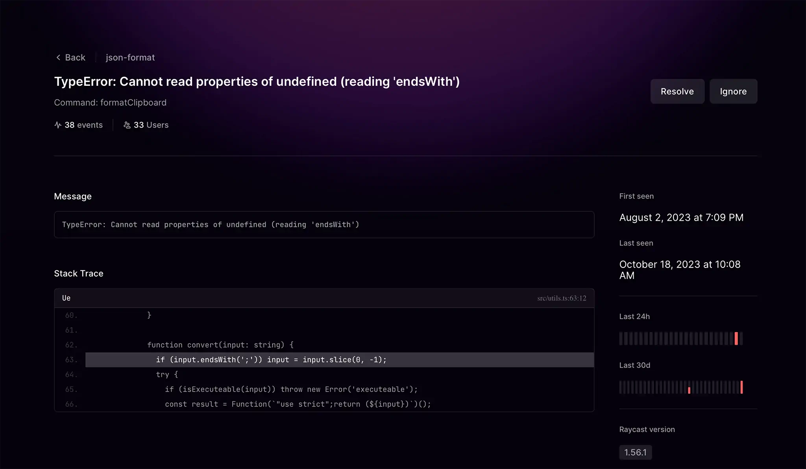
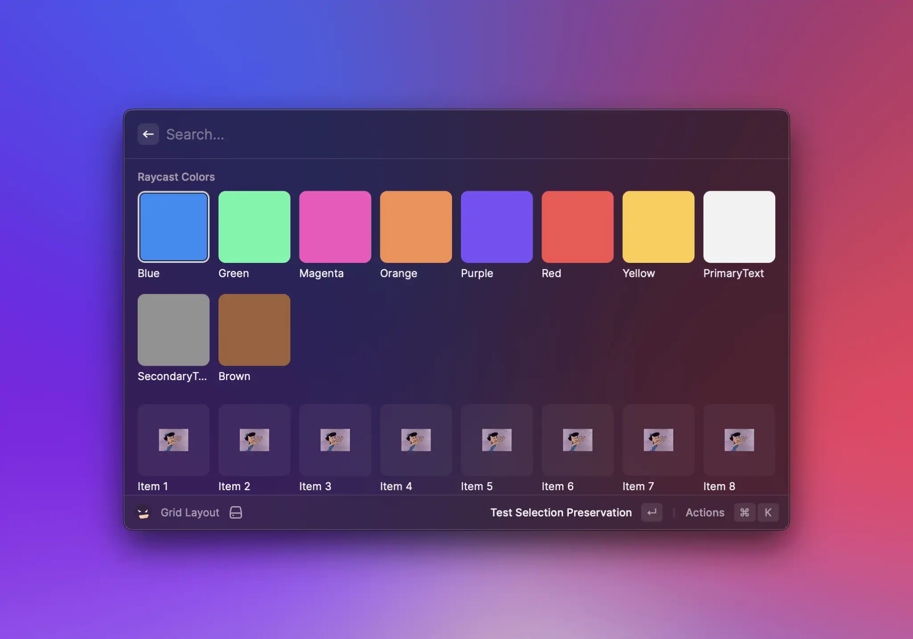

# Changelog

## 1.103.0 - 2025-09-15

Over the past few releases, we've made some additions to the API to better support it:

- there's a new `platforms` field in the manifest. We’ve intentionally chosen to release only extensions that we are tested on Windows. This is the field that allow extensions to be available on Windows. By default, if not specified, the field's value is `["macOS"]`. If you want to make an extension available on Windows, you can set it to `["macOS", "Windows"]`
- Keyboard Shortcuts are tricky. If you use the `Common` shortcuts, then they will be cross-platform. However, if you use shortcuts and specify a modifier like `cmd`, the shortcut will be ignored on Windows (and vice-versa, if you specify a modifier like `windows`, it won't be available on macOS). So we've added a new syntax where you can nest shortcuts per platform:

```js
{
  macOS: { modifiers: ["cmd", "shift"], key: "c" },
  Windows: { modifiers: ["ctrl", "shift"], key: "c" },
}
```

- Sometimes, you might want to change preferences depending on the platform (for example if it's a path). You can now specify the default as a object as well:

```json
"default": {
"macOS": "foo",
"Windows": "bar"
}
```

- We've also updated the `@raycast/utils` to make it cross platform and added a `runPowerShellScript` function.

## 1.98.0 - 2025-05-08

### ✨ New

- New `Action.InstallMCPServer` to push a MCP installation form

### 💎 Improvements

- **Shortcuts**: It’s now possible to provide platform-specific shortcuts.

### 🐞 Fixes

- Fixed an issue that caused extensions containing Swift code to not compile.

## 1.94.0 - 2025-03-19

### ✨ New

- The extensions now run on Nodejs 22 and react 19. Among other benefits, this makes `fetch` globally available. There shouldn’t be any breaking change - but if you find some, please let us know!
  Additionally, new extensions will be bootstrapped with ESLint 9
- **Tools**: Tools can now specify some preferences, the same way Commands can

### 💎 Improvements

- **CLI**: When a tool or a command (when running in the background) times out, an error message will be printed in the terminal
- **CLI**: When publishing an extension, the PR to the extensions repository will be created as draft so you can fill the description up before submitting it

## 1.93.0 - 2025-02-26

### ✨ New

- **Tools**: We are introducing a new type of entry points for extensions: Tools. They turn a regular extension into an AI Extension. As opposed to a command, they don’t show up in the root search and the user can’t directly interact with them. Instead, they are functionalities that the AI can use to interact with an extension.

## 1.91.0 - 2025-02-05

### ✨ New

- **AI**: The models added in [Raycast 1.90.0](https://www.raycast.com/changelog/1-90-0) are now also part of the API
  - DeepSeek R1² reasoning model (powered by Together AI) and its distilled version¹ (powered by Groq)
  - OpenAI o1-mini² and o1-preview² reasoning models
  - OpenAI o3-mini¹
  - Google Gemini 1.5 Flash¹ and Gemini 1.5 Pro², Gemini 2.0 Flash¹ and Gemini 2.0 Flash Thinking¹ models
  - xAI Grok-2² model
  - Perplexity Sonar¹, Sonar Pro² and Sonar Reasoning¹ models

¹ available with Raycast Pro
² available with Raycast Pro + Advanced AI

### 🐞 Fixes

- **Window Management**: Added missing types for `getActiveWindow`.

## 1.89.0 - 2025-01-15

### 💎 Improvements

- **Cache**: Clearing the cache will now delete all the files in the cache folder instead of the entire folder.

## 1.88.0 - 2024-12-16

### 🐞 Fixes

- **Markdown**: Fixed a crash when trying to print invalid surrogate code points
- **Types**: Fixed an issue when generating the TypeScript definition for the preferences when one of their descriptions contained `*/`

## 1.87.0 - 2024-12-04

### ✨ New

- **Docs**: You can now find a few txt files containing all the docs that you can feed to LLMs:
  - [https://raw.githubusercontent.com/raycast/extensions/refs/heads/gh-pages/llms-full.txt](https://raw.githubusercontent.com/raycast/extensions/refs/heads/gh-pages/llms-full.txt) → All the docs
  - [https://raw.githubusercontent.com/raycast/extensions/refs/heads/gh-pages/llms-api.txt](https://raw.githubusercontent.com/raycast/extensions/refs/heads/gh-pages/llms-api.txt) → The API docs
  - [https://raw.githubusercontent.com/raycast/extensions/refs/heads/gh-pages/llms-utils.txt](https://raw.githubusercontent.com/raycast/extensions/refs/heads/gh-pages/llms-utils.txt) → The utils docs

### 🐞 Fixes

- **CLI**: Fix a couple of issues when trying to publish an extension or pull contributions

## 1.86.0 - 2024-11-20

### 💎 Improvements

- **CLI**: The CLI that comes with `@raycast/api` does not use a platform/architecture-specific binary anymore. This should fix some issues that people encountered when trying to install the API.

## 1.84.0 - 2024-10-09

### 💎 Improvements

- When running a no-view command with arguments, only clear the argument inputs instead of clearing the entire search bar (which brings the behaviour in line with other no-view commands)

### 🐞 Fixes

- Fixed a regression where `selectedItemId` wouldn’t be respected
- Fixed a typo in the extension template’s build script

## 1.81.0 - 2024-08-13

### ✨ New

- **Detail:** You can now render LaTeX in the Detail views. We support the following delimiters:
  - Inline math: `\(...\)` and `\begin{math}...\end{math}`
  - Display math: `\[...\]`, `$$...$$` and `\begin{equation}...\end{equation}`

### 💎 Improvements

- You can now pick a different command template for each command that you add in the `Create Extension` command’s form.
- Added a new `Add Command` action for local extensions in the `Manage Extensions` command.

## 1.80.0 - 2024-07-31

### ✨ New

- **AI:** OpenAI GPT-4o Mini can now be used in the API.
- **Quicklinks:** `CreateQuickLink` now accepts an `icon` prop that allows you to customize the icon of your Quicklink.

### 💎 Improvements

- **Menu Bar Commands** now show a confirmation toast when activated or refreshed.

## 1.79.0 - 2024-07-17

### ✨ New

- **Navigation**: Added a second argument to `useNavigation().push` to specify a callback called when the pushed view will be popped. You can use it to update the current view when it will become active again. There’s also a new `onPop` prop on `Action.Push` to do the same thing.

### 💎 Improvements

- When creating or forking an extension, an alert will be shown if you specify an existing folder (and thus avoid overwriting files without warning)

## 1.78.0 - 2024-07-03

### ✨ New

- In addition to the new Custom Window Management commands, we are introducing a `WindowManagement` API to give you total control to move your windows depending on any kind of logic you can imagine.
- You can now access the `ownerOrAuthorName` in the `environment`, useful for re-usable libraries.

### 🐞 Fixes

- **Pagination**: Fixed the TypeScript definition of the `onLoadMore` callback.

## 1.77.0 - 2024-06-19

### ✨ New

- Updated React version to 18.3.1 to prepare for the next major version of React. This shouldn't impact any extensions but let us know if you find any unexpected behaviour.

### 🐞 Fixes

- **Menu Bar Extra**: fixed an issue where `Submenu` icons changed appearance based on Raycast's appearance, instead of the system's.

## 1.76.0 - 2024-06-05

### 💎 Improvements

- Some companies requires all package.json’s names to be name-spaced (eg. `@foo/bar`). However, Raycast only understands names that _aren’t_ name-spaced. This prevented some people from creating internal extensions. In order to workaround this issue, you can now use the `@workaround` namespace in extension names (eg. `@workaround/bar`).

### 🐞 Fixes

- **Clipboard**: Fixed an issue where 2 items were added to the pasteboard when copying a file (one with the file name, and one with the file url). It now correctly adds 1 item with 2 representations.

## 1.74.0 - 2024-05-15

### ✨ New

- **AI:** The models available in the API now matches the ones available in the app (eg. GPt-4o, Llama-3, etc.). As part of this, the models are now part of an enum `AI.Model` which will make it easier to add and deprecate them as time goes on.
- **Utils:** we’ve added a new React hook called `useLocalStorage`. This hook simplifies managing a value in `LocalStorage`. Take a look at the [developer docs](https://developers.raycast.com/utilities/react-hooks/uselocalstorage) to learn more.

### 💎 Improvements

- **DX**: Improved the precision of warning messages when trying to add children to a react component that can’t accept them.

## 1.72.0 - 2024-04-24

### ✨ New

- **Browser Extension**: You can now access the context of the focused browser via the Raycast Browser Extension. You can get the list of open tabs as well as the content of a tab.

### 🐞 Fixes

- **Grid**: Fixed a bug that caused the selected Grid item to be brought into focus when paginating.

## 1.71.0 - 2024-04-10

### ✨ New

- **Developer Hub:** you can now programmatically send error reports using the new `captureException` function.
- **Utils**: we’ve added a new React hook, `useStreamJSON`. The new hook simplifies the process of streaming through large JSON data sources, which normally would not fit in the extension’s memory. Take a look at the [developer docs](https://developers.raycast.com/utilities/react-hooks/usestreamjson) to learn more.
- **AI**: All the new models are also available in the API.

### 💎 Improvements

- `getApplications`, `getDefaultApplication`, and `Action.OpenWith` now support remote URLs and will return the installed Applications that can open remote URLs (usually browsers)

### 🐞 Fixes

- **Pagination**: Fixed a bug that could cause pagination to not work when `filtering` was set to true.
- **CLI**: Fixed the cursor being kept hidden when interrupting a command

## 1.70.0 - 2024-03-20

### 💎 Improvements

- **Grid & List:** The placeholders shown while waiting for the next page to load are now animated
- **Application info:** Application object now returns the localized name if the application is running

### 🐞 Fixes

- **Forms:** Fixed an issue which made it impossible to select a value of a controlled Dropdown after changing its value programmatically
- **Grid:** Fixed an issue where pagination would not work when scrolling to the bottom while `isLoading` is initially false
- **List:** Fixed an issue where pagination would not work if there was an empty section at the end
- Fixed a rare case where, when an extension throws an error, a different error saying “Could not communicate with command worker” would be thrown instead

## 1.69.0 - 2024-03-07

### ✨ New

- `List` and `Grid` now have native pagination support! 🎉 If you want to update your extension to support pagination, head over to the [docs](https://developers.raycast.com/api-reference/user-interface/list#pagination) for instructions on how to get your extension to use pagination.
- Markdown: Added support for specifying a tint color in the url of a markdown image by adding a `raycast-tint-color` query string

### 💎 Improvements

- Lint: The eslint plugin and `ray` CLI has been updated to have the same algorithm to check if a string is in Title Case (using the definition from Apple)
- `getApplications` (and `Action.OpenWith`) will now show `Terminal` when using a path to a directory

### 🐞 Fixes

- Fixed an issue where, when the user would change the selection in a List or Grid and rapidly trigger an action, the action of the previously selected item would execute instead

## 1.67.0 - 2024-02-07

### 🐞 Fixes

- Fix a crash that could happen when exporting a function that would return another function.
- **Menu Bar Extra:** Fixed a bug that caused the text in text-only extras to be offset.

## 1.66.0 - 2024-01-24

### 💎 Improvements

- Improved some error messages in the `ray` CLI.

### 🐞 Fixes

- **Form**: Fixed the display of full-day dates in the Date Picker.

## 1.65.0 - 2024-01-10

### ✨ New

- **Developer Tools**: we've introduced a new developer option, `Use file logging instead of OSLog`, to work around an OS issue that causes some users to not see any extension logs in the terminal during development.

### 💎 Improvements

- **Form's Date Picker:** Future dates will be prioritised when parsing the date, f.e. if you type "8am" and itrs already "10am", then the parsed date will be "tomorrow 8am".

### 🐞 Fixes

- Fixed an issue where the `ray` CLI could not communicate with the app.
- Fixed an issue where an OAuth authorization session triggered by a menu bar command would not be able to complete if a `background` launch was triggered between authorization starting and completing.
- Fixed an issue on multi-monitor setups, where sometimes MenuBarExtra icons would not appear dimmed on inactive displays.

## 1.64.0 - 2023-12-13

### ✨ New

- **Form**: Introduced a new component `Form.LinkAccessory` to render a link displayed in the right-hand side of the search bar.
- **Arguments**: Introduced a new Argument type: `dropdown`. You can now [specify a list of options](https://developers.raycast.com/information/manifest#argument-properties) for the user choose from.
- **Developer Hub**: User preferences are now included in error reports. Password and text preferences will be replaced with `[REDACTED]`, file/directory/appPicker preferences will be scrubbed of PII, and dropdown/checkbox preferences will be sent as-is.

### 💎 Improvements

- **Window Capture**: Added a warning when trying to take a screenshot of Raycast if that screenshot won't match the requirement for the Store's extensions guidelines (eg. if Raycast is too close to an edge or if the screen doesn't have a high enough resolution).

### 🐞 Fixes

- **Types generation**: Fixed the type of a required `appPicker` preference (even if it is `required`, the app might be undefined because it is missing).
- **Empty View**: Fixed an issue where the Empty View might not be showing in a certain case.
- **Menu Bar Extra**: \*\*\*\*icons tinted with `Color.PrimaryText` and `Color.SecondaryText` should now change based on the menu bar's appearance.
- **List Metadata:** `Link`s should be properly aligned again.

## 1.63.0 - 2023-11-29

### 💎 Improvements

- Improved runtime error handling when using a Swift project

### 🐞 Fixes

- **Lists**: Fixed a race condition where the selected item would not be the first one after a list items update

- **MenuBarExtra:** `alternate` are no longer supported on pre-Sonoma versions of macOS, as they would often appear alongside their parent items.

## 1.62.0 - 2023-11-15

### ✨ New

- **Menu Bar:** `MenuBarExtra.Item`s have a new prop, `alternate`. If an `alternate` is defined, it will replace its parent `MenuBarExtra.Item` when the user presses the ⌥ (option) key.
- The Node runtime has been updated to [Node 20](https://nodejs.org/en/blog/announcements/v20-release-announce/), the [current](https://github.com/nodejs/Release#release-schedule) Long-term Support (LTS) release.
- **AI**: You can now use the `gpt-4` model with `AI.ask`. If a user does not have access to this model, it will gracefully fall back to an available model. You can check if a user has access using `environment.canAccess('gpt-4')`.

### 💎 Improvements

- **Error Handling:** `Could not communicate with command worker` errors should not be reported anymore.

### 🐞 Fixes

- **Toast:** Fixed an issue that caused toast actions to not work after a toast was updated.
- **Error Handling:** Fixed an edge case that could cause an out-of-memory error while an uncaught exception was processed, obfuscating the original error.
- **Performance**: Fixed an issue where some keyboard events would be dropped while an extension was loading.
- **Markdown**: Fixed a regression where HTML comments would show up in the rendered Markdown.

## 1.61.0 - 2023-11-02

### 💎 Improvements

- **Date Picker**: When specifying a min and/or max date, the suggestion will now always be within those bounds

### 🐞 Fixes

- Fixed a bug that previously could cause a `no-view` command to display an error icon in the root search, with no means of removing the error.

## 1.60.0 - 2023-10-18

## Introducing the Extension Issues Dashboard



The new Extension Issues Dashboard is designed to help you quickly troubleshoot and resolve issues in any of your extensions by providing real-time visibility into errors encountered by users. You can access it at <https://www.raycast.com/extension-issues>, or by using the new `View Issues` action.

### ✨ New

- It is now possible to write extensions [using ESM](https://developers.raycast.com/faq) instead of CommonJS

### 💎 Improvements

- Updated NodeJS runtime to 18.18.2
- When copying a deeplink with some arguments in the root search, copy the deeplink with those arguments

### 🐞 Fixes

- Fixed an issue where animated toasts would hang around after the command was unloaded.

## 1.59.0 - 2023-09-21

### ✨ New

- **PickDate**: Similar to `Form.DatePicker`, you can also check whether the user picked a full day or a specific time with `Action.PickDate.isFullDay(date)`.

### 💎 Improvements

- **Clipboard**: The `transient` option is renamed to `concealed`.

### 🐞 Fixes

- **MenuBarExtra:** Right-clicking `MenuBarExtra.Item`s should now work in macOS Sonoma.

## 1.58.0 - 2023-09-06

### ✨ New

- **Alert**: Add a new option `rememberUserChoice` to show a checkbox to remember the user choice the next time the same Alert would be shown.
- **DatePicker**: You can know check whether the user picked a full day or a specific time with `Form.DatePicker.isFullDay(date)`.

### 💎 Improvements

- The "Fork Extension" action is now also available in the Store for installed extensions.
- All the APIs that accepts a file path will now resolve `~` if necessary.

### 🐞 Fixes

- Fix an issue where some Toasts would not disappear after the command was terminated.
- Fix an issue where List Item's accessories with an icon could have their text cut off.
- Fix `getFrontmostApplication` failing for some applications.
- The "Fork Extension" will now be more robust dealing with unexpected `package.json` formats.
- Fixed an issue where newly created Extensions would not use the correct username after it had been updated.
- Fix an issue where it was possible to set a multiline `searchText`

## 1.57.0 - 2023-08-09

### 🐞 Fixes

- **Metadata**: Fixed various rendering issues with `TagList`.
- **Menu Bar Extra**: Fixed a bug that caused section titles to be unreadable on macOS Sonoma.
- **Menu Bar Extra**: Fixed a bug that could cause a menu bar command to be unloaded while its menu is open.
- **Form**: Fixed stale suggestions in the DatePicker when changing its type.
- **Icon**: Fixed the `AppWindowGrid2x2` icon only showing a square.

## 1.56.0 - 2023-07-26

### ✨ New

- **Clipboard**: `Clipboard.read()` now supports an `offset` option to access the Clipboard History (limited to the last 5)
- **Grid:** Grid items can now have an icon accessory
- **Shortcuts:** Providing a consistent user experience should now be easier thanks to the new `Keyboard.Shortcut.Common` export.

### 💎 Improvements

- `getSelectedText` is now more reliable
- **Trash**: Improved behaviour of `trash` and `Action.Trash` to better handle missing files.
- **HUD**: `showHUD` now supports the same options as `closeMainWindow`
- **Command Launching:** Improved logic for deciding which version of a command gets launched when a user has both a production and a development version of an extension installed.
- **Tags:** Icon-only tags should now center the icon.

### 🐞 Fixes

- **Form**: When working on a draft, updating a `Form.Checkbox` will update the draft.
- **Error Reports:** Improved error messages when an extension crashes during a background launch.
- **Shortcuts:** Previously, the API permitted the creation of shortcuts using keys reserved by Raycast (⌘+K, ⌘+W, ⌘+Esc, etc.), resulting in unexpected behavior. Raycast now ignores these and, during development mode, they will trigger a runtime warning.

## 1.55.0 - 2023-07-06

### 💎 Improvements

- **Fallback Commands**: Local commands will now have an indicator so that it's possible to differentiate them from the commands installed from the Store
- The NodeJS process used for Raycast extensions will now be named `Raycast Helper (Extensions)`
- Active menu bar commands will now be displayed in `Extension Diagnostics`.

### 🐞 Fixes

- Fix an issue where Metadata's Tag items would sometimes not be updated
- Fix a bug where renamed commands appear in the root search with both the original and the updated name after an extension update.

## 1.54.0 - 2023-06-21

### 💎 Improvements

- Add an action to clear the local storage when an unexpected error occurs
- When using `showToast` while the Raycast window is closed (for example if a command is launched with a hotkey), a `HUD` will be shown instead
- Improve the error messages when a command fails to load
- The NodeJS inspector will now use a random free port instead of using the default 9229 port (which you can use for other NodeJS scripts)

### 🐞 Fixes

- Fix a performance issue on the first render of Lists and Grids
- Fix an issue where required arguments wouldn't be required when launching a command right after installing it
- Fix a regression where the deprecated `render` method would not work anymore
- Fix an edge case where some Form items would not be updated if some items would be added at the same time

## 1.53.0 - 2023-06-07

### ✨ New

- **Metadata**: `List.Item.Detail.Metadata.TagList.Item` and `Detail.Metadata.TagList.Item` now accepts an action handler via the `onAction` prop!
- Added [LaunchContext](https://developers.raycast.com/api-reference/command#launchcontext) support to `Create Quicklink` and `Create Snippet:`
  - `launchCommand({ ownerOrAuthorName: "raycast", extensionName: "raycast", name: "create-quicklink", type: LaunchType.UserInitiated, context: { name: "context name", application: "Xcode", }});`
  - `launchCommand({ ownerOrAuthorName: "raycast", extensionName: "snippets", name: "create-snippet", type: LaunchType.UserInitiated, context: { name: "context name", text: "context text", keyword: "context keyword" }})`
- **Date Pickers:** You can now add a minimum and maximum date to `Form.DatePicker` and `Action.PickDate` using the `min` and `max` props to limit the suggestions shown when entering a date.

### 💎 Improvements

- Updated NodeJS to 18.16.0
- Improve the "Fork Extension" action to avoid modifying the manifest as much as possible.

### 🐞 Fixes

- Fixed a bug that sometimes caused `no-view` commands to not display errors.
- Fixed a bug that caused OAuth not to work if the `client.authorize(authorizationRequest)` was executed more than once.
- Fixed a problem where commands with background execution would not display the OAuth sign-in screen.
- **SVG**: Properly handle `currentColor`
- **List/Grid**: Fixed `selectedItemId` being sometimes ignored on the first render.
- **Form**: Fixed triggering `onChange` on the TextArea when using a markdown keyboard shortcut.

## 1.52.0 - 2023-05-24

### ✨ New

- **SVG**: You can now use the Raycast `Color` in an SVG.

### 💎 Improvements

- Improve the error message when a required property is missing on a component

### 🐞 Fixes

- Fixed an edge case where the keyboard events triggered while an extension is loading would not be passed down to the extension once loaded
- Fixed an issue where the fallback of an image would show while it is being loaded

## 1.51.0 - 2023-05-10

### ✨ New

- **AI**: Introduced a new `AI` Pro API. Use `AI.ask` to seamlessly ask any prompt and enhance your extensions with artificial intelligence.
- **Pro APIs:** You can now check whether a user can access a certain API using `environment.canAccess(AI)`.

### 💎 Improvements

- **Custom Theme**: Deprecated `Color.Brown` as it is not part of the Raycast colors anymore.
- **Custom Theme:** Renamed `environment.theme` to `environment.appearance`.
- Improve the error message when an API is called with arguments of the wrong type.

### 🐞 Fixes

- **Forms**: Fixed an issue where drafts would not save the value of a File Picker.
- **Forms**: Fixed an issue where `onChange` would not be triggered in certain cases for a File Picker.
- **Lists**: Fixed an issue that caused a List's section to re-render whenever an action panel's submenu was updated.
- **Colors:** Fixed a crash that could sometimes occur when using `adjustContrast` on a dynamic color.

## 1.50.0 - 2023-04-27

### ✨ New

- Raycast now provides 2 global TypeScript namespaces called `**Preferences**` and `**Arguments**` which respectively contain the types of the preferences and the types of the arguments of all the commands of the extensions.
  For example, if a command named `show-todos` has some preferences, its `getPreferenceValues`'s return type can be specified with `getPreferenceValues<Preferences.ShowTodos>()`. This will make sure that the types used in the command stay in sync with the manifest.
- It is now possible to add commands that are disabled by default. A user will have to enable it manually before it shows up in Raycast's root search. This can be useful to provide commands for specific workflows without overwhelming everybody's root search.
- **Markdown Tables** are now properly supported.
- **Markdown** code blocks now support syntax highlighting. To enable it, make sure you specify the programming language at the start of the block.

### 💎 Improvements

- **Colors**: To improve accessibility, dynamic adjustment for raw colors (`HEX`, `rgb` etc) used in extensions has been switched from opt-in to opt-out. If your extension relies on accurate color reproduction, check the [documentation](https://developers.raycast.com/api-reference/user-interface/colors) for instructions on how to opt-out.
- **Images**: You can now suffix your local assets with `@dark` to automatically provide a dark theme option, eg: `icon.png` and `icon@dark.png`.

### 🐞 Fixes

- **CLI**: Fix an issue where the CLI wouldn't want to bundle files named `foo.node.js`.

## 1.49.0 - 2023-03-29

### ✨ New

- It is now possible to drag and drop items from Grids. Lists are also supported if their items have as `quickLook` properties.

### 💎 Improvements

- Extend `launchCommand` to allow inter-extension launches
- Extend `launchCommand` to allow to pass a `fallbackText`

### 🐞 Fixes

- **SVG**: Ignore doctype and HTML comments
- Fix a flicker happening when there was a fallback text passed to a command
- Fix a rendering issue with multi-line `tag` text.

## 1.48.0 - 2023-02-22

### ✨ New

- **Clipboard**: Added `transient` option to `Clipboard.copy` method.
- **Actions**: Added `type` prop to `Action.PickDate` to control the date components to be picked.

### 💎 Improvements

- Improve the time to interaction when launching a command that always renders the same view type.

### 🐞 Fixes

- Changed `Deactivate Command` action shortcut to `⌘ ⌥ ⇧ D`, so it doesn't clash with `Copy Deeplink`
- Fixed an issue where restarting Raycast would not properly restore menu bar commands that sometimes didn't put anything in the menu bar.
- Locale: Respect the hourCycle, calendar, and numbering system locale.

## 1.47.0 - 2023-02-01

### ✨ New

- **Clipboard**: Add a new `Clipboard.read()` method that reads the clipboard content as plain text, file path, or HTML.

### 💎 Improvements

- **List Accessories**: Tags can now use any color (we made some improvements to ensure that any color would have enough contrast to be readable)

### 🐞 Fixes

- Fixed a bug where reloading menu bar commands in development mode would not respect certain manifest property updates (e.g. interval).
- Fixed a bug that caused `Metadata.Link`'s `title` to be cut off unnecessarily when using the large text size.
- Fixed a bug where `clearSearchBar` wouldn't clear the search bar when rendering a Grid.
- Fixed a bug where `ray lint` would fail if there were a .DS_Store file in the `src` folder.

## 1.46.0 - 2023-01-18

⚠️️ **Global Fetch Deprecation**: We've removed the experimental support for global fetch in Node 18. The reason is that the feature is not stable yet (hence the warning on it being "experimental" in the dev console) and is not compatible with our new proxy feature in Raycast. We've scanned the public repository for extensions that make use of global fetch and replaced it with the _cross-fetch_ dependency via separate PRs. If we missed an extension, let us know - in most cases, it should be a straightforward replacement.

### ✨ New

- **Source maps** for production errors: source maps are now also enabled for production builds of an extension. When an exception occurs, you get cleaner stack traces with proper source locations in the TypeScript sources files (vs. the minified and unusable JavaScript locations). _Note_: An extension must be re-published to enable production source maps.
- **Action.PickDate**: We are introducing a new Action to allow users to set a Date directly from the action panel.

### 💎 Improvements

- **Dev Tools**: the "Start Development" command under "Manage Extensions" now starts development in iTerm if installed as the default terminal.
- In order to ensure that date formatting & other internationalization functions work as expected, the NodeJS process is now started with the `LC_ALL` environment variable set to the user's current locale.

### 🐞 Fixes

- Fixed an issue where the first exec/spawn call for running a subprocess could be slower than subsequent calls.
- Fixed menu bar icon padding when there's no text.
- Fixed a problem where menu bar commands updated with a new required preference would not display the required preference screen.
- Fixed a rare bug with menu bar commands that could lead to Raycast hanging.
- Fixed an issue where menu bar commands launching view commands would cause stacking in the navigation hierarchy.
- Fixed an issue where fallback images in lists would flicker.
- Dev Tools: Fixed a bug when zip archiving extensions with special characters in file names.

## 1.45.0 - 2022-12-14

### ✨ New

- **Fallback commands**: All commands (except menu-bar commands and commands with more than one required argument) can now be used as [fallback commands](https://manual.raycast.com/fallback-commands)! They should all work out of the box (e.g. a command that renders a List will receive `onSearchTextChange` with the fallback text on its first render, etc.) but you can customize the user experience with a new top-level prop `fallbackText`.
- **List Accessories:** `date` and `text` accessories can now be colored.
- **List Accessories:** We've added a new accessory type: `tag`.
- **Metadata:** Label text can now also be colored.
- **Proxy Support**: Extensions using popular networking libraries such as node-fetch/cross-fetch, got, Axios, or our useFetch hook are compatible with proxies if the user has turned on the new proxy preference in Raycast.

### 💎 Improvements

- **Background refresh**: when a command misses a required preference, instead of showing the error screen, the user is directed to the preference onboarding screen again.

### 🐞 Fixes

- Fixed a bug where entered characters could be "swallowed" in controlled form components or the controlled search bar.
- Fixed the `launchContext` not being propagated to menu-bar and background launches when using the `launchCommand` API.
- Fixed a multi-monitor [bug](https://github.com/raycast/extensions/issues/2975) where menu bar extra text would be unreadable on the inactive screen.
- Fixed a bug where menu bar extra icon tinting would change based on Raycast's appearance instead of the system's.
- Fixed some memory leaks when using Form components

## 1.44.0 - 2022-11-23

### ✨ New

- **Async Submenus and Dropdown**: Dropdowns and ActionPanel Submenus now also support the properties `onSearchTextChange, isLoading, throttle, filtering` - same as for List and Grid where you can perform custom logic when the user changes the search text.
- **Application:** You can now get the current frontmost Application of the system with the top-level `getFrontmostApplication` method.
- **File and Directory Preferences**: We've added two new preference types `"directory"` and `"file"`, supported via the manifest. Both types show a file picker component and let the user select directory or file paths.
- **Environment:** You can now get the user's text size via `environment.textSize`.

### 💎 Improvements

- **Pop To Root Behavior**: `closeMainWindow` accepts a new parameter `popToRootType` that lets you control when Raycast pops back to root: the default is as-is and respects the user's "Pop to Root Search" preference in Raycast. `PopToRootType.Immediate` closes the window _and_ immediately pops back to root, regardless of the user's setting (so you can get rid of an additional `popToRoot()` call). The new mode `PopToRootType.Suspended` temporarily prevents Raycast from automatically popping back to root; this is useful for situations where a command needs to interact with an external system 00ity and then return the user back to the launching command.
- **Clipboard:** We added new options to copy and paste HTML content, which is useful for sharing formatted text, e.g. a link to a Notion page in Slack.
- **Markdown**: Markdown in a `Detail` component now supports convenience image references for icons and asset folder files such as:
  `` or `` (absolute URLs and user folder paths via `~` are also supported)
- **OAuth**: The client's `providerIcon` is now optional (extension icon as default) and accepts an `Image.ImageLike` type.
- **List and Detail Metadata**: Now show tooltips when labels get truncated.
- **Action.ToggleQuickLook**: Now also expands paths starting with `~`.

### 🐞 Fixes

- **Dropdown**: Fixed triggering a dropdown component's `onChange` handler when navigating.
- **Dropdown**: Fixed the missing `placeholder` property in the search bar dropdown.
- **Forms**: Fixed submitting a form with marked text.

## 1.43.0 - 2022-11-09

### ✨ New

- **Actions**: You can now specify an action to focus when opening the ActionPanel (and an ActionPanel.Submenu) by setting the `autoFocus` prop.
- **Forms**: Introducing a new Form Item `Form.FilePicker` to select one or multiple files (or directories)

### 💎 Improvements

- **DX**: A warning will now be shown in the console when using async entry points for view and menu-bar commands.
- **List/Grid**: Improved the keyword search algorithm to match intersecting keywords (for example, the search term "black cat" matches keywords ["black", "cat"]).
- **Grid**: The grid supports a new property for configuring how sections are ordered. Setting `filtering={{ keepSectionOrder: true }}` ensures that the sections' order is not changed based on items' ranking values; this can be useful for use cases where a small number of fixed sections should always appear in the same order when the user filters the grid. We are deprecating the `enableFiltering` property.

### 🐞 Fixes

- Fixed the Grid or List's selection sometimes not being preserved when native filtering is disabled.
- The `Image.Mask.RoundedRectangle` mask will be more consistent regardless of the size of the image.
- Fixed an issue where the specified `searchText` property would not always be respected.

## 1.42.0 - 2022-10-26

### ✨ New

- The Node runtime has been updated to [Node 18](https://nodejs.org/en/blog/announcements/v18-release-announce/), the [current](https://github.com/nodejs/Release#release-schedule) Long-term Support (LTS) release.
- Commands can now launch other commands! Using the new `launchCommand` method, you can now trigger a background refresh of another command in the same extension - or even open another command. Some use cases are updating a menu bar command from a view command or, vice versa, launching a companion view command from the menu bar. (Note that for now we only support launches of other commands within the same extension.)

### 💎 Improvements

- **Grid** now supports two new aspect ratios: 4/3 and 3/4.
- **Menu Bar** icon tinting is now theme-aware.
- **Background Refresh:** The shortest interval available is now 10s instead of 1m (use cautiously and also see our [best practices guide](https://developers.raycast.com/information/background-refresh#best-practices)).
- **Grid**: The grid supports a new property for configuring how sections are ordered. Setting `filtering={{ keepSectionOrder: true }}` ensures that the section order is not changed based on items' ranking values; this can be useful for use cases where a small number of fix sections should always appear in the same order when the user filters the list. We are deprecating the `enableFiltering` property.

### 🐞 Fixes

- **List Item Metadata Link and Detail Metadata Link** styling should now be consistent with their respective **List Item Metadata Label** and **Detail Metadata Label** respectively.
- Fixed a bug where `List.Item`'s accessories might not be aligned.
- Fixed a bug where the last API call or log in a no-view command would not run before the command gets unloaded.

## 1.41.0 - 2022-10-12

### New

- **Grid**: the `Grid` component accepts three new props that should give extension authors more flexibility: `columns`, `fit` and `aspectRatio`.



- **Grid Sections** don't all have to look the same anymore! The grid `Section` component now _also_ accepts the `columns`, `fit` and `aspectRatio` props. When specified, they will override the value of the parent `Grid` component's prop.
- **List**: The list supports a new property for configuring how sections are ordered. Setting `filtering={{ keepSectionOrder: true }}` ensures that the section order is not changed based on items' ranking values; this can be useful for use cases where a small number of fix sections should always appear in the same order when the user filters the list. We are deprecating the `enableFiltering` property.
- **Menu Bar Extra:** added a new `Section` component, which can be used to better group related `Item`s and/or `Submenu`s. The component has an optional title for the section. At the same time, we are deprecating the `Separator` component.
- **Menu Bar Extra**: The `Item` component now accepts an optional `subtitle` prop.
- **Clipboard:** `Clipboard.copy()` and `Clipboard.paste()` methods now accept file paths as a parameter.

### 💎 Improvements

- Improved dark/light mode detection for **Menu Bar Extra** icons.
- If a **Menu Bar Extra**'s `title` spans multiple lines**,** only the first one will be displayed.

### 🐞 Fixes

- Fixed certain error stack traces causing CPU spikes of the Node process.
- Fixed an issue with **macOS Ventura Beta** where **Menu Bar Extra**s would sometimes become unresponsive.
- Fixed the type of the List and Grid's `onSelectionChange`. It always used to return `null` when no items were selected but the type was `string | undefined`. It is now properly `string | null`. Note that this might trigger some TypeScript error when you upgrade but it should help you fix some bugs.

## 1.40.0 - 2022-09-28

### ✨ New

- **Menu Bar Extras** can now be deactivated without disabling the menu bar command! To deactivate a menu bar command, run the `Deactivate Command` action from the command's Action Panel - or drag the menu bar extra out of the menu bar while holding down ⌘.
- Commands with **Background Refresh** also now have a `Deactivate Command` action!
- **Menu Bar Extras** now support both a primary and secondary action type (right click or control click).
- **Dropdown**'s items can now specify `keywords` to match more search terms.
- **Extension Diagnostics** command can now be used to help finding the cause behind any issues with extensions. It displays all `Loaded Commands`, commands with `Background Refresh` enabled and latest `Events` triggered.

### 💎 Improvements

- **Menu Bar Extra** action handlers will now either wait or force a render after finishing execution, to ensure any state updates performed in the action handler have had a chance to render.
- **Menu Bar** commands now automatically refresh when their or their parent extension's preferences change.
- **OAuth**: Path-based redirect URLs are now officially supported.
- **OAuth**: ⚠️️ API methods for OAuth request creation now throw an error when used from a background command - you can check the launch type of a command to see whether authorization can be performed
- **Types**: Node and React types have been added back as optional API peer dependencies and dev dependencies to the templates, so that VS Code autocompletion works.
- **Templates**: Updated to include the utils package.
- **DevX**: Added warnings when specifying a `value` without `onChange` or when changing a Form item from controlled to uncontrolled.
- **DevX**: For starting development, the CLI does not depend on metadata attributes any more

### 🐞 Fixes

- **Forms**: The type of the `DatePicker`'s value is now `Date | null` (`null` happens when selecting `No Date`).
  ⚠️ This might cause some TypeScript errors but it will now reflect what is really happening, preventing bugs at runtime.
- Fixed an issue where `List.Item.Detail.Metadata` titles sometimes being cropped despite there being enough room.
- **Menu Bar Extra** `Item` and `Submenu` icons now change based on the system's dark / light mode, not Raycast's.
- **Forms**: Fixed a bug where the initial value for a controlled TextArea could not be deleted.
- **Forms**: Fixed the info icon and message not coming back after clearing an error on form items.
- **Forms**: Fixed updating the placeholder of the TagPicker item.
- **Empty View**: Fix an issue where an Empty View's actions would be rendered even thought the Empty View isn't.
- **OAuth**: Fixed a bug where multiple overlays could stack upon each other when OAuth was initiated from a menu bar or background launched command

## 1.39.2 - 2022-09-01

### ✨ New

- **Bundler**: You can now import wasm files and they will bundle in the extension

### 💎 Improvements

- **SVG**: Accept a percentage for rect corner radius attributes
- **Actions**: `Action.Trash` is now a Destructive Action (meaning it will show up in red)

### 🐞 Fixes

- **Metadata**: Fixes an issue where List Metadata would sometimes render Tags in the wrong position

## 1.39.0 - 2022-08-18

### ✨ New

- **List.Item.Detail.Metadata**: We've added support for new `Link` and `TagList` item types.
- **Environment**: You can now check the `mode` of the current command _(as defined in the manifest)_ _via_ `environment.commandMode`.

### 💎 Improvements

- **CLI**: The ray CLI is now code-signed
- **CLI**: We've updated esbuild to v0.14.52
- **NPM size:** is now 0.5MB instead of 25MB _(binary files for ray CLI have been moved out of the NPM package)_

### 🐞 Fixes

- **Navigation**: Top-level components can now dynamically return a different view type when used inside a navigation stack
- **Background Refresh**: Fixed an edge case where commands would run into a timeout that prevented further refreshing
- **Menu Bar Commands**: Fixed a bug where the error screen of menu bar commands would repeatedly be shown in the root search
- **Actions:** Triggering actions by _numeric shortcut / double-clicking_ could trigger wrong actions or didn't work entirely
- **Form:** `TextArea` placeholder now won't highlight markdowns if it has `enabledMarkdown`

## 1.38.3 - 2022-08-03

### 💎 Improvements

- Added debug actions to all local development commands in root search
- Menu bar commands now show an activation button in preferences

### 🐞 Fixes

- **Menu Bar Commands**: Fixed issues around hot reloading, unloading, and inconsistent action handler behavior
- **No-view Commands:** Fixed returning top-level props for commands that doesn't have arguments or drafts

## 1.38.1 - 2022-07-21

### ✨ New

- 🍫 **Menu Bar Commands (Beta)**: For a long time, Commands could only live in the Raycast window. From today, Commands can put glanceable information in the Menu Bar 💪. Check out our [new docs section](https://developers.raycast.com/api-reference/menu-bar-commands) on how to develop your first native macOS menu bar command with hot reloading 🔥.
- 🔄 **Background Refresh (Beta)**: To keep Menu Bar Commands up-to-date, we ported Background Refresh from [Script Commands](https://github.com/raycast/script-commands) to Extensions. Background Refresh is configured with a new interval option in the Extension's [manifest](https://developers.raycast.com/information/manifest) and also works for "no-view" mode commands. Read more about it in a [new docs guide](https://developers.raycast.com/information/background-refresh).
- 🪝 **Utils**: We've released new React hooks to make it faster to build extensions that follow best practices. To do this, we looked at the Extension's repository for use cases and how we can improve them. Most Extensions connect to APIs: they make network requests, show a toast to handle errors, and add caching and optimistic updates to speed up interactions. Utils are available via a [new public npm package](https://www.npmjs.com/package/@raycast/utils).
- 🤬 **Arguments**: We also ported more functionality from Script Commands. Extensions can now define arguments, which enable simple forms that live in the root search of Raycast. Arguments can be defined via the [manifest](https://developers.raycast.com/information/manifest), and their entered values are passed to the main function of a command.
- ✍️ **Subtitle Updates**: We've added a new method `updateCommandMetadata` that allows you to update the subtitle of a command in root search. Combined with Background Refresh, this is another way to present information to the user as dashboard-like items in the root search.

## 1.38.0 - 2022-07-19

### ✨ New

- **Redesign**: Along side the app's redesign, we are introducing a whole set of [new icons](https://developers.raycast.com/api-reference/user-interface/icons-and-images#icon) for you to pick to illustrate the actions in your extensions.
- **New Destructive Action:** You can now specify the `style` of an `Action` to highlight it in the Action Panel as destructive. Use it for actions where an end-user should be cautious with proceeding.

### 💎 Improvements

- **DevTools**: Turning on the "Use Node production environment" in the Advanced Preferences will also hide the debug actions. Previously it was only hiding them when there was no Action Panel specified.
- **DevTools**: The "Clear Local Storage" debug action has been renamed to "Clear Local Storage & Cache" and will clear the [Cache](https://developers.raycast.com/api-reference/cache) along side the [Local Storage](https://developers.raycast.com/api-reference/storage).
- **Dev Tools**: The "Start Development" action now quotes the extension folder path.
- **Dev Tools**: Added a new development advanced preference to keep the Raycast window always visible during development.
- **Dev Tools**: Added a new build status tooltip to the accessory icon of a development command in root search.
- **Dev Tools**: Improved the error handling for failed extension updates after invalid manifest changes; improved the error messages for general rendering errors.

### 🐞 Fixes

- `require('os').tmpdir()` will now properly return the path to a temp directory.
- Fixed a rarely occurring crash happening when using some SVGs with a path that contains an arc where the ending point is the same as the starting point.
- Forms: Fixed a bug where stored form values could get cleared after extension updates.
- Forms: Fixed inconsistent behaviour of the `onBlur` handler that could get triggered for the `Form.TextField` when the form screen is popped in a navigation stack.
- List: Fixed the updating of tooltips for list accessory items.

## 1.37.0 - 2022-06-29

### ✨ New

- **React 18**: React Suspense, `useSyncExternalStore`, etc.. A whole bunch of new features are available with the newest version of React. See the [migration guide](https://developers.raycast.com/migration/v1.37.0) for more information.
- **Quick Look:** Use the new `<Action.ToggleQuickLook />` action to show additional information with a Quick Look preview.
- **Forms:** Use the new validation feature to check if entered data is correctly formatted and show failure messages with a nice UX
- **Forms:** Drafts support - use the feature if you want Raycast to preserve non-submitted data, to provide the best experience for users
- **DevX:** Check out the new screenshot tool that takes a photo of Raycast from the best possible angle

### 💎 Improvements

- **List Accessories**: You can now pass `{date: Date}` as an accessory and it will be rendered nicely by Raycast.
- **Detail View:** Add support for `- [ ] task` and `- [x] task` in markdown views.
- **Action Panel**: Add a new `onOpen` callback on `ActionPanel.Submenu`. It can, for example, be used to lazily fetch the content of the Submenu.
- **Grid**: Add support for `ColorLike` as Grid.Item's content.
- **Forms:** New callbacks `onFocus` and `onBlur` for all the items
- **Forms:** Markdown highlighting for the `Form.TextArea`

### 🐞 Fixes

- **Misc:** Fixed a crash when using `<List>{response?.website && <List.Item title={response.website} />}</List>` and `website` is an empty string ([Issue 1845](https://github.com/raycast/extensions/issues/1845)).
- **Dev Tools**: Fixed uninstalling of local development extensions via the Action Panel
- **Markdown**: Fixed rendering of transparent animated gifs in markdown
- **Forms:** Fixed an issue when entering characters with IME ([Issue 739](https://github.com/raycast/extensions/issues/739)) in controlled text inputs
- **List Accessories:** Fixed the tooltip for grouped accessories; now the tooltip will be shown for the group instead of separately for the items

## 1.36.0 - 2022-06-01

### ✨ New

The `<Grid />` component's made its way to our API. It's perfect to layout media-heavy information, such as icons, images or colors. The component allows you to layout differently sized items. We designed [its API](https://developers.raycast.com/api-reference/user-interface/list) close to the `<List />` component for smooth adoption.


### 🐞 Fixes

- Fixed the controlled mode for `Form.DatePicker`
- Fixed the dynamic appearance of form item's `info` accessory
- Fixed the OAuth logout preference not being shown for single-command extensions
- Fixed a bug where components that are pushed with the same properties values would not be updated ([Issue 1843](https://github.com/raycast/extensions/issues/1843))
- Fixed a bug where updated list metadata items would cause unnecessary list reloading
- Fixed an issue with tinted, resized icons appearing blurred in some cases (e.g. Alerts)

## 1.35.0 - 2022-05-18

### ✨ New

- **List Item Metadata**: we've added a new `metadata` property to the `List.Item.Detail` component, allowing you to add structured metadata. The `metadata` property can be used together with `markdown`, in which case the detail view will be split horizontally, with the markdown being displayed in the top half and the metadata displayed in the bottom half (similar to the `File Search`, `Clipboard History` or `Search Contacts` commands). Alternatively, it can be used by itself, in which case the metadata will take up the entire height of the detail view.
- **Preferences**: We've added two new top-level methods `openExtensionPreferences` and `openCommandPreferences` that allow you to open both extension and command preferences, for example, via an Action ([Issue 179](https://github.com/raycast/extensions/issues/179))

### 💎 Improvements

- Added a new development action to clear the local storage of an extension

### 🐞 Fixes

- Fixed a bug where the wrong form element onChange handler would be called initially while the form was being updated ([Issue 1633](https://github.com/raycast/extensions/issues/1633))
- Fixed a bug where form elements would not be re-rendered correctly ([Issue 1663](https://github.com/raycast/extensions/issues/1663))
- Fixed a bug where a fully controlled form TextField/PasswordField behaves as stateful ([Issue 1093](https://github.com/raycast/extensions/issues/1093))
- Fixed `EmptyView` not being displayed when it would be reused in a navigation stack

## 1.34.0 - 2022-05-04

### 💎 Improvements

- OAuth: TokenSets are now included in the encrypted Raycast export (Raycast Preferences > Advanced > Export)
- OAuth: The convenience method `TokenSet.isExpired()` now includes some buffer time to reduce the risk of performing requests with expired access tokens

### 🐞 Fixes

- Fixed an issue where updating the search bar accessory would result in the search bar text being selected
- Forms: We've fixed some inconsistencies around form item properties and added new warnings (e.g. when `defaultValue` and `value` are set at the same time); this also fixes [Issue 1104](https://github.com/raycast/extensions/issues/1104)
- Forms: Fixed an issue where updating form items would lead to unwanted scrolling; fixed the `autoFocus` property not scrolling to the focused item
- Fixed an issue with `Action.OpenWith` trying to perform a state update without checking whether it's still mounted ([Issue 1495](https://github.com/raycast/extensions/issues/1495)).
- Fixed an issue where `adjustContrast` would not be respected for colored TagPicker items.

## 1.33.0 - 2022-04-20

### ✨ New

- **OAuth**: we've added a new API that enables you to authorize extensions through OAuth providers such as Google, Twitter, Dropbox or Spotify ([Issue #178](https://github.com/raycast/extensions/issues/178)). The docs contain a [new detailed guide](https://developers.raycast.com/api-reference/oauth) and we've added some integration examples to the extensions repository. (Note that we currently only support OAuth 2.0 with PKCE, more on that in the [guide](https://developers.raycast.com/api-reference/oauth).)
- **Form Focus**: use the new imperative form API to programmatically focus form items. Want to make sure a particular input is focused on mount? Form items now accept an `autoFocus` prop! ([Issue #66](https://github.com/raycast/extensions/issues/66))
- **Form Reset**: use the new imperative form API to reset form items' values to their initial values.
- **Form Info:** Use the new `info` prop on form items to show additional information about an item, e.g. to explain what this field is used for.
- The Raycast window opens automatically when you start a development session for an extension. You can turn the behavior off in the Advanced preferences tab.

### 💎 Improvements

- Improved detection of default editor when you open extensions from Raycast
- Improved templates for list, form and detail
- Removed `react-devtools` from `devDependencies` for newly created extensions (so that you don't have to download a big dependency that you might not use)

### 🐞 Fixes

- Fixed an issue where animated gifs would be incorrectly scaled when size attributes are specified in markdown.
- Form Checkbox now returns proper boolean values on submit

## 1.32.0 - 2022-04-06

### ✨ New

- **List Tooltips**: List items now support tooltips for the title, subtitle, icon, and each accessory item. For titles, you can use the new type `{ value: string, tooltip: string }`, for icons `{ value: Image.ImageLike, tooltip: string }`, and for accessories you just add the new property `tooltip`.
- **Animated Gifs**: the `Detail` component now renders animated gifs defined in markdown! 🎭

### 💎 Improvements

- Improved recovering the Node process after a crash and logging the error to the CLI output
- Added support for running CLI commands through `npx @raycast/api <commandName>`
- Improved the `Create Extension` command to add `README.md` and `CHANGELOG.md` files

### 🐞 Fixes

- **Detail Metadata**: Fixed toggling (showing/hiding)
- **Detail Metadata**: Fixed only one separator item getting rendered
- **Detail Metadata**: Fixed a crash when using primary or secondary colors for tag items
- **List Accessories**: Fixed rendering when using `undefined` for accessory values
- **List EmptyView**: Fixed an issue where passing a `List.EmptyView` child to a `List.Section` would treat it as a `List.Item`
- **SVG**: Fixed rendering base64 encoded SVG images
- Fixed loading when a new command is launched by hotkey while another command is open

## 1.31.0 - 2022-03-23

### ✨ New

- **Detail Metadata**: we've added a new property `metadata` to the `Detail` component; this allows you to add structured metadata that is displayed on the right side in a detail view (similar to the Linear, Asana or Jira extensions). We support types such as labels, coloured tags, links, and separators. ([Issue #219](https://github.com/raycast/extensions/issues/219))
- **List Accessories**: list components can now show multiple accessory items through the new `accessories` property. (Previously you could only configure one `accessoryTitle` and `accesoryIcon`, both of which continue to work but have been marked deprecated.) Each item can be configured as text-only, icon-only, or icon + text. ([Issue #72](https://github.com/raycast/extensions/issues/72))
- **List Empty View**: list components can define a new `EmptyView` that gives you control over the icon, title, description and optional actions to use when there are no items in a list. (Previously we would default to a "No results" view.) You can use the component to show a custom image and text when the search does not return results or the user is required to first perform some setup. ([Issue #447](https://github.com/raycast/extensions/issues/447))

### 💎 Improvements

- **Environment**: the current theme (`"dark" | "light"`) configured via Raycast appearance preferences is now globally accessible through `environment.theme`
- **SVG**: You can now specify width and height attributes for images in markdown (`` tag).
- **Dev Tools:** the "Create Extension" command lets you add categories to your extension; the categories are displayed alongside the new metadata on our revamped details page in the store.
- **Dev Tools**: added a new development action to clear the local assets cache, e.g. to render an updated list icon without having to restart Raycast. ([Issue #1095](https://github.com/raycast/extensions/issues/1095))
- **Preferences**: the `required` property in manifest preferences is now optional.

### 🐞 Fixes

- Fixed the extension icon not being updated during development.
- Fixed an extension's cached icon not being cleared when updated from the store. (Note that other dynamically loaded images in the assets folder may still be cached, so if you want to enforce an update for end users you need to rename them.)
- Fixed an edge case where some search bar characters would be wrongly passed to pushed lists in a navigation stack.

## 1.30.2 - 2022-03-11

### 🐞 Fixes

- Fixed updating the list `isShowingDetail` property
- Fixed unnecessarily reloading the list detail view on search term changes

## 1.30.0 - 2022-03-09

### ✨ New

- We've added the highly requested **search bar dropdown** 🎉 ([Issue #72](https://github.com/raycast/extensions/issues/72)): you can now add a dropdown component as an accessory to the search bar; the dropdown shows up in the top-right corner and can be used for filtering lists and toggling list states. (So it's a good time to remove any workarounds with actions or navigation for showing a different set of items in the list.)
- The **search bar text** 🔎 can now be programmatically updated ([Issue #281](https://github.com/raycast/extensions/issues/281)) while you can still opt into built-in filtering at the same time
- **List-detail views**: list views now support a `detail` property that allows you to display a detail view on the right-hand side of list items ([Issue #83](https://github.com/raycast/extensions/issues/83)) 👯‍♂️; you can use the feature to display additional content side-by-side as users scroll through the list
- Support for rendering **SVG files** 🖼️ where images are accepted ([Issue #77](https://github.com/raycast/extensions/issues/77)), including in the `Detail` view's markdown
- New method `Clipboard.readText()` to read the last copied text from the system's clipboard 📋
- Added a new prop `type` to `Form.DatePicker` 📅 to control the date components asked from the user

### 💎 Improvements

- **Toast action handlers** 🍞 can now still be called if the toast outlives a dismissed extension
- Support for multiple actions of type `Action.SubmitForm` in a form's Action Panel

### 🐞 Fixes

- Fixed some flickering that could happen when using `React.memo`
- Fixed a few edge cases around Action Panels
- Fixed duplicated shortcut shown in the Action Panel's tooltip when setting the default shortcut explicitly on the primary action
- Fixed updating a `Form.Description` component

## 1.29.0 - 2022-02-23

### ✨ New

- Add 2 new Actions: `Action.CreateSnippet` and `Action.CreateQuicklink`. Use them in your extensions to provide users an option to integrate deeper with Raycast, for example, by creating a Quicklink from a frequently visited website.

### 💎 Improvements

- Various documentation fixes and improvements such as new media for UI components.
- Synchronous React state update calls are now batched, leading to less re-rendering.
- Markdown comments will now be hidden in the `Detail` view

### 🐞 Fixes

- Fixed a crash that could happen when switching between a development and store version of an extension or restarting the Node connection.
- Fixed an issue with React Developer Tools sometimes not getting opened.
- Limit the width that the `ActionPanel` can take.

## 1.28.0 - 2022-02-09

### 💎 Improvements

- Completely **revised (backwards-compatible) API** - new namespaces, better organisation, more consistency, updated templates, revamped docs. Check out the full [migration guide](https://developers.raycast.com/migration/v1.28.0) and get rid of those deprecation warnings. (At the same time, don't worry, your extension is going to work as before, even if you don't take immediate action.)
- We've **prettified the CLI output** 💅: all output is now more colourful, cleaner and easier to parse. Update the npm package to v1.28.0 to get the latest CLI for development.
- **Fallback images**: You can now specify local asset files or built-in icons that are displayed when image loading fails, for example when a remote file is missing ([Issue #108](https://github.com/raycast/extensions/issues/108)); [see the docs](https://developers.raycast.com/api-reference/user-interface/icons-and-images)
- **Toasts** are now passed as argument to their action callback, so you can directly act on them in the handler function (for example, hiding them)
- **Extensions feedback:** We've added **better bug report and feature request actions** both to the store details page of an extension and to the error screen; the actions prefill some data already in the templates so that reporting issues and feature requests becomes easier for end users.

### 🐞 Bugfixes

- Fixed tag picker images and emojis not being properly displayed ([Issue #493](https://github.com/raycast/extensions/issues/493))

## 1.27.1 - 2022-01-28

### 💎 Improvements

- **Preferences:** Added a new app picker preference type - useful if you want to let users customize their apps to use for opening files, folders and URLs [Issue #98](https://github.com/raycast/extensions/issues/98)
- **Forms:** Added new `Form.PasswordField` that allows you to show secure text fields ([Issue #319](https://github.com/raycast/extensions/issues/319) and [Issue #44](https://github.com/raycast/extensions/issues/44))
- **Forms:** Added new `Form.Description` component that allows you to show a simple label
- Added a new top-level `open` method that gives you more flexibility for opening files, folders, and URLs with default apps or specified apps, often making using an external npm package unnecessary (the built-in open action use our method under the hood)
- **Node:** added security enhancements for the managed Node runtime such as verification of the executable, configuring executable permissions, and removing unnecessary files
- **CLI:** Added more error info output to build errors
- **CLI:** Added a new `—fix` flag to the `lint` command (applies ESLint and prettier fixes)
- **Create Extension Command:** Updated the templates to include a `fix-lint` script; added prettier to devDependencies

### 🐞 Bugfixes

- **Forms:** Fixed `onChange` callback behaviour to be consistent across all components
- **Forms:** Fixed generic updates of titles for all components ([Issue #687](https://github.com/raycast/extensions/issues/687))
- **Preferences:** Fixed a bug in dropdown preferences returning the defined default value, even if the default is not part of the list values
- **Preferences:** Fixed the `data` property not being treated as required for the dropdown
- **Preferences:** Fixed defined initial values not being ignored (use default only)
- **List:** Fixed same-rank items with identical names being non-deterministically ordered
- Fixed a bug with open actions causing double opening via the default and specified app
- **CLI:** Removed auto-installation of npm dependencies through the downloaded npm

## 1.27.0 - 2022-01-12

### 💎 Improvements

- **Developer Tools:** Added `Open Support Directory` action to local dev extensions
- **Developer Tools**: Removed auto-injecting of globals for enabling React Developer Tools in dev mode
- **Developer Tools**: Added `prettier` checks to CLI `lint` command
- **Documentation:** Updates and fixes

### 🐞 Bugfixes

- **Forms:** Fixed controlled updates for the `Form.TagPicker`
- **Navigation**: Fixed a bug where a programmatic pop, followed by a manual pop (e.g. ESC) could lead to wrong state ([Issue #571](https://github.com/raycast/extensions/issues/571))

## 1.26.3 - 2021-12-16

### ✨ New

- New API for **Alert** views: Alerts are useful for destructive actions or actions that require user confirmation; new methods let you display our beautiful native Alert component\
  ([Issue #48](https://github.com/raycast/extensions/issues/48))
- New API for **interactive Toasts**: you can now add buttons to Toasts, e.g. to give the user options for created items, to open the browser, or for any other relevant context ([Issue #438](https://github.com/raycast/extensions/issues/438))
- New API for retrieving the current **Finder selection**: unlocks a couple of use cases for extensions that perform actions on selected files and folders ([Issue #153](https://github.com/raycast/extensions/issues/153))

### 💎 Improvements

- Improved ranking for fuzzy search in lists with sections and keywords
- The icon of the `OpenWithAction` can now be customised
- The env var NODE_EXTRA_CA_CERTS is now being propagated so that custom certificates can be configured
- Improved the CLI error message when an entry point file from the manifest is missing ([Issue #495](https://github.com/raycast/extensions/issues/495))

### 🐞 Bugfixes

- Textfields do not auto-transform certain characters such as dashes any more ([Issue #491](https://github.com/raycast/extensions/issues/491) and [Issue #360](https://github.com/raycast/extensions/issues/360))

### ⚙️ Build Updates

- This CLI of this version contains an update of the build tool with changed (and "more compatible") heuristics around how `default` exports are handled. This means that you should double check whether `import` statements for certain npm packages need to be adjusted.\
  **Example**: `import caniuse from "caniuse-api"` has to be changed to `import * as caniuse from "caniuse-api"` because of the missing `default` export of the built `caniuse` library that has to run in a Node environment.

## 1.25.7 - 2021-11-26

### 💎 Improvements

- Keywords added to list items are now matched again by prefixes (exact matches were required previously)
- Extensions are now checked for version compatibility before updating and installation
- New and updated templates available in the "Create Extension" scaffolding command

### 🐞 Bugfixes

- Modifications to list item keywords could result in wrong list filtering
- Fixed a regression where the CLI would not automatically install dependencies when building the extension
- DatePicker form element now returns the time component when specified
- Animated toasts are now automatically dismissed when the extension is unloaded
- Forms don't accidentally trigger draft creation mode any more
- Extensions which are off by default are now correctly disabled

## 1.25.5 - 2021-11-18

### 💎 Improvements

- Full fuzzy search by default for lists using built-in filtering
- Faster list loading times
- Better default auto-layout of list item title, subtitle and accessories
- Extension support directory does not need to be explicitly created any more
- Raycast is no longer automatically brought to the foreground for failure toasts
- New default action to open a bug report on production error screens in extensions

### 🐞 Bugfixes

- Updated extension icons are now displayed without having to re-install the dev extension
- Focus is now kept on the current form element when re-rendering
- Caret does not jump to the end of the string in controlled textfields and textareas any more (one edge left that is going to be tackled in one of the next releases)
- "Disable pop to root search" developer preference is now only applied for commands that are under active development
- Documentation fixes and updates

## 1.25.4 - 2021-11-11

### 💎 Improvements

- Updating of items and submenus while the action panel is open
- Supporting all convenience actions with primary shortcut (cmd + enter) on form views
- Better error handling when the API cannot be loaded after failed app updates

### 🐞 Bugfixes

- Loading indicator in detail views when used in a navigation stack

## 1.25.2 - 2021-10-28

### 💎 Improvements

- Improved ActionPanel updating performance

### 🐞 Bugfixes

- `searchBarPlaceholder` updates when using the list in a navigation stack
- Wrong action panel actions when popping back in a navigation stack
- Empty state flickering when updating the `isLoading` property in lists
- Accessory and subtitle label truncation in lists
- Icon from assets tinting on dynamic theme changes
- Dynamic removal of form elements
- Open actions leading to Node env vars being set for the opened application
- Some extensions not getting loaded for a particular Node setup
- Local storage values being lost when extensions are automatically updated

## 1.25.1 - 2021-10-20

### 🐞 Bugfixes

- Fixed configuring `tintColor` for icons in `ActionPanel` and `Form.Dropdown`
- Fixed displaying submenu icons from local assets
- Fixed tinting of icons provided from local assets
- Fixed a crash with the `getSelectedText` function
- Fixed the main window sometimes not shown when an error is thrown from a command
- Fixed the `OpenWithAction` not working for some apps
- Fixed the list empty state not being shown in certain cases when using custom filtering
- Fixed the the topmost item not automatically being selected for custom list filtering
- Fixed the line number info in error stack traces sometimes not being correct
- Fixed an issue where installing store extension would sometimes fail
- Fixed a crash that could be caused by sending invalid codepoints from an extension
- Fixed a bug where no error would be shown when the runtime download failed
- Fixed reaching the max. call stack size when logging recursive object structures (this could happen when you console logged a React component, for example).

## 1.25.0 - 2021-10-13

### Hello World

It's happening! We're opening up our API and store for public beta.


This is a big milestone for our community. We couldn't have pulled it off without our alpha testers. A massive shoutout to everybody who helped us shape the API. Now let's start building. We can't wait to see what you will come up with.
