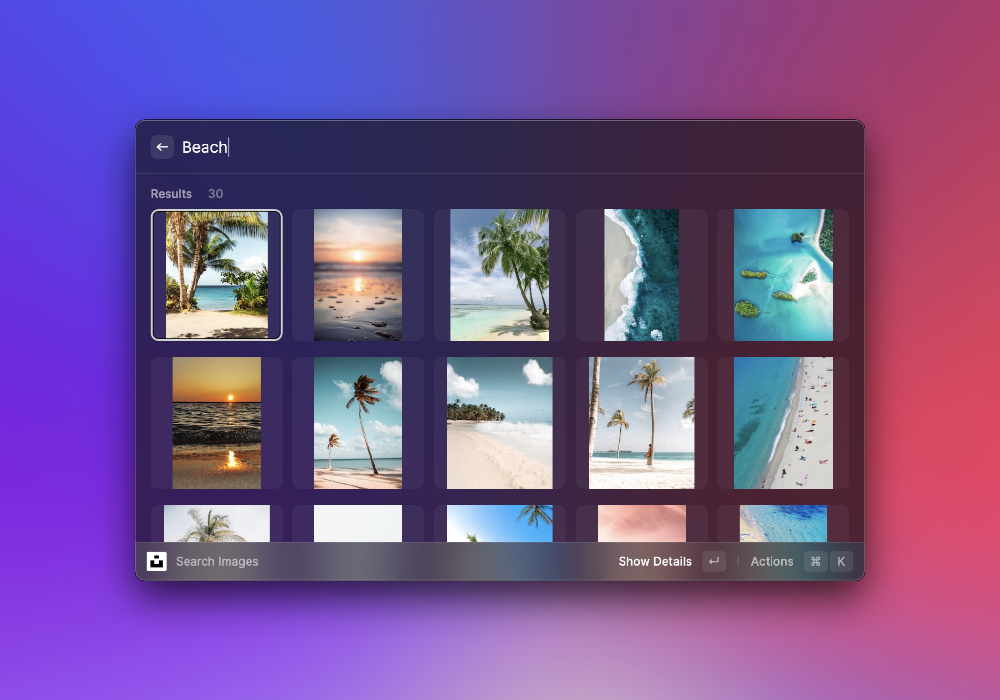
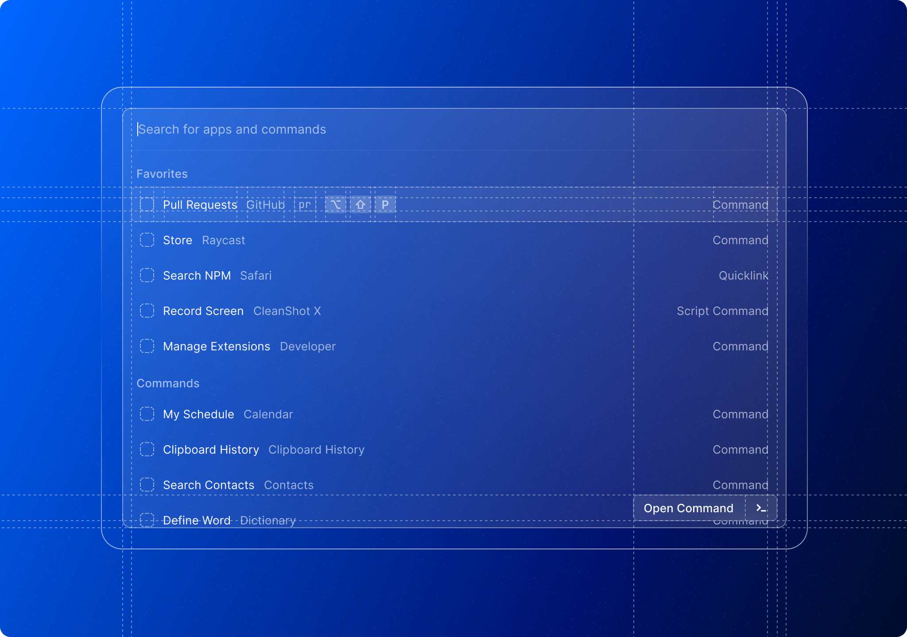

# Changelog

## 1.37.0 – 2022-06-29

### ✨ New

- **React 18**: React Suspense, `useSyncExternalStore`, etc.. A whole bunch of new features are available with the newest version of React. See the [migration guide](https://developers.raycast.com/migration/v1.37.0) for more information.
- **Quick Look:** Use the new `<Action.ToggleQuickLook />` action to show additional information with a Quick Look preview.
- **Forms:** Use the new validation feature to check if entered data is correctly formatted and show failure messages with a nice UX
- **Forms:** Drafts support – use the feature if you want Raycast to preserve non-submitted data, to provide the best experience for users
- **DevX:** Check out the new screenshot tool that takes a photo of Raycast from the best possible angle

### 💎 Improvements

- **List Accessories**: You can now pass `{date: Date}` as an accessory and it will be rendered nicely by Raycast.
- **Detail View:** Add support for `- [ ] task` and `- [x] task` in markdown views.
- **Action Panel**: Add a new `onOpen` callback on `ActionPanel.Submenu`. It can, for example, be used to lazily fetch the content of the Submenu.
- **Grid**: Add support for `ColorLike` as Grid.Item’s content.
- **Forms:** New callbacks `onFocus` and `onBlur` for all the items
- **Forms:** Markdown highlighting for the `Form.TextArea`

### 🐞 Fixes

- **Misc:** Fixed a crash when using `<List>{response?.website && <List.Item title={response.website} />}</List>` and `website` is an empty string ([Issue 1845](https://github.com/raycast/extensions/issues/1845)).
- **Dev Tools**: Fixed uninstalling of local development extensions via the Action Panel
- **Markdown**: Fixed rendering of transparent animated gifs in markdown
- **Forms:** Fixed an issue when entering characters with IME ([Issue 739](https://github.com/raycast/extensions/issues/739)) in controlled text inputs
- **List Accessories:** Fixed the tooltip for grouped accessories; now the tooltip will be shown for the group instead of separately for the items

## 1.36.0 – 2022-06-01

### ✨ New

The `<Grid />` component’s made its way to our API. It’s perfect to layout media-heavy information, such as icons, images or colors. The component allows you to layout differently sized items. We designed [its API](https://developers.raycast.com/api-reference/user-interface/list) close to the `<List />` component  for smooth adoption.

### 🐞 Fixes

- Fixed the controlled mode for `Form.DatePicker`
- Fixed the dynamic appearance of form item’s `info` accessory
- Fixed the OAuth logout preference not being shown for single-command extensions
- Fixed a bug where components that are pushed with the same properties values would not be updated ([Issue 1843](https://github.com/raycast/extensions/issues/1843))
- Fixed a bug where updated list metadata items would cause unnecessary list reloading
- Fixed an issue with tinted, resized icons appearing blurred in some cases (e.g. Alerts)

## 1.35.0 – 2022-05-18

### ✨ New

- **List Item Metadata**: we’ve added a new `metadata` property to the `List.Item.Detail` component, allowing you to add structured metadata. The `metadata` property can be used together with `markdown`, in which case the detail view will be split horizontally, with the markdown being displayed in the top half and the metadata displayed in the bottom half (similar to the `File Search`, `Clipboard History` or `Search Contacts` commands). Alternatively, it can be used by itself, in which case the metadata will take up the entire height of the detail view.
- **Preferences**: We’ve added two new top-level methods `openExtensionPreferences` and `openCommandPreferences` that allow you to open both extension and command preferences, for example, via an Action ([Issue 179](https://github.com/raycast/extensions/issues/179))

### 💎 Improvements

- Added a new development action to clear the local storage of an extension

### 🐞 Fixes

- Fixed a bug where the wrong form element onChange handler would be called initially while the form was being updated ([Issue 1633](https://github.com/raycast/extensions/issues/1633))
- Fixed a bug where form elements would not be re-rendered correctly ([Issue 1663](https://github.com/raycast/extensions/issues/1663))
- Fixed a bug where a fully controlled form TextField/PasswordField behaves as stateful ([Issue 1093](https://github.com/raycast/extensions/issues/1093))
- Fixed `EmptyView` not being displayed when it would be reused in a navigation stack

## 1.34.0 – 2022-05-04

### 💎 Improvements

- OAuth: TokenSets are now included in the encrypted Raycast export (Raycast Preferences > Advanced > Export)
- OAuth: The convenience method `TokenSet.isExpired()` now includes some buffer time to reduce the risk of performing requests with expired access tokens

### 🐞 Fixes

- Fixed an issue where updating the search bar accessory would result in the search bar text being selected
- Forms: We’ve fixed some inconsistencies around form item properties and added new warnings (e.g. when `defaultValue` and `value` are set at the same time); this also fixes [Issue 1104](https://github.com/raycast/extensions/issues/1104)
- Forms: Fixed an issue where updating form items would lead to unwanted scrolling; fixed the `autoFocus` property not scrolling to the focused item
- Fixed an issue with `Action.OpenWith` trying to perform a state update without checking whether it’s still mounted ([Issue 1495](https://github.com/raycast/extensions/issues/1495)).
- Fixed an issue where `adjustContrast` would not be respected for colored TagPicker items.

## 1.33.0 – 2022-04-20

### ✨ New

- **OAuth**: we've added a new API that enables you to authorize extensions through OAuth providers such as Google, Twitter, Dropbox or Spotify ([Issue #178](https://github.com/raycast/extensions/issues/178)). The docs contain a [new detailed guide](https://developers.raycast.com/api-reference/oauth) and we've added some integration examples to the extensions repository. (Note that we currently only support OAuth 2.0 with PKCE, more on that in the [guide](https://developers.raycast.com/api-reference/oauth).)
- **Form Focus**: use the new imperative form API to programmatically focus form items. Want to make sure a particular input is focused on mount? Form items now accept an `autoFocus` prop! ([Issue #66](https://github.com/raycast/extensions/issues/66))
- **Form Reset**: use the new imperative form API to reset form items’ values to their initial values.
- **Form Info:** Use the new `info` prop on form items to show additional information about an item, e.g. to explain what this field is used for.
- The Raycast window opens automatically when you start a development session for an extension. You can turn the behavior off in the Advanced preferences tab.

### 💎 Improvements

- Improved detection of default editor when you open extensions from Raycast
- Improved templates for list, form and detail
- Removed `react-devtools` from `devDependencies` for newly created extensions (so that you don't have to download a big dependency that you might not use)

### 🐞 Fixes

- Fixed an issue where animated gifs would be incorrectly scaled when size attributes are specified in markdown.
- Form Checkbox now returns proper boolean values on submit

## 1.32.0 – 2022-04-06

### ✨ New

- **List Tooltips**: List items now support tooltips for the title, subtitle, icon, and each accessory item. For titles, you can use the new type `{ value: string, tooltip: string }`, for icons `{ value: Image.ImageLike, tooltip: string }`, and for accessories you just add the new property `tooltip`.
- **Animated Gifs**: the `Detail` component now renders animated gifs defined in markdown! 🎭

### 💎 Improvements

- Improved recovering the Node process after a crash and logging the error to the CLI output
- Added support for running CLI commands through `npx @raycast/api <commandName>`
- Improved the `Create Extension` command to add `README.md` and `CHANGELOG.md` files

### 🐞 Fixes

- **Detail Metadata**: Fixed toggling (showing/hiding)
- **Detail Metadata**: Fixed only one separator item getting rendered
- **Detail Metadata**: Fixed a crash when using primary or secondary colors for tag items
- **List Accessories**: Fixed rendering when using `undefined` for accessory values
- **List EmptyView**: Fixed an issue where passing a `List.EmptyView` child to a `List.Section` would treat it as a `List.Item`
- **SVG**: Fixed rendering base64 encoded SVG images
- Fixed loading when a new command is launched by hotkey while another command is open

## 1.31.0 – 2022-03-23

### ✨ New

- **Detail Metadata**: we’ve added a new property `metadata` to the `Detail` component; this allows you to add structured metadata that is displayed on the right side in a detail view (similar to the Linear, Asana or Jira extensions). We support types such as labels, coloured tags, links, and separators. ([Issue #219](https://github.com/raycast/extensions/issues/219))
- **List Accessories**: list components can now show multiple accessory items through the new `accessories` property. (Previously you could only configure one `accessoryTitle` and `accesoryIcon`, both of which continue to work but have been marked deprecated.) Each item can be configured as text-only, icon-only, or icon + text. ([Issue #72](https://github.com/raycast/extensions/issues/72))
- **List Empty View**: list components can define a new `EmptyView` that gives you control over the icon, title, description and optional actions to use when there are no items in a list. (Previously we would default to a “No results” view.) You can use the component to show a custom image and text when the search does not return results or the user is required to first perform some setup. ([Issue #447](https://github.com/raycast/extensions/issues/447))

### 💎 Improvements

- **Environment**: the current theme (`"dark" | "light"`) configured via Raycast appearance preferences is now globally accessible through `environment.theme`
- **SVG**: You can now specify width and height attributes for images in markdown (`` tag).
- **Dev Tools:** the “Create Extension” command lets you add categories to your extension; the categories are displayed alongside the new metadata on our revamped details page in the store.
- **Dev Tools**: added a new development action to clear the local assets cache, e.g. to render an updated list icon without having to restart Raycast. ([Issue #1095](https://github.com/raycast/extensions/issues/1095))
- **Preferences**: the `required` property in manifest preferences is now optional.

### 🐞 Fixes

- Fixed the extension icon not being updated during development.
- Fixed an extension’s cached icon not being cleared when updated from the store. (Note that other dynamically loaded images in the assets folder may still be cached, so if you want to enforce an update for end users you need to rename them.)
- Fixed an edge case where some search bar characters would be wrongly passed to pushed lists in a navigation stack.

## 1.30.2 – 2022-03-11

### 🐞 Fixes

- Fixed updating the list `isShowingDetail` property
- Fixed unnecessarily reloading the list detail view on search term changes

## 1.30.0 - 2022-03-09

### ✨ New

- We’ve added the highly requested **search bar dropdown** 🎉 ([Issue #72](https://github.com/raycast/extensions/issues/72)): you can now add a dropdown component as an accessory to the search bar; the dropdown shows up in the top-right corner and can be used for filtering lists and toggling list states. (So it’s a good time to remove any workarounds with actions or navigation for showing a different set of items in the list.)
- The **search bar text** 🔎 can now be programmatically updated ([Issue #281](https://github.com/raycast/extensions/issues/281)) while you can still opt into built-in filtering at the same time
- **List-detail views**: list views now support a `detail` property that allows you to display a detail view on the right-hand side of list items ([Issue #83](https://github.com/raycast/extensions/issues/83)) 👯‍♂️; you can use the feature to display additional content side-by-side as users scroll through the list
- Support for rendering **SVG files** 🖼️ where images are accepted ([Issue #77](https://github.com/raycast/extensions/issues/77)), including in the `Detail` view’s markdown
- New method `Clipboard.readText()` to read the last copied text from the system’s clipboard 📋
- Added a new prop `type` to `Form.DatePicker` 📅 to control the date components asked from the user

### 💎 Improvements

- **Toast action handlers** 🍞 can now still be called if the toast outlives a dismissed extension
- Support for multiple actions of type `Action.SubmitForm` in a form’s Action Panel

### 🐞 Fixes

- Fixed some flickering that could happen when using `React.memo`
- Fixed a few edge cases around Action Panels
- Fixed duplicated shortcut shown in the Action Panel’s tooltip when setting the default shortcut explicitly on the primary action
- Fixed updating a `Form.Description` component

## 1.29.0 - 2022-02-23

### ✨ New

- Add 2 new Actions: `Action.CreateSnippet` and `Action.CreateQuicklink`. Use them in your extensions to provide users an option to integrate deeper with Raycast, for example, by creating a Quicklink from a frequently visited website.

### 💎 Improvements

- Various documentation fixes and improvements such as new media for UI components.
- Synchronous React state update calls are now batched, leading to less re-rendering.
- Markdown comments will now be hidden in the `Detail` view

### 🐞 Fixes

- Fixed a crash that could happen when switching between a development and store version of an extension or restarting the Node connection.
- Fixed an issue with React Developer Tools sometimes not getting opened.
- Limit the width that the `ActionPanel` can take.

## 1.28.0 - 2022-02-09

### 💎 Improvements

- Completely **revised (backwards-compatible) API** – new namespaces, better organisation, more consistency, updated templates, revamped docs. Check out the full [migration guide](https://developers.raycast.com/migration/v1.28.0) and get rid of those deprecation warnings. (At the same time, don’t worry, your extension is going to work as before, even if you don’t take immediate action.)
- We’ve **prettified the CLI output** 💅: all output is now more colourful, cleaner and easier to parse. Update the npm package to v1.28.0 to get the latest CLI for development.
- **Fallback images**: You can now specify local asset files or built-in icons that are displayed when image loading fails, for example when a remote file is missing ([Issue #108](https://github.com/raycast/extensions/issues/108)); [see the docs](https://developers.raycast.com/api-reference/user-interface/icons-and-images)
- **Toasts** are now passed as argument to their action callback, so you can directly act on them in the handler function (for example, hiding them)
- **Extensions feedback:** We’ve added **better bug report and feature request actions** both to the store details page of an extension and to the error screen; the actions prefill some data already in the templates so that reporting issues and feature requests becomes easier for end users.

### 🐞 Bugfixes

- Fixed tag picker images and emojis not being properly displayed (​​[Issue #493](https://github.com/raycast/extensions/issues/493))

## 1.27.1 - 2022-01-28

### 💎 Improvements

- **Preferences:** Added a new app picker preference type – useful if you want to let users customize their apps to use for opening files, folders and URLs [Issue #98](https://github.com/raycast/extensions/issues/98)
- **Forms:** Added new `Form.PasswordField` that allows you to show secure text fields ([Issue #319](https://github.com/raycast/extensions/issues/319) and [Issue #44](https://github.com/raycast/extensions/issues/44))
- **Forms:** Added new `Form.Description` component that allows you to show a simple label
- Added a new top-level `open` method that gives you more flexibility for opening files, folders, and URLs with default apps or specified apps, often making using an external npm package unnecessary (the built-in open action use our method under the hood)
- **Node:** added security enhancements for the managed Node runtime such as verification of the executable, configuring executable permissions, and removing unnecessary files
- **CLI:** Added more error info output to build errors
- **CLI:** Added a new `—fix` flag to the `lint` command (applies ESLint and prettier fixes)
- **Create Extension Command:** Updated the templates to include a `fix-lint` script; added prettier to devDependencies

### 🐞 Bugfixes

- **Forms:** Fixed `onChange` callback behaviour to be consistent across all components
- **Forms:** Fixed generic updates of titles for all components ([Issue #687](https://github.com/raycast/extensions/issues/687))
- **Preferences:** Fixed a bug in dropdown preferences returning the defined default value, even if the default is not part of the list values
- **Preferences:** Fixed the `data` property not being treated as required for the dropdown
- **Preferences:** Fixed defined initial values not being ignored (use default only)
- **List:** Fixed same-rank items with identical names being non-deterministically ordered
- Fixed a bug with open actions causing double opening via the default and specified app
- **CLI:** Removed auto-installation of npm dependencies through the downloaded npm

## 1.27.0 - 2022-01-12

### 💎 Improvements

- **Developer Tools:** Added `Open Support Directory` action to local dev extensions
- **Developer Tools**: Removed auto-injecting of globals for enabling React Developer Tools in dev mode
- **Developer Tools**: Added `prettier` checks to CLI `lint` command
- **Documentation:** Updates and fixes

### 🐞 Bugfixes

- **Forms:** Fixed controlled updates for the `Form.TagPicker`
- **Navigation**: Fixed a bug where a programmatic pop, followed by a manual pop (e.g. ESC) could lead to wrong state ([Issue #571](https://github.com/raycast/extensions/issues/571))

## 1.26.3 - 2021-12-16

### ✨ New

- New API for **Alert** views: Alerts are useful for destructive actions or actions that require user confirmation; new methods let you display our beautiful native Alert component\
  ([Issue #48](https://github.com/raycast/extensions/issues/48))
- New API for **interactive Toasts**: you can now add buttons to Toasts, e.g. to give the user options for created items, to open the browser, or for any other relevant context ([Issue #438](https://github.com/raycast/extensions/issues/438))
- New API for retrieving the current **Finder selection**: unlocks a couple of use cases for extensions that perform actions on selected files and folders ([Issue #153](https://github.com/raycast/extensions/issues/153))

### 💎 Improvements

- Improved ranking for fuzzy search in lists with sections and keywords
- The icon of the `OpenWithAction` can now be customised
- The env var NODE_EXTRA_CA_CERTS is now being propagated so that custom certificates can be configured
- Improved the CLI error message when an entry point file from the manifest is missing ([Issue #495](https://github.com/raycast/extensions/issues/495))

### 🐞 Bugfixes

- Textfields do not auto-transform certain characters such as dashes any more ([Issue #491](https://github.com/raycast/extensions/issues/491) and [Issue #360](https://github.com/raycast/extensions/issues/360))

### ⚙️ Build Updates

- This CLI of this version contains an update of the build tool with changed (and "more compatible") heuristics around how `default` exports are handled. This means that you should double check whether `import` statements for certain npm packages need to be adjusted.\
  **Example**: `import caniuse from "caniuse-api"` has to be changed to `import * as caniuse from "caniuse-api"` because of the missing `default` export of the built `caniuse` library that has to run in a Node environment.

## 1.25.7 - 2021-11-26

### 💎 Improvements

- Keywords added to list items are now matched again by prefixes (exact matches were required previously)
- Extensions are now checked for version compatibility before updating and installation
- New and updated templates available in the "Create Extension" scaffolding command

### 🐞 Bugfixes

- Modifications to list item keywords could result in wrong list filtering
- Fixed a regression where the CLI would not automatically install dependencies when building the extension
- DatePicker form element now returns the time component when specified
- Animated toasts are now automatically dismissed when the extension is unloaded
- Forms don't accidentally trigger draft creation mode any more
- Extensions which are off by default are now correctly disabled

## 1.25.5 - 2021-11-18

### 💎 Improvements

- Full fuzzy search by default for lists using built-in filtering
- Faster list loading times
- Better default auto-layout of list item title, subtitle and accessories
- Extension support directory does not need to be explicitly created any more
- Raycast is no longer automatically brought to the foreground for failure toasts
- New default action to open a bug report on production error screens in extensions

### 🐞 Bugfixes

- Updated extension icons are now displayed without having to re-install the dev extension
- Focus is now kept on the current form element when re-rendering
- Caret does not jump to the end of the string in controlled textfields and textareas any more (one edge left that is going to be tackled in one of the next releases)
- "Disable pop to root search" developer preference is now only applied for commands that are under active development
- Documentation fixes and updates

## 1.25.4 - 2021-11-11

### 💎 Improvements

- Updating of items and submenus while the action panel is open
- Supporting all convenience actions with primary shortcut (cmd + enter) on form views
- Better error handling when the API cannot be loaded after failed app updates

### 🐞 Bugfixes

- Loading indicator in detail views when used in a navigation stack

## 1.25.2 - 2021-10-28

### 💎 Improvements

- Improved ActionPanel updating performance

### 🐞 Bugfixes

- `searchBarPlaceholder` updates when using the list in a navigation stack
- Wrong action panel actions when popping back in a navigation stack
- Empty state flickering when updating the `isLoading` property in lists
- Accessory and subtitle label truncation in lists
- Icon from assets tinting on dynamic theme changes
- Dynamic removal of form elements
- Open actions leading to Node env vars being set for the opened application
- Some extensions not getting loaded for a particular Node setup
- Local storage values being lost when extensions are automatically updated

## 1.25.1 - 2021-10-20

### 🐞 Bugfixes

- Fixed configuring `tintColor` for icons in `ActionPanel` and `Form.Dropdown`
- Fixed displaying submenu icons from local assets
- Fixed tinting of icons provided from local assets
- Fixed a crash with the `getSelectedText` function
- Fixed the main window sometimes not shown when an error is thrown from a command
- Fixed the `OpenWithAction` not working for some apps
- Fixed the list empty state not being shown in certain cases when using custom filtering
- Fixed the the topmost item not automatically being selected for custom list filtering
- Fixed the line number info in error stack traces sometimes not being correct
- Fixed an issue where installing store extension would sometimes fail
- Fixed a crash that could be caused by sending invalid codepoints from an extension
- Fixed a bug where no error would be shown when the runtime download failed
- Fixed reaching the max. call stack size when logging recursive object structures (this could happen when you console logged a React component, for example).

## 1.25.0 - 2021-10-13

### Hello World

It's happening! We're opening up our API and store for public beta.

This is a big milestone for our community. We couldn't have pulled it off without our alpha testers. A massive shoutout to everybody who helped us shape the API. Now let's start building. We can't wait to see what you will come up with.
