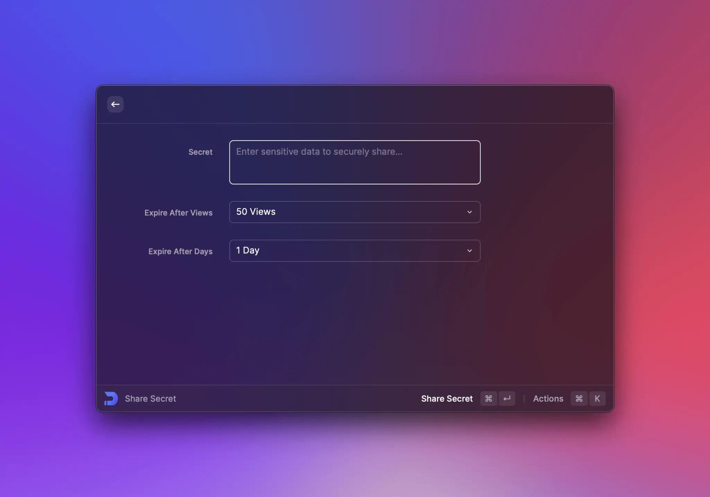

# Doppler Share Secrets


The full source code of the example can be found [here](https://github.com/raycast/extensions/tree/main/extensions/doppler-share-secrets#readme). You can install the extension [here](https://www.raycast.com/thomas/doppler-share-secrets).


In this example we use a form to collect inputs from a user. To make it interesting, we use [Doppler](http://share.doppler.com) which is a service to make it easy to securely share sensitive information such as API keys or passwords.



The extension has multiple commands. In this example we're using a simple form with a textfield for the secret, a dropdown for an expiration after views and a second dropdown for an alternate expiration after a maximum of days.

## Add form items

First, we render the static form. For this we add all the mentioned form items:

```typescript
import { Action, ActionPanel, Clipboard, Form, Icon, showToast, Toast } from "@raycast/api";
import got from "got";

export default function Command() {
  return (
    <Form>
      <Form.TextArea id="secret" title="Secret" placeholder="Enter sensitive data to securely share…" />
      <Form.Dropdown id="expireViews" title="Expire After Views" storeValue>
        <Form.Dropdown.Item value="1" title="1 View" />
        <Form.Dropdown.Item value="2" title="2 Views" />
        <Form.Dropdown.Item value="3" title="3 Views" />
        <Form.Dropdown.Item value="5" title="5 Views" />
        <Form.Dropdown.Item value="10" title="10 Views" />
        <Form.Dropdown.Item value="20" title="20 Views" />
        <Form.Dropdown.Item value="50" title="50 Views" />
        <Form.Dropdown.Item value="-1" title="Unlimited Views" />
      </Form.Dropdown>
      <Form.Dropdown id="expireDays" title="Expire After Days" storeValue>
        <Form.Dropdown.Item value="1" title="1 Day" />
        <Form.Dropdown.Item value="2" title="2 Days" />
        <Form.Dropdown.Item value="3" title="3 Days" />
        <Form.Dropdown.Item value="7" title="1 Week" />
        <Form.Dropdown.Item value="14" title="2 Weeks" />
        <Form.Dropdown.Item value="30" title="1 Month" />
        <Form.Dropdown.Item value="90" title="3 Months" />
      </Form.Dropdown>
    </Form>
  );
}
```

Both dropdowns set the `storeValue` to true. This restores the last selected value when the command is opened again. This option is handy when your users select the same options often. In this case, we assume that users want to keep the expiration settings persisted.

## Submit form values

Now that we have the form, we want to collect the inserted values, send them to Doppler and copy the URL that allows us to share the information securely. For this, we create a new action:

```tsx
function ShareSecretAction() {
  async function handleSubmit(values: { secret: string; expireViews: number; expireDays: number }) {
    if (!values.secret) {
      showToast({
        style: Toast.Style.Failure,
        title: "Secret is required",
      });
      return;
    }

    const toast = await showToast({
      style: Toast.Style.Animated,
      title: "Sharing secret",
    });

    try {
      const { body } = await got.post("https://api.doppler.com/v1/share/secrets/plain", {
        json: {
          secret: values.secret,
          expire_views: values.expireViews,
          expire_days: values.expireDays,
        },
        responseType: "json",
      });

      await Clipboard.copy((body as any).authenticated_url);

      toast.style = Toast.Style.Success;
      toast.title = "Shared secret";
      toast.message = "Copied link to clipboard";
    } catch (error) {
      toast.style = Toast.Style.Failure;
      toast.title = "Failed sharing secret";
      toast.message = String(error);
    }
  }

  return <Action.SubmitForm icon={Icon.Upload} title="Share Secret" onSubmit={handleSubmit} />;
}
```

Let's break this down:

- The `<ShareSecretAction>` returns an [`<Action.SubmitForm>`](../api-reference/user-interface/actions.md#action.submitform).
- The `handleSubmit()` gets called when the form is submitted with it's values.
  - First we check if the user entered a secret. If not, we show a toast.
  - Then we show a toast to hint that there is a network call in progress to share the secret.
  - We call [Doppler's API](https://docs.doppler.com/reference/share-secret) with the form values
    - If the network response succeeds, we copy the authenticated URL to the clipboard and show a success toast.
    - If the network response fails, we show a failure toast with additional information about the failure.

## Wire it up

The last step is to add the `<ShareSecretAction>` to the form:

```typescript
import { Action, ActionPanel, Clipboard, Form, Icon, showToast, Toast } from "@raycast/api";
import got from "got";

export default function Command() {
  return (
    <Form
      actions={
        <ActionPanel>
          <ShareSecretAction />
        </ActionPanel>
      }
    >
      <Form.TextArea id="secret" title="Secret" placeholder="Enter sensitive data to securely share…" />
      <Form.Dropdown id="expireViews" title="Expire After Views" storeValue>
        <Form.Dropdown.Item value="1" title="1 View" />
        <Form.Dropdown.Item value="2" title="2 Views" />
        <Form.Dropdown.Item value="3" title="3 Views" />
        <Form.Dropdown.Item value="5" title="5 Views" />
        <Form.Dropdown.Item value="10" title="10 Views" />
        <Form.Dropdown.Item value="20" title="20 Views" />
        <Form.Dropdown.Item value="50" title="50 Views" />
        <Form.Dropdown.Item value="-1" title="Unlimited Views" />
      </Form.Dropdown>
      <Form.Dropdown id="expireDays" title="Expire After Days" storeValue>
        <Form.Dropdown.Item value="1" title="1 Day" />
        <Form.Dropdown.Item value="2" title="2 Days" />
        <Form.Dropdown.Item value="3" title="3 Days" />
        <Form.Dropdown.Item value="7" title="1 Week" />
        <Form.Dropdown.Item value="14" title="2 Weeks" />
        <Form.Dropdown.Item value="30" title="1 Month" />
        <Form.Dropdown.Item value="90" title="3 Months" />
      </Form.Dropdown>
    </Form>
  );
}

function ShareSecretAction() {
  async function handleSubmit(values: { secret: string; expireViews: number; expireDays: number }) {
    if (!values.secret) {
      showToast({
        style: Toast.Style.Failure,
        title: "Secret is required",
      });
      return;
    }

    const toast = await showToast({
      style: Toast.Style.Animated,
      title: "Sharing secret",
    });

    try {
      const { body } = await got.post("https://api.doppler.com/v1/share/secrets/plain", {
        json: {
          secret: values.secret,
          expire_views: values.expireViews,
          expire_days: values.expireDays,
        },
        responseType: "json",
      });

      await Clipboard.copy((body as any).authenticated_url);

      toast.style = Toast.Style.Success;
      toast.title = "Shared secret";
      toast.message = "Copied link to clipboard";
    } catch (error) {
      toast.style = Toast.Style.Failure;
      toast.title = "Failed sharing secret";
      toast.message = String(error);
    }
  }

  return <Action.SubmitForm icon={Icon.Upload} title="Share Secret" onSubmit={handleSubmit} />;
}
```

And there you go. A simple form to enter a secret and get a URL that you can share with others that will "destroy itself" accordingly to your preferences. As next steps, you could use the `<PasteAction>` to paste the link directly to front-most application or add another action that clears the form and let's you create another shareable link.
