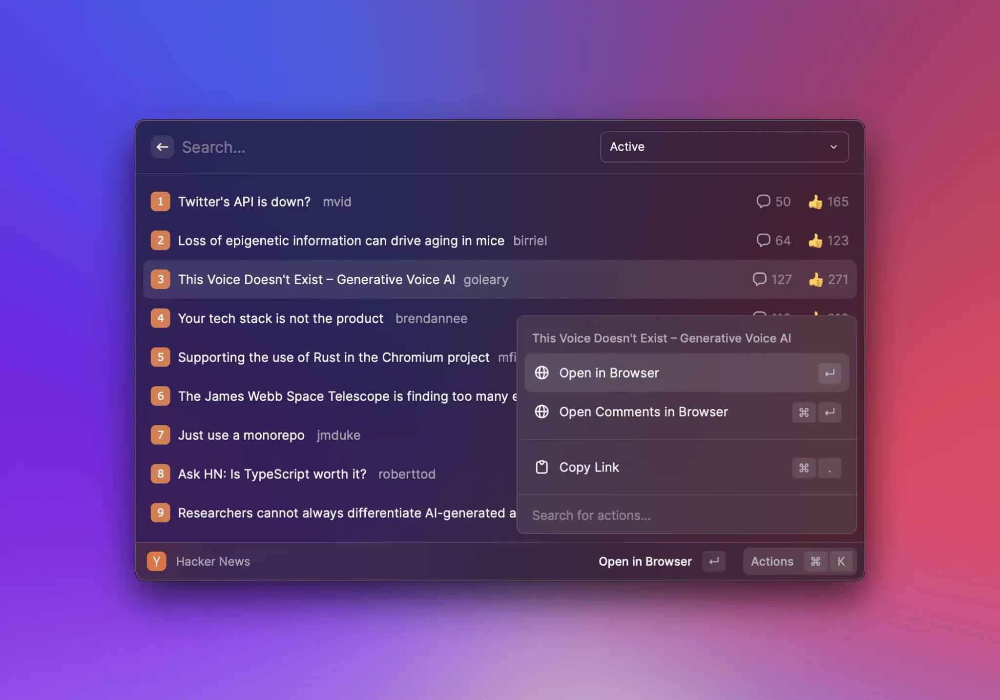

# Hacker News


The source code of the example can be found [here](https://github.com/raycast/extensions/tree/main/extensions/hacker-news#readme). You can install it [here](https://www.raycast.com/thomas/hacker-news).


Who doesn't like a good morning read on [Hacker News](https://news.ycombinator.com) with a warm coffee?! In this example, we create a simple list with the top stories on the frontpage.



## Load top stories

First, let's get the latest top stories. For this we use a [RSS feed](https://hnrss.org):

```typescript
import { Action, ActionPanel, List, showToast, Toast, Keyboard } from "@raycast/api";
import { useEffect, useState } from "react";
import Parser from "rss-parser";

const parser = new Parser();

interface State {
  items?: Parser.Item[];
  error?: Error;
}

export default function Command() {
  const [state, setState] = useState<State>({});

  useEffect(() => {
    async function fetchStories() {
      try {
        const feed = await parser.parseURL("https://hnrss.org/frontpage?description=0&count=25");
        setState({ items: feed.items });
      } catch (error) {
        setState({
          error: error instanceof Error ? error : new Error("Something went wrong"),
        });
      }
    }

    fetchStories();
  }, []);

  console.log(state.items); // Prints stories

  return <List isLoading={!state.items && !state.error} />;
}
```

Breaking this down:

- We use a third-party dependency to parse the RSS feed and intially the parser.
- We define our command state as a TypeScript interface.
- We use [React's `useEffect`](https://reactjs.org/docs/hooks-effect.html) hook to parse the RSS feed after the command did mount.
- We print the top stories to the console.
- We render a list and show the loading indicator as long as we load the stories.

## Render stories

Now that we got the data from Hacker News, we want to render the stories. For this, we create a new React component and a few helper functions that render a story:

```typescript
function StoryListItem(props: { item: Parser.Item; index: number }) {
  const icon = getIcon(props.index + 1);
  const points = getPoints(props.item);
  const comments = getComments(props.item);

  return (
    <List.Item
      icon={icon}
      title={props.item.title ?? "No title"}
      subtitle={props.item.creator}
      accessories={[{ text: `👍 ${points}` }, { text: `💬  ${comments}` }]}
    />
  );
}

const iconToEmojiMap = new Map<number, string>([
  [1, "1️⃣"],
  [2, "2️⃣"],
  [3, "3️⃣"],
  [4, "4️⃣"],
  [5, "5️⃣"],
  [6, "6️⃣"],
  [7, "7️⃣"],
  [8, "8️⃣"],
  [9, "9️⃣"],
  [10, "🔟"],
]);

function getIcon(index: number) {
  return iconToEmojiMap.get(index) ?? "⏺";
}

function getPoints(item: Parser.Item) {
  const matches = item.contentSnippet?.match(/(?<=Points:\s*)(\d+)/g);
  return matches?.[0];
}

function getComments(item: Parser.Item) {
  const matches = item.contentSnippet?.match(/(?<=Comments:\s*)(\d+)/g);
  return matches?.[0];
}
```

To give the list item a nice look, we use a simple number emoji as icon, add the creator's name as subtitle and the points and comments as accessory title. Now we can render the `<StoryListItem>`:

```typescript
export default function Command() {
  const [state, setState] = useState<State>({});

  // ...

  return (
    <List isLoading={!state.items && !state.error}>
      {state.items?.map((item, index) => (
        <StoryListItem key={item.guid} item={item} index={index} />
      ))}
    </List>
  );
}
```

## Add actions

When we select a story in the list, we want to be able to open it in the browser and also copy it's link so that we can share it in our watercooler Slack channel. For this, we create a new React Component:

```typescript
function Actions(props: { item: Parser.Item }) {
  return (
    <ActionPanel title={props.item.title}>
      <ActionPanel.Section>
        {props.item.link && <Action.OpenInBrowser url={props.item.link} />}
        {props.item.guid && <Action.OpenInBrowser url={props.item.guid} title="Open Comments in Browser" />}
      </ActionPanel.Section>
      <ActionPanel.Section>
        {props.item.link && (
          <Action.CopyToClipboard
            content={props.item.link}
            title="Copy Link"
            shortcut={Keyboard.Shortcut.Common.Copy}
          />
        )}
      </ActionPanel.Section>
    </ActionPanel>
  );
}
```

The component takes a story and renders an [`<ActionPanel>`](../api-reference/user-interface/action-panel.md) with our required actions. We add the actions to the `<StoryListItem>`:

```typescript
function StoryListItem(props: { item: Parser.Item; index: number }) {
  // ...

  return (
    <List.Item
      icon={icon}
      title={props.item.title ?? "No title"}
      subtitle={props.item.creator}
      accessories={[{ text: `👍 ${points}` }, { text: `💬  ${comments}` }]}
      // Wire up actions
      actions={<Actions item={props.item} />}
    />
  );
}
```

## Handle errors

Lastly, we want to be a good citizen and handle errors appropriately to guarantee a smooth experience. We'll show a toast whenever our network request fails:

```typescript
export default function Command() {
  const [state, setState] = useState<State>({});

  // ...

  if (state.error) {
    showToast({
      style: Toast.Style.Failure,
      title: "Failed loading stories",
      message: state.error.message,
    });
  }

  // ...
}
```

## Wrapping up

That's it, you have a working extension to read the frontpage of Hacker News. As next steps, you can add another command to show the jobs feed or add an action to copy a Markdown formatted link.
