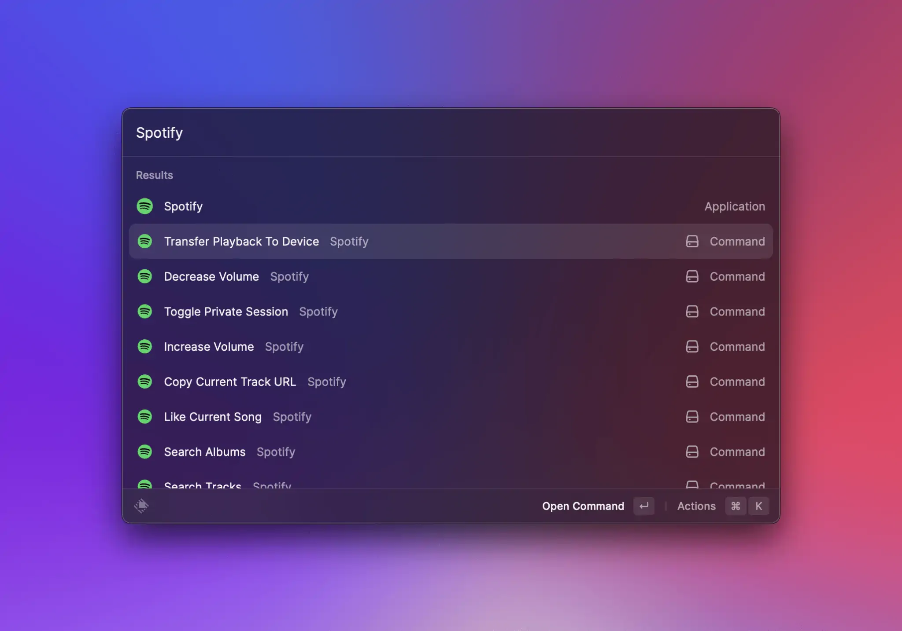

# Spotify Controls


The source code of the example can be found [here](https://github.com/raycast/extensions/tree/main/extensions/spotify-controls#readme). You can install it [here](https://www.raycast.com/thomas/spotify-controls).


This example shows how to build commands that don't show a UI in Raycast. This type of command is useful for interactions with other apps such as skipping songs in Spotify or just simply running some scripts that don't need visual confirmation.



## Control Spotify macOS app

Spotify's macOS app supports AppleScript. This is great to control the app without opening it. For this, we use the [`run-applescript`](https://www.npmjs.com/package/run-applescript) package. Let's start by toggling play pause:

```typescript
import { runAppleScript } from "run-applescript";

export default async function Command() {
  await runAppleScript('tell application "Spotify" to playpause');
}
```

## Close Raycast main window

When performing this command, you'll notice that Raycast toggles the play pause state of the Spotify macOS app but the Raycast main window stays open. Ideally the window closes after you run the command. Then you can carry on with what you did before.

Here is how you can close the main window:

```typescript
import { closeMainWindow } from "@raycast/api";
import { runAppleScript } from "run-applescript";

export default async function Command() {
  await closeMainWindow();
  await runAppleScript('tell application "Spotify" to playpause');
}
```

Notice that we call the `closeMainWindow` function before running the AppleScript. This makes the command feel snappier.

With less than 10 lines of code, you executed a script and controlled the UI of Raycast. As a next step you could add more commands to skip a track.
