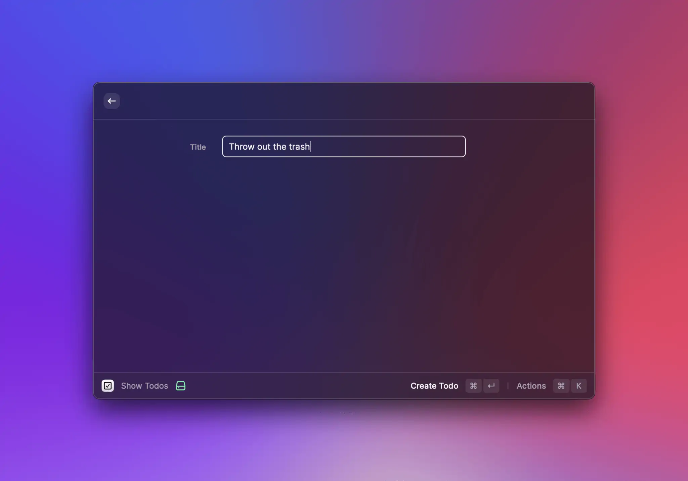

# Todo List


The source code of the example can be found [here](https://github.com/raycast/extensions/tree/main/examples/todo-list#readme).


What's an example section without a todo list?! Let's put one together in Raycast. This example will show how to render a list, navigate to a form to create a new element and update the list.


## Render todo list

Let's start with a set of todos and simply render them as a list in Raycast:

```typescript
import { List } from "@raycast/api";
import { useState } from "react";

interface Todo {
  title: string;
  isCompleted: boolean;
}

export default function Command() {
  const [todos, setTodos] = useState<Todo[]>([
    { title: "Write a todo list extension", isCompleted: false },
    { title: "Explain it to others", isCompleted: false },
  ]);

  return (
    <List>
      {todos.map((todo, index) => (
        <List.Item key={index} title={todo.title} />
      ))}
    </List>
  );
}
```

For this we define a TypeScript interface to describe out Todo with a `title` and a `isCompleted` flag that we use later to complete the todo. We use [React's `useState` hook](https://reactjs.org/docs/hooks-state.html) to create a local state of our todos. This allows us to update them later and the list will get re-rendered. Lastly we render a list of all todos.

## Create a todo

A static list of todos isn't that much fun. Let's create new ones with a form. For this, we create a new React component that renders the form:

```typescript
function CreateTodoForm(props: { onCreate: (todo: Todo) => void }) {
  const { pop } = useNavigation();

  function handleSubmit(values: { title: string }) {
    props.onCreate({ title: values.title, isCompleted: false });
    pop();
  }

  return (
    <Form
      actions={
        <ActionPanel>
          <Action.SubmitForm title="Create Todo" onSubmit={handleSubmit} />
        </ActionPanel>
      }
    >
      <Form.TextField id="title" title="Title" />
    </Form>
  );
}

function CreateTodoAction(props: { onCreate: (todo: Todo) => void }) {
  return (
    <Action.Push
      icon={Icon.Pencil}
      title="Create Todo"
      shortcut={{ modifiers: ["cmd"], key: "n" }}
      target={<CreateTodoForm onCreate={props.onCreate} />}
    />
  );
}
```

The `<CreateTodoForm>` shows a single text field for the title. When the form is submitted, it calls the `onCreate` callback and closes itself.



To use the action, we add it to the `<List>` component. This makes the action available when the list is empty which is exactly what we want to create our first todo.

```typescript
export default function Command() {
  const [todos, setTodos] = useState<Todo[]>([]);

  function handleCreate(todo: Todo) {
    const newTodos = [...todos, todo];
    setTodos(newTodos);
  }

  return (
    <List
      actions={
        <ActionPanel>
          <CreateTodoAction onCreate={handleCreate} />
        </ActionPanel>
      }
    >
      {todos.map((todo, index) => (
        <List.Item key={index} title={todo.title} />
      ))}
    </List>
  );
}
```

## Complete a todo

Now that we can create new todos, we also want to make sure that we can tick off something on our todo list. For this, we create a `<ToggleTodoAction>` that we assign to the `<List.Item>`:

```typescript
export default function Command() {
  const [todos, setTodos] = useState<Todo[]>([]);

  // ...

  function handleToggle(index: number) {
    const newTodos = [...todos];
    newTodos[index].isCompleted = !newTodos[index].isCompleted;
    setTodos(newTodos);
  }

  return (
    <List
      actions={
        <ActionPanel>
          <CreateTodoAction onCreate={handleCreate} />
        </ActionPanel>
      }
    >
      {todos.map((todo, index) => (
        <List.Item
          key={index}
          icon={todo.isCompleted ? Icon.Checkmark : Icon.Circle}
          title={todo.title}
          actions={
            <ActionPanel>
              <ActionPanel.Section>
                <ToggleTodoAction todo={todo} onToggle={() => handleToggle(index)} />
              </ActionPanel.Section>
            </ActionPanel>
          }
        />
      ))}
    </List>
  );
}

function ToggleTodoAction(props: { todo: Todo; onToggle: () => void }) {
  return (
    <Action
      icon={props.todo.isCompleted ? Icon.Circle : Icon.Checkmark}
      title={props.todo.isCompleted ? "Uncomplete Todo" : "Complete Todo"}
      onAction={props.onToggle}
    />
  );
}
```

In this case we added the `<ToggleTodoAction>` to the list item. By doing this we can use the `index` to toggle the appropriate todo. We also added an icon to our todo that reflects the `isCompleted` state.

## Delete a todo

Similar to toggling a todo, we also add the possibility to delete one. You can follow the same steps and create a new `<DeleteTodoAction>` and add it to the `<List.Item>`.

```typescript
export default function Command() {
  const [todos, setTodos] = useState<Todo[]>([]);

  // ...

  function handleDelete(index: number) {
    const newTodos = [...todos];
    newTodos.splice(index, 1);
    setTodos(newTodos);
  }

  return (
    <List
      actions={
        <ActionPanel>
          <CreateTodoAction onCreate={handleCreate} />
        </ActionPanel>
      }
    >
      {todos.map((todo, index) => (
        <List.Item
          key={index}
          icon={todo.isCompleted ? Icon.Checkmark : Icon.Circle}
          title={todo.title}
          actions={
            <ActionPanel>
              <ActionPanel.Section>
                <ToggleTodoAction todo={todo} onToggle={() => handleToggle(index)} />
              </ActionPanel.Section>
              <ActionPanel.Section>
                <CreateTodoAction onCreate={handleCreate} />
                <DeleteTodoAction onDelete={() => handleDelete(index)} />
              </ActionPanel.Section>
            </ActionPanel>
          }
        />
      ))}
    </List>
  );
}

// ...

function DeleteTodoAction(props: { onDelete: () => void }) {
  return (
    <Action
      icon={Icon.Trash}
      title="Delete Todo"
      shortcut={{ modifiers: ["ctrl"], key: "x" }}
      onAction={props.onDelete}
    />
  );
}
```

We also gave the `<DeleteTodoAction>` a keyboard shortcut. This way users can delete todos quicker. Additionally, we also added the `<CreateTodoAction>` to the `<List.Item>`. This makes sure that users can also create new todos when there are some already.

Finally, our command looks like this:

```typescript
import { Action, ActionPanel, Form, Icon, List, useNavigation } from "@raycast/api";
import { useState } from "react";

interface Todo {
  title: string;
  isCompleted: boolean;
}

export default function Command() {
  const [todos, setTodos] = useState<Todo[]>([
    { title: "Write a todo list extension", isCompleted: false },
    { title: "Explain it to others", isCompleted: false },
  ]);

  function handleCreate(todo: Todo) {
    const newTodos = [...todos, todo];
    setTodos(newTodos);
  }

  function handleToggle(index: number) {
    const newTodos = [...todos];
    newTodos[index].isCompleted = !newTodos[index].isCompleted;
    setTodos(newTodos);
  }

  function handleDelete(index: number) {
    const newTodos = [...todos];
    newTodos.splice(index, 1);
    setTodos(newTodos);
  }

  return (
    <List
      actions={
        <ActionPanel>
          <CreateTodoAction onCreate={handleCreate} />
        </ActionPanel>
      }
    >
      {todos.map((todo, index) => (
        <List.Item
          key={index}
          icon={todo.isCompleted ? Icon.Checkmark : Icon.Circle}
          title={todo.title}
          actions={
            <ActionPanel>
              <ActionPanel.Section>
                <ToggleTodoAction todo={todo} onToggle={() => handleToggle(index)} />
              </ActionPanel.Section>
              <ActionPanel.Section>
                <CreateTodoAction onCreate={handleCreate} />
                <DeleteTodoAction onDelete={() => handleDelete(index)} />
              </ActionPanel.Section>
            </ActionPanel>
          }
        />
      ))}
    </List>
  );
}

function CreateTodoForm(props: { onCreate: (todo: Todo) => void }) {
  const { pop } = useNavigation();

  function handleSubmit(values: { title: string }) {
    props.onCreate({ title: values.title, isCompleted: false });
    pop();
  }

  return (
    <Form
      actions={
        <ActionPanel>
          <Action.SubmitForm title="Create Todo" onSubmit={handleSubmit} />
        </ActionPanel>
      }
    >
      <Form.TextField id="title" title="Title" />
    </Form>
  );
}

function CreateTodoAction(props: { onCreate: (todo: Todo) => void }) {
  return (
    <Action.Push
      icon={Icon.Pencil}
      title="Create Todo"
      shortcut={{ modifiers: ["cmd"], key: "n" }}
      target={<CreateTodoForm onCreate={props.onCreate} />}
    />
  );
}

function ToggleTodoAction(props: { todo: Todo; onToggle: () => void }) {
  return (
    <Action
      icon={props.todo.isCompleted ? Icon.Circle : Icon.Checkmark}
      title={props.todo.isCompleted ? "Uncomplete Todo" : "Complete Todo"}
      onAction={props.onToggle}
    />
  );
}

function DeleteTodoAction(props: { onDelete: () => void }) {
  return (
    <Action
      icon={Icon.Trash}
      title="Delete Todo"
      shortcut={{ modifiers: ["ctrl"], key: "x" }}
      onAction={props.onDelete}
    />
  );
}
```

And that's a wrap. You created a todo list in Raycast, it's that easy. As next steps, you could extract the `<CreateTodoForm>` into a separate command. Then you can create todos also from the root search of Raycast and can even assign a global hotkey to open the form. Also, the todos aren't persisted. If you close the command and reopen it, they are gone. To persist, you can use the [storage](../api-reference/storage.md) or [write it to disc](../api-reference/environment.md#environment).
