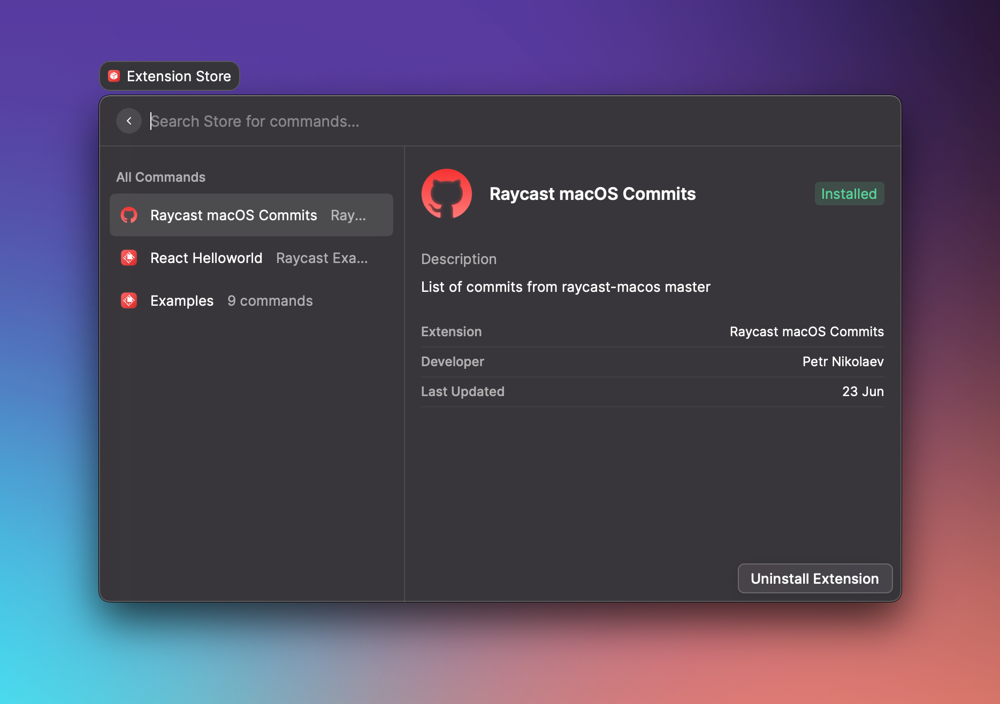

# Publish an extension

Now we have Extension Store where you can install extensions built by others. Search for "Extension Store" command in Raycast app or browse it [via web](https://raycast.com/featured) \(you need to be logged in\).

### Publish extension

All extensions from [extensions](https://github.com/raycast-api/api-alpha/blob/main/extensions) directory are automatically published by CI on new commits to `main`. So in order to publish new extension or an update, you need to create a Pull Request. We will review your changes and suggest if anything needs an update. Once accepted, we will merge your PR and it will automatically be published to the store.

Quick note for those who haven't created PRs before:

1. Fork this repository
2. Make changes in your forked repo
3. Push changes to your forked repo
4. In GitHub Web UI press Contribute -&gt; Open Pull Request

### Prepare for publishing

To avoid build failures during the publishing step, please run `npm run build` script for your extension. Under the hood it calls `ray build -e dist` and should give same errors as CI.

### Extension review

We are still in the process of figuring out what should be guidelines so expect constant changes around that topic. We will make sure to communicate all the changes with the alpha testers group.


We are still in the testing phase and we might remove extensions from the store from time to time or break something. Also, there is high chance that once we are getting closer to the public launch we'll have more strict guidelines and we might completely reset the store.


