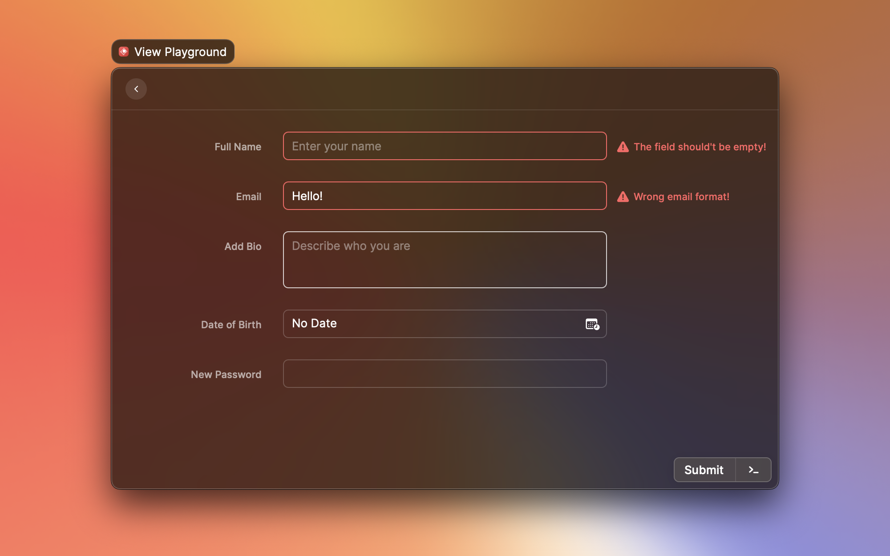

# Best Practices

## General

### Handle errors

Network requests can fail, permissions to files can be missing… More generally, errors happen. By default, we handle every unhandled exception or unresolved Promise and show error screens. However, you should handle the "expected" error cases for your command. You should aim not to disrupt the user's flow just because something went wrong. For example, if a network request fails but you can read the cache, show the cache. A user might not need the fresh data straight away. In most cases, it's best to show a `Toast` with information about the error.

Here is an example on how to show a toast for an error:

```typescript
import { Detail, showToast, Toast } from "@raycast/api";
import { useEffect, useState } from "react";

export default function Command() {
  const [error, setError] = useState<Error>();

  useEffect(() => {
    setTimeout(() => {
      setError(new Error("Booom 💥"));
    }, 1000);
  }, []);

  useEffect(() => {
    if (error) {
      showToast({
        style: Toast.Style.Failure,
        title: "Something went wrong",
        message: error.message,
      });
    }
  }, [error]);

  return <Detail markdown="Example for proper error handling" />;
}
```

### Handle runtime dependencies

Ideally, your extension doesn't depend on any runtime dependencies. In reality, sometimes locally installed apps or CLIs are required to perform functionality. Here are a few tips to guarantee a good user experience:

- If a command requires a runtime dependency to run (e.g. an app that needs to be installed by the user), show a helpful message.
  - If your extension is tightly coupled to an app, f.e. searching tabs in Safari or using AppleScript to control Spotify, checks don't always have to be strict because users most likely don't install the extension without having the dependency installed locally.
- If only some functionality of your extension requires the runtime dependency, consider making this functionality only available if the dependency is installed. Typically, this is the best case for [actions](terminology.md#action), e.g. to open a URL in the desktop app instead of the browser.

### Show loading indicator

When commands need to load big data sets, it's best to inform the user about this. To keep your command snappy, it's important to render a React component as quickly as possible.

You can start with an empty list or a static form and then load the data to fill the view. To make the user aware of the loading process, you can use the `isLoading` prop on all top-level components, e.g. [`<Detail>`](../api-reference/user-interface/detail.md), [`<Form>`](../api-reference/user-interface/form.md) or [`<List>`](../api-reference/user-interface/list.md).

Here is an example to show the loading indicator in a list:

```typescript
import { List } from "@raycast/api";
import { useEffect, useState } from "react";

export default function Command() {
  const [items, setItems] = useState<string[]>();

  useEffect(() => {
    setTimeout(() => {
      setItems(["Item 1", "Item 2", "Item 3"]);
    }, 1000);
  }, []);

  return (
    <List isLoading={items === undefined}>
      {items?.map((item, index) => (
        <List.Item key={index} title={item} />
      ))}
    </List>
  );
}
```

---

## Forms

### Use Forms Validation

When an end-user enters some data, you can check to see that this input is in a format you expect.
If the data isn't correctly formatted, you can set the `error` prop on the Form item to show a message explaining what needs to be corrected, and lets them try again.




Keep in mind that if the Form has any errors the [`Action.SubmitForm`](../api-reference/user-interface/actions.md#action.submitform) `onSubmit` callback won't be triggered.


```typescript
import { Form } from "@raycast/api";
import { useState } from "react";

export default function Command() {
  const [nameError, setNameError] = useState<string | undefined>();
  const [passwordError, setPasswordError] = useState<string | undefined>();

  function dropNameErrorIfNeeded() {
    if (nameError && nameError.length > 0) {
      setNameError(undefined);
    }
  }

  function dropPasswordErrorIfNeeded() {
    if (passwordError && passwordError.length > 0) {
      setPasswordError(undefined);
    }
  }

  return (
    <Form>
      <Form.TextField
        id="nameField"
        title="Full Name"
        placeholder="Enter your name"
        error={nameError}
        onChange={dropNameErrorIfNeeded}
        onBlur={(event) => {
          if (event.target.value?.length == 0) {
            setNameError("The field should't be empty!");
          } else {
            dropNameErrorIfNeeded();
          }
        }}
      />
      <Form.PasswordField
        id="password"
        title="New Password"
        error={passwordError}
        onChange={dropPasswordErrorIfNeeded}
        onBlur={(event) => {
          const value = event.target.value;
          if (value && value.length > 0) {
            if (!validatePassword(value)) {
              setPasswordError("Password should be at least 8 characters!");
            } else {
              dropPasswordErrorIfNeeded();
            }
          } else {
            setPasswordError("The field should't be empty!");
          }
        }}
      />
      <Form.TextArea id="bioTextArea" title="Add Bio" placeholder="Describe who you are" />
      <Form.DatePicker id="birthDate" title="Date of Birth" />
    </Form>
  );
}

function validatePassword(value: string): boolean {
  return value.length >= 8;
}
```
