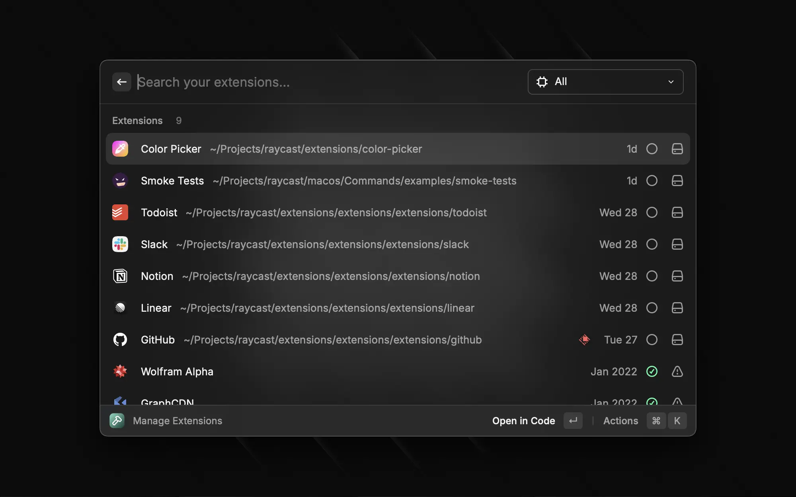
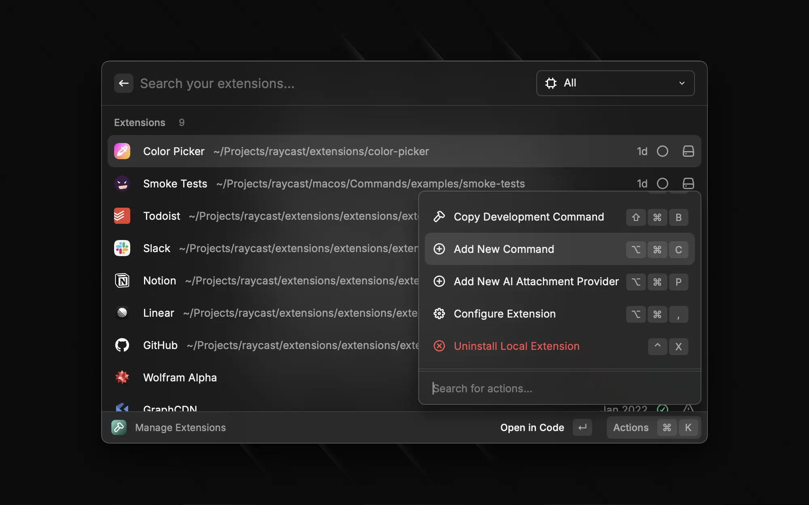

# `Manage Extensions` Command

Raycast provides a built-in command to manage your extensions.

For each extensions, there are a few actions to manage them.

## Add New Command

One such action is the `Add New Command` action.

It will prompt you for the information about the new command before updating the manifest of the extension and creating the file for you based on the template you selected.
