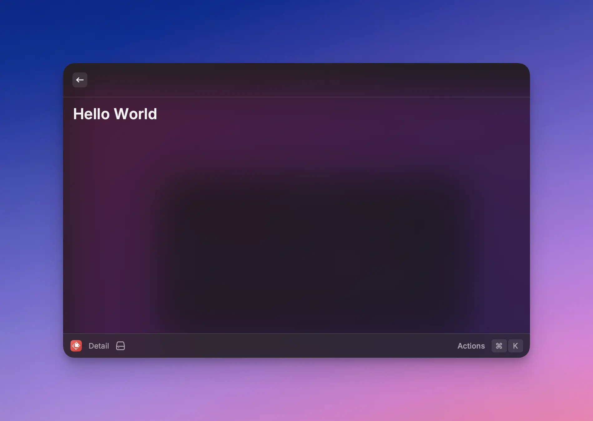
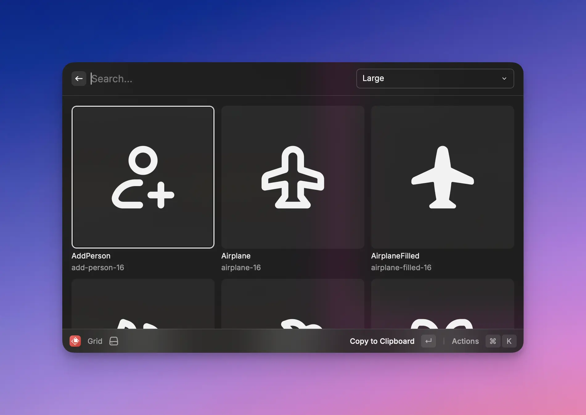
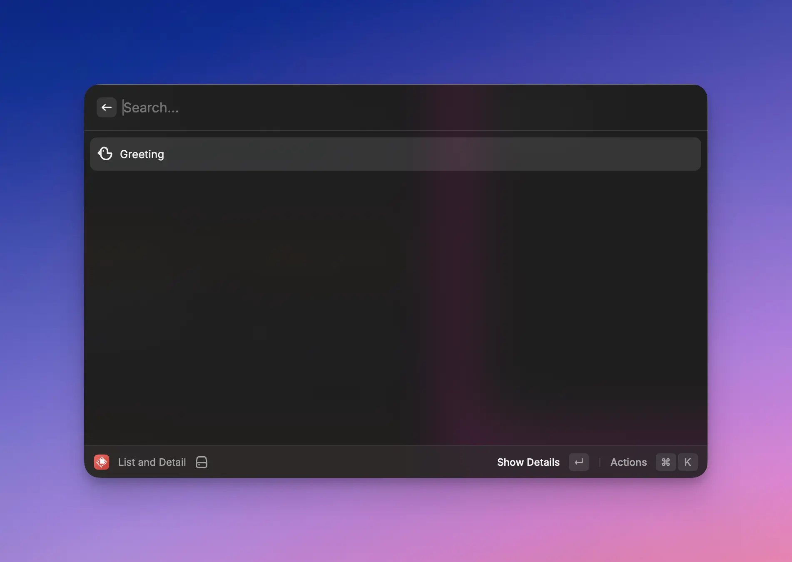
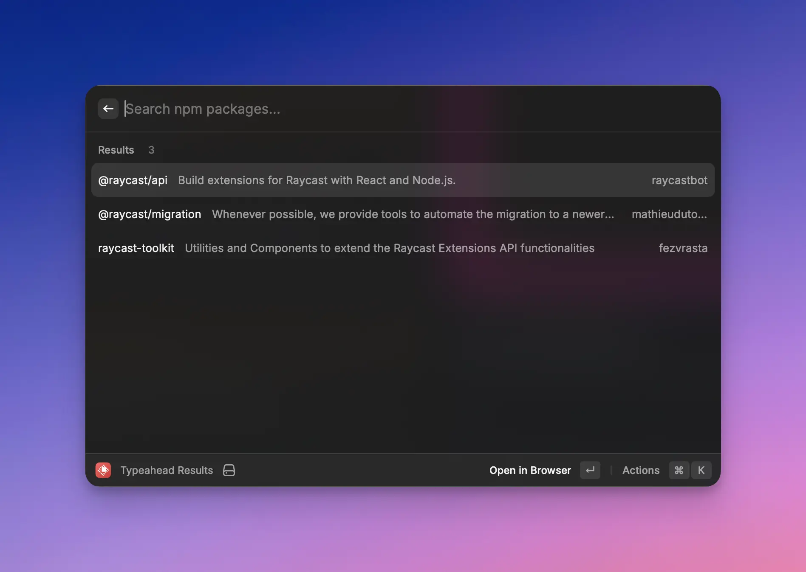
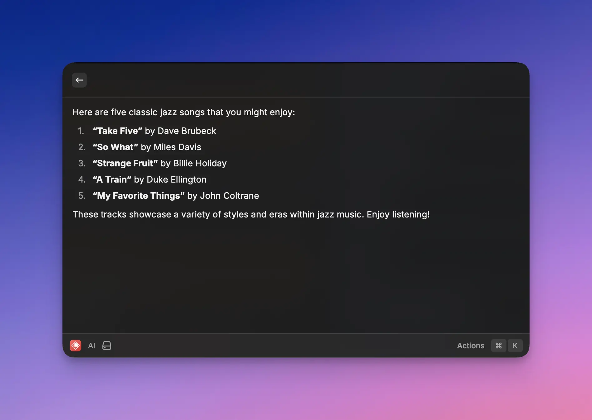
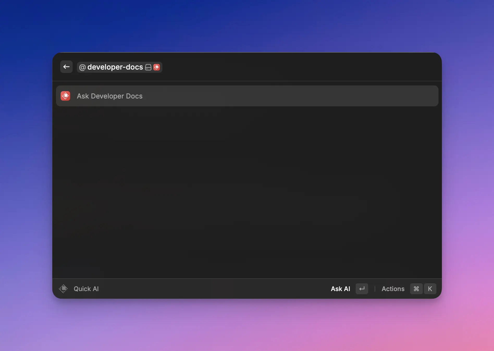

# Templates

Raycast provides a variety of templates to kickstart your extension.

Raycast provides 3 types of templates:

- **Commands:** These are templates for [commands](../terminology.md).
- **Tools:** These are templates for [tools](../terminology.md#tool). You can select a different one for each tool that you add to your extension.
- **Extension Boilerplates:** These are fully built extensions designed to be tweaked by organizations for internal use.

## Commands

### Show Detail

Renders a simple Hello World from a markdown string. 


See the [API Reference](../../api-reference/user-interface/detail.md) for more information about customization.


### Submit Form

Renders a form that showcases all available form elements.


See the [API Reference](../../api-reference/user-interface/form.md) for more information about customization.


### Show Grid

Renders a grid of Icons available from Raycast.

Defaults to a large grid, but provides a selection menu to change the size.


See the [API Reference](../../api-reference/user-interface/grid.md) for more information about customization.

See here for information about [Icons](../../api-reference/user-interface/icons-and-images.md).


### Show List and Detail

Renders a list of options. When an option is selected, a Detail view is displayed.


See the [API Reference](../../api-reference/user-interface/list.md) for more information about customization.


### Menu Bar Extra

Adds a simple Menu Bar Extra with a menu.


See the [API Reference](../../api-reference/menu-bar-commands.md) for more information about customization.


### Run Script

A example of a no-view command which shows a simple [HUD](../../api-reference/feedback/hud.md).

### Show List

Renders a static list with each entry containing an icon, title, subtitle, and accessory.


See the [API Reference](../../api-reference/user-interface/list.md) for more information about customization.


### Show Typeahead Results

Renders a dynamic and searchable list of NPM packages. The command fetches new items as the search is updated by the user.

### AI

Renders the output of an AI call in a Detail view.

## Tools

A simple tool which asks for confirmation before executing.


See the [API Reference](../../api-reference/tool.md) for more information about customization.


## Extension Boilerplates

The Raycast Team has created high-quality templates to reinforce team experiences with the Raycast API.

Run `npm init raycast-extension -t <template-name>` to get started with these extensions. All templates can be found on the [templates page](https://www.raycast.com/templates).

Specific instructions about customizing the template can be found on the relevant [template page](https://www.raycast.com/templates). Simply customize the template as you see fit, then run `npm run publish` in the extension directory to allow your team to install the extension.
