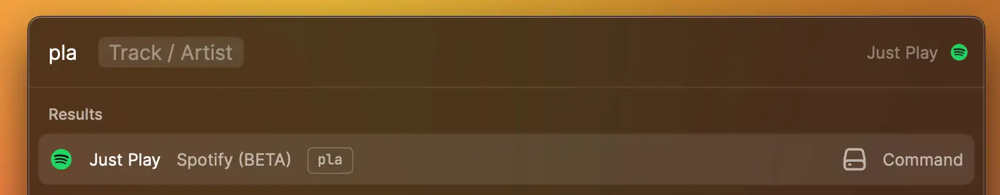

# Arguments

Raycast supports arguments for your commands so that users can enter values right from Root Search before opening the command.



Arguments are configured in the [manifest](../manifest.md#argument-properties) per command.



- **Maximum number of arguments:** 3 (if you have a use case that requires more, please let us know via feedback or in the [Slack community](https://www.raycast.com/community))
- The order of the arguments specified in the manifest is important and is reflected by the fields shown in Root Search. To provide a better UX, put the required arguments before the optional ones.



## Example

Let's say we want a command with three arguments. Its `package.json` will look like this:

```json
{
  "name": "arguments",
  "title": "API Arguments",
  "description": "Example of Arguments usage in the API",
  "icon": "command-icon.png",
  "author": "raycast",
  "license": "MIT",
  "commands": [
    {
      "name": "my-command",
      "title": "Arguments",
      "subtitle": "API Examples",
      "description": "Demonstrates usage of arguments",
      "mode": "view",
      "arguments": [
        {
          "name": "title",
          "placeholder": "Title",
          "type": "text",
          "required": true
        },
        {
          "name": "subtitle",
          "placeholder": "Secret Subtitle",
          "type": "password"
        },
        {
          "name": "favoriteColor",
          "type": "dropdown",
          "placeholder": "Favorite Color",
          "required": true,
          "data": [
            {
              "title": "Red",
              "value": "red"
            },
            {
              "title": "Green",
              "value": "green"
            },
            {
              "title": "Blue",
              "value": "blue"
            }
          ]
        }
      ]
    }
  ],
  "dependencies": {
    "@raycast/api": "1.38.0"
  },
  "scripts": {
    "dev": "ray develop",
    "build": "ray build -e dist",
    "lint": "ray lint"
  }
}
```

The command itself will receive the arguments' values via the `arguments` prop:

```typescript
import { Form, LaunchProps } from "@raycast/api";

export default function Todoist(props: LaunchProps<{ arguments: Arguments.MyCommand }>) {
  const { title, subtitle } = props.arguments;
  console.log(`title: ${title}, subtitle: ${subtitle}`);

  return (
    <Form>
      <Form.TextField id="title" title="Title" defaultValue={title} />
      <Form.TextField id="subtitle" title="Subtitle" defaultValue={subtitle} />
    </Form>
  );
}
```

## Types

### Arguments

A command receives the values of its arguments via a top-level prop named `arguments`. It is an object with the arguments' `name` as keys and their values as the property's values.

Depending on the `type` of the argument, the type of its value will be different.

| Argument type         | Value type          |
| :-------------------- | :------------------ |
| <code>text</code>     | <code>string</code> |
| <code>password</code> | <code>string</code> |
| <code>dropdown</code> | <code>string</code> |


Raycast provides a global TypeScript namespace called `Arguments` which contains the types of the arguments of all the commands of the extension.

For example, if a command named `show-todos` accepts arguments, its `LaunchProps` can be described as `LaunchProps<{ arguments: Arguments.ShowTodos }>`. This will make sure that the types used in the command stay in sync with the manifest.

