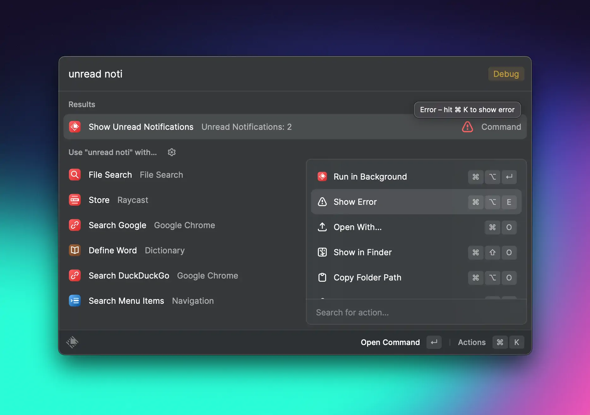
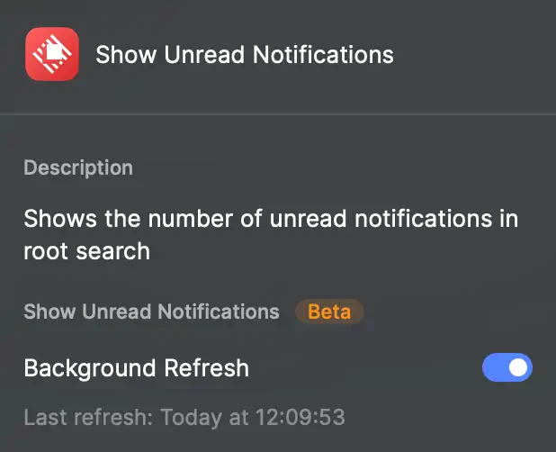

# Background Refresh

Commands of an extension can be configured to be automatically run in the background, without the user manually opening them.
Background refresh can be useful for:

- dynamically updating the subtitle of a command in Raycast root search
- refreshing menu bar commands
- other supporting functionality for your main commands

This guide helps you understand when and how to use background refresh and learn about the constraints.

## Scheduling Commands

Raycast supports scheduling commands with mode `no-view` and `menu-bar` at a configured interval.

### Manifest

Add a new property `interval` to a command in the [manifest](../manifest.md#command-properties)

Example:

```json
{
    "name": "unread-notifications",
    "title": "Show Unread Notifications",
    "description": "Shows the number of unread notifications in root search",
    "mode": "no-view",
    "interval": "10m"
},
```

The interval specifies that the command should be launched in the background every X seconds (s), minutes (m), hours (h) or days (d). Examples: `10m`, `12h`, `1d`. The minimum value is 10 seconds (`10s`), which should be used cautiously, also see the section on best practices.

Note that the actual scheduling is not exact and might vary within a tolerance level. macOS determines the best time for running the command in order to optimize energy consumption, and scheduling times can also vary when running on battery. To prevent overlapping background launches of the same command, commands are terminated after a timeout that is dynamically adjusted to the interval.

## Running in the background

The entry point of your command stays the same when launched from the background. For no-view commands, a command will run until the Promise of the main async function resolves. Menu bar commands render a React component and run until the `isLoading` property is set to `false`.

You can use the global `environment.launchType` in your command to determine whether the command has been launched by the user (`LaunchType.UserInitiated`) or via background refresh (`LaunchType.Background`).

```typescript
import { environment, updateCommandMetadata } from "@raycast/api";

async function fetchUnreadNotificationCount() {
  return 10;
}

export default async function Command() {
  console.log("launchType", environment.launchType);
  const count = await fetchUnreadNotificationCount();
  await updateCommandMetadata({ subtitle: `Unread Notifications: ${count}` });
}
```

Raycast auto-terminates the command if it exceeds its maximum execution time. If your command saves some state that is shared with other commands, make sure to use defensive programming, i.e. add handling for errors and data races if the stored state is incomplete or inaccessible.

## Development and Debugging

For local commands under development, errors are shown as usual via the console. Two developer actions in root search help you to run and debug scheduled commands:

- Run in Background: this immediately runs the command with `environment.launchType` set to `LaunchType.Background`.
- Show Error: if the command could not be loaded or an uncaught runtime exception was thrown, the full error can be shown in the Raycast error overlay for development. This action is also shown to users of the installed Store command and provides actions to copy and report the error on the production error overlay.



When the background run leads to an error, users will also see a warning icon on the root search command and a tooltip with a hint to show the error via the Action Panel. The tooltip over the subtitle of a command shows the last run time.

You can launch the built-in root search command "Extension Diagnostics" to see which of your commands run in background and when they last ran.

## Preferences

For scheduled commands, Raycast automatically adds command preferences that give users the options to enable and disable background refresh. Preferences also show the last run time of the command.



When a user installs the command via the Store, background refresh is initially _disabled_ and is activated either when the user opens the command for the first time or enables background refresh in preferences. (This is to avoid automatically running commands in the background without the user being aware of it.)

## Best Practices

- Make sure the command is useful both when manually launched by the user or when launched in the background
- Choose the interval value as high as possible - low values mean the command will run more often and consume more energy
- If your command performs network requests, check the rate limits of the service and handle errors appropriately (e.g. automatically retry later)
- Make sure the command finishes as quickly as possible; for menu bar commands, ensure `isLoading` is set to false as early as possible
- Use defensive programming if state is shared between commands of an extension and handle potential data races and inaccessible data
