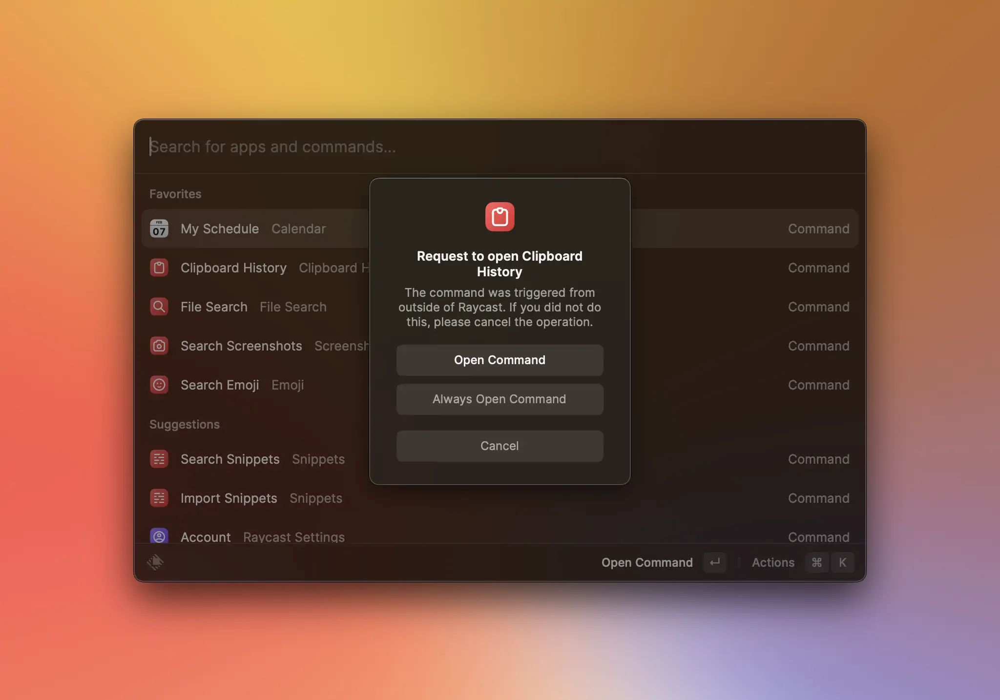

# Deeplinks

Deeplinks are Raycast-specific URLs you can use to launch any command, as long as it's installed and enabled in Raycast.

They adhere to the following format:

```
raycast://extensions/<author-or-owner>/<extension-name>/<command-name>
```

| Name            | Description                                                                                                                                                                                                                        | Type     |
| :-------------- | ---------------------------------------------------------------------------------------------------------------------------------------------------------------------------------------------------------------------------------- | -------- |
| author-or-owner | For store extensions, it's the value of the `owner` or the `author` field in the extension's [manifest](../manifest.md). For built-in extensions (such as `Calendar`), this is always `raycast`.                                   | `string` |
| extension-name  | For store extensions, it's the value of the extension's `name` field in the extension's [manifest](../manifest.md). For built-in extensions (such as `Calendar`), this is the "slugified" extension name; in this case `calendar`. | `string` |
| command-name    | For store extensions, it's the value of the command's `name` field in the extension's [manifest](../manifest.md). For built-in commands (such as `My Schedule`), this is the "slugified" command name; in this case `my-schedule`. | `string` |

To make fetching a command's Deeplink easier, each command in the Raycast root now has a `Copy Deeplink` action.


Whenever a command is launched using a Deeplink, Raycast will ask you to confirm that you want to run the command. This is to ensure that you are aware of the command you are running.




## Query Parameters

| Name         | Description                                                                                                                            | Type                                   |
| :----------- | -------------------------------------------------------------------------------------------------------------------------------------- | -------------------------------------- |
| launchType   | Runs the command in the background, skipping bringing Raycast to the front.                                                            | Either `userInitiated` or `background` |
| arguments    | If the command accepts [arguments](./arguments.md), they can be passed using this query parameter.                                     | URL-encoded JSON object.               |
| context      | If the command make use of [LaunchContext](../../api-reference/command.md#launchcontext), it can be passed using this query parameter. | URL-encoded JSON object.               |
| fallbackText | Some text to prefill the search bar or first text input of the command                                                                 | `string`                               |
