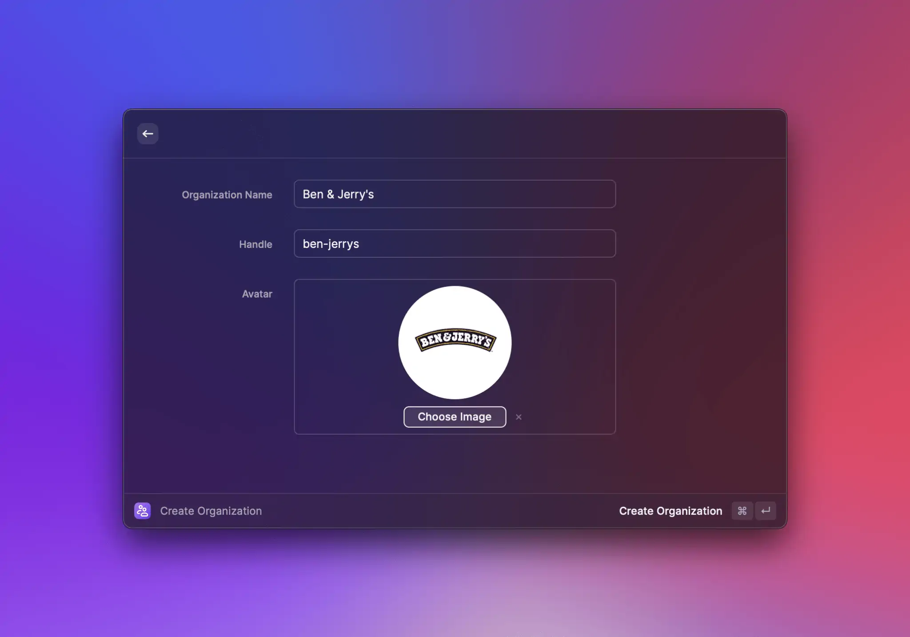
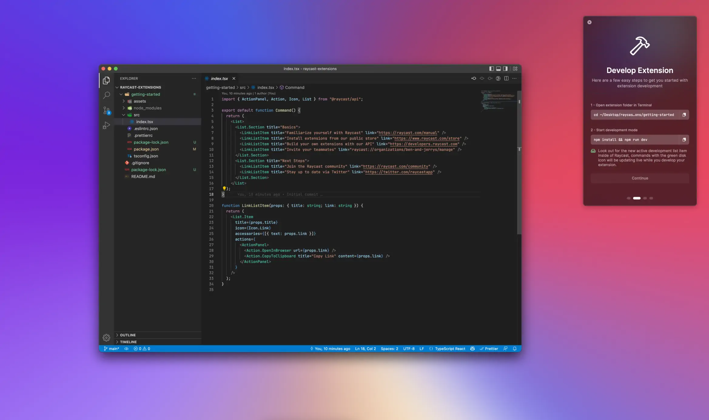
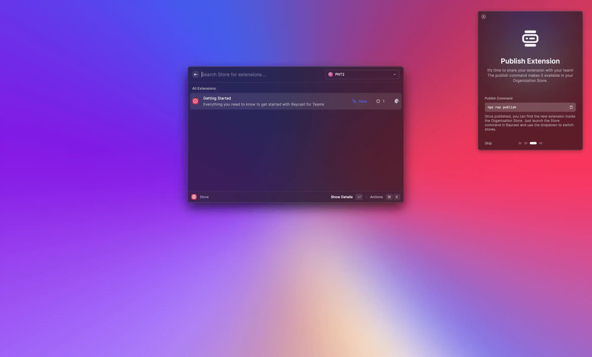

# Getting Started with Raycast for Teams

Raycast for Teams allows you to build, share and discover extensions in a private store. The store is only accessible to members of your organization.

## Create Your Organization

To get started, create your organization. Specify the name of the organization, a handle (used in links, e.g. `https://raycast.com/your_org/some_extension`) and optionally upload an avatar.


You can use the Manage Organization command to edit your organization's information later.


## Create Your Private Extension Store

After you've created your organization, it's time to set up a private store for your extensions.

### Init a Local Repository

First, select a folder to create a local repository for your private extension store. We create a folder that contains a Getting Started extension. We recommend to store all extensions of your team in a single repository. This makes it easy to collaborate.

### Build The Getting Started Extension

After you have created the local repository, navigate into the `getting-started` folder. The folder contains a simple extension with a command that shows a list with a few useful links. Run `npm run dev` in the folder to build the extension and start development mode. Raycast opens and you can see a new Development section in the root search. The section shows all commands that are under active development. You can open the command and open a few links.


See [Create Your First Extension](../basics/create-your-first-extension.md) for a more detailed guide on how to create an extension.


### Publish The Getting Started Extension

Now, we share the extension with your organization. Perform `npm run publish` in the extension folder. The command verifies, builds and publishes the extension to your private extension store. The extension is only accessible to members of your organization.

🎉 Congratulations! You built and published your first private extension. Now it's time to spread the word in your organization.

## Invite Your Teammates

Use the Copy Organization Invite Link command in Raycast to share access to your organization. Send the link to your teammates. You'll receive an email when somebody joins your organization. You can use the Manage Organization command to see who's part of your organization, reset the invite link and edit your organization details.

As a next step, follow [this guide](./collaborate-on-private-extensions.md) to push your local repository to a source control system. This allows you to collaborate with your teammates on your extensions.
